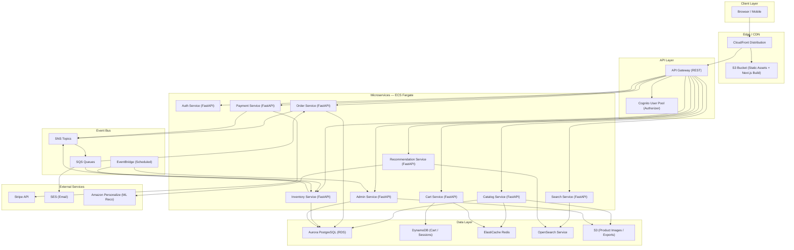
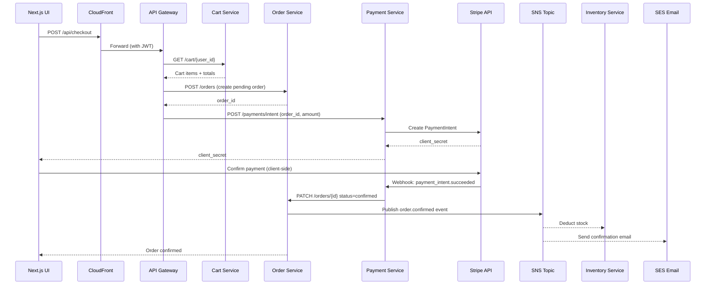
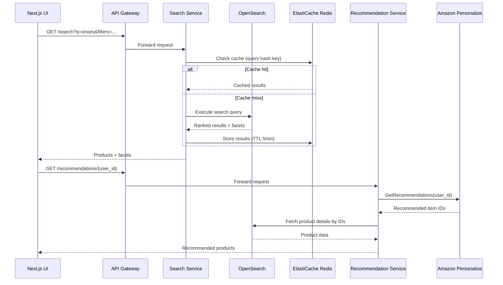
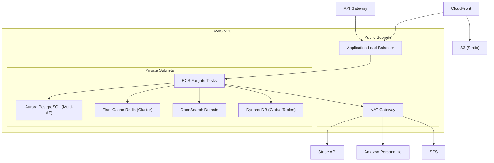
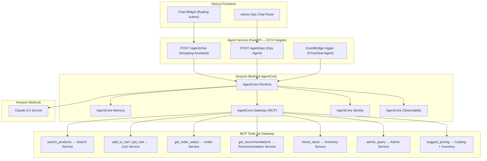

# Design Document: Ecommerce AWS Platform

## Overview

A full-featured, cloud-native ecommerce platform built on AWS, using FastAPI (Python) for backend microservices and Next.js for the frontend. The system covers product catalog, shopping cart, checkout and payments, order management, user authentication, search, recommendations, inventory management, and an admin dashboard. The architecture prioritizes scalability, resilience, and developer velocity by leveraging managed AWS services wherever practical.

The platform is designed as a set of loosely coupled microservices behind an API Gateway, with an event-driven backbone (SNS/SQS) for async workflows like order processing and inventory updates. Static assets and the Next.js frontend are served via S3 and CloudFront for global low-latency delivery.

All technology choices are documented in the Decision Log section with comparisons and justifications.

---

## Decision Log

### DL-01: Primary Database — Aurora PostgreSQL vs DynamoDB vs MongoDB Atlas

| Option | Pros | Cons |
|---|---|---|
| **Aurora PostgreSQL (chosen)** | ACID transactions, rich relational queries, familiar SQL, RDS Proxy for connection pooling, supports JSONB for flexible fields | Vertical scaling limits, requires schema migrations |
| DynamoDB | Infinite horizontal scale, serverless, single-digit ms latency | No joins, complex query patterns, eventual consistency traps |
| MongoDB Atlas | Flexible schema, good for catalog | Not native AWS, extra cost, operational overhead |

**Decision**: Aurora PostgreSQL for transactional data (orders, users, inventory). DynamoDB for session/cart data where key-value access patterns dominate and scale is unpredictable.

---

### DL-02: Caching — ElastiCache Redis vs Memcached vs DAX

| Option | Pros | Cons |
|---|---|---|
| **ElastiCache Redis (chosen)** | Rich data structures, pub/sub, persistence, cluster mode, widely supported | Slightly more complex than Memcached |
| Memcached | Simple, fast | No persistence, no pub/sub, limited data types |
| DAX | DynamoDB-native acceleration | Only works with DynamoDB |

**Decision**: ElastiCache Redis for session caching, product catalog caching, rate limiting, and leaderboard/recommendation caching.

---

### DL-03: Search — OpenSearch vs Algolia vs RDS Full-Text

| Option | Pros | Cons |
|---|---|---|
| **OpenSearch (chosen)** | Native AWS, powerful full-text + faceted search, vector search for recommendations, no per-query cost | Operational complexity, cluster sizing |
| Algolia | Excellent DX, instant search | Expensive at scale, external dependency |
| RDS Full-Text | No extra infra | Poor performance at scale, limited features |

**Decision**: OpenSearch Service for product search, faceted filtering, and as the vector store for ML-based recommendations.

---

### DL-04: Messaging — SNS+SQS vs EventBridge vs Kafka (MSK)

| Option | Pros | Cons |
|---|---|---|
| **SNS + SQS (chosen)** | Fully managed, fan-out pattern, dead-letter queues, simple ops | Not a full event streaming platform |
| EventBridge | Schema registry, event routing rules, SaaS integrations | Higher latency, less suited for high-throughput |
| MSK (Kafka) | High throughput, replay, consumer groups | Heavy ops, overkill for most ecommerce patterns |

**Decision**: SNS for fan-out (order placed → inventory, email, analytics), SQS for reliable async task queues per service. EventBridge for scheduled jobs (daily reports, inventory sync).

---

### DL-05: Payments — Stripe vs Braintree vs Adyen

| Option | Pros | Cons |
|---|---|---|
| **Stripe (chosen)** | Best-in-class DX, webhooks, fraud detection, global coverage, strong Python SDK | Transaction fees |
| Braintree | PayPal ecosystem | Less modern API |
| Adyen | Enterprise-grade | Complex onboarding, high minimums |

**Decision**: Stripe for payment processing with webhook-driven order confirmation flow.

---

### DL-06: Authentication — Cognito vs Auth0 vs Custom JWT

| Option | Pros | Cons |
|---|---|---|
| **Cognito (chosen)** | Native AWS, integrates with API Gateway authorizers, MFA, social login, free tier | Complex configuration, limited customization of hosted UI |
| Auth0 | Excellent DX, flexible | External dependency, cost at scale |
| Custom JWT | Full control | Security risk, maintenance burden |

**Decision**: Cognito User Pools for authentication + identity, with Cognito Authorizer on API Gateway.

---

### DL-07: Container Orchestration — ECS Fargate vs EKS vs Lambda

| Option | Pros | Cons |
|---|---|---|
| **ECS Fargate (chosen)** | Serverless containers, no node management, native AWS integrations, simpler than EKS | Less flexible than Kubernetes, vendor lock-in |
| EKS | Full Kubernetes, portable | High operational overhead |
| Lambda | Zero infra, per-invocation billing | Cold starts, 15-min limit, not ideal for FastAPI |

**Decision**: ECS Fargate for all FastAPI microservices. Each service runs as an independent Fargate task behind an Application Load Balancer.

---

## Architecture

### High-Level System Architecture



---

### Request Flow: Checkout Sequence



---

### Request Flow: Product Search



---

## Components and Interfaces

### Auth Service

**Purpose**: User registration, login, token refresh, profile management via Cognito.

**Interface**:
```python
class AuthRouter:
    async def register(body: RegisterRequest) -> UserResponse: ...
    async def login(body: LoginRequest) -> TokenResponse: ...
    async def refresh_token(body: RefreshRequest) -> TokenResponse: ...
    async def get_profile(user_id: str) -> UserProfile: ...
    async def update_profile(user_id: str, body: UpdateProfileRequest) -> UserProfile: ...
```

**Responsibilities**:
- Delegate auth to Cognito User Pools
- Issue and validate JWT tokens via Cognito Authorizer
- Store extended profile data in Aurora

---

### Catalog Service

**Purpose**: CRUD for products, categories, and product images.

**Interface**:
```python
class CatalogRouter:
    async def list_products(page: int, limit: int, category_id: Optional[str]) -> PaginatedProducts: ...
    async def get_product(product_id: str) -> ProductDetail: ...
    async def create_product(body: CreateProductRequest) -> ProductDetail: ...
    async def update_product(product_id: str, body: UpdateProductRequest) -> ProductDetail: ...
    async def delete_product(product_id: str) -> None: ...
    async def upload_image(product_id: str, file: UploadFile) -> ImageUploadResponse: ...
    async def list_categories() -> list[Category]: ...
```

**Responsibilities**:
- Persist product data in Aurora PostgreSQL
- Upload product images to S3, serve via CloudFront
- Cache hot product pages in Redis (TTL 10 min)
- Publish `product.updated` events to SNS for OpenSearch re-indexing

---

### Cart Service

**Purpose**: Manage per-user shopping carts with fast read/write.

**Interface**:
```python
class CartRouter:
    async def get_cart(user_id: str) -> Cart: ...
    async def add_item(user_id: str, body: AddItemRequest) -> Cart: ...
    async def update_item(user_id: str, item_id: str, body: UpdateItemRequest) -> Cart: ...
    async def remove_item(user_id: str, item_id: str) -> Cart: ...
    async def clear_cart(user_id: str) -> None: ...
```

**Responsibilities**:
- Store cart state in DynamoDB (key: `user_id`, TTL 30 days)
- Cache active carts in Redis for sub-ms reads
- Validate product availability against Inventory Service before adding items

---

### Order Service

**Purpose**: Order lifecycle management from creation to fulfillment.

**Interface**:
```python
class OrderRouter:
    async def create_order(user_id: str, body: CreateOrderRequest) -> Order: ...
    async def get_order(order_id: str) -> Order: ...
    async def list_orders(user_id: str, page: int, limit: int) -> PaginatedOrders: ...
    async def update_order_status(order_id: str, body: UpdateStatusRequest) -> Order: ...
    async def cancel_order(order_id: str) -> Order: ...
```

**Responsibilities**:
- Persist orders in Aurora with full status history
- Publish `order.created`, `order.confirmed`, `order.cancelled` events to SNS
- Consume `payment.succeeded` events from SQS to confirm orders
- Enforce state machine transitions (pending → confirmed → shipped → delivered → cancelled)

---

### Payment Service

**Purpose**: Payment intent creation and Stripe webhook handling.

**Interface**:
```python
class PaymentRouter:
    async def create_payment_intent(body: PaymentIntentRequest) -> PaymentIntentResponse: ...
    async def stripe_webhook(request: Request) -> None: ...
    async def get_payment(payment_id: str) -> Payment: ...
    async def refund(payment_id: str, body: RefundRequest) -> Refund: ...
```

**Responsibilities**:
- Create Stripe PaymentIntents server-side
- Verify Stripe webhook signatures (STRIPE_WEBHOOK_SECRET)
- Publish `payment.succeeded` / `payment.failed` events to SNS
- Store payment records in Aurora for audit trail

---

### Search Service

**Purpose**: Full-text and faceted product search via OpenSearch.

**Interface**:
```python
class SearchRouter:
    async def search(q: str, filters: SearchFilters, page: int, limit: int) -> SearchResponse: ...
    async def autocomplete(q: str) -> list[str]: ...
    async def index_product(product: ProductDocument) -> None: ...
    async def delete_product_index(product_id: str) -> None: ...
```

**Responsibilities**:
- Execute OpenSearch queries with full-text + faceted filters
- Cache frequent queries in Redis (TTL 5 min)
- Consume `product.updated` events from SQS to keep index fresh
- Support autocomplete via OpenSearch completion suggester

---

### Recommendation Service

**Purpose**: Personalized product recommendations using Amazon Personalize.

**Interface**:
```python
class RecommendationRouter:
    async def get_recommendations(user_id: str, limit: int) -> list[Product]: ...
    async def get_similar_items(product_id: str, limit: int) -> list[Product]: ...
    async def record_event(body: UserEventRequest) -> None: ...
```

**Responsibilities**:
- Call Amazon Personalize for user-personalized recommendations
- Fall back to OpenSearch popularity-based ranking if Personalize unavailable
- Record user interaction events (view, add-to-cart, purchase) to Personalize event tracker

---

### Inventory Service

**Purpose**: Real-time stock tracking and reservation.

**Interface**:
```python
class InventoryRouter:
    async def get_stock(product_id: str) -> StockLevel: ...
    async def reserve_stock(body: ReserveStockRequest) -> Reservation: ...
    async def release_reservation(reservation_id: str) -> None: ...
    async def adjust_stock(product_id: str, body: AdjustStockRequest) -> StockLevel: ...
    async def list_low_stock(threshold: int) -> list[StockLevel]: ...
```

**Responsibilities**:
- Maintain stock levels in Aurora with optimistic locking
- Consume `order.confirmed` events from SQS to deduct stock
- Consume `order.cancelled` events to release reservations
- Publish `inventory.low_stock` events for admin alerts
- EventBridge scheduled job for daily stock reconciliation

---

### Admin Service

**Purpose**: Dashboard data, reporting, and platform management.

**Interface**:
```python
class AdminRouter:
    async def get_dashboard_metrics() -> DashboardMetrics: ...
    async def list_all_orders(filters: OrderFilters) -> PaginatedOrders: ...
    async def export_orders(filters: OrderFilters) -> ExportResponse: ...
    async def list_users(page: int, limit: int) -> PaginatedUsers: ...
    async def get_revenue_report(start: date, end: date) -> RevenueReport: ...
```

**Responsibilities**:
- Aggregate metrics from Aurora (orders, revenue, users)
- Generate CSV/Excel exports to S3 with presigned URLs
- Restricted to admin role via Cognito group claim in JWT

---

## Data Models

### User

```python
class User(Base):
    __tablename__ = "users"

    id: UUID  # primary key, matches Cognito sub
    email: str  # unique, indexed
    full_name: str
    phone: Optional[str]
    cognito_sub: str  # unique
    role: Literal["customer", "admin"]
    created_at: datetime
    updated_at: datetime
    addresses: list["Address"]  # relationship
```

**Validation Rules**:
- `email` must be valid RFC 5322 format
- `role` defaults to `"customer"`

---

### Product

```python
class Product(Base):
    __tablename__ = "products"

    id: UUID
    sku: str  # unique, indexed
    name: str
    description: str
    price: Decimal  # precision=10, scale=2
    compare_at_price: Optional[Decimal]
    category_id: UUID  # FK → categories
    brand: Optional[str]
    images: list[str]  # S3/CloudFront URLs
    attributes: dict  # JSONB — size, color, material, etc.
    is_active: bool
    created_at: datetime
    updated_at: datetime
```

**Validation Rules**:
- `price` must be > 0
- `sku` must be unique across all products
- `images` list must contain at least one URL for active products

---

### Order

```python
class Order(Base):
    __tablename__ = "orders"

    id: UUID
    user_id: UUID  # FK → users
    status: Literal["pending", "confirmed", "processing", "shipped", "delivered", "cancelled", "refunded"]
    items: list["OrderItem"]  # relationship
    subtotal: Decimal
    tax: Decimal
    shipping_cost: Decimal
    total: Decimal
    shipping_address: dict  # JSONB snapshot at time of order
    payment_id: Optional[UUID]  # FK → payments
    stripe_payment_intent_id: Optional[str]
    notes: Optional[str]
    created_at: datetime
    updated_at: datetime
```

**Validation Rules**:
- `total` must equal `subtotal + tax + shipping_cost`
- Status transitions must follow the defined state machine
- `shipping_address` snapshot is immutable after creation

---

### OrderItem

```python
class OrderItem(Base):
    __tablename__ = "order_items"

    id: UUID
    order_id: UUID  # FK → orders
    product_id: UUID  # FK → products
    sku: str  # snapshot
    name: str  # snapshot
    unit_price: Decimal  # snapshot at time of order
    quantity: int
    subtotal: Decimal  # unit_price * quantity
```

---

### Cart (DynamoDB)

```python
# DynamoDB item schema
{
    "PK": "USER#<user_id>",       # partition key
    "SK": "CART",                  # sort key
    "items": [
        {
            "product_id": str,
            "sku": str,
            "name": str,
            "unit_price": Decimal,
            "quantity": int,
            "image_url": str
        }
    ],
    "updated_at": str,             # ISO 8601
    "ttl": int                     # Unix epoch + 30 days
}
```

---

### Inventory

```python
class Inventory(Base):
    __tablename__ = "inventory"

    id: UUID
    product_id: UUID  # FK → products, unique
    quantity_on_hand: int
    quantity_reserved: int
    quantity_available: int  # computed: on_hand - reserved
    reorder_threshold: int
    reorder_quantity: int
    updated_at: datetime
    version: int  # optimistic locking
```

**Validation Rules**:
- `quantity_available` must never go below 0
- `version` incremented on every write for optimistic concurrency control

---

### Payment

```python
class Payment(Base):
    __tablename__ = "payments"

    id: UUID
    order_id: UUID  # FK → orders
    stripe_payment_intent_id: str  # unique
    amount: Decimal
    currency: str  # ISO 4217, e.g. "usd"
    status: Literal["pending", "succeeded", "failed", "refunded", "partially_refunded"]
    stripe_charge_id: Optional[str]
    refunded_amount: Decimal
    metadata: dict  # JSONB
    created_at: datetime
    updated_at: datetime
```

---

## Key Functions with Formal Specifications

### `create_order(user_id, cart, shipping_address)`

```python
async def create_order(
    user_id: UUID,
    cart: Cart,
    shipping_address: Address,
    db: AsyncSession,
    inventory_client: InventoryClient,
) -> Order:
```

**Preconditions**:
- `cart.items` is non-empty
- All `cart.items[i].quantity > 0`
- `user_id` exists in the users table
- `shipping_address` has all required fields (street, city, country, postal_code)

**Postconditions**:
- Returns `Order` with `status = "pending"`
- `order.total == sum(item.unit_price * item.quantity) + tax + shipping_cost`
- Each `OrderItem` has a price snapshot from the current product price
- Stock is reserved (not yet deducted) for each item
- No mutations to the cart (cart cleared separately after payment confirmation)

**Loop Invariants** (over `cart.items`):
- All previously processed items have valid price snapshots
- Running `subtotal` equals sum of processed items' `unit_price * quantity`

---

### `process_payment_webhook(event, stripe_sig)`

```python
async def process_payment_webhook(
    event: dict,
    stripe_sig: str,
    db: AsyncSession,
    sns_client: SNSClient,
) -> None:
```

**Preconditions**:
- `stripe_sig` is a valid HMAC signature verifiable with `STRIPE_WEBHOOK_SECRET`
- `event["type"]` is a known Stripe event type
- `event["data"]["object"]["metadata"]["order_id"]` exists and is a valid UUID

**Postconditions**:
- If `event.type == "payment_intent.succeeded"`: payment record updated to `succeeded`, `order.confirmed` SNS event published
- If `event.type == "payment_intent.payment_failed"`: payment record updated to `failed`, `order.cancelled` SNS event published
- Operation is idempotent — duplicate webhook delivery produces no additional side effects

---

### `reserve_stock(product_id, quantity, order_id)`

```python
async def reserve_stock(
    product_id: UUID,
    quantity: int,
    order_id: UUID,
    db: AsyncSession,
) -> Reservation:
```

**Preconditions**:
- `quantity > 0`
- `inventory.quantity_available >= quantity` (checked with SELECT FOR UPDATE)
- No existing reservation for `(product_id, order_id)` pair

**Postconditions**:
- `inventory.quantity_reserved` increases by `quantity`
- `inventory.quantity_available` decreases by `quantity`
- `inventory.version` incremented (optimistic lock)
- Returns `Reservation` record with `status = "active"`
- If concurrent update detected (version mismatch), raises `StockConflictError` and retries up to 3 times

**Loop Invariants** (retry loop):
- `quantity_available >= 0` is maintained across all attempts
- Each retry re-reads current inventory state

---

### `search_products(query, filters, page, limit)`

```python
async def search_products(
    query: str,
    filters: SearchFilters,
    page: int,
    limit: int,
    os_client: OpenSearchClient,
    redis_client: Redis,
) -> SearchResponse:
```

**Preconditions**:
- `query` is a non-empty string (max 500 chars)
- `page >= 1`, `1 <= limit <= 100`
- `filters.price_min <= filters.price_max` if both provided

**Postconditions**:
- Returns `SearchResponse` with `products`, `total_count`, `facets`, `page`, `limit`
- Results are sorted by relevance score descending (default) or by specified sort field
- `len(products) <= limit`
- Cache key is deterministic hash of `(query, filters, page, limit)`
- Cache TTL is 5 minutes; stale results are acceptable within that window

---

### `get_recommendations(user_id, limit)`

```python
async def get_recommendations(
    user_id: UUID,
    limit: int,
    personalize_client: PersonalizeRuntimeClient,
    os_client: OpenSearchClient,
    redis_client: Redis,
) -> list[Product]:
```

**Preconditions**:
- `1 <= limit <= 50`
- `user_id` is a valid UUID (user need not have interaction history)

**Postconditions**:
- Returns up to `limit` products
- If Personalize returns results: products are ranked by Personalize score
- If Personalize unavailable or user has no history: falls back to top-selling products from OpenSearch
- Results cached in Redis per `user_id` with TTL 15 minutes

---

## Algorithmic Pseudocode

### Order State Machine

```python
ORDER_STATE_MACHINE = {
    "pending":    ["confirmed", "cancelled"],
    "confirmed":  ["processing", "cancelled"],
    "processing": ["shipped", "cancelled"],
    "shipped":    ["delivered"],
    "delivered":  ["refunded"],
    "cancelled":  [],
    "refunded":   [],
}

async def transition_order_status(
    order: Order,
    new_status: str,
    db: AsyncSession,
) -> Order:
    allowed = ORDER_STATE_MACHINE.get(order.status, [])
    if new_status not in allowed:
        raise InvalidTransitionError(
            f"Cannot transition from {order.status} to {new_status}"
        )
    order.status = new_status
    order.updated_at = datetime.utcnow()
    await db.commit()
    return order
```

---

### Checkout Algorithm

```python
async def checkout(user_id: UUID, checkout_request: CheckoutRequest, ...) -> CheckoutResponse:
    # 1. Load and validate cart
    cart = await cart_service.get_cart(user_id)
    if not cart.items:
        raise EmptyCartError()

    # 2. Validate all items still available
    for item in cart.items:
        stock = await inventory_service.get_stock(item.product_id)
        if stock.quantity_available < item.quantity:
            raise InsufficientStockError(item.product_id)
        # INVARIANT: all previously checked items have sufficient stock

    # 3. Calculate totals
    subtotal = sum(item.unit_price * item.quantity for item in cart.items)
    tax = calculate_tax(subtotal, checkout_request.shipping_address)
    shipping = calculate_shipping(cart.items, checkout_request.shipping_address)
    total = subtotal + tax + shipping

    # 4. Create pending order (with price snapshots)
    order = await order_service.create_order(user_id, cart, checkout_request.shipping_address)

    # 5. Reserve stock for all items
    reservations = []
    for item in cart.items:
        reservation = await inventory_service.reserve_stock(
            item.product_id, item.quantity, order.id
        )
        reservations.append(reservation)
        # INVARIANT: all reservations so far are active

    # 6. Create Stripe PaymentIntent
    intent = await stripe.payment_intents.create(
        amount=int(total * 100),  # cents
        currency="usd",
        metadata={"order_id": str(order.id)},
    )

    # 7. Return client_secret for frontend to confirm payment
    return CheckoutResponse(
        order_id=order.id,
        client_secret=intent.client_secret,
        total=total,
    )
    # POSTCONDITION: order is in "pending" state, stock is reserved, payment intent exists
```

---

### OpenSearch Product Indexing

```python
async def build_product_document(product: Product, stock: StockLevel) -> dict:
    return {
        "id": str(product.id),
        "sku": product.sku,
        "name": product.name,
        "description": product.description,
        "price": float(product.price),
        "compare_at_price": float(product.compare_at_price) if product.compare_at_price else None,
        "category_id": str(product.category_id),
        "brand": product.brand,
        "attributes": product.attributes,
        "is_active": product.is_active,
        "in_stock": stock.quantity_available > 0,
        "stock_quantity": stock.quantity_available,
        "image_url": product.images[0] if product.images else None,
        "suggest": {
            "input": [product.name, product.brand, product.sku],
            "weight": 10,
        },
        "indexed_at": datetime.utcnow().isoformat(),
    }

async def index_product(product_id: UUID, os_client, db, inventory_client):
    product = await db.get(Product, product_id)
    stock = await inventory_client.get_stock(product_id)
    doc = await build_product_document(product, stock)
    await os_client.index(index="products", id=str(product_id), body=doc)
```

---

### Inventory Deduction (Event-Driven)

```python
async def handle_order_confirmed_event(event: dict, db: AsyncSession):
    order_id = UUID(event["order_id"])
    order = await db.get(Order, order_id)

    for item in order.items:
        # Optimistic locking retry loop
        for attempt in range(3):
            inventory = await db.get(Inventory, item.product_id, with_for_update=True)
            if inventory.quantity_reserved < item.quantity:
                raise InsufficientReservationError(item.product_id)

            inventory.quantity_reserved -= item.quantity
            inventory.quantity_on_hand -= item.quantity
            inventory.quantity_available = inventory.quantity_on_hand - inventory.quantity_reserved
            inventory.version += 1

            try:
                await db.commit()
                break  # success
            except OptimisticLockError:
                await db.rollback()
                if attempt == 2:
                    raise
                # INVARIANT: quantity_available >= 0 maintained across retries
```

---

## Example Usage

### Checkout Flow (Frontend — Next.js)

```typescript
// pages/checkout.tsx
import { loadStripe } from "@stripe/stripe-js";
import { useCartStore } from "@/store/cart";

const stripePromise = loadStripe(process.env.NEXT_PUBLIC_STRIPE_KEY!);

async function handleCheckout(shippingAddress: Address) {
  // 1. Call backend to create order + payment intent
  const res = await fetch("/api/checkout", {
    method: "POST",
    headers: { Authorization: `Bearer ${getToken()}` },
    body: JSON.stringify({ shipping_address: shippingAddress }),
  });
  const { client_secret, order_id } = await res.json();

  // 2. Confirm payment client-side with Stripe Elements
  const stripe = await stripePromise;
  const { error } = await stripe!.confirmCardPayment(client_secret, {
    payment_method: { card: cardElement },
  });

  if (error) {
    showError(error.message);
  } else {
    router.push(`/orders/${order_id}/confirmation`);
  }
}
```

---

### Product Search (Frontend — Next.js)

```typescript
// hooks/useSearch.ts
export function useSearch(query: string, filters: SearchFilters) {
  return useSWR(
    query ? `/api/search?q=${encodeURIComponent(query)}&${buildFilterParams(filters)}` : null,
    fetcher,
    { dedupingInterval: 5000 }
  );
}

// components/SearchBar.tsx
export function SearchBar() {
  const [query, setQuery] = useState("");
  const { data, isLoading } = useSearch(query, filters);

  return (
    <div>
      <input value={query} onChange={(e) => setQuery(e.target.value)} />
      {data?.products.map((p) => <ProductCard key={p.id} product={p} />)}
    </div>
  );
}
```

---

### FastAPI Service Bootstrap

```python
# main.py (per microservice)
from fastapi import FastAPI
from fastapi.middleware.cors import CORSMiddleware
from contextlib import asynccontextmanager
from app.routers import catalog, health
from app.db import engine
from app.cache import redis_pool

@asynccontextmanager
async def lifespan(app: FastAPI):
    # startup
    await engine.connect()
    await redis_pool.initialize()
    yield
    # shutdown
    await engine.dispose()
    await redis_pool.close()

app = FastAPI(title="Catalog Service", lifespan=lifespan)
app.add_middleware(CORSMiddleware, allow_origins=["*"])
app.include_router(catalog.router, prefix="/catalog")
app.include_router(health.router)
```

---

### SNS Event Publishing

```python
# events/publisher.py
import boto3, json
from uuid import UUID
from datetime import datetime

sns = boto3.client("sns", region_name="us-east-1")

async def publish_order_confirmed(order_id: UUID, user_id: UUID, total: float):
    sns.publish(
        TopicArn=settings.ORDER_EVENTS_TOPIC_ARN,
        Message=json.dumps({
            "event_type": "order.confirmed",
            "order_id": str(order_id),
            "user_id": str(user_id),
            "total": total,
            "timestamp": datetime.utcnow().isoformat(),
        }),
        MessageAttributes={
            "event_type": {
                "DataType": "String",
                "StringValue": "order.confirmed",
            }
        },
    )
```

---

## Error Handling

### Insufficient Stock at Checkout

**Condition**: One or more cart items have `quantity_available < requested_quantity` at checkout time.
**Response**: Return `HTTP 409 Conflict` with a list of unavailable items and their current available quantities.
**Recovery**: Frontend displays which items are unavailable; user adjusts cart quantities.

---

### Payment Failure

**Condition**: Stripe `payment_intent.payment_failed` webhook received.
**Response**: Order transitions to `cancelled`, stock reservations released, `payment.failed` SNS event published.
**Recovery**: User is notified via email (SES); frontend redirects to checkout with error message.

---

### Duplicate Webhook Delivery

**Condition**: Stripe delivers the same webhook event more than once (at-least-once delivery).
**Response**: Payment service checks if `stripe_payment_intent_id` already processed; if so, returns `HTTP 200` immediately without re-processing.
**Recovery**: Idempotency key stored in payments table; no duplicate order confirmations.

---

### OpenSearch Unavailable

**Condition**: OpenSearch cluster is unreachable or returns 5xx.
**Response**: Search service returns `HTTP 503` with `Retry-After` header. Catalog service falls back to Aurora-based product listing (no full-text, no facets).
**Recovery**: Circuit breaker (via `tenacity` retry library) with exponential backoff; alerts via CloudWatch alarm.

---

### Optimistic Lock Conflict (Inventory)

**Condition**: Two concurrent requests attempt to reserve the same stock simultaneously.
**Response**: Losing request retries up to 3 times with fresh inventory read.
**Recovery**: After 3 failed attempts, returns `HTTP 409` to the caller; reservation is not created.

---

### Cognito Token Expiry

**Condition**: User's JWT access token has expired.
**Response**: API Gateway returns `HTTP 401 Unauthorized`.
**Recovery**: Frontend detects 401, uses refresh token to obtain new access token via Cognito, retries original request transparently.

---

## Testing Strategy

### Unit Testing

- Each FastAPI service has isolated unit tests using `pytest` + `pytest-asyncio`
- Database interactions mocked with `unittest.mock` or `pytest-mock`
- Stripe interactions mocked using Stripe's test mode and `stripe-mock`
- Target: 80%+ line coverage per service

### Property-Based Testing

**Library**: `hypothesis` (Python)

Key properties to test:
- `create_order` total always equals `subtotal + tax + shipping_cost` for any valid cart
- `reserve_stock` never allows `quantity_available` to go below 0 under concurrent calls
- Order state machine never allows invalid transitions for any sequence of status updates
- Search pagination: `page=N, limit=L` always returns at most `L` results

### Integration Testing

- `docker-compose` environment with LocalStack (S3, SQS, SNS, DynamoDB), PostgreSQL, Redis, and OpenSearch
- End-to-end checkout flow tested: cart → order → payment webhook → inventory deduction → email
- Stripe webhook integration tested with Stripe CLI (`stripe listen --forward-to localhost`)

### Load Testing

- `locust` for load testing checkout and search endpoints
- Target: 1000 concurrent users, p99 latency < 500ms for search, < 2s for checkout

---

## Performance Considerations

- **CloudFront**: All static assets (Next.js build, product images) served from edge. Cache-Control headers set to `max-age=31536000, immutable` for hashed assets.
- **Redis caching**: Product catalog pages (TTL 10 min), search results (TTL 5 min), user recommendations (TTL 15 min), session data (TTL 24h).
- **RDS Proxy**: Connection pooling for Aurora to handle ECS Fargate's ephemeral connection patterns without exhausting DB connections.
- **OpenSearch**: Dedicated master nodes for cluster stability; use `_source` filtering to return only needed fields.
- **DynamoDB**: On-demand capacity for cart service to handle unpredictable traffic spikes (flash sales).
- **ECS Fargate Auto Scaling**: Target tracking on CPU (70%) and ALB request count per target.
- **SQS**: Batch processing for inventory deduction events (batch size 10) to reduce DB round trips.

---

## Security Considerations

- **Authentication**: All API endpoints (except `/health`, `/search`, `/catalog`) require valid Cognito JWT via API Gateway authorizer.
- **Admin endpoints**: Protected by Cognito group claim check (`cognito:groups` contains `"admins"`).
- **Stripe webhooks**: Signature verified with `stripe.Webhook.construct_event()` before any processing.
- **S3 bucket policy**: Product image bucket is private; CloudFront OAC (Origin Access Control) is the only allowed reader.
- **Secrets management**: All secrets (DB passwords, Stripe keys, JWT secrets) stored in AWS Secrets Manager; injected as environment variables at ECS task startup.
- **VPC isolation**: All ECS services, Aurora, Redis, and OpenSearch run in private subnets. Only ALB and API Gateway are in public subnets.
- **WAF**: AWS WAF attached to CloudFront and API Gateway for rate limiting, SQL injection, and XSS protection.
- **Data encryption**: Aurora encrypted at rest (KMS), Redis in-transit TLS, S3 SSE-S3.
- **PCI compliance**: Cardholder data never touches our servers — Stripe Elements handles card input client-side.

---

## Infrastructure Overview



---

## Dependencies

| Dependency | Version | Purpose |
|---|---|---|
| FastAPI | 0.111+ | Backend web framework |
| SQLAlchemy (async) | 2.0+ | ORM for Aurora PostgreSQL |
| asyncpg | 0.29+ | Async PostgreSQL driver |
| boto3 | 1.34+ | AWS SDK (SNS, SQS, S3, Cognito, Personalize) |
| aioboto3 | 12+ | Async AWS SDK wrapper |
| redis (async) | 5.0+ | ElastiCache Redis client |
| opensearch-py | 2.4+ | OpenSearch client |
| stripe | 8.0+ | Stripe payments SDK |
| pydantic | 2.0+ | Data validation and settings |
| alembic | 1.13+ | Database migrations |
| tenacity | 8.2+ | Retry logic with backoff |
| hypothesis | 6.0+ | Property-based testing |
| pytest-asyncio | 0.23+ | Async test support |
| Next.js | 14+ | Frontend framework (App Router) |
| SWR | 2.0+ | Data fetching / caching for React |
| @stripe/stripe-js | 3.0+ | Stripe Elements (client-side) |
| Zustand | 4.0+ | Frontend state management (cart) |
| Tailwind CSS | 3.0+ | UI styling |

---

## Correctness Properties

*A property is a characteristic or behavior that should hold true across all valid executions of a system — essentially, a formal statement about what the system should do. Properties serve as the bridge between human-readable specifications and machine-verifiable correctness guarantees.*

---

### Property 1: User Registration Round-Trip

*For any* valid email and password, registering a user and then fetching their profile should return a record with the submitted email, a role of `"customer"`, and a non-null unique `cognito_sub`.

**Validates: Requirements 1.1, 1.4, 1.8, 1.9**

---

### Property 2: Token Refresh Round-Trip

*For any* authenticated user, logging in to obtain a refresh token and then calling the refresh endpoint should return a new, valid JWT access token without requiring re-authentication.

**Validates: Requirements 1.3, 1.7**

---

### Property 3: Profile Update Round-Trip

*For any* authenticated user and any valid profile update payload, submitting the update and then fetching the profile should return a record that reflects all updated fields.

**Validates: Requirements 1.5**

---

### Property 4: Invalid JWT Rejection

*For any* request carrying an invalid, malformed, or expired JWT to a protected API_Gateway endpoint, the gateway should return HTTP 401 Unauthorized and not forward the request to the downstream service.

**Validates: Requirements 1.6, 12.1**

---

### Property 5: Product CRUD Round-Trip

*For any* valid product payload, creating a product and then fetching it by ID should return a record matching the submitted fields. After updating the product, fetching it should reflect the updated fields. After deleting the product, fetching it should return HTTP 404.

**Validates: Requirements 2.1, 2.2, 2.3**

---

### Property 6: Product Validation Invariants

*For any* product creation or update request where `price <= 0`, `sku` duplicates an existing product, or the product is active with no images, the Catalog_Service should reject the request with an appropriate error and leave the existing data unchanged.

**Validates: Requirements 2.7, 2.8, 2.9**

---

### Property 7: Pagination Upper Bound

*For any* paginated list endpoint (products, orders, users) with a given `limit` parameter, the number of items returned in a single response should never exceed `limit`.

**Validates: Requirements 2.6, 4.9, 6.10, 7.7, 9.4**

---

### Property 8: Cache-Then-Store Round-Trip

*For any* cacheable request (product page, search query, recommendation), a cache miss should result in the response being stored in Redis so that the immediately subsequent identical request is served from Redis without querying the backing store.

**Validates: Requirements 2.5, 6.2, 6.3, 7.5**

---

### Property 9: Cart Mutation Round-Trip

*For any* user and sequence of cart operations (add, update, remove, clear), fetching the cart after each operation should reflect the exact state produced by that operation, with no phantom items and no missing items.

**Validates: Requirements 3.1, 3.4, 3.5, 3.6**

---

### Property 10: Cart DynamoDB Structure Invariant

*For any* cart record written to DynamoDB, the partition key should be `USER#<user_id>`, the sort key should be `CART`, and the TTL field should be set to a Unix epoch timestamp approximately 30 days in the future from the time of the write.

**Validates: Requirements 3.7, 3.8**

---

### Property 11: Order Total Mathematical Invariant

*For any* order, `order.total` must equal `subtotal + tax + shipping_cost`, and for every `OrderItem`, `subtotal` must equal `unit_price * quantity`. These equalities must hold for all valid carts and shipping configurations.

**Validates: Requirements 4.2, 4.3**

---

### Property 12: Order State Machine Validity

*For any* order and any requested status transition, the Order_Service should allow the transition if and only if it is listed in the State_Machine definition, and reject all other transitions with HTTP 422. No sequence of valid transitions should produce an invalid state.

**Validates: Requirements 4.7, 4.8**

---

### Property 13: Order Creation Round-Trip with Immutable Snapshot

*For any* checkout request with a non-empty cart and valid shipping address, the created order should have status `"pending"`, each item should carry a price snapshot equal to the product price at creation time, and subsequently updating the user's address should not alter the order's `shipping_address` field.

**Validates: Requirements 4.1, 4.12**

---

### Property 14: SNS Event Publishing on Order and Payment Transitions

*For any* order creation, confirmation, or cancellation, and for any payment success or failure webhook, the corresponding SNS event (`order.created`, `order.confirmed`, `order.cancelled`, `payment.succeeded`, `payment.failed`) should be published exactly once to the appropriate SNS topic.

**Validates: Requirements 4.4, 4.5, 4.6, 4.11, 5.5, 5.6**

---

### Property 15: Webhook Idempotency

*For any* Stripe webhook event delivered N times (N >= 1), the Payment_Service should update the payment record status exactly once and publish the corresponding SNS event exactly once, regardless of how many times the same event is delivered.

**Validates: Requirements 5.7**

---

### Property 16: Webhook Signature Rejection

*For any* Stripe webhook request with an invalid or missing signature, the Payment_Service should return HTTP 400 and perform no state mutations.

**Validates: Requirements 5.3, 5.4**

---

### Property 17: Payment Record Persistence and Uniqueness

*For any* processed payment, a record should exist in Aurora with the correct `stripe_payment_intent_id`. Attempting to create a second payment record with the same `stripe_payment_intent_id` should be rejected.

**Validates: Requirements 5.9, 5.10**

---

### Property 18: Search Response Structure

*For any* valid search request with a non-empty query, the response should contain all required fields: `products`, `total_count`, `facets`, `page`, and `limit`, and `len(products)` should be less than or equal to `limit`.

**Validates: Requirements 6.1, 6.9, 6.10**

---

### Property 19: Search Input Validation

*For any* search request where `page < 1`, `limit < 1`, `limit > 100`, or `price_min > price_max`, the Search_Service should reject the request with an appropriate error response.

**Validates: Requirements 6.7, 6.8**

---

### Property 20: Search Index Synchronization

*For any* product that receives a `product.updated` event, a subsequent search for that product's name or SKU should return the updated document. For any deleted product, a subsequent search should not return that product.

**Validates: Requirements 6.5, 6.6**

---

### Property 21: Recommendation Fallback

*For any* user with no interaction history in Amazon Personalize, or when Personalize is unavailable, the Recommendation_Service should return a non-empty list of products sourced from the OpenSearch popularity-based fallback, up to the requested `limit`.

**Validates: Requirements 7.2**

---

### Property 22: Recommendation Limit Enforcement

*For any* recommendation request, the number of products returned should be greater than or equal to 1 and less than or equal to `limit`, and any request with `limit < 1` or `limit > 50` should be rejected.

**Validates: Requirements 7.6, 7.7**

---

### Property 23: Inventory Availability Invariant

*For any* sequence of reservation, deduction, and release operations, `quantity_available` must always equal `quantity_on_hand - quantity_reserved` and must never be negative. The `version` field must increment by exactly 1 on every write.

**Validates: Requirements 8.1, 8.2, 8.9**

---

### Property 24: Reservation and Release Round-Trip

*For any* product with sufficient stock, reserving N units and then releasing the reservation (via order cancellation) should restore `quantity_available` to its original value. Confirming the order should permanently deduct N units from `quantity_on_hand`.

**Validates: Requirements 8.4, 8.5**

---

### Property 25: Low-Stock Threshold and Listing

*For any* inventory record where `quantity_available` falls below `reorder_threshold` after a deduction, an `inventory.low_stock` SNS event should be published. A low-stock listing request with threshold T should return all and only products where `quantity_available < T`.

**Validates: Requirements 8.6, 8.8**

---

### Property 26: Inventory Adjustment Correctness

*For any* stock adjustment of delta D applied to a product, the resulting `quantity_on_hand` should equal the previous value plus D, and `quantity_available` should equal the new `quantity_on_hand` minus `quantity_reserved`.

**Validates: Requirements 8.7**

---

### Property 27: Concurrent Reservation Retry and Failure

*For any* inventory item where concurrent reservation requests exceed available stock, the Inventory_Service should retry up to 3 times on optimistic lock conflicts and, after exhausting retries, return HTTP 409 without creating a reservation, leaving `quantity_available >= 0`.

**Validates: Requirements 8.3, 14.3**

---

### Property 28: Admin Authorization Enforcement

*For any* request to an Admin_Service endpoint where the JWT does not contain the `"admins"` Cognito group claim, the service should return HTTP 403 Forbidden and perform no data access or mutation.

**Validates: Requirements 9.6, 9.7**

---

### Property 29: Revenue Report Date Filter

*For any* revenue report request with a `start` and `end` date, all orders included in the report should have `created_at` within the `[start, end]` range, and no orders outside that range should appear.

**Validates: Requirements 9.2**

---

### Property 30: Checkout Insufficient Stock Response

*For any* checkout request containing one or more items where `quantity_available < requested_quantity`, the Order_Service should return HTTP 409 Conflict with a response body listing each unavailable item and its current available quantity, and no order should be created.

**Validates: Requirements 14.1**

---

### Property 31: Catalog Fallback on OpenSearch Unavailability

*For any* product listing request when OpenSearch is unavailable, the Catalog_Service should return a valid product list sourced from Aurora, without full-text ranking or facets, rather than returning an error.

**Validates: Requirements 14.5**

---

### Property 32: SQS Batch Processing Completeness

*For any* batch of up to 10 inventory deduction SQS messages, all messages in the batch should be processed and the corresponding stock deductions should be applied to Aurora, with no messages silently dropped.

**Validates: Requirements 13.5**

---

### Property 33: Search Retry on OpenSearch Failure

*For any* OpenSearch query that returns a 5xx error, the Search_Service should retry the request with exponential backoff (via `tenacity`) before returning an error to the caller, and should not return a 5xx to the client on the first failure.

**Validates: Requirements 13.7**


---

## AI Agents (Amazon Bedrock AgentCore)

### Architecture



---

### Agent Tool Definitions

```python
# Shopping Assistant tools
SHOPPING_TOOLS = [
    {
        "name": "search_products",
        "description": "Search the product catalog by keyword with optional price and category filters",
        "input_schema": {
            "query": "str — search keywords",
            "price_min": "float | None — minimum price filter",
            "price_max": "float | None — maximum price filter",
            "category": "str | None — category slug filter",
            "limit": "int — max results (default 5)"
        }
    },
    {
        "name": "add_to_cart",
        "description": "Add a product to the authenticated user's cart",
        "input_schema": {
            "product_id": "str — UUID of the product",
            "quantity": "int — number of units to add"
        }
    },
    {
        "name": "get_cart",
        "description": "Retrieve the current cart contents and subtotal for the authenticated user",
        "input_schema": {}
    },
    {
        "name": "get_order_status",
        "description": "Get the status and details of a specific order or the most recent order",
        "input_schema": {
            "order_id": "str | None — UUID of order, or None for most recent"
        }
    },
    {
        "name": "get_recommendations",
        "description": "Get personalized product recommendations for the authenticated user",
        "input_schema": {
            "limit": "int — number of recommendations (default 5)"
        }
    },
    {
        "name": "check_stock",
        "description": "Check the available stock level for a specific product",
        "input_schema": {
            "product_id": "str — UUID of the product"
        }
    }
]

# Ops Agent tools
OPS_TOOLS = [
    {
        "name": "get_stuck_orders",
        "description": "Find orders that have been in a given status for longer than a specified duration",
        "input_schema": {
            "status": "str — order status to check (e.g. 'processing')",
            "hours": "int — minimum hours in that status (default 24)"
        }
    },
    {
        "name": "get_low_stock_items",
        "description": "List products where available quantity is below the reorder threshold",
        "input_schema": {
            "threshold": "int | None — override threshold (default: each product's reorder_threshold)"
        }
    },
    {
        "name": "get_revenue_report",
        "description": "Generate a revenue summary for a date range",
        "input_schema": {
            "start_date": "str — ISO date (e.g. '2024-01-01')",
            "end_date": "str — ISO date (e.g. '2024-01-31')",
            "granularity": "str — 'day' | 'week' | 'month'"
        }
    },
    {
        "name": "get_dashboard_metrics",
        "description": "Get current platform metrics: order counts, revenue totals, user counts",
        "input_schema": {}
    },
    {
        "name": "export_orders",
        "description": "Generate a CSV export of orders and return a presigned download URL",
        "input_schema": {
            "status": "str | None — filter by order status",
            "date_from": "str | None — ISO date",
            "date_to": "str | None — ISO date"
        }
    }
]

# Price/Deal Agent tools
PRICING_TOOLS = [
    {
        "name": "get_slow_moving_products",
        "description": "Find products with low sales velocity relative to stock age",
        "input_schema": {
            "days_in_stock": "int — minimum days since last restock (default 30)",
            "max_units_sold": "int — maximum units sold in that period (default 5)"
        }
    },
    {
        "name": "suggest_markdown",
        "description": "Calculate and publish a markdown suggestion for a slow-moving product",
        "input_schema": {
            "product_id": "str — UUID of the product",
            "suggested_discount_pct": "float — suggested discount percentage (0-50)"
        }
    },
    {
        "name": "get_restock_recommendations",
        "description": "List products below reorder threshold with suggested reorder quantities",
        "input_schema": {}
    },
    {
        "name": "publish_pricing_suggestion",
        "description": "Publish a pricing suggestion event to SNS for admin review",
        "input_schema": {
            "product_id": "str",
            "action": "str — 'markdown' | 'restock' | 'promote'",
            "suggested_price": "float | None",
            "reason": "str — explanation of the suggestion"
        }
    }
]
```

---

### Agent Service Interface

```python
class AgentRouter:
    async def chat(user_id: str, body: ChatRequest) -> ChatResponse: ...
    # POST /agent/chat — Shopping Assistant
    # body: { message: str, session_id: str | None }
    # response: { reply: str, session_id: str, tool_calls: list[ToolCall] | None }

    async def ops_chat(user_id: str, body: ChatRequest) -> ChatResponse: ...
    # POST /agent/ops — Ops Agent (admin only)

    async def run_pricing_agent() -> PricingRunResponse: ...
    # POST /agent/pricing/run — triggered by EventBridge
```

---

### Memory Design

- Short-term (session): conversation history, last 10 turns, stored in AgentCore Memory with session_id TTL 1 hour
- Long-term (user): preferred categories, size preferences, brand preferences, past purchase patterns — stored in AgentCore Memory with user_id key, no expiry
- Admin long-term: frequently queried report types, preferred date ranges

---

### Frontend Chat Widget

- Floating chat button (bottom-right) on all shop pages
- Opens a slide-over panel with message history
- Supports text input + suggested quick actions ("Find deals", "Track my order", "What's new?")
- Streams responses using Server-Sent Events (SSE)


---

## AI-Powered Features

### Semantic Search Architecture

```
Query → Bedrock Titan Embeddings → 1024-dim vector
                                        ↓
OpenSearch hybrid query: {
  "query": {
    "hybrid": {
      "queries": [
        { "match": { "name": query_text } },          // BM25
        { "knn": { "embedding": { "vector": [...], "k": 20 } } }  // k-NN
      ]
    }
  }
}
```

The `embedding` field is mapped as `knn_vector` with `dimension: 1024` and `space_type: cosine`. When a product is indexed, `build_product_document()` calls Bedrock Titan Embeddings to generate the vector and includes it in the document. At query time, the query string is embedded with the same model and the hybrid query is executed. If the Bedrock call fails, the service falls back to BM25-only search.

---

### Visual Search Flow

```
Image upload → Claude Vision → extracted attributes dict
                                        ↓
{ "category": "shoes", "color": "black", "style": "running", "material": "mesh" }
                                        ↓
Hybrid search with extracted attributes as query
```

`POST /search/visual` accepts a multipart image upload (JPEG, PNG, WebP, max 5MB). The image bytes are base64-encoded and sent to `claude-3-5-sonnet-20241022` via Bedrock with a structured prompt requesting JSON attribute extraction. The extracted attributes are joined into a natural-language query string and passed to the hybrid search. The response includes both the search results and the `extracted_attributes` dict so the customer can see what was detected.

---

### Fraud Detection Scoring

```python
FRAUD_SIGNALS = {
    "new_account": 0.3,          # account < 7 days old
    "high_value_new": 0.25,      # order > $200 + new account
    "address_mismatch": 0.2,     # billing != shipping country
    "velocity": 0.15,            # > 3 orders in 1 hour
    "expedited_high_value": 0.1, # overnight shipping + order > $500
}
# score = sum of triggered signals, capped at 1.0
```

`score_order()` is called inside `create_order` before any PaymentIntent is created. If `score >= 0.8` the order is rejected with HTTP 422. If `0.5 <= score < 0.8` the order is created with `status = "under_review"` and an SNS alert is published. Otherwise the order proceeds normally. The `fraud_score` (Float) and `fraud_signals` (JSON list) are persisted on the Order record for audit. When `BEDROCK_FRAUD_ENABLED=true`, the rule-based score is augmented by a Claude classifier that receives a structured JSON prompt describing the order context.

---

### Product Description Prompt Template

```
You are an expert ecommerce copywriter. Generate product content for:
Product: {name}
Category: {category}
Brand: {brand}
Attributes: {attributes}

Return JSON with:
- title: SEO-optimized title (max 80 chars)
- description: 150-300 word product description
- bullets: list of 5 benefit-focused bullet points
```

`POST /catalog/products/{productId}/generate-description` fetches the product from Aurora, builds the prompt, and calls `anthropic.claude-3-5-sonnet-20241022-v2:0` via Bedrock. The generated `{title, description, bullets}` JSON is returned to the admin for review — the product is NOT updated automatically. The admin then calls `POST /catalog/products/{productId}/apply-description` with the approved content to persist the changes.
