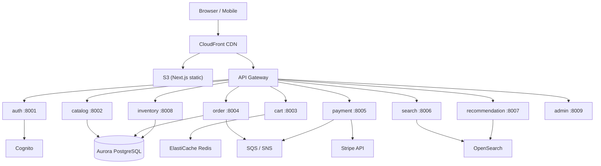

# Ecommerce AWS Platform

A cloud-native, microservices-based ecommerce platform built on AWS. Each domain is an independent FastAPI service deployed as a container on ECS Fargate, with a Next.js storefront and full Terraform infrastructure-as-code.

## Architecture



## Tech Stack

| Layer | Technology |
|---|---|
| Frontend | Next.js 16, TypeScript, Tailwind CSS |
| Services | Python 3.11, FastAPI, SQLAlchemy 2 |
| Database | Aurora PostgreSQL (prod), SQLite (dev) |
| Cache | ElastiCache Redis |
| Search | OpenSearch |
| Auth | AWS Cognito |
| Payments | Stripe |
| Messaging | SQS + SNS |
| Container runtime | ECS Fargate |
| CDN / Storage | CloudFront + S3 |
| IaC | Terraform 1.7+ |
| CI/CD | GitHub Actions |

## Prerequisites

- [Docker](https://docs.docker.com/get-docker/) 24+
- [Node.js](https://nodejs.org/) 22+
- [Python](https://www.python.org/) 3.11+
- [Terraform](https://developer.hashicorp.com/terraform/install) 1.7+
- [AWS CLI](https://aws.amazon.com/cli/) v2

## Quick Start

```bash
# Clone the repo
git clone <repo-url>
cd ecommerce-aws-platform

# Start all services locally
docker compose up -d

# Seed LocalStack secrets (requires LocalStack running)
bash scripts/bootstrap-secrets.sh

# Install frontend deps and run dev server
cd frontend && npm install && npm run dev
```

## Service Ports

| Service | Port | Swagger UI |
|---|---|---|
| auth | 8001 | http://localhost:8001/docs |
| catalog | 8002 | http://localhost:8002/docs |
| cart | 8003 | http://localhost:8003/docs |
| order | 8004 | http://localhost:8004/docs |
| payment | 8005 | http://localhost:8005/docs |
| search | 8006 | http://localhost:8006/docs |
| recommendation | 8007 | http://localhost:8007/docs |
| inventory | 8008 | http://localhost:8008/docs |
| admin | 8009 | http://localhost:8009/docs |
| frontend | 3000 | http://localhost:3000 |

## Environment Variables

Copy `.env.example` in each service directory and fill in values:

```bash
cp services/payment/.env.example services/payment/.env
```

Key variables:

| Variable | Description |
|---|---|
| `DATABASE_URL` | SQLAlchemy async connection string |
| `STRIPE_SECRET_KEY` | Stripe secret key (payment service) |
| `STRIPE_WEBHOOK_SECRET` | Stripe webhook signing secret |
| `LOG_LEVEL` | Logging level (`INFO`, `DEBUG`, etc.) |

## Makefile Commands

```bash
make up            # Start all services
make down          # Stop all services
make build         # Rebuild Docker images
make logs          # Tail all logs
make test          # Run Python tests
make lint          # Lint Python with ruff
make fmt           # Format Python with ruff
make type-check    # TypeScript type check
make clean         # Tear down + remove artifacts
```

## Deployment

### Infrastructure (Terraform)

```bash
make tf-init-dev
make tf-plan-dev
make tf-apply-dev
```

### CI/CD (GitHub Actions)

- `ci.yml` — runs on every push/PR: lints, tests, and builds
- `deploy.yml` — runs on `main`: builds and pushes Docker images to ECR, deploys frontend to S3/CloudFront, runs Terraform plan

Required GitHub secrets:

| Secret | Description |
|---|---|
| `AWS_ACCOUNT_ID` | AWS account ID |
| `AWS_ACCESS_KEY_ID` | IAM access key |
| `AWS_SECRET_ACCESS_KEY` | IAM secret key |
| `NEXT_PUBLIC_API_URL` | Public API base URL |
| `NEXT_PUBLIC_STRIPE_PUBLISHABLE_KEY` | Stripe publishable key |
| `S3_BUCKET_NAME` | Frontend S3 bucket |
| `CLOUDFRONT_DISTRIBUTION_ID` | CloudFront distribution ID |

## Contributing

See [CONTRIBUTING.md](CONTRIBUTING.md).

## Security

See [SECURITY.md](SECURITY.md) for how to report vulnerabilities.

## License

MIT
