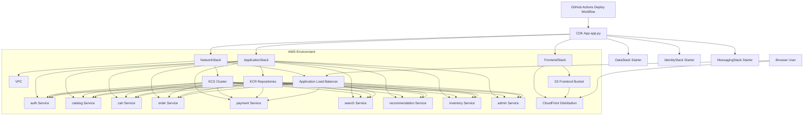

# AWS CDK Starter

This directory contains a Python AWS CDK scaffold for the ecommerce platform.

Terraform under `../infra` stays in the repository. CDK is the new deployment path only for the environments and resources that you explicitly decide CDK owns.

## What This Starter Includes

- Shared CDK context for project and environment naming
- `NetworkStack` with VPC, ECS cluster, and an internet-facing ALB
- `ApplicationStack` with one ECR repository and one ECS Fargate service per microservice
- `FrontendStack` with S3 and CloudFront for the storefront
- `DataStack`, `IdentityStack`, and `MessagingStack` as starter platform stacks you can extend next

## Current Scope

This is a starting point, not a full parity rewrite of the Terraform estate. It intentionally focuses on the deployment shape first:

- ECS cluster and services
- image repositories
- ALB path routing
- frontend hosting

You can extend it next with Aurora, ElastiCache, OpenSearch, Cognito authorizers, Secrets Manager wiring, and HTTPS certificates.

## New To CDK?

If this is your first time with AWS CDK, start here:

- [CDK-BASICS-TUTORIAL.md](CDK-BASICS-TUTORIAL.md)

## Deployment Diagram



## Bootstrap

```bash
cd cdk
python3 -m venv .venv
source .venv/bin/activate
pip install -r requirements.txt
cdk bootstrap aws://ACCOUNT_ID/us-east-1
```

## Synthesize

```bash
cd cdk
cdk synth
```

## Deploy

```bash
cd cdk
cdk deploy --all
```

## Useful Context Overrides

```bash
cdk synth -c project=ecommerce -c environment=dev -c service_image_tag=latest
cdk deploy -c environment=sandbox -c aws_region=us-east-1
```

## Ownership Rule

Keep the ownership boundary simple:

- Terraform can remain in the repository for learning and comparison.
- CDK should be the deployment authority for any environment where the pipeline runs `cdk deploy`.
- Do not let Terraform and CDK both manage the same named resource in the same AWS environment.
