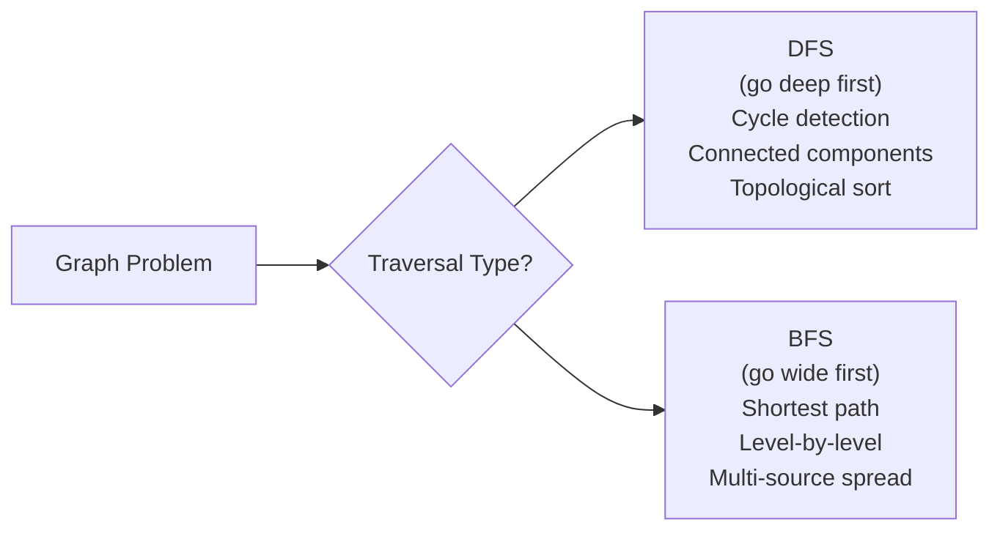
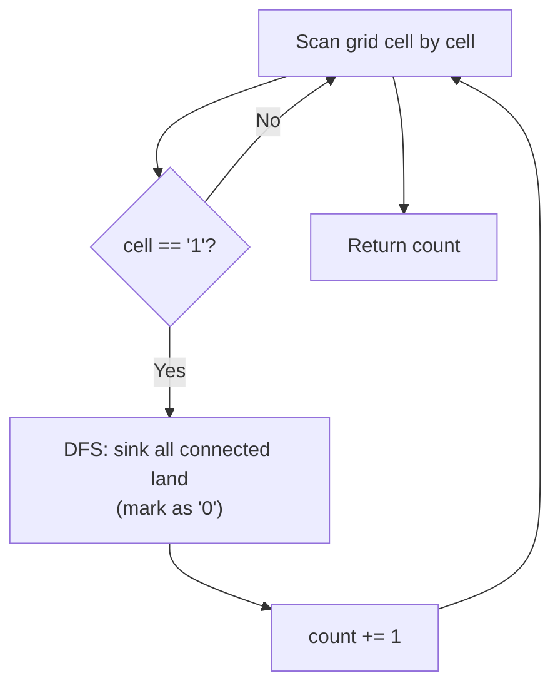
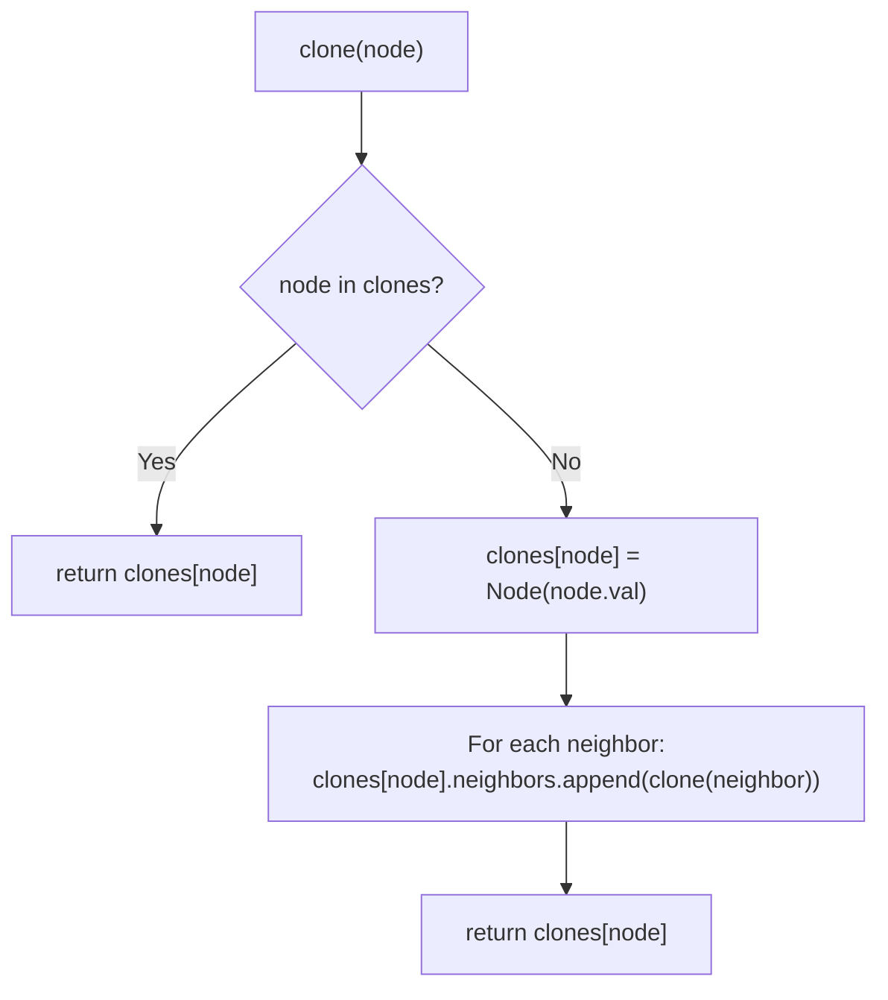
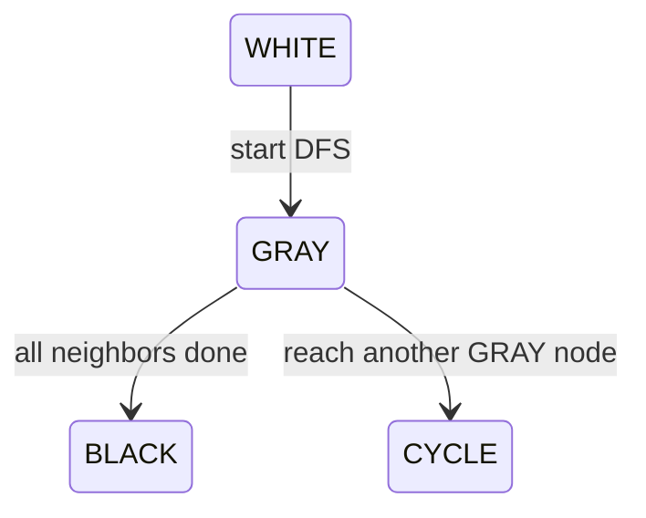
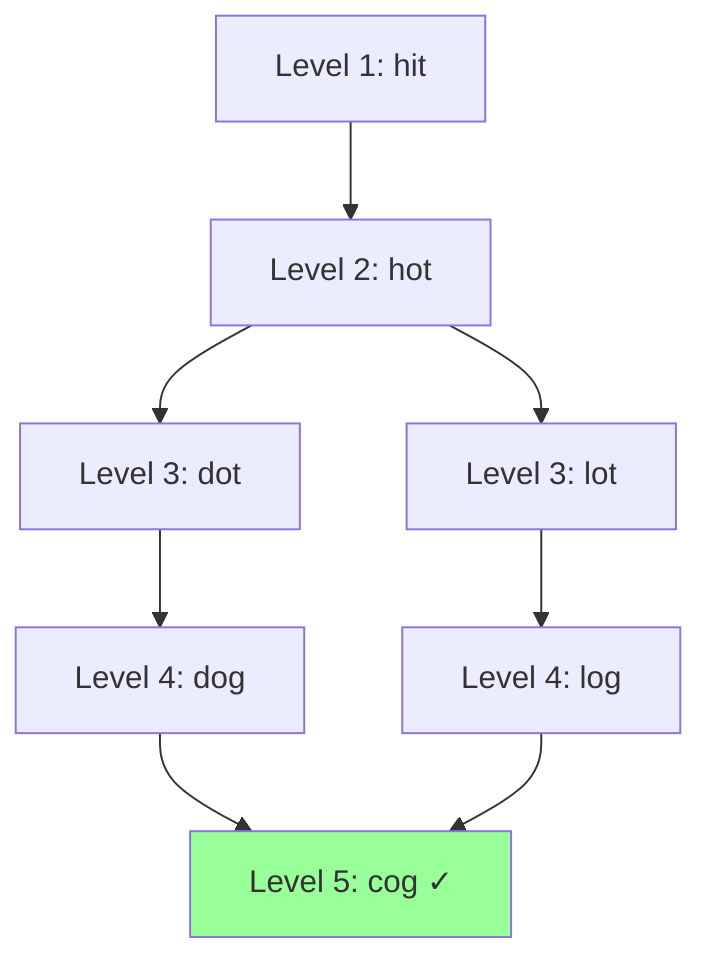
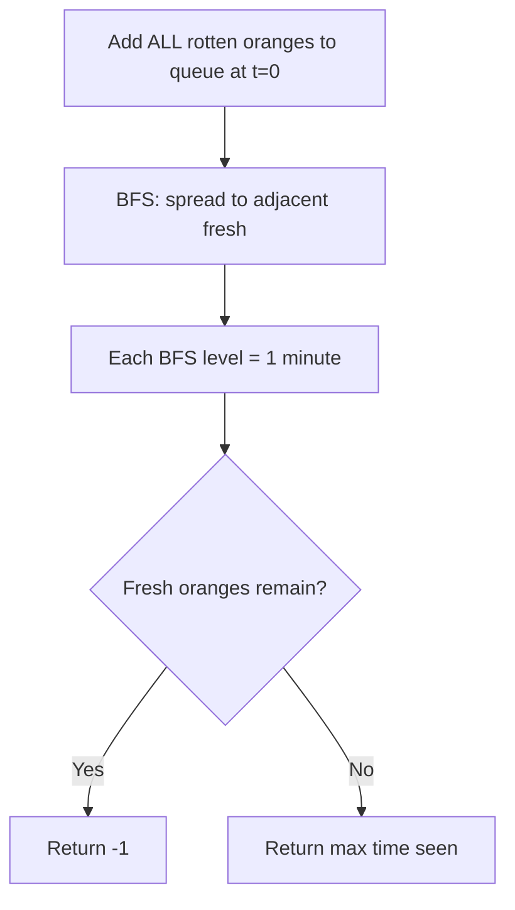
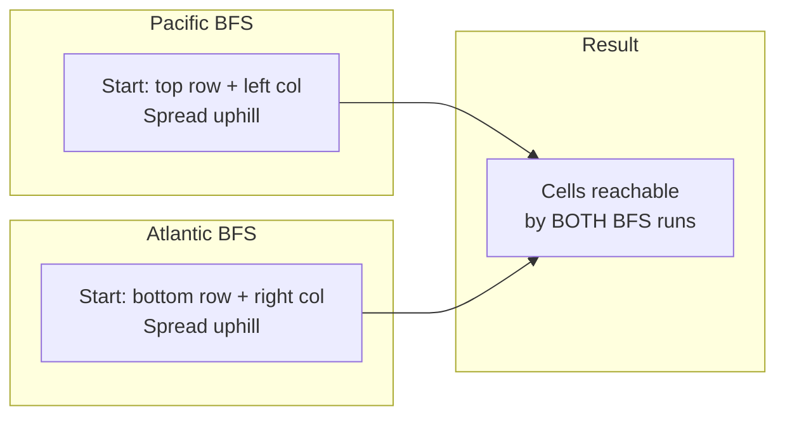
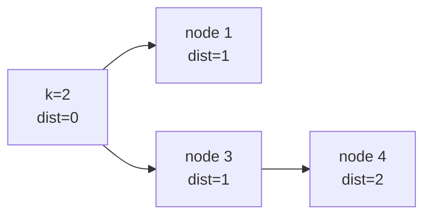
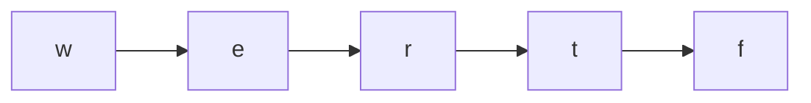

# Graph — Problems with Intuition

Problems ordered easy → hard. The key mental shift: graphs can have cycles,
so you always need a `visited` set.

---

## The Core Mental Model



**DFS:** uses a stack (or recursion). Goes as deep as possible before backtracking.
**BFS:** uses a queue. Visits all neighbors before going deeper. Guarantees shortest path in unweighted graphs.

---

## Problem 1 — Number of Islands (Medium) #200

```
Input:
  [["1","1","0","0","0"],
   ["1","1","0","0","0"],
   ["0","0","1","0","0"],
   ["0","0","0","1","1"]]
Output: 3
```

### Brute Force — Union-Find

```python
class UF:
    def __init__(self, n):
        self.parent = list(range(n))
        self.count = 0
    def find(self, x):
        while self.parent[x] != x:
            self.parent[x] = self.parent[self.parent[x]]
            x = self.parent[x]
        return x
    def union(self, x, y):
        px, py = self.find(x), self.find(y)
        if px != py:
            self.parent[px] = py
            self.count -= 1

def num_islands_uf(grid):
    m, n = len(grid), len(grid[0])
    uf = UF(m * n)
    for r in range(m):
        for c in range(n):
            if grid[r][c] == '1':
                uf.count += 1
                for dr, dc in [(0,1),(1,0)]:
                    nr, nc = r+dr, c+dc
                    if 0<=nr<m and 0<=nc<n and grid[nr][nc]=='1':
                        uf.union(r*n+c, nr*n+nc)
    return uf.count
```

### Optimal — DFS Flood Fill

```
For each unvisited land cell, start a DFS that "sinks" the entire island
(marks all connected land as visited). Count how many times we start a DFS.

Grid:
  1 1 0
  1 0 0
  0 0 1

(0,0)=1 → DFS, sink all connected 1s:
  sink (0,0), (0,1), (1,0) → count=1

(0,2)=0 → skip
(1,1)=0 → skip
(2,2)=1 → DFS, sink (2,2) → count=2

Answer: 2
```



```python
def num_islands(grid):
    if not grid:
        return 0
    rows, cols = len(grid), len(grid[0])
    count = 0

    def dfs(r, c):
        if r < 0 or r >= rows or c < 0 or c >= cols or grid[r][c] != '1':
            return
        grid[r][c] = '0'   # sink (mark visited)
        dfs(r+1, c)
        dfs(r-1, c)
        dfs(r, c+1)
        dfs(r, c-1)

    for r in range(rows):
        for c in range(cols):
            if grid[r][c] == '1':
                dfs(r, c)
                count += 1
    return count
```

| | Time | Space |
|--|------|-------|
| Union-Find | O(m×n × α) | O(m×n) |
| DFS flood fill | O(m×n) | O(m×n) |

---

## Problem 2 — Clone Graph (Medium) #133

```
Input: node with val=1, neighbors=[2,4], etc.
Output: deep copy of the entire graph
```

### Brute Force — BFS with Hash Map

```python
from collections import deque

def clone_graph_bfs(node):
    if not node:
        return None
    clones = {node: Node(node.val)}
    queue = deque([node])
    while queue:
        curr = queue.popleft()
        for neighbor in curr.neighbors:
            if neighbor not in clones:
                clones[neighbor] = Node(neighbor.val)
                queue.append(neighbor)
            clones[curr].neighbors.append(clones[neighbor])
    return clones[node]
```

### Optimal — DFS with Memoization

```
Use a hash map: original_node → cloned_node
When we encounter a node already in the map, return its clone (handles cycles).

clone(1):
  clones[1] = Node(1)
  for neighbor 2:
    clone(2):
      clones[2] = Node(2)
      for neighbor 1: already in clones → return clones[1]
      for neighbor 3: clone(3)...
    clones[1].neighbors.append(clones[2])
  ...
```



```python
def clone_graph(node):
    if not node:
        return None
    clones = {}

    def dfs(n):
        if n in clones:
            return clones[n]
        clone = Node(n.val)
        clones[n] = clone   # store BEFORE recursing (handles cycles!)
        for neighbor in n.neighbors:
            clone.neighbors.append(dfs(neighbor))
        return clone

    return dfs(node)
```

| | Time | Space |
|--|------|-------|
| BFS | O(V+E) | O(V) |
| DFS | O(V+E) | O(V) |

---

## Problem 3 — Course Schedule (Medium) #207

```
Input: numCourses=4, prerequisites=[[1,0],[2,0],[3,1],[3,2]]
Output: True  (can finish: 0→1→3, 0→2→3)

Input: numCourses=2, prerequisites=[[1,0],[0,1]]
Output: False  (cycle: 0 requires 1, 1 requires 0)
```

### Brute Force — Topological Sort (Kahn's)

```python
from collections import deque

def can_finish_kahn(numCourses, prerequisites):
    in_degree = [0] * numCourses
    graph = [[] for _ in range(numCourses)]
    for a, b in prerequisites:
        graph[b].append(a)
        in_degree[a] += 1
    queue = deque(i for i in range(numCourses) if in_degree[i] == 0)
    count = 0
    while queue:
        node = queue.popleft()
        count += 1
        for neighbor in graph[node]:
            in_degree[neighbor] -= 1
            if in_degree[neighbor] == 0:
                queue.append(neighbor)
    return count == numCourses
```

### Optimal — DFS Cycle Detection (3-Color)

```
Color each node:
  WHITE (0) = unvisited
  GRAY  (1) = currently being processed (in current DFS path)
  BLACK (2) = fully processed

If we reach a GRAY node → cycle detected!

Graph: 0→1→3, 0→2→3

dfs(0): color[0]=GRAY
  dfs(1): color[1]=GRAY
    dfs(3): color[3]=GRAY
      no neighbors → color[3]=BLACK
    color[1]=BLACK
  dfs(2): color[2]=GRAY
    dfs(3): color[3]=BLACK → already done, skip
    color[2]=BLACK
  color[0]=BLACK
No cycle → True ✓
```



```python
def can_finish(numCourses, prerequisites):
    graph = [[] for _ in range(numCourses)]
    for a, b in prerequisites:
        graph[b].append(a)

    WHITE, GRAY, BLACK = 0, 1, 2
    color = [WHITE] * numCourses

    def dfs(node):
        color[node] = GRAY
        for neighbor in graph[node]:
            if color[neighbor] == GRAY:
                return False   # cycle!
            if color[neighbor] == WHITE:
                if not dfs(neighbor):
                    return False
        color[node] = BLACK
        return True

    return all(dfs(i) for i in range(numCourses) if color[i] == WHITE)
```

| | Time | Space |
|--|------|-------|
| Kahn's (BFS) | O(V+E) | O(V+E) |
| DFS 3-color | O(V+E) | O(V+E) |

---

## Problem 4 — Word Ladder (Hard) #127

```
Input: beginWord="hit", endWord="cog"
       wordList=["hot","dot","dog","lot","log","cog"]
Output: 5  (hit→hot→dot→dog→cog)
```

### Brute Force — DFS (finds A path, not shortest)

```python
def word_ladder_dfs(beginWord, endWord, wordList):
    word_set = set(wordList)
    best = [float('inf')]

    def dfs(word, steps, visited):
        if word == endWord:
            best[0] = min(best[0], steps)
            return
        for i in range(len(word)):
            for c in 'abcdefghijklmnopqrstuvwxyz':
                new_word = word[:i] + c + word[i+1:]
                if new_word in word_set and new_word not in visited:
                    visited.add(new_word)
                    dfs(new_word, steps+1, visited)
                    visited.remove(new_word)

    dfs(beginWord, 1, {beginWord})
    return best[0] if best[0] != float('inf') else 0
# Exponential time — explores all paths
```

### Optimal — BFS (guarantees shortest path)

```
BFS explores level by level. First time we reach endWord = shortest path.

Level 1: {hit}
Level 2: {hot}  (hit→hot: change 'i' to 'o')
Level 3: {dot, lot}  (hot→dot, hot→lot)
Level 4: {dog, log}  (dot→dog, lot→log)
Level 5: {cog}  (dog→cog, log→cog) ← FOUND! return 5
```



```python
from collections import deque

def ladder_length(beginWord, endWord, wordList):
    word_set = set(wordList)
    if endWord not in word_set:
        return 0

    queue = deque([(beginWord, 1)])
    visited = {beginWord}

    while queue:
        word, steps = queue.popleft()
        for i in range(len(word)):
            for c in 'abcdefghijklmnopqrstuvwxyz':
                new_word = word[:i] + c + word[i+1:]
                if new_word == endWord:
                    return steps + 1
                if new_word in word_set and new_word not in visited:
                    visited.add(new_word)
                    queue.append((new_word, steps + 1))
    return 0
```

| | Time | Space |
|--|------|-------|
| DFS | O(M² × N) exponential | O(M×N) |
| BFS | O(M² × N) | O(M×N) |

M = word length, N = wordList size

---

## Problem 5 — Rotting Oranges (Medium) #994

```
Input:
  [[2,1,1],
   [1,1,0],
   [0,1,1]]
Output: 4  (minutes until all fresh oranges rot)
```

### Brute Force — Simulate Minute by Minute

```python
def oranges_rotting_brute(grid):
    m, n = len(grid), len(grid[0])
    minutes = 0
    while True:
        newly_rotten = []
        for r in range(m):
            for c in range(n):
                if grid[r][c] == 2:
                    for dr, dc in [(0,1),(0,-1),(1,0),(-1,0)]:
                        nr, nc = r+dr, c+dc
                        if 0<=nr<m and 0<=nc<n and grid[nr][nc]==1:
                            newly_rotten.append((nr,nc))
        if not newly_rotten:
            break
        for r, c in newly_rotten:
            grid[r][c] = 2
        minutes += 1
    fresh = sum(grid[r][c]==1 for r in range(m) for c in range(n))
    return -1 if fresh > 0 else minutes
# O((m×n)²) — rescans entire grid each minute
```

### Optimal — Multi-Source BFS

```
Key insight: all rotten oranges spread simultaneously.
Start BFS from ALL rotten oranges at once (multi-source BFS).
Each BFS level = 1 minute.

Initial rotten: (0,0)=2
Queue: [(0,0,0), (0,1,0)]  ← all rotten oranges at minute 0

Minute 1: spread from (0,0) → rot (0,1)? already rotten. rot (1,0)
          spread from (0,1) → rot (0,2), (1,1)
          Queue: [(1,0,1),(0,2,1),(1,1,1)]

Minute 2: spread from (1,0) → nothing new
          spread from (0,2) → nothing new
          spread from (1,1) → rot (2,1)
          Queue: [(2,1,2)]

Minute 3: spread from (2,1) → rot (2,2)
          Queue: [(2,2,3)]

Minute 4: spread from (2,2) → nothing new
          Queue: []

No fresh oranges remain → return 4 ✓
```



```python
from collections import deque

def oranges_rotting(grid):
    m, n = len(grid), len(grid[0])
    queue = deque()
    fresh = 0

    for r in range(m):
        for c in range(n):
            if grid[r][c] == 2:
                queue.append((r, c, 0))
            elif grid[r][c] == 1:
                fresh += 1

    if fresh == 0:
        return 0

    max_time = 0
    while queue:
        r, c, t = queue.popleft()
        for dr, dc in [(0,1),(0,-1),(1,0),(-1,0)]:
            nr, nc = r+dr, c+dc
            if 0<=nr<m and 0<=nc<n and grid[nr][nc]==1:
                grid[nr][nc] = 2
                fresh -= 1
                max_time = t + 1
                queue.append((nr, nc, t+1))

    return max_time if fresh == 0 else -1
```

| | Time | Space |
|--|------|-------|
| Simulate | O((m×n)²) | O(1) |
| Multi-source BFS | O(m×n) | O(m×n) |

---

## Problem 6 — Pacific Atlantic Water Flow (Medium) #417

```
Input: heights matrix
Output: cells from which water can flow to BOTH oceans

Pacific: top and left edges
Atlantic: bottom and right edges
Water flows to equal or lower adjacent cells.
```

### Brute Force — DFS from Every Cell

```python
def pacific_atlantic_brute(heights):
    m, n = len(heights), len(heights[0])
    result = []

    def can_reach_pacific(r, c, visited):
        if r == 0 or c == 0: return True
        for dr, dc in [(0,1),(0,-1),(1,0),(-1,0)]:
            nr, nc = r+dr, c+dc
            if (0<=nr<m and 0<=nc<n and (nr,nc) not in visited
                    and heights[nr][nc] <= heights[r][c]):
                visited.add((nr,nc))
                if can_reach_pacific(nr, nc, visited): return True
        return False

    # Similar for atlantic... O(m×n) per cell = O(m²×n²) total
```

### Optimal — Reverse BFS from Ocean Edges

```
Reverse the problem: instead of flowing DOWN from cells to ocean,
flow UP from ocean edges to cells.

A cell can reach Pacific if Pacific water can flow UP to it.
A cell can reach Atlantic if Atlantic water can flow UP to it.

BFS from Pacific edges (top row + left col) going UPHILL.
BFS from Atlantic edges (bottom row + right col) going UPHILL.
Intersection = answer.
```



```python
from collections import deque

def pacific_atlantic(heights):
    m, n = len(heights), len(heights[0])

    def bfs(starts):
        visited = set(starts)
        queue = deque(starts)
        while queue:
            r, c = queue.popleft()
            for dr, dc in [(0,1),(0,-1),(1,0),(-1,0)]:
                nr, nc = r+dr, c+dc
                if (0<=nr<m and 0<=nc<n and (nr,nc) not in visited
                        and heights[nr][nc] >= heights[r][c]):  # uphill!
                    visited.add((nr,nc))
                    queue.append((nr,nc))
        return visited

    pacific_starts  = [(0,c) for c in range(n)] + [(r,0) for r in range(1,m)]
    atlantic_starts = [(m-1,c) for c in range(n)] + [(r,n-1) for r in range(m-1)]

    pacific  = bfs(pacific_starts)
    atlantic = bfs(atlantic_starts)

    return [[r,c] for r in range(m) for c in range(n)
            if (r,c) in pacific and (r,c) in atlantic]
```

| | Time | Space |
|--|------|-------|
| DFS from every cell | O(m²×n²) | O(m×n) |
| Reverse BFS | O(m×n) | O(m×n) |

---

## Problem 7 — Network Delay Time (Medium) #743

```
Input: times=[[2,1,1],[2,3,1],[3,4,1]], n=4, k=2
Output: 2  (signal from node 2 reaches all nodes in 2 time units)
```

### Brute Force — Bellman-Ford

```python
def network_delay_bellman_ford(times, n, k):
    dist = [float('inf')] * (n + 1)
    dist[k] = 0
    for _ in range(n - 1):   # relax n-1 times
        for u, v, w in times:
            if dist[u] + w < dist[v]:
                dist[v] = dist[u] + w
    max_dist = max(dist[1:])
    return max_dist if max_dist < float('inf') else -1
# O(V×E) time
```

### Optimal — Dijkstra with Min-Heap

```
Greedy: always process the node with the smallest known distance first.
Use a min-heap to efficiently get the next closest node.

Start: dist[2]=0, heap=[(0,2)]

Pop (0,2): process node 2
  neighbor 1: dist[1] = 0+1 = 1. heap=[(1,1)]
  neighbor 3: dist[3] = 0+1 = 1. heap=[(1,1),(1,3)]

Pop (1,1): process node 1 (no outgoing edges)

Pop (1,3): process node 3
  neighbor 4: dist[4] = 1+1 = 2. heap=[(2,4)]

Pop (2,4): process node 4 (no outgoing edges)

max(dist) = 2 ✓
```



```python
import heapq
from collections import defaultdict

def network_delay_time(times, n, k):
    graph = defaultdict(list)
    for u, v, w in times:
        graph[u].append((v, w))

    dist = {i: float('inf') for i in range(1, n+1)}
    dist[k] = 0
    heap = [(0, k)]

    while heap:
        d, node = heapq.heappop(heap)
        if d > dist[node]:
            continue   # stale entry
        for neighbor, weight in graph[node]:
            new_dist = d + weight
            if new_dist < dist[neighbor]:
                dist[neighbor] = new_dist
                heapq.heappush(heap, (new_dist, neighbor))

    max_dist = max(dist.values())
    return max_dist if max_dist < float('inf') else -1
```

| | Time | Space |
|--|------|-------|
| Bellman-Ford | O(V×E) | O(V) |
| Dijkstra | O((V+E) log V) | O(V+E) |

---

## Problem 8 — Alien Dictionary (Hard) #269

```
Input: words=["wrt","wrf","er","ett","rftt"]
Output: "wertf"  (valid ordering of alien alphabet)

Derive order by comparing adjacent words:
  "wrt" vs "wrf" → t comes before f
  "wrf" vs "er"  → w comes before e
  "er"  vs "ett" → r comes before t
  "ett" vs "rftt"→ e comes before r
```

### Brute Force — Try All Orderings

```python
from itertools import permutations

def alien_order_brute(words):
    chars = set(''.join(words))
    # Try all permutations of characters
    for perm in permutations(chars):
        order = {c: i for i, c in enumerate(perm)}
        valid = True
        for i in range(len(words)-1):
            w1, w2 = words[i], words[i+1]
            for c1, c2 in zip(w1, w2):
                if c1 != c2:
                    if order[c1] > order[c2]:
                        valid = False
                    break
            else:
                if len(w1) > len(w2):
                    valid = False
        if valid:
            return ''.join(perm)
    return ""
# O(n! × m×n) — completely impractical
```

### Optimal — Topological Sort

```
Step 1: Build directed graph from adjacent word comparisons
  "wrt" vs "wrf": first diff at index 2 → t→f edge
  "wrf" vs "er":  first diff at index 0 → w→e edge
  "er"  vs "ett": first diff at index 1 → r→t edge
  "ett" vs "rftt":first diff at index 0 → e→r edge

Graph: t→f, w→e, r→t, e→r

Step 2: Topological sort (DFS)
  Start with any unvisited node.
  Post-order DFS → reverse = topological order.

DFS from w: w→e→r→t→f (post-order: f,t,r,e,w)
Reverse: w,e,r,t,f ✓
```



```python
from collections import defaultdict, deque

def alien_order(words):
    # Build adjacency list with all unique chars
    adj = {c: set() for word in words for c in word}

    # Compare adjacent words to find ordering
    for i in range(len(words) - 1):
        w1, w2 = words[i], words[i+1]
        min_len = min(len(w1), len(w2))
        if len(w1) > len(w2) and w1[:min_len] == w2[:min_len]:
            return ""   # invalid: longer word before shorter prefix
        for j in range(min_len):
            if w1[j] != w2[j]:
                adj[w1[j]].add(w2[j])
                break

    # Topological sort via DFS
    # 0=unvisited, 1=in-progress, 2=done
    state = {c: 0 for c in adj}
    result = []

    def dfs(c):
        if state[c] == 1: return False   # cycle
        if state[c] == 2: return True    # already processed
        state[c] = 1
        for neighbor in adj[c]:
            if not dfs(neighbor):
                return False
        state[c] = 2
        result.append(c)
        return True

    for c in adj:
        if state[c] == 0:
            if not dfs(c):
                return ""

    return ''.join(reversed(result))
```

| | Time | Space |
|--|------|-------|
| Brute force | O(n! × m×n) | O(n) |
| Topological sort | O(C + N×M) | O(C) |

C = unique chars, N = words, M = word length
