# Linked List — Problems with Intuition

Problems ordered easy → hard. Each shows the pointer state at every step.

---

## Problem 1 — Delete Node (Easy) #237

**Given a node in a singly linked list (not the tail), delete it.**
You only have access to that node — not the head.

```
Input:  [4] → [5] → [1] → [9],  node = [5]
Output: [4] → [1] → [9]
```

### Why This Is Tricky

You can't reach the previous node to do `prev.next = node.next`.
You only have the node itself.

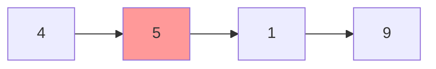

### Brute Force Thinking

"I need to remove node 5. I can't go backward. I'm stuck."

### Optimal — Copy-Forward Trick

Copy the next node's value into the current node, then skip the next node.
Effectively you're deleting the NEXT node but making it look like you deleted
the current one.

```
Before: [4] → [5] → [1] → [9]
                ↑ we are here

Step 1: Copy next value into current
  node.val = node.next.val
  [4] → [1] → [1] → [9]   ← node now has value 1

Step 2: Skip the next node
  node.next = node.next.next
  [4] → [1] → [9]  ✓
```

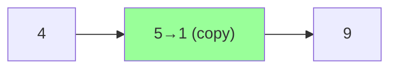

```python
def delete_node(node):
    node.val = node.next.val        # copy next value here
    node.next = node.next.next      # skip next node
```

| | Time | Space |
|--|------|-------|
| Optimal | O(1) | O(1) |

---

## Problem 2 — Reverse Linked List (Easy) #206

```
Input:  [1] → [2] → [3] → [4] → [5]
Output: [5] → [4] → [3] → [2] → [1]
```

### Brute Force — Collect and Rebuild

```python
def reverse_brute(head):
    vals = []
    curr = head
    while curr:
        vals.append(curr.val)
        curr = curr.next
    curr = head
    for v in reversed(vals):
        curr.val = v
        curr = curr.next
    return head
# O(n) time, O(n) space
```

### Optimal — Three Pointer In-Place

The key: you need 3 pointers because redirecting an arrow destroys your
only path forward.

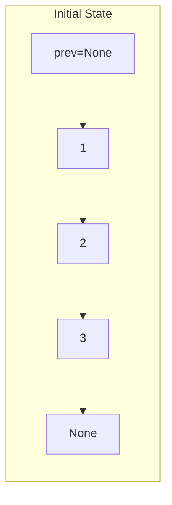

```
State machine — what changes each iteration:

BEFORE:  prev=None  curr=[1]  nxt=[2]
         None  [1]→[2]→[3]→None

STEP 1 (save nxt):
         nxt = curr.next = [2]

STEP 2 (redirect arrow):
         curr.next = prev
         None←[1]  [2]→[3]→None

STEP 3 (advance prev):
         prev = curr = [1]

STEP 4 (advance curr):
         curr = nxt = [2]

─────────────────────────────────────
BEFORE:  prev=[1]  curr=[2]  nxt=?
         None←[1]  [2]→[3]→None

STEP 1: nxt = [3]
STEP 2: curr.next = prev → None←[1]←[2]  [3]→None
STEP 3: prev = [2]
STEP 4: curr = [3]

─────────────────────────────────────
BEFORE:  prev=[2]  curr=[3]  nxt=?
         None←[1]←[2]  [3]→None

STEP 1: nxt = None
STEP 2: curr.next = prev → None←[1]←[2]←[3]
STEP 3: prev = [3]
STEP 4: curr = None  ← STOP

New head = prev = [3] ✓
```

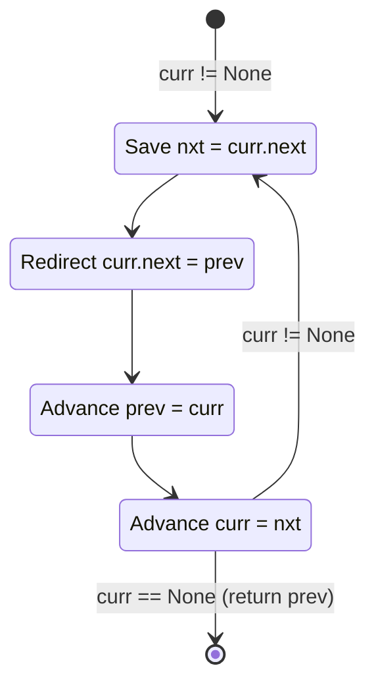

```python
def reverse_list(head):
    prev, curr = None, head
    while curr:
        nxt = curr.next        # 1. save — MUST be first
        curr.next = prev       # 2. redirect
        prev = curr            # 3. advance prev
        curr = nxt             # 4. advance curr
    return prev
```

| | Time | Space |
|--|------|-------|
| Brute force | O(n) | O(n) |
| Three pointers | O(n) | O(1) |

---

## Problem 3 — Middle of Linked List (Easy) #876

```
Input:  [1] → [2] → [3] → [4] → [5]
Output: node [3]

Input:  [1] → [2] → [3] → [4] → [5] → [6]
Output: node [4]  (second middle for even length)
```

### Brute Force — Count Then Walk

```python
def find_middle_brute(head):
    length = 0
    curr = head
    while curr:
        length += 1
        curr = curr.next
    # Walk to middle
    curr = head
    for _ in range(length // 2):
        curr = curr.next
    return curr
# O(n) time, O(1) space — two passes
```

### Optimal — Slow/Fast Pointers (One Pass)

```
Intuition: fast moves 2x speed. When fast reaches end, slow is at middle.

[1] → [2] → [3] → [4] → [5]
 ↑                           ↑
slow                        fast (both start here)

Step 1: slow=[2], fast=[3]
Step 2: slow=[3], fast=[5]
Step 3: fast.next=None → STOP. slow=[3] ✓

For even length [1]→[2]→[3]→[4]→[5]→[6]:
Step 1: slow=[2], fast=[3]
Step 2: slow=[3], fast=[5]
Step 3: slow=[4], fast=None (fast.next was [6], fast.next.next=None) → STOP
slow=[4] ✓ (second middle)
```

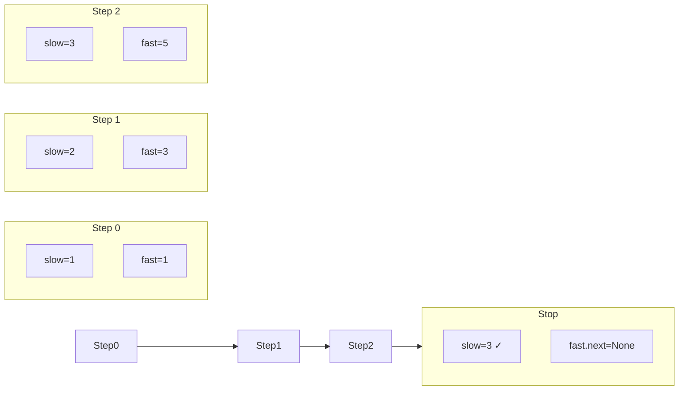

```python
def find_middle(head):
    slow = fast = head
    while fast and fast.next:
        slow = slow.next
        fast = fast.next.next
    return slow
```

| | Time | Space | Passes |
|--|------|-------|--------|
| Count + walk | O(n) | O(1) | 2 |
| Slow/fast | O(n) | O(1) | 1 |

---

## Problem 4 — Linked List Cycle Detection (Easy) #141 / #142

**#141:** Does the list have a cycle?
**#142:** Where does the cycle start?

```
Input:  [3] → [2] → [0] → [-4]
                ↑____________|   (tail connects back to node [2])
Output #141: True
Output #142: node [2]
```

### Brute Force — Hash Set

```python
def has_cycle_brute(head):
    seen = set()
    curr = head
    while curr:
        if id(curr) in seen:
            return True
        seen.add(id(curr))
        curr = curr.next
    return False
# O(n) time, O(n) space
```

### Optimal — Floyd's Cycle Detection (O(1) space)

```
Intuition: if there's a cycle, a fast runner will eventually lap a slow runner.
Like two runners on a circular track — the faster one always catches up.

Phase 1: Detect the cycle
  slow moves 1 step, fast moves 2 steps.
  If they meet → cycle exists.

Phase 2: Find the entry point
  Reset slow to head. Keep fast at meeting point.
  Both move 1 step at a time.
  Where they meet = cycle entry.

WHY PHASE 2 WORKS (math):
  Let:
    F = distance from head to cycle entry
    C = cycle length
    k = distance from entry to meeting point

  When they meet:
    slow traveled: F + k
    fast traveled: F + k + C  (fast did one extra loop)
    fast = 2 × slow → F + k + C = 2(F + k)
    → C = F + k
    → F = C - k

  So: distance from head to entry (F)
    = distance from meeting point to entry going forward (C - k)

  Reset slow to head, both move 1 step → they meet at entry! ✓
```

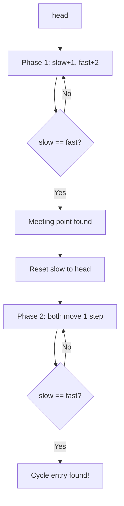

```python
def detect_cycle(head):
    # Phase 1: find meeting point
    slow = fast = head
    while fast and fast.next:
        slow = slow.next
        fast = fast.next.next
        if slow == fast:
            break
    else:
        return None  # no cycle

    # Phase 2: find entry
    slow = head
    while slow != fast:
        slow = slow.next
        fast = fast.next
    return slow  # cycle entry node
```

| | Time | Space |
|--|------|-------|
| Hash set | O(n) | O(n) |
| Floyd's | O(n) | O(1) |

---

## Problem 5 — Remove Nth Node From End (Medium) #19

```
Input:  [1] → [2] → [3] → [4] → [5],  n=2
Output: [1] → [2] → [3] → [5]   (removed 4, which is 2nd from end)
```

### Brute Force — Two Passes

```python
def remove_nth_brute(head, n):
    # Pass 1: count length
    length = 0
    curr = head
    while curr:
        length += 1
        curr = curr.next
    # Pass 2: walk to (length - n - 1)th node
    dummy = ListNode(0, head)
    curr = dummy
    for _ in range(length - n):
        curr = curr.next
    curr.next = curr.next.next
    return dummy.next
# O(n) time, O(1) space — two passes
```

### Optimal — Two Pointers with Gap (One Pass)

```
Idea: maintain a gap of n between two pointers.
When the fast pointer reaches the end, slow is just before the target.

[1] → [2] → [3] → [4] → [5] → None,  n=2

Step 1: Advance fast n steps ahead
  fast moves 2 steps: fast=[3]
  slow stays at dummy

  dummy → [1] → [2] → [3] → [4] → [5] → None
   ↑                   ↑
  slow                fast   (gap = 2)

Step 2: Move both until fast reaches None
  Move 1: slow=[1], fast=[4]
  Move 2: slow=[2], fast=[5]
  Move 3: slow=[3], fast=None → STOP

  dummy → [1] → [2] → [3] → [4] → [5] → None
                        ↑
                       slow (just before target [4])

Step 3: slow.next = slow.next.next
  dummy → [1] → [2] → [3] → [5] → None ✓
```

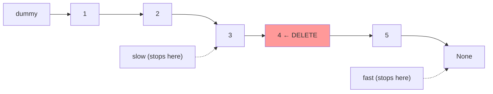

```python
def remove_nth_from_end(head, n):
    dummy = ListNode(0, head)
    slow = fast = dummy

    # Advance fast n+1 steps (so slow stops BEFORE the target)
    for _ in range(n + 1):
        fast = fast.next

    # Move both until fast is None
    while fast:
        slow = slow.next
        fast = fast.next

    # Delete the target
    slow.next = slow.next.next
    return dummy.next
```

| | Time | Space | Passes |
|--|------|-------|--------|
| Two pass | O(n) | O(1) | 2 |
| Two pointers | O(n) | O(1) | 1 |

---

## Problem 6 — Merge Two Sorted Lists (Easy) #21

```
Input:  [1] → [2] → [4]
        [1] → [3] → [4]
Output: [1] → [1] → [2] → [3] → [4] → [4]
```

### Brute Force — Collect, Sort, Rebuild

```python
def merge_brute(l1, l2):
    vals = []
    while l1:
        vals.append(l1.val); l1 = l1.next
    while l2:
        vals.append(l2.val); l2 = l2.next
    vals.sort()
    dummy = curr = ListNode(0)
    for v in vals:
        curr.next = ListNode(v)
        curr = curr.next
    return dummy.next
# O(n log n) time, O(n) space
```

### Optimal — Pointer Weaving

```
Use a dummy head to avoid special-casing the first node.
Always attach the smaller of the two current nodes.

l1: [1] → [2] → [4]
l2: [1] → [3] → [4]

dummy → ?

Compare l1.val=1 vs l2.val=1 → tie, take l1
  dummy → [1(l1)]
  l1 advances to [2]

Compare l1.val=2 vs l2.val=1 → take l2
  dummy → [1] → [1(l2)]
  l2 advances to [3]

Compare l1.val=2 vs l2.val=3 → take l1
  dummy → [1] → [1] → [2(l1)]
  l1 advances to [4]

Compare l1.val=4 vs l2.val=3 → take l2
  dummy → [1] → [1] → [2] → [3(l2)]
  l2 advances to [4]

Compare l1.val=4 vs l2.val=4 → tie, take l1
  dummy → [1] → [1] → [2] → [3] → [4(l1)]
  l1 = None

l1 exhausted → attach remaining l2
  dummy → [1] → [1] → [2] → [3] → [4] → [4] ✓
```

```python
def merge_two_lists(l1, l2):
    dummy = curr = ListNode(0)
    while l1 and l2:
        if l1.val <= l2.val:
            curr.next = l1
            l1 = l1.next
        else:
            curr.next = l2
            l2 = l2.next
        curr = curr.next
    curr.next = l1 or l2   # attach remaining
    return dummy.next
```

| | Time | Space |
|--|------|-------|
| Collect + sort | O(n log n) | O(n) |
| Pointer weaving | O(n) | O(1) |

---

## Problem 7 — Reorder List (Medium) #143

```
Input:  [1] → [2] → [3] → [4] → [5]
Output: [1] → [5] → [2] → [4] → [3]
Pattern: L0 → Ln → L1 → Ln-1 → L2 → ...
```

### Brute Force — Deque

```python
from collections import deque

def reorder_brute(head):
    dq = deque()
    curr = head
    while curr:
        dq.append(curr)
        curr = curr.next
    dummy = curr = ListNode(0)
    left = True
    while dq:
        node = dq.popleft() if left else dq.pop()
        curr.next = node
        curr = curr.next
        left = not left
    curr.next = None
    return dummy.next
# O(n) time, O(n) space
```

### Optimal — Three Steps, No Extra Space

```
Step 1: Find middle
  [1] → [2] → [3] → [4] → [5]
                ↑ middle

Step 2: Reverse second half
  First half:  [1] → [2] → [3]
  Second half: [5] → [4]  (reversed)

Step 3: Interleave
  Take one from first, one from second, alternating.
```

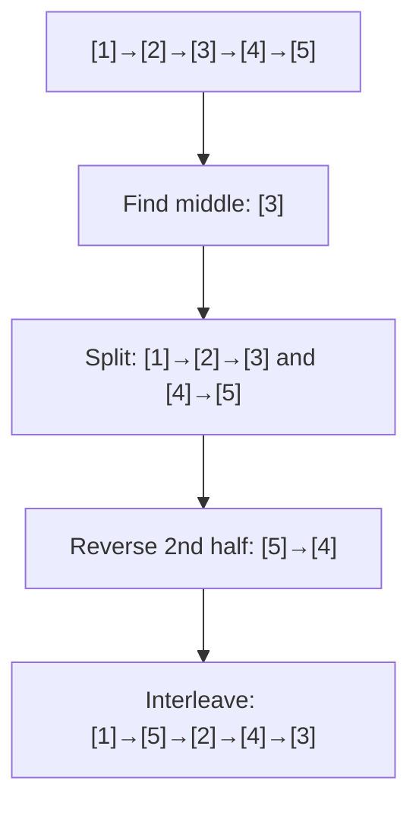

```python
def reorder_list(head):
    if not head or not head.next:
        return

    # Step 1: find middle
    slow = fast = head
    while fast.next and fast.next.next:
        slow = slow.next
        fast = fast.next.next
    # slow is now the middle

    # Step 2: reverse second half
    prev, curr = None, slow.next
    slow.next = None   # cut the list
    while curr:
        nxt = curr.next
        curr.next = prev
        prev = curr
        curr = nxt
    # prev is head of reversed second half

    # Step 3: interleave
    first, second = head, prev
    while second:
        tmp1, tmp2 = first.next, second.next
        first.next = second
        second.next = tmp1
        first = tmp1
        second = tmp2
```

| | Time | Space |
|--|------|-------|
| Deque | O(n) | O(n) |
| Three steps | O(n) | O(1) |

---

## Problem 8 — Copy List with Random Pointer (Medium) #138

```
Each node has: val, next, random (points to any node or None)
Input:  [[7,null],[13,0],[11,4],[10,2],[1,0]]
Output: Deep copy with same structure
```

### Brute Force — Two Pass with Hash Map

```python
def copy_random_list_brute(head):
    if not head:
        return None
    # Pass 1: create all new nodes
    old_to_new = {}
    curr = head
    while curr:
        old_to_new[curr] = Node(curr.val)
        curr = curr.next
    # Pass 2: wire up next and random
    curr = head
    while curr:
        if curr.next:
            old_to_new[curr].next = old_to_new[curr.next]
        if curr.random:
            old_to_new[curr].random = old_to_new[curr.random]
        curr = curr.next
    return old_to_new[head]
# O(n) time, O(n) space
```

### Optimal — Interleaving (O(1) extra space)

```
Idea: weave copies between originals, then separate.

Step 1: Interleave copies
  [1] → [2] → [3]
  becomes:
  [1] → [1'] → [2] → [2'] → [3] → [3']

Step 2: Set random pointers for copies
  node.next.random = node.random.next
  (copy's random = original's random's copy)

Step 3: Separate the two lists
```

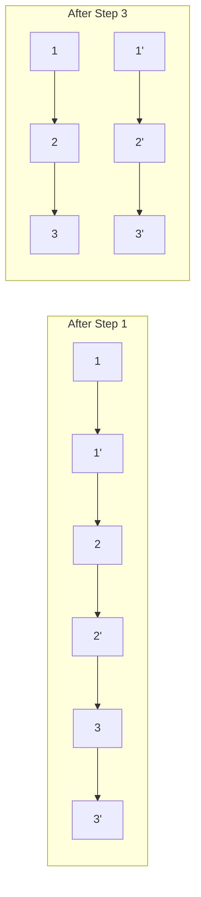

```python
def copy_random_list(head):
    if not head:
        return None

    # Step 1: interleave
    curr = head
    while curr:
        copy = Node(curr.val)
        copy.next = curr.next
        curr.next = copy
        curr = copy.next

    # Step 2: set random pointers
    curr = head
    while curr:
        if curr.random:
            curr.next.random = curr.random.next
        curr = curr.next.next

    # Step 3: separate
    dummy = Node(0)
    copy_curr = dummy
    curr = head
    while curr:
        copy_curr.next = curr.next
        curr.next = curr.next.next
        copy_curr = copy_curr.next
        curr = curr.next

    return dummy.next
```

| | Time | Space |
|--|------|-------|
| Hash map | O(n) | O(n) |
| Interleaving | O(n) | O(1) |

---

## Problem 9 — LRU Cache (Hard) #146

```
LRUCache(2)
put(1,1) → cache: {1:1}
put(2,2) → cache: {1:1, 2:2}
get(1)   → 1  (moves 1 to most recent)
put(3,3) → evict 2 (LRU), cache: {1:1, 3:3}
get(2)   → -1 (evicted)
```

### Brute Force — OrderedDict

```python
from collections import OrderedDict

class LRUCache:
    def __init__(self, capacity):
        self.cap = capacity
        self.cache = OrderedDict()

    def get(self, key):
        if key not in self.cache:
            return -1
        self.cache.move_to_end(key)
        return self.cache[key]

    def put(self, key, value):
        if key in self.cache:
            self.cache.move_to_end(key)
        self.cache[key] = value
        if len(self.cache) > self.cap:
            self.cache.popitem(last=False)
# O(1) amortized — but relies on Python built-in
```

### Optimal — Manual DLL + Hash Map

```
Structure:
  Hash map: key → node (O(1) lookup)
  DLL: most_recent ↔ ... ↔ least_recent (O(1) move/evict)

  head(dummy) ⇄ [most recent] ⇄ ... ⇄ [least recent] ⇄ tail(dummy)

get(key):
  1. Find node via hash map
  2. Move node to front (most recent)
  3. Return value

put(key, value):
  1. If key exists: update value, move to front
  2. If new: create node, add to front, add to hash map
  3. If over capacity: remove tail node, remove from hash map
```

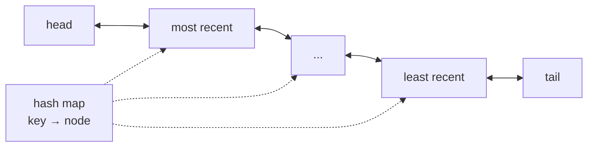

```python
class Node:
    def __init__(self, key=0, val=0):
        self.key = key
        self.val = val
        self.prev = self.next = None

class LRUCache:
    def __init__(self, capacity):
        self.cap = capacity
        self.cache = {}
        self.head = Node()   # dummy head (most recent side)
        self.tail = Node()   # dummy tail (least recent side)
        self.head.next = self.tail
        self.tail.prev = self.head

    def _remove(self, node):
        node.prev.next = node.next
        node.next.prev = node.prev

    def _insert_front(self, node):
        node.next = self.head.next
        node.prev = self.head
        self.head.next.prev = node
        self.head.next = node

    def get(self, key):
        if key not in self.cache:
            return -1
        node = self.cache[key]
        self._remove(node)
        self._insert_front(node)
        return node.val

    def put(self, key, value):
        if key in self.cache:
            self._remove(self.cache[key])
        node = Node(key, value)
        self.cache[key] = node
        self._insert_front(node)
        if len(self.cache) > self.cap:
            lru = self.tail.prev
            self._remove(lru)
            del self.cache[lru.key]
```

| | Time | Space |
|--|------|-------|
| OrderedDict | O(1) | O(n) |
| DLL + HashMap | O(1) | O(n) |

---

## Problem 10 — Reverse Nodes in k-Group (Hard) #25

```
Input:  [1] → [2] → [3] → [4] → [5],  k=2
Output: [2] → [1] → [4] → [3] → [5]

Input:  [1] → [2] → [3] → [4] → [5],  k=3
Output: [3] → [2] → [1] → [4] → [5]
```

### Brute Force — Collect Groups

```python
def reverse_k_group_brute(head, k):
    vals = []
    curr = head
    while curr:
        vals.append(curr.val)
        curr = curr.next
    # Reverse each group of k
    for i in range(0, len(vals) - len(vals) % k, k):
        vals[i:i+k] = vals[i:i+k][::-1]
    curr = head
    for v in vals:
        curr.val = v
        curr = curr.next
    return head
# O(n) time, O(n) space
```

### Optimal — In-Place Group Reversal

```
Key insight: check if k nodes remain before reversing.
If fewer than k remain, leave them as-is.

[1]→[2]→[3]→[4]→[5], k=2

Group 1: [1]→[2] — has 2 nodes ✓ → reverse → [2]→[1]
Group 2: [3]→[4] — has 2 nodes ✓ → reverse → [4]→[3]
Group 3: [5]      — has 1 node  ✗ → leave as-is

Result: [2]→[1]→[4]→[3]→[5] ✓
```

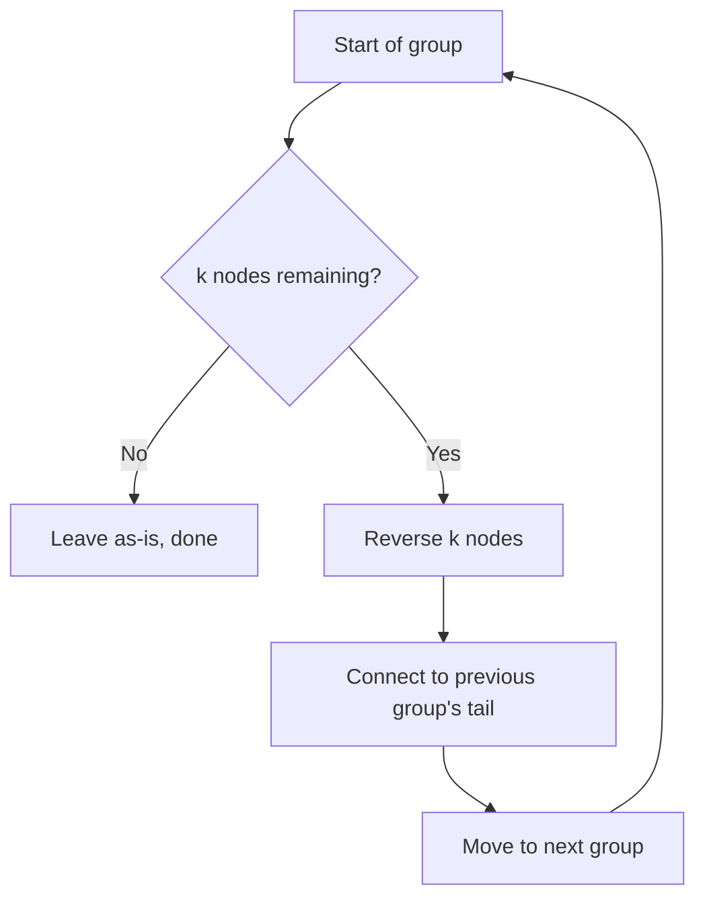

```python
def reverse_k_group(head, k):
    def get_kth(curr, k):
        """Return the kth node from curr, or None if fewer than k nodes."""
        while curr and k > 0:
            curr = curr.next
            k -= 1
        return curr

    dummy = ListNode(0, head)
    group_prev = dummy

    while True:
        kth = get_kth(group_prev, k)
        if not kth:
            break

        group_next = kth.next   # node after this group

        # Reverse k nodes starting from group_prev.next
        prev, curr = group_next, group_prev.next
        while curr != group_next:
            nxt = curr.next
            curr.next = prev
            prev = curr
            curr = nxt

        # Connect: group_prev → kth (new head) → ... → old_head → group_next
        tmp = group_prev.next   # old head of group (now tail after reversal)
        group_prev.next = kth
        group_prev = tmp        # advance group_prev to new tail

    return dummy.next
```

| | Time | Space |
|--|------|-------|
| Collect + reverse | O(n) | O(n) |
| In-place | O(n) | O(1) |
