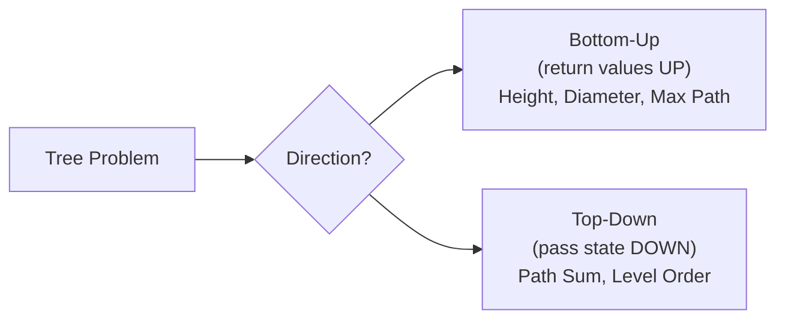
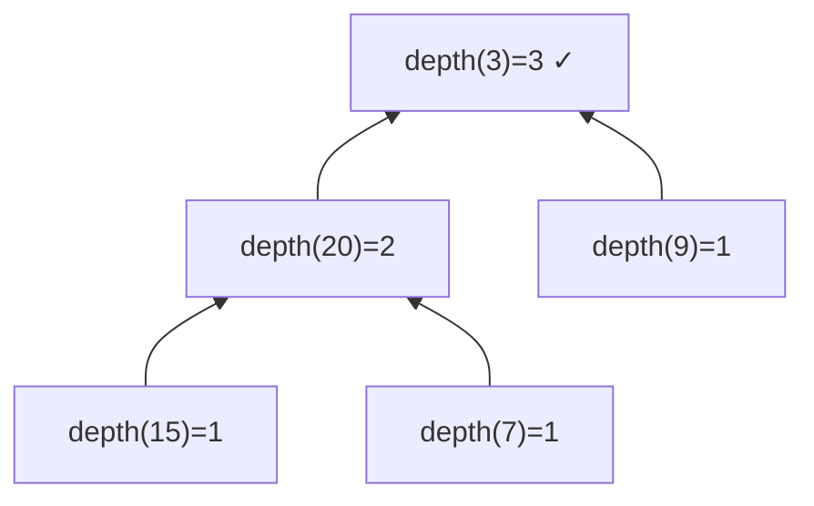
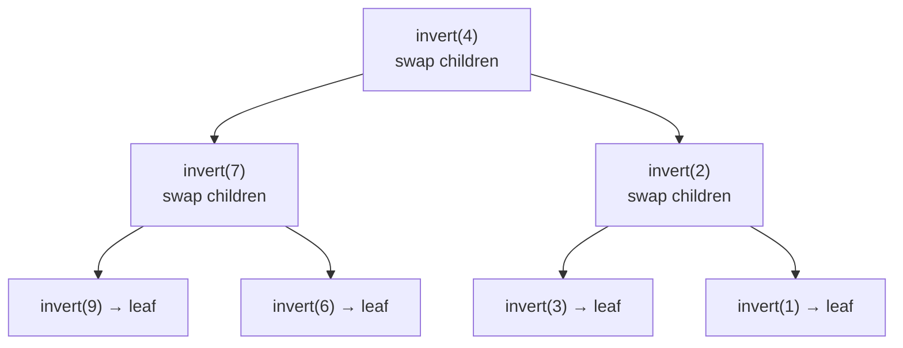
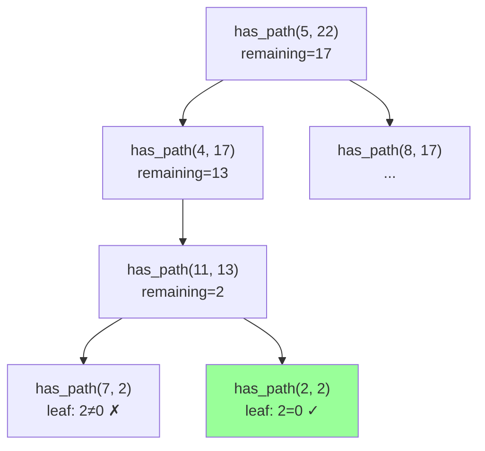
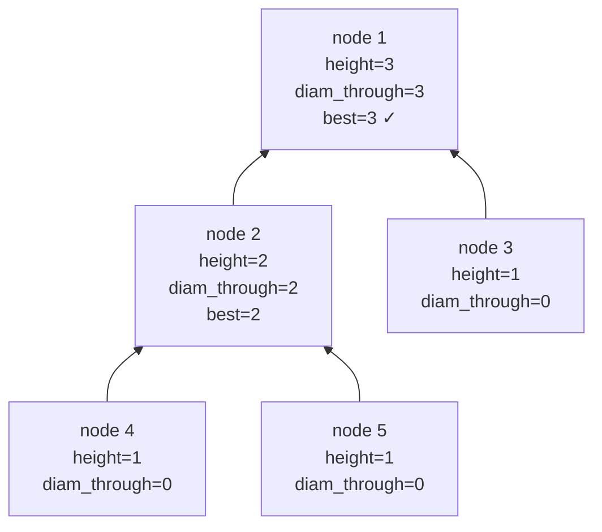
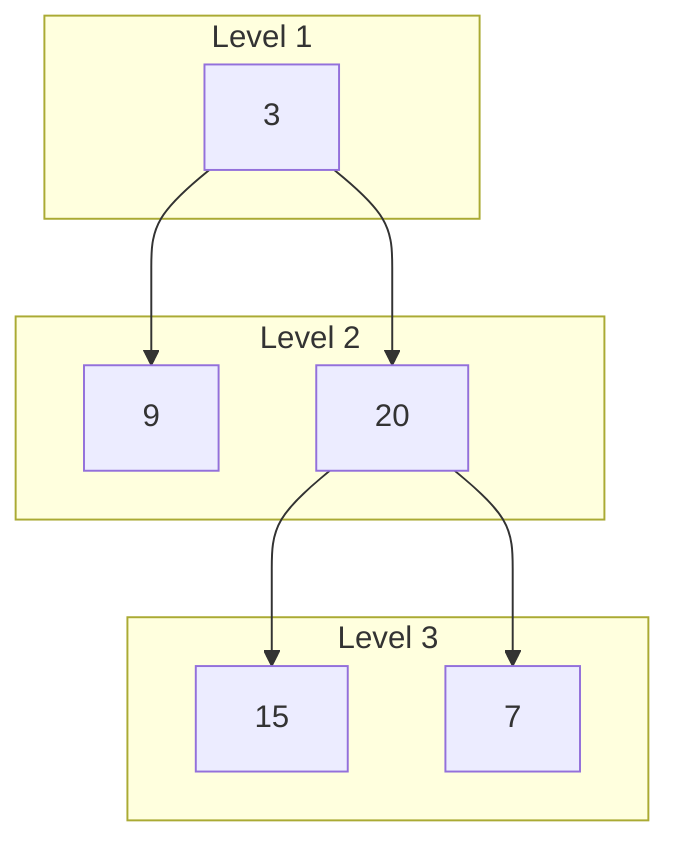
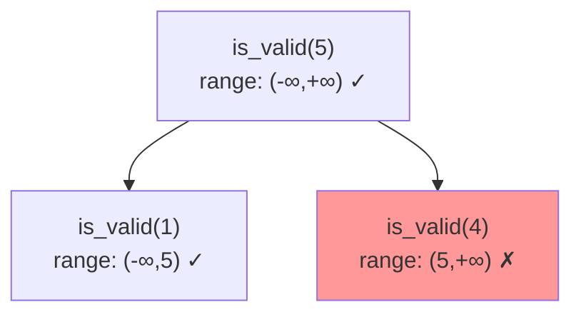
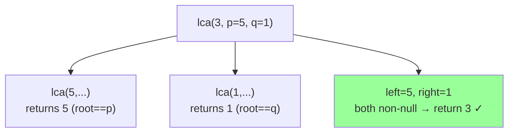
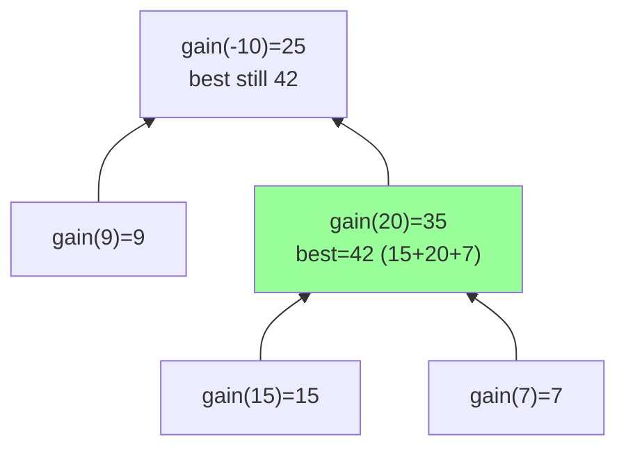
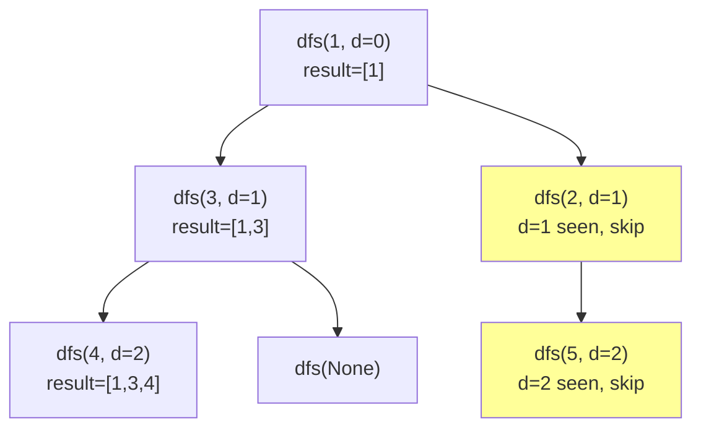

# Tree — Problems with Intuition

Problems ordered easy → hard. Focus on building the mental model for
recursion and pointer navigation.

---

## The Core Mental Model

Every tree problem reduces to one of two patterns:



**Bottom-up:** children compute something, return it to parent.
**Top-down:** parent passes context (remaining sum, depth) to children.

---

## Problem 1 — Maximum Depth (Easy) #104

```
Input:
    3
   / \
  9  20
     / \
    15   7
Output: 3
```

### Brute Force — BFS Level Count

```python
from collections import deque

def max_depth_bfs(root):
    if not root:
        return 0
    depth = 0
    queue = deque([root])
    while queue:
        depth += 1
        for _ in range(len(queue)):
            node = queue.popleft()
            if node.left:  queue.append(node.left)
            if node.right: queue.append(node.right)
    return depth
# O(n) time, O(n) space
```

### Optimal — DFS Recursion

```
Intuition: depth of a tree = 1 + max(depth of left, depth of right)

depth(3) = 1 + max(depth(9), depth(20))
depth(9) = 1 + max(depth(None), depth(None)) = 1 + max(0,0) = 1
depth(20) = 1 + max(depth(15), depth(7)) = 1 + max(1,1) = 2
depth(3) = 1 + max(1, 2) = 3 ✓
```



```python
def max_depth(root):
    if not root:
        return 0
    return 1 + max(max_depth(root.left), max_depth(root.right))
```

| | Time | Space |
|--|------|-------|
| BFS | O(n) | O(n) |
| DFS | O(n) | O(h) — h=height |

---

## Problem 2 — Invert Binary Tree (Easy) #226

```
Input:          Output:
     4               4
   /   \           /   \
  2     7    →    7     2
 / \   / \       / \   / \
1   3 6   9     9   6 3   1
```

### Brute Force — Collect and Rebuild

```python
def invert_brute(root):
    if not root:
        return None
    # Collect all values in level order
    from collections import deque
    vals = []
    q = deque([root])
    while q:
        node = q.popleft()
        vals.append(node.val if node else None)
        if node:
            q.append(node.left)
            q.append(node.right)
    # Rebuild mirrored — complex and error-prone
    # Just use the recursive approach instead
```

### Optimal — Recursive Swap

```
At every node: swap left and right children, then recurse.

invert(4):
  swap(2, 7) → left=7, right=2
  invert(7):
    swap(6, 9) → left=9, right=6
  invert(2):
    swap(1, 3) → left=3, right=1
```



```python
def invert_tree(root):
    if not root:
        return None
    root.left, root.right = invert_tree(root.right), invert_tree(root.left)
    return root
```

| | Time | Space |
|--|------|-------|
| Recursive | O(n) | O(h) |

---

## Problem 3 — Path Sum (Easy) #112

```
Input: target=22
        5
       / \
      4   8
     /   / \
    11  13   4
   /  \       \
  7    2        1

Output: True  (path 5→4→11→2 = 22)
```

### Brute Force — Find All Paths

```python
def has_path_sum_brute(root, target):
    paths = []
    def dfs(node, path):
        if not node:
            return
        path.append(node.val)
        if not node.left and not node.right:
            paths.append(list(path))
        dfs(node.left, path)
        dfs(node.right, path)
        path.pop()
    dfs(root, [])
    return any(sum(p) == target for p in paths)
# O(n) time, O(n) space — collects all paths unnecessarily
```

### Optimal — Pass Remaining Sum Down

```
Instead of summing up, subtract as you go down.
At a leaf, check if remaining == 0.

has_path(5, remaining=22):
  remaining = 22 - 5 = 17
  has_path(4, 17):
    remaining = 17 - 4 = 13
    has_path(11, 13):
      remaining = 13 - 11 = 2
      has_path(7, 2):  leaf, 2≠0 → False
      has_path(2, 2):  leaf, 2==0 → TRUE ✓
```



```python
def has_path_sum(root, target):
    if not root:
        return False
    target -= root.val
    if not root.left and not root.right:   # leaf
        return target == 0
    return has_path_sum(root.left, target) or has_path_sum(root.right, target)
```

| | Time | Space |
|--|------|-------|
| Collect all paths | O(n) | O(n) |
| Pass remaining down | O(n) | O(h) |

---

## Problem 4 — Diameter of Binary Tree (Easy) #543

```
Input:
      1
     / \
    2   3
   / \
  4   5
Output: 3  (path 4→2→1→3 or 5→2→1→3)
```

### Brute Force — O(n²)

```python
def diameter_brute(root):
    def height(node):
        if not node: return 0
        return 1 + max(height(node.left), height(node.right))

    if not root: return 0
    # Diameter through root
    through_root = height(root.left) + height(root.right)
    # Diameter in subtrees
    left_diam = diameter_brute(root.left)
    right_diam = diameter_brute(root.right)
    return max(through_root, left_diam, right_diam)
# O(n²) — height recomputed for every node
```

### Optimal — Single DFS with Global Max

```
Key insight: compute height AND update diameter in one pass.
At each node: diameter_through_here = left_height + right_height

        1
       / \
      2   3
     / \
    4   5

At node 4: height=1, diameter_through=0+0=0
At node 5: height=1, diameter_through=0+0=0
At node 2: height=2, diameter_through=1+1=2  ← update best=2
At node 3: height=1, diameter_through=0+0=0
At node 1: height=3, diameter_through=2+1=3  ← update best=3

Answer: 3 ✓
```



```python
def diameter_of_binary_tree(root):
    best = [0]

    def height(node):
        if not node:
            return 0
        left  = height(node.left)
        right = height(node.right)
        best[0] = max(best[0], left + right)   # update global diameter
        return 1 + max(left, right)             # return height to parent

    height(root)
    return best[0]
```

| | Time | Space |
|--|------|-------|
| Brute force | O(n²) | O(h) |
| Single DFS | O(n) | O(h) |

---

## Problem 5 — Level Order Traversal (Medium) #102

```
Input:
    3
   / \
  9  20
     / \
    15   7
Output: [[3], [9,20], [15,7]]
```

### Brute Force — DFS with Depth Tracking

```python
def level_order_dfs(root):
    result = []
    def dfs(node, depth):
        if not node: return
        if depth == len(result):
            result.append([])
        result[depth].append(node.val)
        dfs(node.left, depth + 1)
        dfs(node.right, depth + 1)
    dfs(root, 0)
    return result
# O(n) time, O(n) space — works but DFS is unnatural for level order
```

### Optimal — BFS with Level Batching

```
Process all nodes at current level before moving to next.
Use len(queue) at start of each level to know how many to process.

Queue: [3]
Level 1: process 3 → add children [9,20]. Result: [[3]]
Queue: [9, 20]
Level 2: process 9 (no children), 20 (add 15,7). Result: [[3],[9,20]]
Queue: [15, 7]
Level 3: process 15,7 (no children). Result: [[3],[9,20],[15,7]]
```



```python
from collections import deque

def level_order(root):
    if not root:
        return []
    result = []
    queue = deque([root])
    while queue:
        level = []
        for _ in range(len(queue)):   # process exactly this level's nodes
            node = queue.popleft()
            level.append(node.val)
            if node.left:  queue.append(node.left)
            if node.right: queue.append(node.right)
        result.append(level)
    return result
```

| | Time | Space |
|--|------|-------|
| DFS | O(n) | O(n) |
| BFS | O(n) | O(n) |

---

## Problem 6 — Validate BST (Medium) #98

```
Input:
    5
   / \
  1   4
     / \
    3   6
Output: False  (4 is in right subtree of 5, but 4 < 5)
```

### Brute Force — Inorder Must Be Sorted

```python
def is_valid_bst_brute(root):
    vals = []
    def inorder(node):
        if not node: return
        inorder(node.left)
        vals.append(node.val)
        inorder(node.right)
    inorder(root)
    return all(vals[i] < vals[i+1] for i in range(len(vals)-1))
# O(n) time, O(n) space — stores all values
```

### Optimal — Pass Valid Range Down

```
Each node must satisfy: min_val < node.val < max_val
Pass the valid range down as you recurse.

is_valid(5, min=-inf, max=+inf):
  5 is in (-inf, +inf) ✓
  is_valid(1, min=-inf, max=5):
    1 is in (-inf, 5) ✓
    is_valid(None) → True
    is_valid(None) → True
  is_valid(4, min=5, max=+inf):
    4 is NOT in (5, +inf) → FALSE ✗
```



```python
def is_valid_bst(root):
    def validate(node, min_val, max_val):
        if not node:
            return True
        if not (min_val < node.val < max_val):
            return False
        return (validate(node.left,  min_val,   node.val) and
                validate(node.right, node.val,  max_val))

    return validate(root, float('-inf'), float('inf'))
```

| | Time | Space |
|--|------|-------|
| Inorder collect | O(n) | O(n) |
| Range validation | O(n) | O(h) |

---

## Problem 7 — Lowest Common Ancestor (Medium) #236

```
Input:
        3
       / \
      5   1
     / \ / \
    6  2 0  8
      / \
     7   4
p=5, q=1 → Output: 3
p=5, q=4 → Output: 5
```

### Brute Force — Find Paths, Compare

```python
def lca_brute(root, p, q):
    def find_path(node, target, path):
        if not node: return False
        path.append(node)
        if node == target: return True
        if find_path(node.left, target, path): return True
        if find_path(node.right, target, path): return True
        path.pop()
        return False

    path_p, path_q = [], []
    find_path(root, p, path_p)
    find_path(root, q, path_q)
    # Find last common node
    lca = None
    for a, b in zip(path_p, path_q):
        if a == b: lca = a
        else: break
    return lca
# O(n) time, O(n) space
```

### Optimal — Single DFS

```
Key insight:
  - If root is p or q → root is the LCA (the other must be in its subtree)
  - If p is in left subtree and q is in right subtree → root is LCA
  - Otherwise → LCA is in whichever subtree contains both

lca(3, p=5, q=1):
  lca(5, p=5, q=1): root==p → return 5
  lca(1, p=5, q=1): root==q → return 1
  left=5, right=1 → both non-null → return root=3 ✓

lca(3, p=5, q=4):
  lca(5, p=5, q=4): root==p → return 5
  lca(1, p=5, q=4): neither found → return None
  left=5, right=None → return left=5 ✓
```



```python
def lowest_common_ancestor(root, p, q):
    if not root or root == p or root == q:
        return root
    left  = lowest_common_ancestor(root.left,  p, q)
    right = lowest_common_ancestor(root.right, p, q)
    if left and right:
        return root   # p and q in different subtrees
    return left or right   # both in same subtree
```

| | Time | Space |
|--|------|-------|
| Find paths | O(n) | O(n) |
| Single DFS | O(n) | O(h) |

---

## Problem 8 — Binary Tree Maximum Path Sum (Hard) #124

```
Input:
   -10
   /  \
  9   20
      / \
     15   7
Output: 42  (path 15→20→7)
```

### Brute Force — Try All Paths

```python
def max_path_sum_brute(root):
    best = [float('-inf')]
    def all_paths(node, path_sum):
        if not node: return
        path_sum += node.val
        best[0] = max(best[0], path_sum)
        all_paths(node.left, path_sum)
        all_paths(node.right, path_sum)
    # Try starting from every node
    def try_all_starts(node):
        if not node: return
        all_paths(node, 0)
        try_all_starts(node.left)
        try_all_starts(node.right)
    try_all_starts(root)
    return best[0]
# O(n²) — starts a new path from every node
```

### Optimal — Single DFS with Global Max

```
Key insight: a path through a node = left_gain + node.val + right_gain
But when returning to parent, you can only extend ONE side (a path can't fork).

gain(node) = max contribution this subtree can add to a path going upward
           = node.val + max(0, gain(left), gain(right))
           (take 0 if a subtree has negative gain — better to not include it)

At each node, update global max with left_gain + node.val + right_gain.

gain(-10):
  gain(9) = 9 (leaf)
  gain(20):
    gain(15) = 15 (leaf)
    gain(7)  = 7  (leaf)
    best = max(best, 15+20+7) = 42 ✓
    return 20 + max(15,7) = 35
  best = max(42, 9+(-10)+35) = 42
  return -10 + max(9, 35) = 25
```



```python
def max_path_sum(root):
    best = [float('-inf')]

    def gain(node):
        if not node:
            return 0
        left_gain  = max(0, gain(node.left))   # ignore negative subtrees
        right_gain = max(0, gain(node.right))
        # Path through this node (can use both sides)
        best[0] = max(best[0], node.val + left_gain + right_gain)
        # Return max contribution going upward (only one side)
        return node.val + max(left_gain, right_gain)

    gain(root)
    return best[0]
```

| | Time | Space |
|--|------|-------|
| Brute force | O(n²) | O(h) |
| Single DFS | O(n) | O(h) |

---

## Problem 9 — Serialize and Deserialize Binary Tree (Hard) #297

```
Input:
    1
   / \
  2   3
     / \
    4   5

Serialized: "1,2,null,null,3,4,null,null,5,null,null"
```

### Brute Force — Level Order (BFS)

```python
from collections import deque

def serialize_bfs(root):
    if not root: return ""
    result = []
    q = deque([root])
    while q:
        node = q.popleft()
        if node:
            result.append(str(node.val))
            q.append(node.left)
            q.append(node.right)
        else:
            result.append("null")
    return ",".join(result)

def deserialize_bfs(data):
    if not data: return None
    vals = data.split(",")
    root = TreeNode(int(vals[0]))
    q = deque([root])
    i = 1
    while q:
        node = q.popleft()
        if vals[i] != "null":
            node.left = TreeNode(int(vals[i]))
            q.append(node.left)
        i += 1
        if vals[i] != "null":
            node.right = TreeNode(int(vals[i]))
            q.append(node.right)
        i += 1
    return root
```

### Optimal — Preorder DFS (Cleaner Code)

```
Preorder: Root → Left → Right
Serialize: visit node, recurse left, recurse right.
Deserialize: consume tokens in same order.

serialize(1):
  "1," + serialize(2) + serialize(3)
  serialize(2):
    "2," + serialize(None) + serialize(None)
    = "2,null,null,"
  serialize(3):
    "3," + serialize(4) + serialize(5)
    = "3,4,null,null,5,null,null,"
  = "1,2,null,null,3,4,null,null,5,null,null,"
```

```python
class Codec:
    def serialize(self, root):
        tokens = []
        def dfs(node):
            if not node:
                tokens.append("null")
                return
            tokens.append(str(node.val))
            dfs(node.left)
            dfs(node.right)
        dfs(root)
        return ",".join(tokens)

    def deserialize(self, data):
        tokens = iter(data.split(","))

        def dfs():
            val = next(tokens)
            if val == "null":
                return None
            node = TreeNode(int(val))
            node.left  = dfs()
            node.right = dfs()
            return node

        return dfs()
```

| | Time | Space |
|--|------|-------|
| BFS | O(n) | O(n) |
| DFS | O(n) | O(n) |

---

## Problem 10 — Binary Tree Right Side View (Medium) #199

```
Input:
    1
   / \
  2   3
   \   \
    5   4
Output: [1, 3, 4]  (rightmost node at each level)
```

### Brute Force — Level Order, Take Last

```python
def right_side_view_bfs(root):
    if not root: return []
    result = []
    queue = deque([root])
    while queue:
        level_size = len(queue)
        for i in range(level_size):
            node = queue.popleft()
            if i == level_size - 1:
                result.append(node.val)   # last node in level
            if node.left:  queue.append(node.left)
            if node.right: queue.append(node.right)
    return result
```

### Optimal — DFS, Visit Right First

```
Visit right child before left. Record the first node seen at each depth.
(First seen in right-first DFS = rightmost node at that level)

dfs(1, depth=0): depth 0 not seen → result=[1]
  dfs(3, depth=1): depth 1 not seen → result=[1,3]
    dfs(4, depth=2): depth 2 not seen → result=[1,3,4]
    dfs(None) → return
  dfs(2, depth=1): depth 1 already seen → skip
    dfs(5, depth=2): depth 2 already seen → skip
    dfs(None) → return
```



```python
def right_side_view(root):
    result = []

    def dfs(node, depth):
        if not node:
            return
        if depth == len(result):
            result.append(node.val)   # first node at this depth
        dfs(node.right, depth + 1)   # right first!
        dfs(node.left,  depth + 1)

    dfs(root, 0)
    return result
```

| | Time | Space |
|--|------|-------|
| BFS | O(n) | O(n) |
| DFS right-first | O(n) | O(h) |
