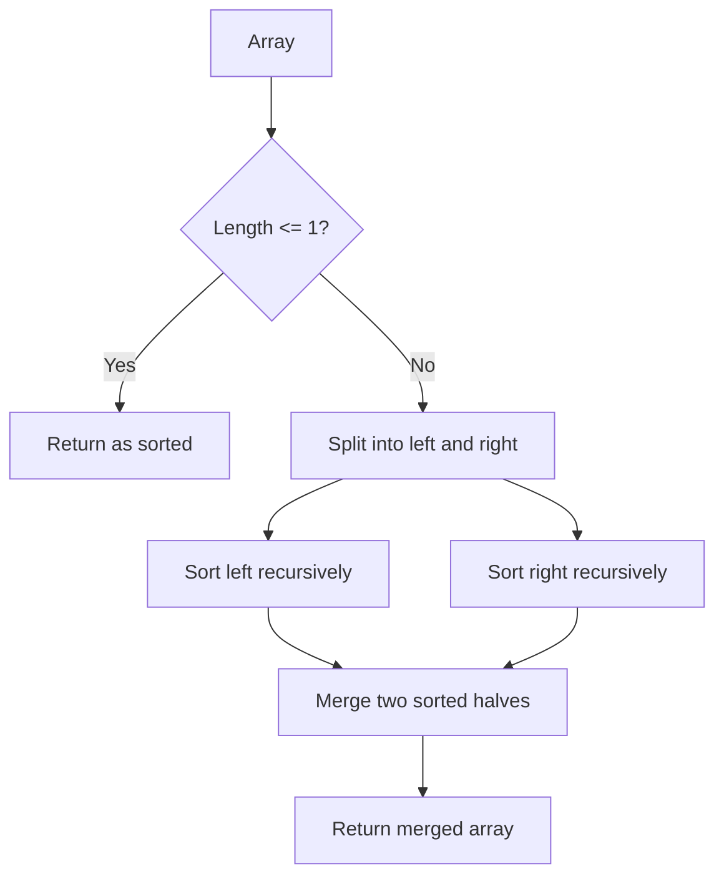

# Sorting Algorithms

Sorting is foundational. Many problems become trivial once the input is sorted. Understanding how sorting algorithms work — and their trade-offs — is essential for both interviews and system design.

Each algorithm page in this section includes a Python implementation, complexity breakdown, and typical interview use cases.

## Quick Reference

| Algorithm | Best | Average | Worst | Space | Stable? |
|-----------|------|---------|-------|-------|---------|
| Bubble Sort | O(n) | O(n²) | O(n²) | O(1) | Yes |
| Selection Sort | O(n²) | O(n²) | O(n²) | O(1) | No |
| Insertion Sort | O(n) | O(n²) | O(n²) | O(1) | Yes |
| Shell Sort | O(n log n) | O(n^1.5) | O(n²) | O(1) | No |
| Merge Sort | O(n log n) | O(n log n) | O(n log n) | O(n) | Yes |
| Quick Sort | O(n log n) | O(n log n) | O(n²) | O(log n) | No |
| Heap Sort | O(n log n) | O(n log n) | O(n log n) | O(1) | No |
| Counting Sort | O(n+k) | O(n+k) | O(n+k) | O(k) | Yes |
| Bucket Sort | O(n+k) | O(n+k) | O(n²) | O(n) | Yes |
| Radix Sort | O(nk) | O(nk) | O(nk) | O(n+k) | Yes |

## When to Use Which

- **Small arrays (n < 20):** Insertion Sort — low overhead, cache-friendly
- **General purpose:** Merge Sort (stable) or Quick Sort (in-place, fast in practice)
- **Nearly sorted data:** Insertion Sort — O(n) best case
- **Integer keys in small range:** Counting Sort — O(n)
- **Floating point in [0,1]:** Bucket Sort
- **Multi-digit integers:** Radix Sort
- **Memory constrained:** Heap Sort — O(1) space, O(n log n) guaranteed

## Visual Playbook

### Bubble Sort Flow (Adjacent Swaps)

**Input:** `[5, 2, 8, 1]`
**Output:** `[1, 2, 5, 8]`

```mermaid
flowchart TD
	A[Start array] --> B[Compare arr[j] and arr[j+1]]
	B --> C{arr[j] > arr[j+1]?}
	C -- Yes --> D[Swap]
	C -- No --> E[Keep order]
	D --> F[Move to next pair]
	E --> F
	F --> G{End of pass?}
	G -- No --> B
	G -- Yes --> H{Any swap this pass?}
	H -- Yes --> I[Next pass]
	H -- No --> J[Already sorted]
	I --> B
```

### Merge Sort Flow (Divide and Conquer)

**Input:** `[5, 2, 8, 1]`
**Output:** `[1, 2, 5, 8]`



Why this helps:
- Bubble Sort visualizes local swaps.
- Merge Sort visualizes global structure.
- Same input, very different algorithmic strategy.

## Files in This Section

- [Bubble Sort](./bubble-sort.md)
- [Selection Sort](./selection-sort.md)
- [Insertion Sort](./insertion-sort.md)
- [Shell Sort](./shell-sort.md)
- [Merge Sort](./merge-sort.md)
- [Quick Sort](./quick-sort.md)
- [Heap Sort](./heap-sort.md)
- [Counting Sort](./counting-sort.md)
- [Bucket Sort](./bucket-sort.md)
- [Radix Sort](./radix-sort.md)
