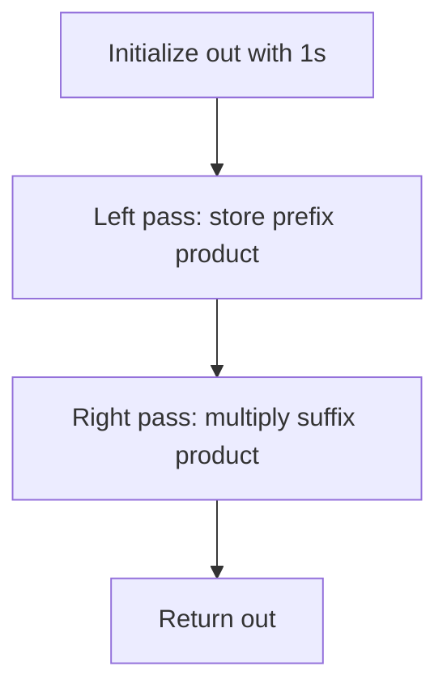

# Arrays

Arrays are the most fundamental data structure. Most DSA problems involve arrays in some form. Mastering array manipulation patterns is the foundation for everything else.

Each problem page in this section includes a Python implementation, complexity summary, and typical interview use cases.

## Key Concepts

- **In-place modification:** Modify the array without extra space. Common tricks: two-pointer (read/write pointers), swapping, overwriting.
- **Index as identity:** The index itself carries information (e.g., mark visited elements by negating, use index to count occurrences).
- **Sorted array properties:** Duplicates are adjacent, binary search is possible, two pointers work from both ends.
- **Prefix/suffix:** Precompute running values to answer range queries in O(1).

## When to Recognize Array Patterns

- "In-place" → two-pointer or index tricks
- "Sorted array" → binary search or two pointers
- "Subarray" → sliding window or prefix sum
- "Missing/duplicate" → index-as-identity or XOR
- "Majority element" → Boyer-Moore voting

## Common Techniques

### Two-Pointer (Read/Write)
Use a slow pointer (write position) and fast pointer (read position). Write pointer only advances when a valid element is found.

### Cyclic Sort
For arrays containing values 1..n, each value belongs at index value-1. Swap elements to their correct positions in O(n).

### Boyer-Moore Voting
Find majority element in O(n) time, O(1) space. Maintain a candidate and count; increment on match, decrement on mismatch; reset when count hits 0.

## Visual Playbook

### Two-Pointer Read/Write (Move Zeroes Pattern)

**Input:** `[0, 1, 0, 3, 12]`
**Output:** `[1, 3, 12, 0, 0]`

```mermaid
flowchart TD
	A[Initialize write=0] --> B[Scan read from left to right]
	B --> C{nums[read] != 0?}
	C -- Yes --> D[Write nums[read] at nums[write]]
	D --> E[write += 1]
	E --> B
	C -- No --> B
	B --> F{Read finished?}
	F -- Yes --> G[Fill remaining with zeros]
```

### Prefix x Suffix (Product Except Self Pattern)

**Input:** `[1, 2, 3, 4]`
**Output:** `[24, 12, 8, 6]`



Quick intuition:
- Two-pointer patterns are about position management.
- Prefix/suffix patterns are about decomposition.
- Both often reduce extra space while keeping O(n) time.

## Problems in This Section

### Core Problems (Original)

| Problem | Difficulty |
|---------|-----------|
| [Move Zeroes](./move-zeroes.md) | Easy |
| [Remove Element](./remove-element.md) | Easy |
| [Shuffle the Array](./shuffle-the-array.md) | Easy |
| [Remove Duplicates from Sorted Array](./remove-duplicates-from-sorted-array.md) | Easy |
| [Remove Duplicates from Sorted Array II](./remove-duplicates-from-sorted-array-ii.md) | Medium |
| [Rotate Array](./rotate-array.md) | Medium |
| [Max Consecutive Ones](./max-consecutive-ones.md) | Easy |
| [Third Maximum Number](./third-maximum-number.md) | Easy |
| [Missing Ranges](./missing-ranges.md) | Easy |
| [Majority Element](./majority-element.md) | Easy |
| [Majority Element II](./majority-element-ii.md) | Medium |
| [Best Time to Buy and Sell Stock](./best-time-to-buy-and-sell-stock.md) | Easy |
| [Best Time to Buy and Sell Stock II](./best-time-to-buy-and-sell-stock-ii.md) | Medium |
| [Number of Zero-Filled Subarrays](./number-of-zero-filled-subarrays.md) | Medium |
| [Increasing Triplet Subsequence](./increasing-triplet-subsequence.md) | Medium |
| [Product of Array Except Self](./product-of-array-except-self.md) | Medium |
| [Next Permutation](./next-permutation.md) | Medium |
| [First Missing Positive](./first-missing-positive.md) | Hard |

### Adobe / Microsoft / Google Focus

| Problem | Difficulty | Companies |
|---------|-----------|-----------|
| [Two Sum](./two-sum.md) | Easy | Google, Microsoft, Adobe |
| [Maximum Subarray (Kadane's)](./maximum-subarray.md) | Medium | Microsoft, Google, Adobe |
| [Container With Most Water](./container-with-most-water.md) | Medium | Google, Microsoft, Adobe |
| [Trapping Rain Water](./trapping-rain-water.md) | Hard | Google, Microsoft, Adobe |
| [Find Minimum in Rotated Sorted Array](./find-minimum-in-rotated-sorted-array.md) | Medium | Microsoft, Google, Adobe |
| [Merge Intervals](./merge-intervals.md) | Medium | Google, Microsoft, Adobe |
| [Subarray Sum Equals K](./subarray-sum-equals-k.md) | Medium | Google, Microsoft, Adobe |
| [Spiral Matrix](./spiral-matrix.md) | Medium | Microsoft, Google, Adobe |
| [Jump Game](./jump-game.md) | Medium | Microsoft, Google, Adobe |
| [Find All Duplicates in an Array](./find-all-duplicates-in-array.md) | Medium | Adobe, Microsoft |
| [Set Matrix Zeroes](./set-matrix-zeroes.md) | Medium | Microsoft, Adobe, Google |

### Quick Pattern Reference

| Pattern | Problems |
|---------|---------|
| Hash Map / Complement | Two Sum, Subarray Sum Equals K |
| Two Pointers (opposite ends) | Container With Most Water, Trapping Rain Water |
| Two Pointers (read/write) | Move Zeroes, Remove Duplicates |
| Prefix/Suffix | Product of Array Except Self, Subarray Sum Equals K |
| Greedy | Jump Game, Merge Intervals, Best Time to Buy/Sell |
| Binary Search | Find Minimum in Rotated Sorted Array |
| Index as Identity | First Missing Positive, Find All Duplicates, Set Matrix Zeroes |
| Kadane's Algorithm | Maximum Subarray, Maximum Product Subarray |
| Simulation | Spiral Matrix, Rotate Image |
