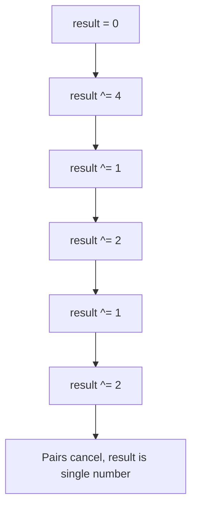

# Bit Manipulation

Bit manipulation uses bitwise operators to solve problems at the binary level. It's often the key to achieving O(1) space or O(n) time where other approaches fall short.

Each problem page in this section includes a Python implementation, complexity summary, and typical interview use cases.

## Key Operators

| Operator | Symbol | Example | Result |
|----------|--------|---------|--------|
| AND | `&` | `5 & 3` = `101 & 011` | `001` = 1 |
| OR | `\|` | `5 \| 3` = `101 \| 011` | `111` = 7 |
| XOR | `^` | `5 ^ 3` = `101 ^ 011` | `110` = 6 |
| NOT | `~` | `~5` | `-6` (two's complement) |
| Left shift | `<<` | `5 << 1` | `10` = 10 |
| Right shift | `>>` | `5 >> 1` | `10` = 2 |

## Essential Properties

### XOR Properties
- `a ^ a = 0` (XOR with itself = 0)
- `a ^ 0 = a` (XOR with 0 = identity)
- XOR is commutative and associative
- **Key use:** Find the single non-duplicate in an array of pairs

### AND Properties
- `n & (n-1)` clears the lowest set bit of n
- `n & (-n)` isolates the lowest set bit of n
- `n & 1` checks if n is odd

### Bit Counting
- Count set bits: repeatedly apply `n & (n-1)` until n = 0
- Brian Kernighan's algorithm: each `n & (n-1)` removes one set bit

## Common Patterns

### Check if power of 2
`n > 0 and (n & (n-1)) == 0`

### Get/Set/Clear bit at position i
- Get: `(n >> i) & 1`
- Set: `n | (1 << i)`
- Clear: `n & ~(1 << i)`

### XOR to find single number
XOR all elements — pairs cancel out, leaving the unique element.

## Visual Playbook

### XOR Cancellation (Single Number)

**Input:** `[4, 1, 2, 1, 2]`
**Output:** `4`



### Sum Without Plus (Carry Propagation)

**Input:** `a = 5`, `b = 3`
**Output:** `8`

```mermaid
flowchart TD
	A[Compute sum_no_carry = a XOR b] --> B[Compute carry = (a AND b) << 1]
	B --> C{carry == 0?}
	C -- Yes --> D[Answer is sum_no_carry]
	C -- No --> E[a = sum_no_carry, b = carry]
	E --> A
```

Bit intuition:
- XOR keeps bits that differ.
- AND finds where carry is needed.
- Left shift moves carry to the next bit position.

## Problems in This Section

| Problem | Difficulty |
|---------|-----------|
| [Single Number](./single-number.md) | Easy |
| [Missing Number](./missing-number.md) | Easy |
| [Set Mismatch](./set-mismatch.md) | Easy |
| [Single Number II](./single-number-ii.md) | Medium |
| [Single Number III](./single-number-iii.md) | Medium |
| [Number of 1 Bits](./number-of-1-bits.md) | Easy |
| [Counting Bits](./counting-bits.md) | Easy |
| [Hamming Distance](./hamming-distance.md) | Easy |
| [Power of Two](./power-of-two.md) | Easy |
| [Reverse Bits](./reverse-bits.md) | Easy |
| [Bitwise AND of Numbers Range](./bitwise-and-of-numbers-range.md) | Medium |
| [Sum of Two Integers](./sum-of-two-integers.md) | Medium |
