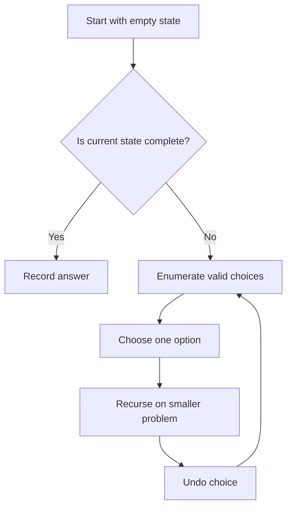

# Recursion & Backtracking

Backtracking is a systematic way to explore all possible solutions by building candidates incrementally and abandoning ("backtracking") candidates that can't lead to a valid solution.

## Mental Picture: The Decision Tree

Think of backtracking as **exploring a tree of decisions**. At each node, you decide what to do next, and the tree branches out. When a branch can't succeed, you return to the last decision point and try the next option.

### Real-World Analogy: Maze Exploration

Imagine you're in a maze:

1. **At each intersection**, you choose a path to explore (the "choice")
2. **You walk down that path** (the "recurse")
3. **If you reach a dead end**, you **backtrack** (return to the intersection)
4. **You try the next direction** from that intersection
5. **If you reach the goal**, you record it and optionally continue exploring for other paths

This is exactly what backtracking does—it systematically tries all possible paths, abandoning ones that don't work.

### Visual: The Call Stack

Here's what your call stack looks like when exploring `[1, 2, 3]` for subsets:

```
Level 1: backtrack(index=0)
  ├─ Choose element 1 → Level 2: backtrack(index=1)
  │   ├─ Choose element 2 → Level 3: backtrack(index=2)
  │   │   ├─ Choose element 3 → Level 4: BASE CASE → Record [1,2,3] → BACKTRACK
  │   │   └─ Skip element 3 → Level 4: BASE CASE → Record [1,2] → BACKTRACK
  │   └─ Skip element 2 → Level 3: backtrack(index=2)
  │       └─ Choose element 3 → Level 4: BASE CASE → Record [1,3] → BACKTRACK
  │
  └─ Skip element 1 → Level 2: backtrack(index=1)
      ├─ Choose element 2 → Level 3: backtrack(index=2)
      │   └─ Choose element 3 → Level 4: BASE CASE → Record [2,3] → BACKTRACK
      └─ Skip element 2 → Level 3: backtrack(index=2)
          └─ Skip element 3 → Level 4: BASE CASE → Record [] → BACKTRACK
```

Every time you hit a base case or exhaust the inner loop, you **pop the stack** and the function returns, allowing the previous level to try the next choice.

## What "Backtrack" Actually Means

**Backtracking is not magic.** It's simply the natural process of a function returning:

1. You make a choice (add an element, place a queen, etc.)
2. You recurse to the next level
3. The recursion eventually returns (either from base case or exhausted loop)
4. You **undo** the choice (remove the element, unplace the queen)
5. The loop continues to the next iteration

The key word is **undo**. Every choice must be reversible so the next iteration works with a clean state.

### Example: Undoing vs Not Undoing

**Wrong (with undo):**
```python
def bad_backtrack(start, path):
    if start == len(nums):
        result.append(path)  # Shares reference!
        return
    
    path.append(nums[start])
    bad_backtrack(start + 1, path)
    # No pop here — BUG! path still has the element
    bad_backtrack(start + 1, path)
```

**Correct (with undo):**
```python
def good_backtrack(start, path):
    if start == len(nums):
        result.append(path[:])  # Copy!
        return
    
    path.append(nums[start])
    good_backtrack(start + 1, path)
    path.pop()  # Undo the choice
    good_backtrack(start + 1, path)
```

## Core Template

```
def backtrack(state, choices):
    if is_solution(state):
        record(state)
        return
    
    for choice in choices:
        if is_valid(choice, state):
            make_choice(choice, state)
            backtrack(state, remaining_choices)
            undo_choice(choice, state)  # backtrack
```

## 🎯 Recommended Learning Path

Follow this order to build your intuition step-by-step:

```
┌─────────────────────────────────────────────┐
│ 1. Warmup: Merge Two Sorted Lists           │  ← Understand basic recursion
│    (Get comfortable with recursive calls)   │
│                                             │
│ 2. Subsets (Include/Exclude)                │  ← Learn the core pattern
│    (Binary decision at each step)           │
│                                             │
│ 3. Combinations                             │  ← Add a constraint (forward-only)
│    (Avoid duplicates naturally)             │
│                                             │
│ 4. Permutations                             │  ← Manage state (used elements)
│    (Track what you've picked)               │
│                                             │
│ 5. Generate Parentheses                     │  ← Add validation (count logic)
│    (Before recursing)                       │
│                                             │
│ 6. N-Queens                                 │  ← Complex constraint logic
│    (Multiple simultaneous constraints)      │
│                                             │
│ 7. Sudoku Solver                            │  ← Master all concepts
│    (State, constraints, pruning combined)   │
└─────────────────────────────────────────────┘
```

Each problem teaches you something new. Don't skip!

## Patterns: Simple to Advanced

This section progresses from **easiest to hardest**. Start with subsets, then build your way up!

### Level 1️⃣: Subsets (Include or Exclude)

**Difficulty: Easy | Concept: Simple binary choice**

**Mental picture:** At each element, you have exactly **2 choices**: include it or exclude it. Binary tree structure.

```
For [1, 2, 3]:
          ROOT
        /      \
    include 1   exclude 1
     /    \        /    \
  inc2   ex2    inc2   ex2
  / \    / \    / \    / \
i3 e3 i3 e3 i3 e3 i3 e3

Result: 8 subsets (2^3)
```

**How to think about it:** "For each element, decide yes or no. Record every combination of yes/no decisions."

**Why it's easy:** Only 2 choices at each step. No state management needed beyond the current path.

---

### Level 2️⃣: Combinations (Forward-Only Picking)

**Difficulty: Easy-Medium | Concept: Pruning by constraint (moving forward only)**

**Mental picture:** Like subsets, but you **always move forward** in the array. Never revisit earlier indices. This naturally avoids duplicates without extra logic.

```
For n=4, k=2:
          ROOT (start=1)
        /    |    \
      1      2     3       (pick from 1,2,3,4)
     / \    / \     |
    2  3-4 3  4     4       (if picked 1, next pick from 2,3,4)

Duplicate avoidance: We never see [2,1] because 1 < 2 and we move forward only.

Result: C(4,2) = 6 combinations
```

**How to think about it:** "Like subsets, but don't look backward. Always start from where you left off."

**Why it's medium:** Same as subsets, but with a constraint that makes it naturally efficient. Good intro to pruning!

---

### Level 3️⃣: Permutations (Track Used Elements)

**Difficulty: Medium | Concept: State management (tracking which elements are used)**

**Mental picture:** At each position, you pick from **remaining unused elements**. When you pick one, it's marked "used" so you can't pick it again in this path.

```
For [1, 2, 3] at position 0:
          ROOT
        /   |   \
    use1  use2  use3
    / \   / \   / \
  u2 u3 u1 u3 u1 u2

Position 0 has 3 choices.
Position 1 has 2 choices (1 remaining).
Position 2 has 1 choice (the last one).

Result: 3! = 6 permutations
```

**How to think about it:** "At each step, pick any unused element. When done picking, record. Then 'unuse' the element for other branches."

**Why it's harder:** You need to maintain a `used` set or array. Must track state across recursive calls. Undo logic is critical!

---

### Level 4️⃣: Constraint Satisfaction (Validate + Prune)

**Difficulty: Hard | Concept: Smart pruning via constraint checking**

**Mental picture:** You build a partial solution **row by row** (or cell by cell). At each step, you **check constraints** before recursing. If any constraint fails, **prune** (don't recurse).

```
For N-Queens (n=4):
          ROOT (row 0)
        /  |  |  \
      col0 col1 col2 col3  (try placing queen in each column)
      |   X   X   X       (only col0 is valid, others conflict with row/diag)
      |
    row 1 (col0 chosen)
    / | X X                (col1, col2, col3 all conflict with col0 or diag)
   |
  row 2
  ...

Massive pruning: Instead of 4^4 = 256 possibilities, we prune to ~2 solutions.
```

**How to think about it:** "Build step-by-step, validate at each step, and don't explore branches that violate rules."

**Why it's hardest:** 
- Complex constraint logic (N-Queens: no same row, column, or diagonal)
- Smart pruning saves exponential time
- Requires understanding problem domain deeply
- Multiple state variables to track and validate

## How to Picture Recursion Depth

Think of each recursive call as **one more level deep** in exploring a specific path:

```
Subsets of [1, 2]:

Depth 0: backtrack(index=0, path=[])
  → Depth 1: backtrack(index=1, path=[1])
    → Depth 2: backtrack(index=2, path=[1,2])
      → BASE CASE → Record [1,2] → Return
    ← Back to Depth 1
    → Depth 2: backtrack(index=2, path=[1])
      → BASE CASE → Record [1] → Return
    ← Back to Depth 1, loop to next choice (skip 2)
    → Depth 2: backtrack(index=2, path=[1])  (same call, nothing to skip)
      → BASE CASE → Record [1] → Return
  ← Back to Depth 0, loop to next choice (skip 1)
  → Depth 1: backtrack(index=1, path=[])
    → Depth 2: backtrack(index=2, path=[2])
      → BASE CASE → Record [2] → Return
    ← Back to Depth 1, loop to next (nothing left)
  ← Back to Depth 0, done

Result: 4 subsets recorded in this order: [1,2], [1], [2], []
```

The **maximum depth** equals the **input size** (or a constraint like row count for N-Queens). The **total number of calls** is huge (exponential), but most return quickly after hitting a base case or exhausting their loop.

## Pruning

The key to efficient backtracking is pruning — cutting off branches early:
- Skip duplicates (sort first, skip same value at same level)
- Check constraints before recursing
- Use bounds to prune (e.g., remaining sum can't reach target)

Each problem page in this section includes a Python implementation, a step-by-step walkthrough, a flow diagram, and common edge cases to watch for.

## Search Tree Intuition



## Practice Problems: Organized by Difficulty Level

### 🟢 Warmup: Basic Recursion (No Backtracking Yet)
Get comfortable with recursion before tackling backtracking!

| Problem | Difficulty |
|---------|-----------|
| [Merge Two Sorted Lists](./merge-two-sorted-lists.md) | Easy |
| [Pow(x, n)](./pow-x-n.md) | Easy |
| [Decode String](./decode-string.md) | Medium |

---

### 🟡 Level 1: Subsets (Easy Backtracking)
Start here! Just include or exclude each element.

| Problem | Difficulty |
|---------|-----------|
| [Subsets](./subsets.md) | Medium |
| [Subsets II](./subsets-ii.md) | Medium |

---

### 🟠 Level 2: Combinations (Forward-Moving)
Add a constraint: only move forward to avoid duplicates.

| Problem | Difficulty |
|---------|-----------|
| [Combinations](./combinations.md) | Medium |
| [Combination Sum](./combination-sum.md) | Medium |
| [Combination Sum II](./combination-sum-ii.md) | Medium |
| [Combination Sum III](./combination-sum-iii.md) | Medium |

---

### 🔴 Level 3: Permutations (Track Used Elements)
More complex: manage a `used` set and track all positions.

| Problem | Difficulty |
|---------|-----------|
| [Permutations](./permutations.md) | Medium |
| [Permutations II](./permutations-ii.md) | Medium |
| [Letter Combinations of a Phone Number](./letter-combinations-of-a-phone-number.md) | Medium |

---

### 🔥 Level 4: Constraint Satisfaction (Advanced)
The hardest level! Complex validation and pruning logic.

| Problem | Difficulty | Concept |
|---------|-----------|---------|
| [Generate Parentheses](./generate-parentheses.md) | Medium | Valid bracket matching |
| [Palindrome Partitioning](./palindrome-partitioning.md) | Medium | String validation |
| [Restore IP Addresses](./restore-ip-addresses.md) | Medium | Multi-constraint validation |
| [N-Queens](./n-queens.md) | Hard | Position conflicts (row/col/diag) |
| [Unique Paths III](./unique-paths-iii.md) | Hard | State-dependent pruning |
| [Remove Invalid Parentheses](./remove-invalid-parentheses.md) | Hard | Complex bracket logic |
| [Sudoku Solver](./sudoku-solver.md) | Hard | Multi-dimensional constraints |
| [Special Binary String](./special-binary-string.md) | Hard | Recursive structure validation |
| [Integer to English Words](./integer-to-english-words.md) | Hard | Multi-case number conversion |
