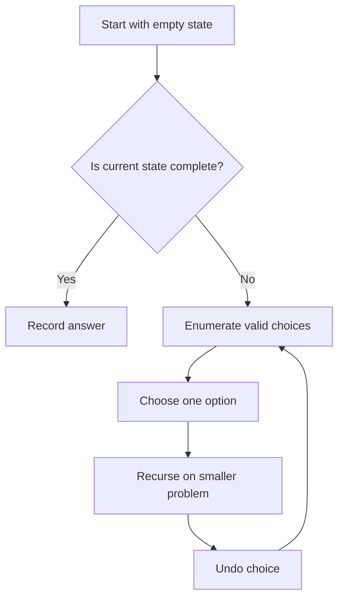

# Recursion & Backtracking

Backtracking is a systematic way to explore all possible solutions by building candidates incrementally and abandoning ("backtracking") candidates that can't lead to a valid solution.

## Mental Picture: The Decision Tree

Think of backtracking as **exploring a tree of decisions**. At each node, you decide what to do next, and the tree branches out. When a branch can't succeed, you return to the last decision point and try the next option.

### Real-World Analogy: Maze Exploration

Imagine you're in a maze:

1. **At each intersection**, you choose a path to explore (the "choice")
2. **You walk down that path** (the "recurse")
3. **If you reach a dead end**, you **backtrack** (return to the intersection)
4. **You try the next direction** from that intersection
5. **If you reach the goal**, you record it and optionally continue exploring for other paths

This is exactly what backtracking does—it systematically tries all possible paths, abandoning ones that don't work.

### Visual: The Call Stack

Here's what your call stack looks like when exploring `[1, 2, 3]` for subsets:

```
Level 1: backtrack(index=0)
  ├─ Choose element 1 → Level 2: backtrack(index=1)
  │   ├─ Choose element 2 → Level 3: backtrack(index=2)
  │   │   ├─ Choose element 3 → Level 4: BASE CASE → Record [1,2,3] → BACKTRACK
  │   │   └─ Skip element 3 → Level 4: BASE CASE → Record [1,2] → BACKTRACK
  │   └─ Skip element 2 → Level 3: backtrack(index=2)
  │       └─ Choose element 3 → Level 4: BASE CASE → Record [1,3] → BACKTRACK
  │
  └─ Skip element 1 → Level 2: backtrack(index=1)
      ├─ Choose element 2 → Level 3: backtrack(index=2)
      │   └─ Choose element 3 → Level 4: BASE CASE → Record [2,3] → BACKTRACK
      └─ Skip element 2 → Level 3: backtrack(index=2)
          └─ Skip element 3 → Level 4: BASE CASE → Record [] → BACKTRACK
```

Every time you hit a base case or exhaust the inner loop, you **pop the stack** and the function returns, allowing the previous level to try the next choice.

## What "Backtrack" Actually Means

**Backtracking is not magic.** It's simply the natural process of a function returning:

1. You make a choice (add an element, place a queen, etc.)
2. You recurse to the next level
3. The recursion eventually returns (either from base case or exhausted loop)
4. You **undo** the choice (remove the element, unplace the queen)
5. The loop continues to the next iteration

The key word is **undo**. Every choice must be reversible so the next iteration works with a clean state.

### Example: Undoing vs Not Undoing

**Wrong (with undo):**
```python
def bad_backtrack(start, path):
    if start == len(nums):
        result.append(path)  # Shares reference!
        return
    
    path.append(nums[start])
    bad_backtrack(start + 1, path)
    # No pop here — BUG! path still has the element
    bad_backtrack(start + 1, path)
```

**Correct (with undo):**
```python
def good_backtrack(start, path):
    if start == len(nums):
        result.append(path[:])  # Copy!
        return
    
    path.append(nums[start])
    good_backtrack(start + 1, path)
    path.pop()  # Undo the choice
    good_backtrack(start + 1, path)
```

## Core Template

```
def backtrack(state, choices):
    if is_solution(state):
        record(state)
        return
    
    for choice in choices:
        if is_valid(choice, state):
            make_choice(choice, state)
            backtrack(state, remaining_choices)
            undo_choice(choice, state)  # backtrack
```

## 🎯 Recommended Learning Path

Follow this order to build your intuition step-by-step:

```
┌─────────────────────────────────────────────┐
│ 1. Warmup: Merge Two Sorted Lists           │  ← Understand basic recursion
│    (Get comfortable with recursive calls)   │
│                                             │
│ 2. Subsets (Include/Exclude)                │  ← Learn the core pattern
│    (Binary decision at each step)           │
│                                             │
│ 3. Combinations                             │  ← Add a constraint (forward-only)
│    (Avoid duplicates naturally)             │
│                                             │
│ 4. Permutations                             │  ← Manage state (used elements)
│    (Track what you've picked)               │
│                                             │
│ 5. Generate Parentheses                     │  ← Add validation (count logic)
│    (Before recursing)                       │
│                                             │
│ 6. N-Queens                                 │  ← Complex constraint logic
│    (Multiple simultaneous constraints)      │
│                                             │
│ 7. Sudoku Solver                            │  ← Master all concepts
│    (State, constraints, pruning combined)   │
└─────────────────────────────────────────────┘
```

Each problem teaches you something new. Don't skip!

## Patterns: Simple to Advanced

This section progresses from **easiest to hardest**. Start with subsets, then build your way up!

### Level 1️⃣: Subsets (Include or Exclude)

**Difficulty: Easy | Concept: Simple binary choice**

**Mental picture:** At each element, you have exactly **2 choices**: include it or exclude it. Binary tree structure.

```
For [1, 2, 3]:
          ROOT
        /      \
    include 1   exclude 1
     /    \        /    \
  inc2   ex2    inc2   ex2
  / \    / \    / \    / \
i3 e3 i3 e3 i3 e3 i3 e3

Result: 8 subsets (2^3)
```

**How to think about it:** "For each element, decide yes or no. Record every combination of yes/no decisions."

**Why it's easy:** Only 2 choices at each step. No state management needed beyond the current path.

---

### Level 2️⃣: Combinations (Forward-Only Picking)

**Difficulty: Easy-Medium | Concept: Pruning by constraint (moving forward only)**

**Mental picture:** Like subsets, but you **always move forward** in the array. Never revisit earlier indices. This naturally avoids duplicates without extra logic.

```
For n=4, k=2:
          ROOT (start=1)
        /    |    \
      1      2     3       (pick from 1,2,3,4)
     / \    / \     |
    2  3-4 3  4     4       (if picked 1, next pick from 2,3,4)

Duplicate avoidance: We never see [2,1] because 1 < 2 and we move forward only.

Result: C(4,2) = 6 combinations
```

**How to think about it:** "Like subsets, but don't look backward. Always start from where you left off."

**Why it's medium:** Same as subsets, but with a constraint that makes it naturally efficient. Good intro to pruning!

---

### Level 3️⃣: Permutations (Track Used Elements)

**Difficulty: Medium | Concept: State management (tracking which elements are used)**

**Mental picture:** At each position, you pick from **remaining unused elements**. When you pick one, it's marked "used" so you can't pick it again in this path.

```
For [1, 2, 3] at position 0:
          ROOT
        /   |   \
    use1  use2  use3
    / \   / \   / \
  u2 u3 u1 u3 u1 u2

Position 0 has 3 choices.
Position 1 has 2 choices (1 remaining).
Position 2 has 1 choice (the last one).

Result: 3! = 6 permutations
```

**How to think about it:** "At each step, pick any unused element. When done picking, record. Then 'unuse' the element for other branches."

**Why it's harder:** You need to maintain a `used` set or array. Must track state across recursive calls. Undo logic is critical!

---

### Level 4️⃣: Constraint Satisfaction (Validate + Prune)

**Difficulty: Hard | Concept: Smart pruning via constraint checking**

**Mental picture:** You build a partial solution **row by row** (or cell by cell). At each step, you **check constraints** before recursing. If any constraint fails, **prune** (don't recurse).

```
For N-Queens (n=4):
          ROOT (row 0)
        /  |  |  \
      col0 col1 col2 col3  (try placing queen in each column)
      |   X   X   X       (only col0 is valid, others conflict with row/diag)
      |
    row 1 (col0 chosen)
    / | X X                (col1, col2, col3 all conflict with col0 or diag)
   |
  row 2
  ...

Massive pruning: Instead of 4^4 = 256 possibilities, we prune to ~2 solutions.
```

**How to think about it:** "Build step-by-step, validate at each step, and don't explore branches that violate rules."

**Why it's hardest:** 
- Complex constraint logic (N-Queens: no same row, column, or diagonal)
- Smart pruning saves exponential time
- Requires understanding problem domain deeply
- Multiple state variables to track and validate

## How to Picture Recursion Depth

Think of each recursive call as **one more level deep** in exploring a specific path:

```
Subsets of [1, 2]:

Depth 0: backtrack(index=0, path=[])
  → Depth 1: backtrack(index=1, path=[1])
    → Depth 2: backtrack(index=2, path=[1,2])
      → BASE CASE → Record [1,2] → Return
    ← Back to Depth 1
    → Depth 2: backtrack(index=2, path=[1])
      → BASE CASE → Record [1] → Return
    ← Back to Depth 1, loop to next choice (skip 2)
    → Depth 2: backtrack(index=2, path=[1])  (same call, nothing to skip)
      → BASE CASE → Record [1] → Return
  ← Back to Depth 0, loop to next choice (skip 1)
  → Depth 1: backtrack(index=1, path=[])
    → Depth 2: backtrack(index=2, path=[2])
      → BASE CASE → Record [2] → Return
    ← Back to Depth 1, loop to next (nothing left)
  ← Back to Depth 0, done

Result: 4 subsets recorded in this order: [1,2], [1], [2], []
```

The **maximum depth** equals the **input size** (or a constraint like row count for N-Queens). The **total number of calls** is huge (exponential), but most return quickly after hitting a base case or exhausting their loop.

## Pruning

The key to efficient backtracking is pruning — cutting off branches early:
- Skip duplicates (sort first, skip same value at same level)
- Check constraints before recursing
- Use bounds to prune (e.g., remaining sum can't reach target)

Each problem page in this section includes a Python implementation, a step-by-step walkthrough, a flow diagram, and common edge cases to watch for.

## Search Tree Intuition



## Practice Problems: Organized by Difficulty Level

### 🟢 Warmup: Basic Recursion (No Backtracking Yet)
Get comfortable with recursion before tackling backtracking!

| Problem | Difficulty |
|---------|-----------|
| [Merge Two Sorted Lists](./merge-two-sorted-lists.md) | Easy |
| [Pow(x, n)](./pow-x-n.md) | Easy |
| [Decode String](./decode-string.md) | Medium |

---

### 🟡 Level 1: Subsets (Easy Backtracking)
Start here! Just include or exclude each element.

| Problem | Difficulty |
|---------|-----------|
| [Subsets](./subsets.md) | Medium |
| [Subsets II](./subsets-ii.md) | Medium |

---

### 🟠 Level 2: Combinations (Forward-Moving)
Add a constraint: only move forward to avoid duplicates.

| Problem | Difficulty |
|---------|-----------|
| [Combinations](./combinations.md) | Medium |
| [Combination Sum](./combination-sum.md) | Medium |
| [Combination Sum II](./combination-sum-ii.md) | Medium |
| [Combination Sum III](./combination-sum-iii.md) | Medium |

---

### 🔴 Level 3: Permutations (Track Used Elements)
More complex: manage a `used` set and track all positions.

| Problem | Difficulty |
|---------|-----------|
| [Permutations](./permutations.md) | Medium |
| [Permutations II](./permutations-ii.md) | Medium |
| [Letter Combinations of a Phone Number](./letter-combinations-of-a-phone-number.md) | Medium |

---

### 🔥 Level 4: Constraint Satisfaction (Advanced)
The hardest level! Complex validation and pruning logic.

| Problem | Difficulty | Concept |
|---------|-----------|---------|
| [Generate Parentheses](./generate-parentheses.md) | Medium | Valid bracket matching |
| [Palindrome Partitioning](./palindrome-partitioning.md) | Medium | String validation |
| [Restore IP Addresses](./restore-ip-addresses.md) | Medium | Multi-constraint validation |
| [N-Queens](./n-queens.md) | Hard | Position conflicts (row/col/diag) |
| [Unique Paths III](./unique-paths-iii.md) | Hard | State-dependent pruning |
| [Remove Invalid Parentheses](./remove-invalid-parentheses.md) | Hard | Complex bracket logic |
| [Sudoku Solver](./sudoku-solver.md) | Hard | Multi-dimensional constraints |
| [Special Binary String](./special-binary-string.md) | Hard | Recursive structure validation |
| [Integer to English Words](./integer-to-english-words.md) | Hard | Multi-case number conversion |

---

## Hands-On Examples: From Zero to Backtracking

These inline examples are designed to be read **in order**. Each one builds on the previous, so resist the urge to skip ahead.

---

### 🐣 Step 1 — The Simplest Recursive Function: Countdown

Before thinking about trees or stacks, see recursion as just **a function that calls itself with a smaller input**.

```python
def countdown(n: int) -> None:
    # Base case: stop the recursion
    if n <= 0:
        print("Go!")
        return

    print(n)
    countdown(n - 1)   # Recursive call on a *smaller* problem

countdown(3)
# Output:
# 3
# 2
# 1
# Go!
```

**Why it works:**

| Call | What happens |
|------|-------------|
| `countdown(3)` | prints `3`, then calls `countdown(2)` |
| `countdown(2)` | prints `2`, then calls `countdown(1)` |
| `countdown(1)` | prints `1`, then calls `countdown(0)` |
| `countdown(0)` | hits the base case → prints `"Go!"` and returns |

Once `countdown(0)` returns, control flows back up through every waiting call frame — that's the **call stack** unwinding.

**Key rules established here:**
1. Every recursive function needs a **base case** (a stopping condition).
2. Each call must move **closer** to the base case (here, `n` shrinks by 1 each time).

---

### 🐣 Step 2 — Returning a Value: Sum of a List

Now the recursive call has to **return** something useful rather than just print.

```python
def list_sum(nums: list[int]) -> int:
    # Base case: empty list has sum 0
    if not nums:
        return 0

    # The sum of a list = first element + sum of everything else
    return nums[0] + list_sum(nums[1:])

print(list_sum([1, 2, 3, 4]))  # 10
```

**Why it works — unrolling by hand:**

```
list_sum([1, 2, 3, 4])
  = 1 + list_sum([2, 3, 4])
        = 2 + list_sum([3, 4])
              = 3 + list_sum([4])
                    = 4 + list_sum([])
                               = 0       ← base case
                    = 4 + 0  = 4
              = 3 + 4        = 7
        = 2 + 7              = 9
  = 1 + 9                    = 10
```

The recursion dives down to the base case, then the **return values bubble back up** through every pending `+` operation.

---

### 🐥 Step 3 — Two Recursive Calls: Fibonacci

When a function makes **two** recursive calls, the number of frames on the call stack **doubles** at each level — this is why exponential complexity appears.

```python
def fib(n: int) -> int:
    if n <= 1:          # Base cases: fib(0)=0, fib(1)=1
        return n
    return fib(n - 1) + fib(n - 2)

print(fib(6))  # 8
```

**Call tree for `fib(4)`:**

```
                  fib(4)
                /        \
           fib(3)         fib(2)
           /    \          /   \
       fib(2) fib(1)   fib(1) fib(0)
       /    \
   fib(1) fib(0)
```

Each node is one function call. `fib(n)` creates roughly $2^n$ calls — extremely expensive without caching.

**Adding memoization to avoid recomputing:**

```python
def fib_memo(n: int) -> int:
    memo = {}
    
    def helper(k: int) -> int:
        if k in memo:
            return memo[k]
        if k <= 1:
            return k
        result = helper(k - 1) + helper(k - 2)
        memo[k] = result
        return result
    
    return helper(n)

print(fib_memo(50))  # instant — each subproblem computed once
```

The `memo` dictionary stores the result of every call. The second time Python reaches `helper(2)` it returns the cached answer from the dictionary instead of re-running the whole subtree.

---

### 🐥 Step 4 — Recursion Over Structure: Flatten a Nested List

Recursion is not just for numbers — it shines when the **data itself is recursive** (a list that can contain other lists).

```python
def flatten(nested: list) -> list[int]:
    result = []
    for item in nested:
        if isinstance(item, list):
            # item is itself a list → recurse into it
            result.extend(flatten(item))
        else:
            # item is a plain number → add it directly
            result.append(item)
    return result

print(flatten([1, [2, [3, 4], 5], [6, 7]]))
# [1, 2, 3, 4, 5, 6, 7]
```

**Why it works:**

The function doesn't know upfront how deep the nesting goes. It just asks: *"Is this thing a list?"*
- **Yes** → recurse, let the same logic handle the inner list.
- **No** → it's a number, just collect it.

This is the same "trust the recursion" thinking you'll use in every backtracking problem.

---

### 🐓 Step 5 — Your First Backtracking: Generate All Subsets

Now we combine recursion with an **undo** step. This is the heart of backtracking.

```python
def subsets(nums: list[int]) -> list[list[int]]:
    result = []

    def backtrack(index: int, path: list[int]) -> None:
        # Every path (at any depth) is a valid subset → record it
        result.append(path[:])   # path[:] makes a snapshot copy

        for i in range(index, len(nums)):
            path.append(nums[i])       # 1. CHOOSE
            backtrack(i + 1, path)     # 2. RECURSE (move forward only)
            path.pop()                 # 3. UNDO — restore path for next iteration

    backtrack(0, [])
    return result

print(subsets([1, 2, 3]))
# [[], [1], [1, 2], [1, 2, 3], [1, 3], [2], [2, 3], [3]]
```

**Why `path[:]` instead of `path`?**

`path` is a list that gets mutated throughout the entire search. If you append `path` directly, every entry in `result` will point to the **same list object**, and they'll all end up showing the final empty state `[]`. Taking `path[:]` creates a brand-new list with the current contents as a snapshot.

**Tracing the first few calls for `[1, 2, 3]`:**

```
backtrack(index=0, path=[])
  → record []
  → i=0: path=[1]
    backtrack(index=1, path=[1])
      → record [1]
      → i=1: path=[1,2]
        backtrack(index=2, path=[1,2])
          → record [1,2]
          → i=2: path=[1,2,3]
            backtrack(index=3, path=[1,2,3])
              → record [1,2,3]   (no loop iterations: index == len)
            path.pop() → path=[1,2]
        path.pop() → path=[1]
      → i=2: path=[1,3]
        backtrack(index=3, path=[1,3])
          → record [1,3]
        path.pop() → path=[1]
    path.pop() → path=[]
  → i=1: path=[2] ... and so on
```

The `path.pop()` after each recursive call is the **undo** — it guarantees that when the loop moves to `i=2`, path is restored to whatever it was before `i=1` was explored.

---

### 🐓 Step 6 — Adding a Constraint: Combination Sum

The subset template with one extra rule: **elements can be reused**, and we only record paths that hit an exact target sum. This teaches **pruning** — cutting branches before recursing.

```python
def combination_sum(candidates: list[int], target: int) -> list[list[int]]:
    result = []
    candidates.sort()   # sorting enables early pruning

    def backtrack(index: int, path: list[int], remaining: int) -> None:
        if remaining == 0:          # Found a valid combination
            result.append(path[:])
            return
        
        for i in range(index, len(candidates)):
            c = candidates[i]
            if c > remaining:       # Pruning: sorted, so all later values are also too big
                break
            
            path.append(c)                      # CHOOSE
            backtrack(i, path, remaining - c)   # RECURSE (i, not i+1 → reuse allowed)
            path.pop()                          # UNDO

    backtrack(0, [], target)
    return result

print(combination_sum([2, 3, 6, 7], 7))
# [[2, 2, 3], [7]]
```

**Why `break` instead of `continue`?**

After sorting, if `candidates[i] > remaining`, then `candidates[i+1]`, `candidates[i+2]`, etc., are all even larger. There is no point checking them — `break` exits the entire loop. This is **pruning** and it can eliminate huge portions of the search tree.

**Why `backtrack(i, ...)` instead of `backtrack(i + 1, ...)`?**

Passing `i` means the next level is allowed to pick `candidates[i]` again (reuse). Passing `i + 1` would mean "move past this element", which is what you'd do if reuse were not allowed (like in plain Combinations).

---

### 🦅 Step 7 — Tracking State: Permutations

Permutations require every element to appear **exactly once** per result, in any order. Because order matters, you cannot simply move forward — you can pick any remaining element at each step. This means you need a **`used` array** to track what's already in the current path.

```python
def permutations(nums: list[int]) -> list[list[int]]:
    result = []
    used = [False] * len(nums)

    def backtrack(path: list[int]) -> None:
        if len(path) == len(nums):  # Used every element → record
            result.append(path[:])
            return

        for i in range(len(nums)):
            if used[i]:
                continue            # Skip elements already in this path

            used[i] = True          # CHOOSE
            path.append(nums[i])
            backtrack(path)         # RECURSE
            path.pop()              # UNDO choice
            used[i] = False         # UNDO state

    backtrack([])
    return result

print(permutations([1, 2, 3]))
# [[1,2,3],[1,3,2],[2,1,3],[2,3,1],[3,1,2],[3,2,1]]
```

**Two things to undo, not one:**

In Subsets we only did `path.pop()`. Here we also flip `used[i]` back to `False`. This is because we introduced **extra state** (`used`). The rule is: **undo everything you touched** before the recursive call returns.

**Why not use a `set` instead of `used[False]`?**

You could use `set(path)` to check membership, but that breaks when `nums` contains duplicates (same value, different positions). Indexing into `used` differentiates elements by **position**, which is always correct.

---

### 🦅 Step 8 — Constraint at Build Time: Generate Parentheses

Instead of building a full path and validating at the end, here we **check constraints before adding** a character. This is the hallmark of efficient backtracking: fail fast.

```python
def generate_parentheses(n: int) -> list[str]:
    result = []

    def backtrack(path: list[str], open_count: int, close_count: int) -> None:
        if len(path) == 2 * n:          # Used all 2n characters → record
            result.append("".join(path))
            return

        # Can add '(' if we haven't used all n open brackets yet
        if open_count < n:
            path.append("(")            # CHOOSE
            backtrack(path, open_count + 1, close_count)
            path.pop()                  # UNDO

        # Can add ')' only if it won't exceed the number of open brackets
        if close_count < open_count:
            path.append(")")            # CHOOSE
            backtrack(path, open_count, close_count + 1)
            path.pop()                  # UNDO

    backtrack([], 0, 0)
    return result

print(generate_parentheses(3))
# ['((()))', '(()())', '(())()', '()(())', '()()()']
```

**Why `close_count < open_count`?**

A closing bracket `)` is only valid if there's already an unmatched open bracket `(` waiting for it. Tracking `open_count` and `close_count` separately lets us enforce this with a single comparison, eliminating the need to validate the whole string after building it.

**Comparing build-time vs post-build validation:**

| Approach | When you check | Cost |
|----------|---------------|------|
| Post-build | After the full string is built | Explores many invalid strings |
| Build-time (this) | Before adding each character | Prunes invalid branches immediately |

Build-time constraints are almost always faster. Learn to spot them in new problems.

---

### Summary Table

| Step | Problem | Core Concept | Complexity |
|------|---------|-------------|-----------|
| 1 | Countdown | Base case + shrinking input | $O(n)$ |
| 2 | List sum | Return value bubbling up | $O(n)$ |
| 3 | Fibonacci | Two recursive calls, exponential tree | $O(2^n)$ → $O(n)$ with memo |
| 4 | Flatten | Recursion over recursive data structures | $O(n)$ |
| 5 | Subsets | Choose / Recurse / Undo | $O(2^n)$ |
| 6 | Combination Sum | Pruning with constraint + reuse | $O(2^t)$ where $t$ = target |
| 7 | Permutations | Two-variable state undo (`path` + `used`) | $O(n \cdot n!)$ |
| 8 | Generate Parentheses | Build-time constraint validation | $O(\frac{4^n}{\sqrt{n}})$ (Catalan) |

Once Step 5 (Subsets) clicks, every harder problem is the same template with one or two additional rules bolted on. Keep that mental model and the rest of the section will feel like variations on a theme.

## More Worked Examples (Simple to Complex)

If the first 8 steps helped, these additional examples continue the same progression with fresh problem types.

---

### 9. Reverse a String (Pure Recursion)

**Problem:** Given a string, return it reversed.

**Example:** `"recursion" -> "noisrucer"`

**Idea:** Reverse of a string is: reverse of the tail + first character.

```python
def reverse_string(s: str) -> str:
  # Base case: empty or single char string is already reversed
  if len(s) <= 1:
    return s

  # Reverse the rest, then place first char at the end
  return reverse_string(s[1:]) + s[0]

print(reverse_string("recursion"))  # noisrucer
```

**Why it works:**
- Every call reduces the problem size by 1.
- Base case stops at length 0 or 1.
- On unwind, characters are appended in reverse order.

**Complexity:**
- Time: $O(n^2)$ in Python due to string slicing/concatenation
- Space: $O(n)$ recursion depth

---

### 10. Climbing Stairs (Recursion + Memoization)

**Problem:** You can climb 1 or 2 steps at a time. How many distinct ways to reach step `n`?

**Example:** `n = 5` -> `8` ways

**Idea:**
- To reach step `n`, you came from `n-1` or `n-2`.
- So `ways(n) = ways(n-1) + ways(n-2)`.
- This is Fibonacci structure; memoization avoids repeated work.

```python
def climb_stairs(n: int) -> int:
  memo = {}
  
  def dp(k: int) -> int:
    if k in memo:
      return memo[k]
    if k <= 2:
      return k
    result = dp(k - 1) + dp(k - 2)
    memo[k] = result
    return result

  return dp(n)

print(climb_stairs(5))  # 8
```

**Why it works:**
- Recurrence covers all valid last moves.
- Subproblems overlap heavily, and cache stores each once.

**Complexity:**
- Time: $O(n)$
- Space: $O(n)$ (cache + call stack)

---

### 11. Word Search (Grid Backtracking)

**Problem:** Given a 2D board and a word, determine if the word exists in the grid by moving up/down/left/right, without reusing the same cell in one path.

**Example:**
- Board:
  `[['A','B','C','E'], ['S','F','C','S'], ['A','D','E','E']]`
- Word: `"ABCCED"`
- Output: `True`

**Idea:**
- Start DFS from every cell that matches the first character.
- At each step, try 4 directions.
- Mark cell as visited during the path, then unmark on return.

```python
def exist(board: list[list[str]], word: str) -> bool:
    rows, cols = len(board), len(board[0])

    def backtrack(r: int, c: int, i: int) -> bool:
        if i == len(word):
            return True

        if (
            r < 0 or r >= rows or
            c < 0 or c >= cols or
            board[r][c] != word[i]
        ):
            return False

        temp = board[r][c]
        board[r][c] = "#"  # mark visited for current path

        found = (
            backtrack(r + 1, c, i + 1) or
            backtrack(r - 1, c, i + 1) or
            backtrack(r, c + 1, i + 1) or
            backtrack(r, c - 1, i + 1)
        )

        board[r][c] = temp  # undo
        return found

    for r in range(rows):
        for c in range(cols):
            if backtrack(r, c, 0):
                return True
    return False
```

**Why it works:**
- Recursive index `i` ensures we match characters in order.
- Temporary marking prevents reusing a cell in the same path.
- Undo allows cell reuse in different branches.

**Complexity:**
- Time: $O(R \cdot C \cdot 4^L)$ where $L$ is word length
- Space: $O(L)$ recursion depth

---

### 12. Palindrome Partitioning (Backtracking with Validation)

**Problem:** Partition a string so every piece is a palindrome. Return all valid partitions.

**Example:** `"aab" -> [["a","a","b"], ["aa","b"]]`

**Idea:**
- At position `start`, try every possible end index.
- If substring `s[start:end+1]` is palindrome, choose it and recurse.
- Reaching `start == len(s)` means a full valid partition.

```python
def partition(s: str) -> list[list[str]]:
    result = []

    def is_palindrome(left: int, right: int) -> bool:
        while left < right:
            if s[left] != s[right]:
                return False
            left += 1
            right -= 1
        return True

    def backtrack(start: int, path: list[str]) -> None:
        if start == len(s):
            result.append(path[:])
            return

        for end in range(start, len(s)):
            if is_palindrome(start, end):
                path.append(s[start:end + 1])
                backtrack(end + 1, path)
                path.pop()

    backtrack(0, [])
    return result

print(partition("aab"))
# [['a', 'a', 'b'], ['aa', 'b']]
```

**Why it works:**
- We enumerate all cut positions.
- Palindrome check prunes invalid branches early.
- Undo keeps path clean for the next split choice.

**Complexity:**
- Time: Exponential in worst case (many valid cuts)
- Space: $O(n)$ recursion depth, excluding output

---

### 13. N-Queens (Advanced Constraint Backtracking)

**Problem:** Place `n` queens on an `n x n` board so that no two queens attack each other.

**Example:** `n = 4` -> 2 valid board arrangements

**Idea:**
- Place exactly one queen per row.
- A position `(row, col)` is invalid if:
  - `col` already has a queen,
  - diagonal `row - col` is occupied,
  - anti-diagonal `row + col` is occupied.
- Use sets for $O(1)$ conflict checks.

```python
def solve_n_queens(n: int) -> list[list[str]]:
    result = []
    cols = set()
    diagonals = set()       # row - col
    anti_diagonals = set()  # row + col
    board = [["."] * n for _ in range(n)]

    def backtrack(row: int) -> None:
        if row == n:
            result.append(["".join(r) for r in board])
            return

        for col in range(n):
            d = row - col
            ad = row + col
            if col in cols or d in diagonals or ad in anti_diagonals:
                continue

            cols.add(col)
            diagonals.add(d)
            anti_diagonals.add(ad)
            board[row][col] = "Q"

            backtrack(row + 1)

            board[row][col] = "."
            cols.remove(col)
            diagonals.remove(d)
            anti_diagonals.remove(ad)

    backtrack(0)
    return result
```

**Why it works:**
- One row at a time guarantees no row conflicts.
- Sets enforce column/diagonal constraints before recursing.
- Backtracking explores all valid placements while pruning invalid states early.

**Complexity:**
- Time: Roughly $O(n!)$ with pruning
- Space: $O(n)$ recursion + sets/board bookkeeping

---

### Quick Practice Order (New Additions)

1. Reverse String
2. Climbing Stairs
3. Word Search
4. Palindrome Partitioning
5. N-Queens

If you can trace these by hand with a small input and explain the base case, choice, recurse, and undo steps, your recursion/backtracking foundation is strong.
