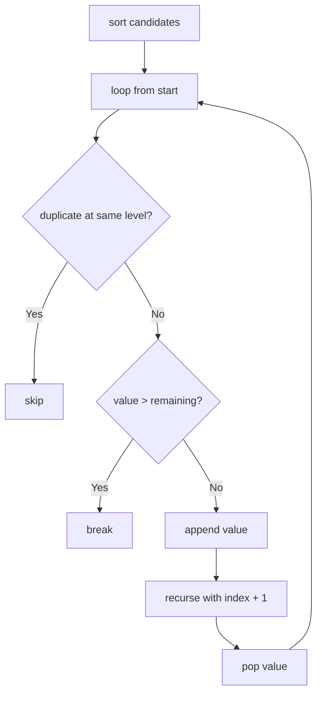

# Combination Sum II

**Difficulty:** Medium
**Pattern:** Backtracking (with Duplicates)
**LeetCode:** #40

## Problem Statement

Given a collection of candidate numbers `candidates` and a target number `target`, find all unique combinations in `candidates` where the candidate numbers sum to `target`. Each number in `candidates` may only be used once in the combination. The solution set must not contain duplicate combinations.

## Examples

### Example 1
**Input:** `candidates = [10,1,2,7,6,1,5]`, `target = 8`
**Output:** `[[1,1,6],[1,2,5],[1,7],[2,6]]`

### Example 2
**Input:** `candidates = [2,5,2,1,2]`, `target = 5`
**Output:** `[[1,2,2],[5]]`

## Constraints
- `1 <= candidates.length <= 100`
- `1 <= candidates[i] <= 50`
- `1 <= target <= 30`

## Hints

> 💡 **Hint 1:** Sort the candidates first. This groups duplicates together and enables pruning.

> 💡 **Hint 2:** Use a start index. Each element can only be used once (advance start by 1 after choosing).

> 💡 **Hint 3:** Skip duplicates at the same recursion level: if `i > start` and `candidates[i] == candidates[i-1]`, skip. This prevents duplicate combinations.

## Approach

**Time Complexity:** O(2^n)
**Space Complexity:** O(n) recursion depth

Sort + backtracking. Skip duplicate values at the same level. Each element used at most once.

## Python Implementation

```python
def combination_sum2(candidates, target):
	candidates.sort()
	result = []
	path = []

	def backtrack(start, remaining):
		if remaining == 0:
			result.append(path[:])
			return

		for index in range(start, len(candidates)):
			if index > start and candidates[index] == candidates[index - 1]:
				continue
			value = candidates[index]
			if value > remaining:
				break
			path.append(value)
			backtrack(index + 1, remaining - value)
			path.pop()

	backtrack(0, target)
	return result
```

## Step-by-Step Example

**Input:** `candidates = [10, 1, 2, 7, 6, 1, 5]`, `target = 8`

1. Sort to `[1, 1, 2, 5, 6, 7, 10]`.
2. Choose first `1`, then second `1`, then `6` to form `[1, 1, 6]`.
3. Backtrack. Use first `1`, then `2`, then `5` to form `[1, 2, 5]`.
4. Backtrack. Use first `1`, then `7` to form `[1, 7]`.
5. Backtrack to top level. Skip the second top-level `1` because it would duplicate the previous branches.
6. Use `2`, then `6` to form `[2, 6]`.

**Output:** `[[1, 1, 6], [1, 2, 5], [1, 7], [2, 6]]`

## Flow Diagram



## Edge Cases

- Duplicates are common, so skipping repeated values at one level is required.
- Unlike Combination Sum I, each index can be used only once.
- If the smallest value already exceeds the remaining target, the branch stops immediately.
