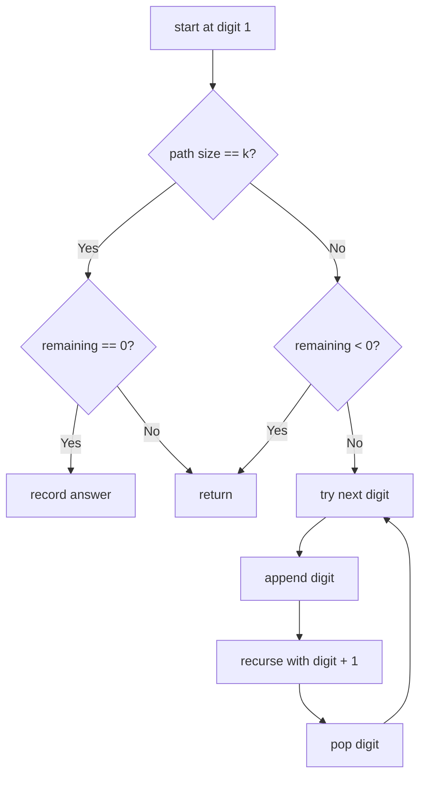

# Combination Sum III

**Difficulty:** Medium
**Pattern:** Backtracking
**LeetCode:** #216

## Problem Statement

Find all valid combinations of `k` numbers that sum up to `n` such that the following conditions are true: Only numbers `1` through `9` are used. Each number is used at most once. Return a list of all possible valid combinations. The list must not contain the same combination twice, and the combinations may be returned in any order.

## Examples

### Example 1
**Input:** `k = 3`, `n = 7`
**Output:** `[[1,2,4]]`

### Example 2
**Input:** `k = 3`, `n = 9`
**Output:** `[[1,2,6],[1,3,5],[2,3,4]]`

## Constraints
- `2 <= k <= 9`
- `1 <= n <= 60`

## Hints

> 💡 **Hint 1:** Backtracking with a start number (1-9), current combination, and remaining sum.

> 💡 **Hint 2:** When the combination has k numbers and sum equals n, add to results.

> 💡 **Hint 3:** Prune: if remaining < 0 or combination size > k, stop. Start from the previous number + 1 to avoid reuse.

## Approach

**Time Complexity:** O(C(9,k) × k)
**Space Complexity:** O(k)

Backtracking over digits 1-9 with size and sum constraints.

## Python Implementation

```python
def combination_sum3(k, n):
	result = []
	path = []

	def backtrack(start, remaining):
		if len(path) == k:
			if remaining == 0:
				result.append(path[:])
			return
		if remaining < 0:
			return

		for value in range(start, 10):
			path.append(value)
			backtrack(value + 1, remaining - value)
			path.pop()

	backtrack(1, n)
	return result
```

## Step-by-Step Example

**Input:** `k = 3`, `n = 7`

1. Start from digit `1`, remaining sum `7`.
2. Choose `1`, remaining `6`.
3. Choose `2`, remaining `4`.
4. Choose `4`, remaining `0` and length `3`, so record `[1, 2, 4]`.
5. Other branches either exceed the sum or reach length `3` with the wrong total.

**Output:** `[[1, 2, 4]]`

## Flow Diagram



## Edge Cases

- `k = 1` reduces to checking whether `n` is a digit from `1` to `9`.
- Large `n` like `50` produces no results because digits are limited to `1..9`.
- Pruning on negative remaining sum avoids useless recursion.
