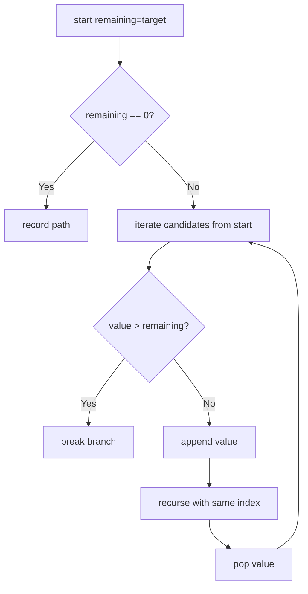
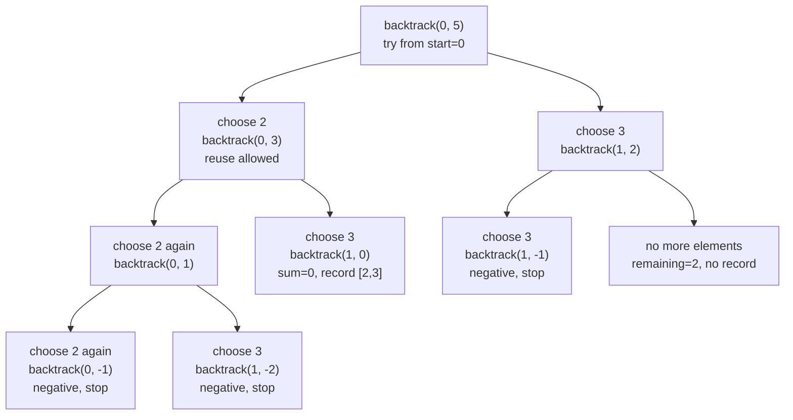

# Combination Sum

**Difficulty:** Medium
**Pattern:** Backtracking
**LeetCode:** #39

## Problem Statement

Given an array of distinct integers `candidates` and a target integer `target`, return a list of all unique combinations of `candidates` where the chosen numbers sum to `target`. You may return the combinations in any order. The same number may be chosen from `candidates` an unlimited number of times. Two combinations are unique if the frequency of at least one of the chosen numbers is different.

## Examples

### Example 1
**Input:** `candidates = [2,3,6,7]`, `target = 7`
**Output:** `[[2,2,3],[7]]`

### Example 2
**Input:** `candidates = [2,3,5]`, `target = 8`
**Output:** `[[2,2,2,2],[2,3,3],[3,5]]`

## Constraints
- `1 <= candidates.length <= 30`
- `2 <= candidates[i] <= 40`
- All elements of `candidates` are distinct
- `1 <= target <= 40`

## Hints

> 💡 **Hint 1:** Backtracking with a remaining target. When remaining == 0, add the current combination to results.

> 💡 **Hint 2:** Use a start index to avoid duplicate combinations. At each step, try each candidate from start onward (allowing reuse of the same element).

> 💡 **Hint 3:** Prune: if remaining < 0, stop. Sort candidates first to enable early termination.

## Approach

**Time Complexity:** O(n^(T/M)) where T is target and M is minimum candidate
**Space Complexity:** O(T/M) recursion depth

Backtracking with start index (allowing reuse). Prune when remaining < 0. Add to results when remaining == 0.

## Python Implementation

```python
def combination_sum(candidates, target):
	candidates.sort()
	result = []
	path = []

	def backtrack(start, remaining):
		if remaining == 0:
			result.append(path[:])
			return

		for index in range(start, len(candidates)):
			value = candidates[index]
			if value > remaining:
				break
			path.append(value)
			backtrack(index, remaining - value)
			path.pop()

	backtrack(0, target)
	return result
```

## Step-by-Step Example

**Input:** `candidates = [2, 3, 6, 7]`, `target = 7`

1. Start with `remaining = 7`, `path = []`.
2. Choose `2`, recurse with `remaining = 5`, `path = [2]`.
3. Choose `2` again, recurse with `remaining = 3`, `path = [2, 2]`.
4. Choose `3`, recurse with `remaining = 0`, record `[2, 2, 3]`.
5. Backtrack until top level, then choose `7`, recurse with `remaining = 0`, record `[7]`.

**Output:** `[[2, 2, 3], [7]]`

## Flow Diagram



## Recursion Tree Visualization

For **Input:** `candidates = [2, 3]`, `target = 5`, the recursion tree shows **reuse** of elements:



**Key insight:** Passing `index` (not `index+1`) allows the same element to be chosen multiple times in the same path.

## Trace Table: Path Formation

**Input:** `candidates = [2, 3, 6, 7]`, `target = 7`

After sorting: `[2, 3, 6, 7]`

| Step | `backtrack(start, remaining)` | `start` | `remaining` | `path` | Action |
|------|------------------------------|---------|-------------|--------|--------|
| 1 | `(0, 7)` | 0 | 7 | `[]` | Loop index 0 to 3 |
| 2 | choose 2 | 0 | 7 | `[2]` | Recurse `(0, 5)` (reuse index 0) |
| 3 | `(0, 5)` nested | 0 | 5 | `[2]` | Loop index 0 to 3 |
| 4 | choose 2 again | 0 | 5 | `[2,2]` | Recurse `(0, 3)` |
| 5 | `(0, 3)` nested | 0 | 3 | `[2,2]` | Loop index 0 to 3 |
| 6 | choose 3 | 1 | 3 | `[2,2,3]` | Recurse `(1, 0)` |
| 7 | `(1, 0)` nested | 1 | 0 | `[2,2,3]` | `remaining == 0` → **record `[2,2,3]`** |
| 8 | Backtrack to step 5 | - | - | `[2,2]` | Pop 3, continue |
| 9 | choose 6 | 2 | 3 | `[2,2,6]` | Recurse `(2, -3)` → `value > remaining` break |
| 10 | Back to step 3, pop 2 | - | - | `[2]` | Try next index=1 |
| 11 | choose 3 | 1 | 4 | `[2,3]` | Recurse `(1, 4)` |
| 12 | `(1, 4)` nested | 1 | 4 | `[2,3]` | Try index 1: value 3 → recurse `(1, 1)` |
| 13 | try index 2,3 from remaining 4 | - | - | - | 6 and 7 exceed remaining, break |
| 14 | Back to step 1, pop 2 | - | - | `[]` | Try next index=1 |
| 15 | choose 7 | 1 | 7 | `[7]` | Recurse `(1, 0)` |
| 16 | `(1, 0)` nested | 1 | 0 | `[7]` | `remaining == 0` → **record `[7]`** |

**Why reuse works:**
- Line 2: Choose 2, still at `start=0`, so 2 can be chosen again in the next level.
- Line 15: Choose 7 from `start=1`, now only 3 and 7 remain available, no more 2.

## Edge Cases

- No solution: `candidates = [5]`, `target = 3` returns `[]`.
- Reuse is allowed here, so recursive calls stay at the same index.
- Sorting enables the `break` pruning when values become too large.
