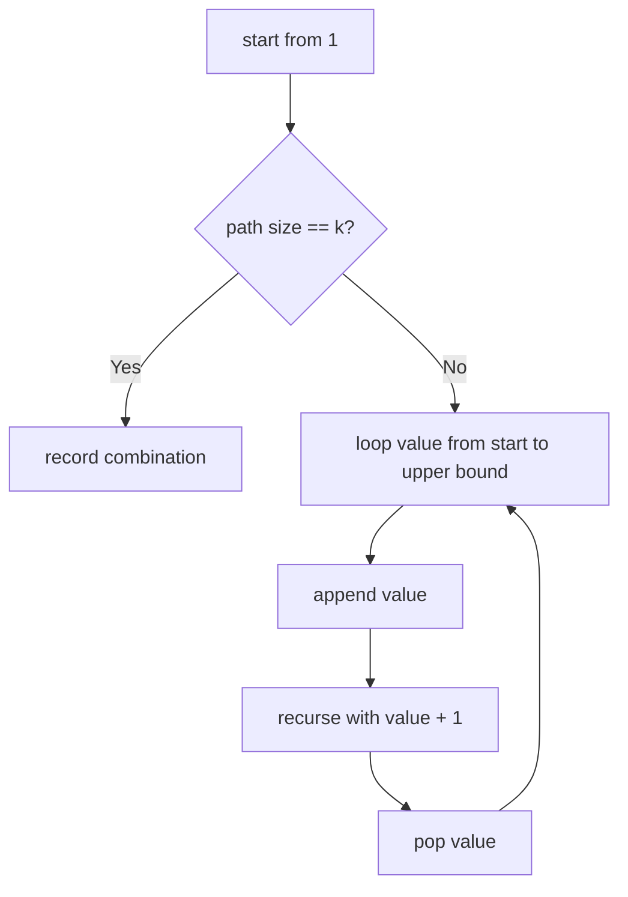

# Combinations

**Difficulty:** Medium
**Pattern:** Backtracking
**LeetCode:** #77

## Problem Statement

Given two integers `n` and `k`, return all possible combinations of `k` numbers chosen from the range `[1, n]`. You may return the answer in any order.

## Examples

### Example 1
**Input:** `n = 4`, `k = 2`
**Output:** `[[1,2],[1,3],[1,4],[2,3],[2,4],[3,4]]`

### Example 2
**Input:** `n = 1`, `k = 1`
**Output:** `[[1]]`

## Constraints
- `1 <= n <= 20`
- `1 <= k <= n`

## Hints

> 💡 **Hint 1:** Backtracking with a start number. At each step, choose a number from start to n.

> 💡 **Hint 2:** When the combination has k numbers, add to results.

> 💡 **Hint 3:** Pruning: if the remaining numbers available (n - start + 1) are fewer than the remaining slots needed (k - current_size), stop early.

## Approach

**Time Complexity:** O(C(n,k) × k)
**Space Complexity:** O(k)

Backtracking with start index and pruning when not enough numbers remain.

## Python Implementation

```python
def combine(n, k):
	result = []
	path = []

	def backtrack(start):
		if len(path) == k:
			result.append(path[:])
			return

		remaining_needed = k - len(path)
		upper_bound = n - remaining_needed + 1

		for value in range(start, upper_bound + 1):
			path.append(value)
			backtrack(value + 1)
			path.pop()

	backtrack(1)
	return result
```

## Step-by-Step Example

**Input:** `n = 4`, `k = 2`

1. Start with `path = []`, candidates `1..4`.
2. Pick `1`, recurse with start `2`.
3. Pick `2`, length is now `2`, record `[1, 2]`.
4. Backtrack to `[1]`, then try `3` to record `[1, 3]`, then `4` to record `[1, 4]`.
5. Backtrack to `[]`, pick `2`, then record `[2, 3]` and `[2, 4]`.
6. Finally record `[3, 4]`.

**Output:** `[[1, 2], [1, 3], [1, 4], [2, 3], [2, 4], [3, 4]]`

## Flow Diagram



## Edge Cases

- `k = 1` returns every number as a singleton combination.
- `k = n` returns one answer containing all numbers.
- Pruning matters when the remaining numbers are fewer than the slots still needed.
