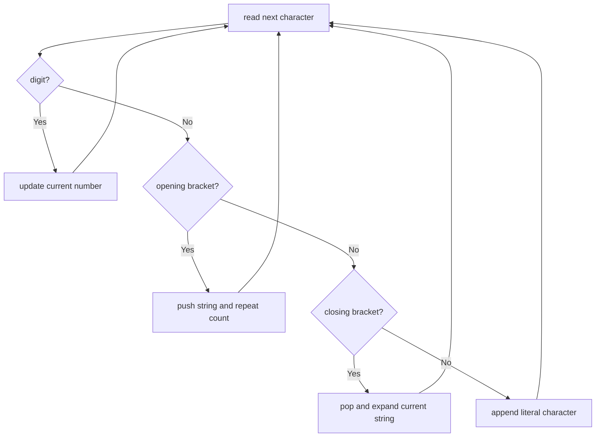

# Decode String

**Difficulty:** Medium
**Pattern:** Stack / Recursion
**LeetCode:** #394

## Problem Statement

Given an encoded string, return its decoded string. The encoding rule is: `k[encoded_string]`, where the `encoded_string` inside the square brackets is being repeated exactly `k` times. Note that `k` is guaranteed to be a positive integer. You may assume that the input string is always valid; there are no extra white spaces, square brackets are well-formed, etc. Furthermore, you may assume that the original data does not contain any digits and that all the digits are only for those repeat numbers, `k`. For example, there will not be input like `3a` or `2[4]`.

## Examples

### Example 1
**Input:** `s = "3[a]2[bc]"`
**Output:** `"aaabcbc"`

### Example 2
**Input:** `s = "3[a2[c]]"`
**Output:** `"accaccacc"`

### Example 3
**Input:** `s = "2[abc]3[cd]ef"`
**Output:** `"abcabccdcdcdef"`

## Constraints
- `1 <= s.length <= 30`
- `s` consists of lowercase English letters, digits, and square brackets `'[]'`
- `s` is guaranteed to be a valid input
- All the integers in `s` are in the range `[1, 300]`

## Hints

> 💡 **Hint 1:** Use a stack. When you see `[`, push the current string and current number onto the stack.

> 💡 **Hint 2:** When you see `]`, pop the number and previous string. Repeat the current string that many times and append to the previous string.

> 💡 **Hint 3:** Build the current number digit by digit (for multi-digit numbers). Build the current string character by character.

## Approach

**Time Complexity:** O(max_k^depth × n)
**Space Complexity:** O(n)

Stack-based: push state on `[`, pop and expand on `]`. Build numbers and strings incrementally.

## Python Implementation

```python
def decode_string(s):
	stack = []
	current_num = 0
	current_str = []

	for char in s:
		if char.isdigit():
			current_num = current_num * 10 + int(char)
		elif char == '[':
			stack.append((current_str, current_num))
			current_str = []
			current_num = 0
		elif char == ']':
			previous_str, repeat = stack.pop()
			current_str = previous_str + current_str * repeat
		else:
			current_str.append(char)

	return ''.join(current_str)
```

## Step-by-Step Example

**Input:** `s = "3[a2[c]]"`

1. Read `3`, so `current_num = 3`.
2. Read `[`, push `([], 3)`.
3. Read `a`, so `current_str = ['a']`.
4. Read `2`, so `current_num = 2`.
5. Read `[`, push `(['a'], 2)`.
6. Read `c`, so `current_str = ['c']`.
7. Read `]`, pop `(['a'], 2)` and build `['a'] + ['c'] * 2 = ['a', 'c', 'c']`.
8. Read `]`, pop `([], 3)` and build `[] + ['a', 'c', 'c'] * 3`.

**Output:** `"accaccacc"`

## Flow Diagram



## Edge Cases

- Multi-digit repeat counts like `12[a]` need number accumulation.
- Nested brackets work because the stack stores previous context.
- Plain strings with no brackets should return unchanged.
