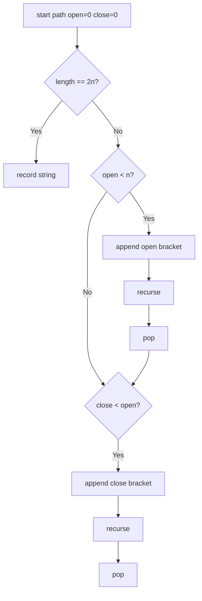
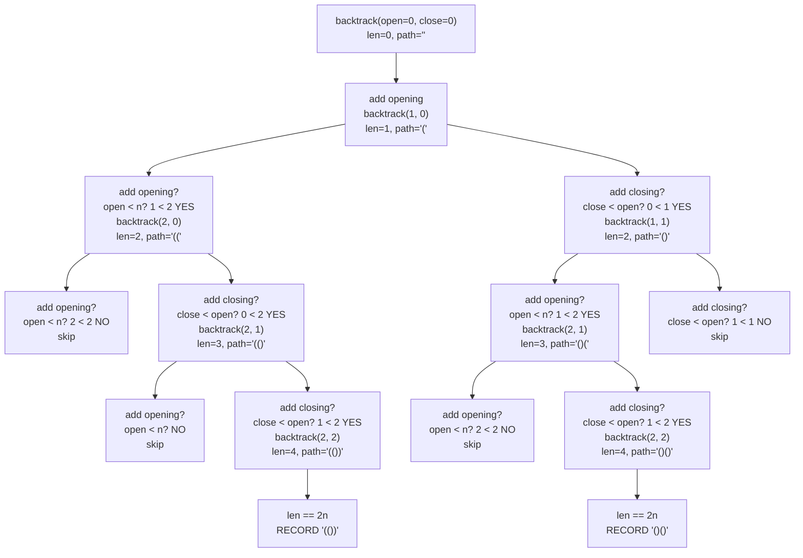

# Generate Parentheses

**Difficulty:** Medium
**Pattern:** Backtracking
**LeetCode:** #22

## Problem Statement

Given `n` pairs of parentheses, write a function to generate all combinations of well-formed parentheses.

## Examples

### Example 1
**Input:** `n = 3`
**Output:** `["((()))","(()())","(())()","()(())","()()()"]`

### Example 2
**Input:** `n = 1`
**Output:** `["()"]`

## Constraints
- `1 <= n <= 8`

## Hints

> 💡 **Hint 1:** Track the count of open and close parentheses used so far.

> 💡 **Hint 2:** You can add `(` if open < n. You can add `)` if close < open (there's an unmatched open bracket).

> 💡 **Hint 3:** When the string has length 2n, add it to results. This naturally generates only valid combinations.

## Approach

**Time Complexity:** O(4^n / √n) — the nth Catalan number
**Space Complexity:** O(n) recursion depth

Backtracking with open/close counters. Add `(` when open < n, add `)` when close < open. Collect when length == 2n.

## Python Implementation

```python
def generate_parenthesis(n):
	result = []

	def backtrack(path, open_used, close_used):
		if len(path) == 2 * n:
			result.append(''.join(path))
			return

		if open_used < n:
			path.append('(')
			backtrack(path, open_used + 1, close_used)
			path.pop()

		if close_used < open_used:
			path.append(')')
			backtrack(path, open_used, close_used + 1)
			path.pop()

	backtrack([], 0, 0)
	return result
```

## Step-by-Step Example

**Input:** `n = 2`

1. Start with empty string.
2. Add `(` because open count is less than `2`.
3. Add another `(`, then only `)` is allowed twice, producing `(())`.
4. Backtrack to `(` and instead add `)`, then add `(`, then `)` to produce `()()`.

**Output:** `["(())", "()()"]`

## Flow Diagram



## Recursion Tree Visualization

For **Input:** `n = 2`, the recursion tree shows how parentheses validity is maintained:



**Key constraint:** The condition `close < open` prevents invalid sequences like `))(`. A close bracket can only appear when there's an unmatched open bracket.

## Trace Table: Valid Path Execution

**Input:** `n = 2`, expected output: `["(())", "()()"]`

| Step | `backtrack(open, close, path)` | `open` | `close` | Can Add `(`? | Can Add `)`? | `path` | Action |
|------|--------------------------------|--------|--------|-------------|-------------|--------|--------|
| 1 | `(0, 0, "")` | 0 | 0 | 0 < 2 ✓ | 0 < 0 ✗ | `""` | Add `(` only |
| 2 | nested `(1, 0, "(")` | 1 | 0 | 1 < 2 ✓ | 0 < 1 ✓ | `"("` | Both possible, try `(` first |
| 3 | nested `(2, 0, "((")` | 2 | 0 | 2 < 2 ✗ | 0 < 2 ✓ | `"(("` | Add `)` only |
| 4 | nested `(2, 1, "(()")` | 2 | 1 | 2 < 2 ✗ | 1 < 2 ✓ | `"(()"` | Add `)` only |
| 5 | nested `(2, 2, "(())")` | 2 | 2 | 2 < 2 ✗ | 2 < 2 ✗ | `"(())"` | len == 4 → **RECORD** |
| (backtrack to step 2) | | | | | | | |
| 6 | nested `(1, 1, "()")` | 1 | 1 | 1 < 2 ✓ | 1 < 1 ✗ | `"()"` | Add `(` only |
| 7 | nested `(2, 1, "()(")` | 2 | 1 | 2 < 2 ✗ | 1 < 2 ✓ | `"()("` | Add `)` only |
| 8 | nested `(2, 2, "()()")` | 2 | 2 | 2 < 2 ✗ | 2 < 2 ✗ | `"()()"` | len == 4 → **RECORD** |

**Why the check `close < open` is crucial:**
- At step 5 with `open=2, close=1`, we can add `)` because there's 1 unmatched `(`.
- We cannot have `close > open` at any point, or the string becomes invalid (e.g., `")("` would have `close=1, open=0` temporarily).

## Complexity Insights

- **Catalan Number**: The output size is the `n`-th Catalan number: $C_n = \frac{1}{n+1}\binom{2n}{n}$
  - For `n=1`: 1 string
  - For `n=2`: 2 strings  
  - For `n=3`: 5 strings
  - For `n=4`: 14 strings

## Edge Cases

- `n = 1` returns only `"()"`.
- A close bracket can never be added when `close_used == open_used`.
- The recursion generates only valid strings, so no cleanup pass is needed.
