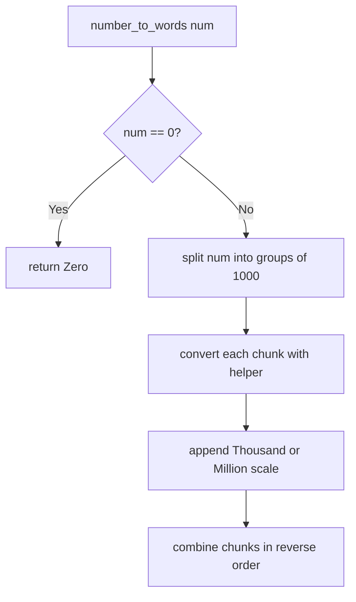

# Integer to English Words

**Difficulty:** Hard
**Pattern:** Recursion / String Building
**LeetCode:** #273

## Problem Statement

Convert a non-negative integer `num` to its English words representation.

## Examples

### Example 1
**Input:** `num = 123`
**Output:** `"One Hundred Twenty Three"`

### Example 2
**Input:** `num = 12345`
**Output:** `"Twelve Thousand Three Hundred Forty Five"`

### Example 3
**Input:** `num = 1000010`
**Output:** `"One Million Ten"`

## Constraints
- `0 <= num <= 2^31 - 1`

## Hints

> 💡 **Hint 1:** Break the number into groups of three digits (ones, thousands, millions, billions). Process each group separately.

> 💡 **Hint 2:** For each group of three digits, handle hundreds, tens, and ones. Use lookup arrays for ones (1-19) and tens (20, 30, ..., 90).

> 💡 **Hint 3:** Recursively convert each three-digit group, then append the appropriate scale word (Thousand, Million, Billion). Handle edge cases: 0, numbers ending in 0s.

## Approach

**Time Complexity:** O(1) — bounded by 32-bit integer
**Space Complexity:** O(1)

Process in groups of 1000. For each group, convert three digits to words using lookup tables. Append scale words.

## Python Implementation

```python
def number_to_words(num):
	if num == 0:
		return 'Zero'

	below_20 = [
		'', 'One', 'Two', 'Three', 'Four', 'Five', 'Six', 'Seven', 'Eight', 'Nine',
		'Ten', 'Eleven', 'Twelve', 'Thirteen', 'Fourteen', 'Fifteen',
		'Sixteen', 'Seventeen', 'Eighteen', 'Nineteen'
	]
	tens = ['', '', 'Twenty', 'Thirty', 'Forty', 'Fifty', 'Sixty', 'Seventy', 'Eighty', 'Ninety']
	thousands = ['', 'Thousand', 'Million', 'Billion']

	def helper(value):
		if value == 0:
			return ''
		if value < 20:
			return below_20[value] + ' '
		if value < 100:
			return tens[value // 10] + ' ' + helper(value % 10)
		return below_20[value // 100] + ' Hundred ' + helper(value % 100)

	words = []
	chunk_index = 0

	while num > 0:
		chunk = num % 1000
		if chunk:
			words.append(helper(chunk) + thousands[chunk_index] + ' ')
		num //= 1000
		chunk_index += 1

	return ' '.join(reversed(''.join(words).split()))
```

## Step-by-Step Example

**Input:** `num = 12345`

1. Split into chunks of `1000`: `12` and `345`.
2. Convert `345` to `"Three Hundred Forty Five"`.
3. Convert `12` to `"Twelve"` and append the scale word `"Thousand"`.
4. Join the higher chunk before the lower chunk.

**Output:** `"Twelve Thousand Three Hundred Forty Five"`

## Flow Diagram



## Edge Cases

- `0` must return `"Zero"`.
- Chunks with value `0` are skipped, so `1000010` becomes `"One Million Ten"`.
- Numbers under `20` use direct word lookup instead of tens decomposition.
