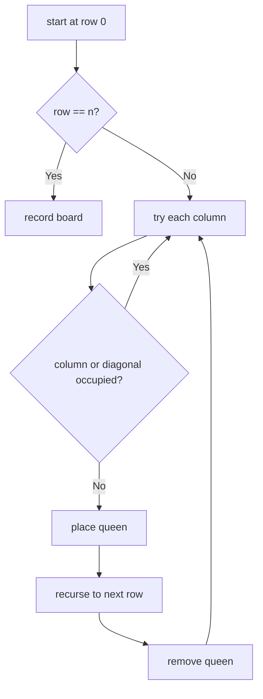
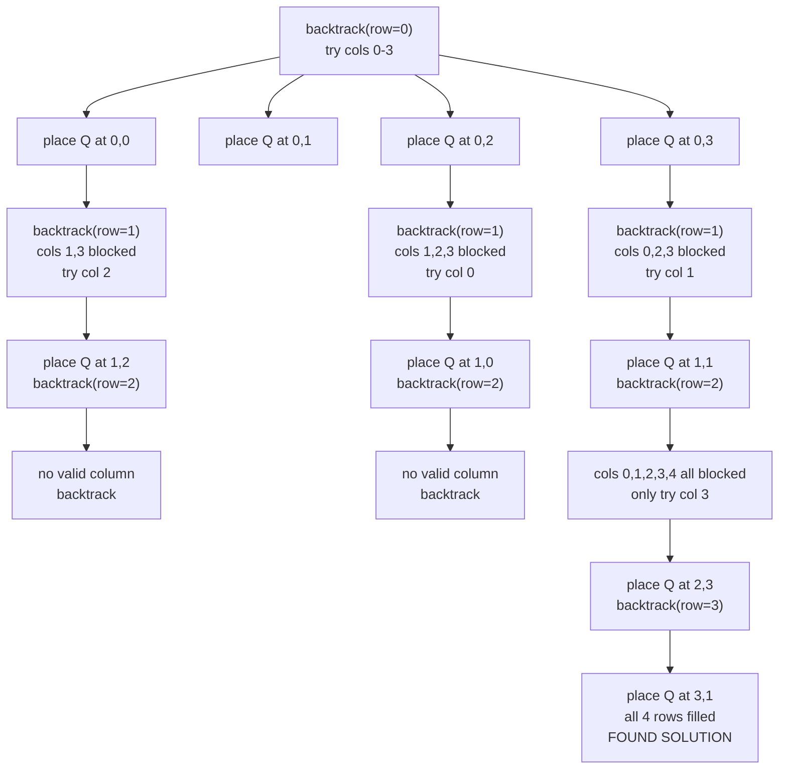

# N-Queens

**Difficulty:** Hard
**Pattern:** Backtracking / Constraint Satisfaction
**LeetCode:** #51

## Problem Statement

The n-queens puzzle is the problem of placing `n` queens on an `n x n` chessboard such that no two queens attack each other. Given an integer `n`, return all distinct solutions to the n-queens puzzle. You may return the answer in any order. Each solution contains a distinct board configuration of the n-queens' placement, where `'Q'` and `'.'` both indicate a queen and an empty space, respectively.

## Examples

### Example 1
**Input:** `n = 4`
**Output:** `[[".Q..","...Q","Q...","..Q."],["..Q.","Q...","...Q",".Q.."]]`

### Example 2
**Input:** `n = 1`
**Output:** `[["Q"]]`

## Constraints
- `1 <= n <= 9`

## Hints

> 💡 **Hint 1:** Place queens row by row. For each row, try each column. Check if the placement is valid (no conflicts with previously placed queens).

> 💡 **Hint 2:** A placement is invalid if another queen is in the same column, same diagonal (row-col is same), or same anti-diagonal (row+col is same). Use three sets to track these.

> 💡 **Hint 3:** When all n rows are filled, record the board configuration. Backtrack by removing the queen and trying the next column.

## Approach

**Time Complexity:** O(n!)
**Space Complexity:** O(n)

Row-by-row backtracking. Track occupied columns, diagonals, and anti-diagonals with sets for O(1) validity checks.

## Python Implementation

```python
def solve_n_queens(n):
	result = []
	board = [['.'] * n for _ in range(n)]
	cols = set()
	diagonals = set()      # row - col
	anti_diagonals = set() # row + col

	def backtrack(row):
		if row == n:
			result.append([''.join(line) for line in board])
			return

		for col in range(n):
			if col in cols or (row - col) in diagonals or (row + col) in anti_diagonals:
				continue

			cols.add(col)
			diagonals.add(row - col)
			anti_diagonals.add(row + col)
			board[row][col] = 'Q'

			backtrack(row + 1)

			board[row][col] = '.'
			cols.remove(col)
			diagonals.remove(row - col)
			anti_diagonals.remove(row + col)

	backtrack(0)
	return result
```

## Step-by-Step Example

**Input:** `n = 4`

1. Try placing a queen in row `0`, column `0`.
2. Move to row `1`. Columns `0` and `1` are invalid, so try column `2`.
3. Move to row `2`. If no valid column exists, backtrack and move the row `1` queen.
4. Continue row by row until all `4` rows are filled.
5. Record a board like `[".Q..", "...Q", "Q...", "..Q."]`.

**Output:** two valid boards for `n = 4`

## Flow Diagram



## Recursion Tree Visualization

For **Input:** `n = 4`, the recursion tree shows how constraints prune the search space:



**Key pruning:** Notice how most branches terminate early because all columns become blocked by diagonal/column constraints.

## Trace Table: Constraint State at Each Row

**Input:** `n = 4`

Assuming we're exploring the **first valid solution path** `[1, 3, 0, 2]` (queen positions in each row):

| Row | Q Position | `cols` Set | `diagonals` Set | `anti_diag` Set | Valid? |
|-----|-----------|-----------|-----------------|-----------------|--------|
| 0 | (0, 1) | `{1}` | `{-1}` | `{1}` | ✓ Place |
| 1 | Try (1,0) | {1,0}? | {-1,0}? | {1,1}? | ✗ diag -1 conflict |
| 1 | Try (1,1) | {1}? | {-1}? | {1}? | ✗ col conflict |
| 1 | Try (1,2) | {1,2}? | {-1,0}? | {1,3}? | ✓ Place |
| 2 | (2,0) | {1,2,0}? | {-1,0,-2}? | {1,3,2}? | ✗ diag -2 conflict |
| 2 | Try (2,3) | {1,2,3}? | {-1,0,1}? | {1,3,5}? | ✓ Place |
| 3 | (3,0) | {1,2,3,0}? | {-1,0,1,-3}? | {1,3,5,3}? | ✓ Place |
| 3 | row == n | - | - | - | **Return True** |

**Diagonal math check at row 2, col 3:**
- Diagonal key: `row - col = 2 - 3 = -1` (already in set from step 0) → **conflict!** Skip.
- Diagonal key: `row + col = 2 + 3 = 5` (new) → **OK, add it**.

## Call Stack Depth

For `n = 4`, the recursion depth is exactly 4 (one level per row). Even for `n = 8`, depth is only 8, so stack overflow is not a concern. **The main challenge is the exponential branching**, but constraint pruning cuts 99% of bad branches.

## Edge Cases

- `n = 1` returns `[["Q"]]`.
- `n = 2` and `n = 3` return no solutions.
- Diagonal bookkeeping is the main pruning step that keeps the search practical.
