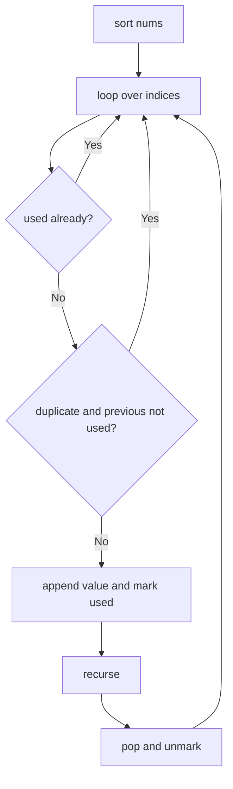

# Permutations II

**Difficulty:** Medium
**Pattern:** Backtracking (with Duplicates)
**LeetCode:** #47

## Problem Statement

Given a collection of numbers, `nums`, that might contain duplicates, return all possible unique permutations in any order.

## Examples

### Example 1
**Input:** `nums = [1,1,2]`
**Output:** `[[1,1,2],[1,2,1],[2,1,1]]`

### Example 2
**Input:** `nums = [1,2,3]`
**Output:** `[[1,2,3],[1,3,2],[2,1,3],[2,3,1],[3,1,2],[3,2,1]]`

## Constraints
- `1 <= nums.length <= 8`
- `-10 <= nums[i] <= 10`

## Hints

> 💡 **Hint 1:** Sort the array. Use a `used` boolean array.

> 💡 **Hint 2:** Skip duplicates: if `nums[i] == nums[i-1]` and `used[i-1] == false`, skip nums[i]. This ensures duplicates are used in order.

> 💡 **Hint 3:** The condition `used[i-1] == false` means the previous duplicate was not used in the current path (it was backtracked), so using nums[i] now would create a duplicate permutation.

## Approach

**Time Complexity:** O(n × n!)
**Space Complexity:** O(n)

Sort + backtracking with used array. Skip duplicate values when the previous identical value is not in the current path.

## Python Implementation

```python
def permute_unique(nums):
	nums.sort()
	result = []
	path = []
	used = [False] * len(nums)

	def backtrack():
		if len(path) == len(nums):
			result.append(path[:])
			return

		for index, value in enumerate(nums):
			if used[index]:
				continue
			if index > 0 and nums[index] == nums[index - 1] and not used[index - 1]:
				continue
			used[index] = True
			path.append(value)
			backtrack()
			path.pop()
			used[index] = False

	backtrack()
	return result
```

## Step-by-Step Example

**Input:** `nums = [1, 1, 2]`

1. Sort to `[1, 1, 2]`.
2. Use the first `1`, then the second `1`, then `2` to record `[1, 1, 2]`.
3. Backtrack and record `[1, 2, 1]`.
4. At the top level, skip starting from the second `1` because the first identical value is not currently used.
5. Start with `2`, then record `[2, 1, 1]`.

**Output:** `[[1, 1, 2], [1, 2, 1], [2, 1, 1]]`

## Flow Diagram



## Edge Cases

- All elements equal produce exactly one permutation.
- Sorting is required before the duplicate-skip condition works.
- Without the skip rule, duplicate values would create repeated permutations.
