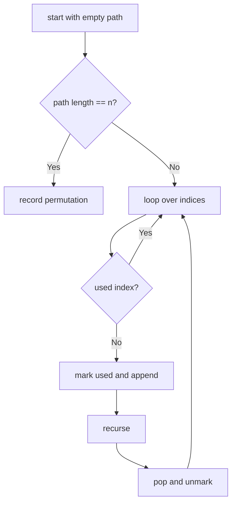

# Permutations

**Difficulty:** Medium
**Pattern:** Backtracking
**LeetCode:** #46

## Problem Statement

Given an array `nums` of distinct integers, return all the possible permutations. You can return the answer in any order.

## Examples

### Example 1
**Input:** `nums = [1,2,3]`
**Output:** `[[1,2,3],[1,3,2],[2,1,3],[2,3,1],[3,1,2],[3,2,1]]`

### Example 2
**Input:** `nums = [0,1]`
**Output:** `[[0,1],[1,0]]`

### Example 3
**Input:** `nums = [1]`
**Output:** `[[1]]`

## Constraints
- `1 <= nums.length <= 6`
- `-10 <= nums[i] <= 10`
- All the integers of `nums` are unique

## Hints

> 💡 **Hint 1:** At each position, try placing each unused element. Use a `used` boolean array to track which elements have been placed.

> 💡 **Hint 2:** When the current permutation has n elements, add it to results.

> 💡 **Hint 3:** Alternatively, swap elements in-place: swap nums[start] with each nums[i] (i >= start), recurse with start+1, then swap back.

## Approach

**Time Complexity:** O(n × n!)
**Space Complexity:** O(n) recursion depth

Backtracking with used array or in-place swapping. Try each unused element at each position.

## Python Implementation

```python
def permute(nums):
	result = []
	path = []
	used = [False] * len(nums)

	def backtrack():
		if len(path) == len(nums):
			result.append(path[:])
			return

		for index, value in enumerate(nums):
			if used[index]:
				continue
			used[index] = True
			path.append(value)
			backtrack()
			path.pop()
			used[index] = False

	backtrack()
	return result
```

## Step-by-Step Example

**Input:** `nums = [1, 2, 3]`

1. Start with empty path.
2. Choose `1`, then choose `2`, then choose `3` to record `[1, 2, 3]`.
3. Backtrack to `[1]`, then choose `3`, then `2` to record `[1, 3, 2]`.
4. Backtrack to top level and repeat starting with `2`, then with `3`.

**Output:** `[[1, 2, 3], [1, 3, 2], [2, 1, 3], [2, 3, 1], [3, 1, 2], [3, 2, 1]]`

## Flow Diagram



## Edge Cases

- A single-element array returns one permutation.
- Distinct elements are assumed here; duplicates require a different skip rule.
- Output size grows as `n!`, which dominates runtime quickly.
