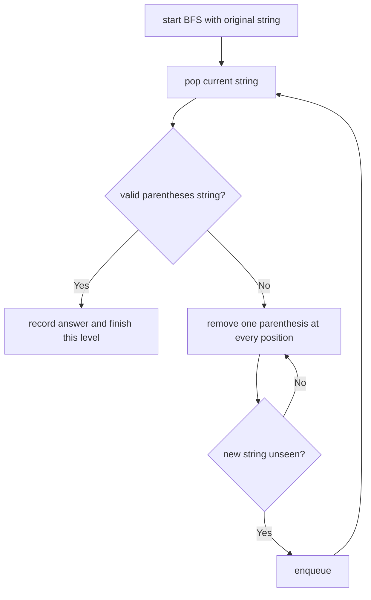

# Remove Invalid Parentheses

**Difficulty:** Hard
**Pattern:** BFS / Backtracking
**LeetCode:** #301

## Problem Statement

Given a string `s` that contains parentheses and letters, remove the minimum number of invalid parentheses to make the input string valid. Return a list of unique strings that are valid with the minimum number of removals. You may return the answer in any order.

## Examples

### Example 1
**Input:** `s = "()())()"`
**Output:** `["(())()","()()()"]`

### Example 2
**Input:** `s = "(a)())()"`
**Output:** `["(a())()","(a)()()"]`

### Example 3
**Input:** `s = ")("`
**Output:** `[""]`

## Constraints
- `1 <= s.length <= 25`
- `s` consists of lowercase English letters and parentheses `'('` and `')'`
- There will be at most `20` parentheses in `s`

## Hints

> 💡 **Hint 1:** BFS approach: start with the original string. Generate all strings with one character removed. Check validity. If any are valid, those are the answers (minimum removals = 1).

> 💡 **Hint 2:** If none are valid at level 1, try level 2 (remove 2 characters), etc. Use a HashSet to avoid duplicates.

> 💡 **Hint 3:** Validity check: scan left to right, count open brackets. If count goes negative, invalid. At end, count must be 0.

## Approach

**Time Complexity:** O(n × 2^n)
**Space Complexity:** O(n × 2^n)

BFS level by level (each level removes one more character). Stop at the first level that produces valid strings.

## Python Implementation

```python
from collections import deque


def remove_invalid_parentheses(s):
	def is_valid(candidate):
		balance = 0
		for char in candidate:
			if char == '(':
				balance += 1
			elif char == ')':
				balance -= 1
				if balance < 0:
					return False
		return balance == 0

	result = []
	queue = deque([s])
	seen = {s}
	found = False

	while queue and not found:
		for _ in range(len(queue)):
			current = queue.popleft()
			if is_valid(current):
				result.append(current)
				found = True
				continue

			if found:
				continue

			for index, char in enumerate(current):
				if char not in '()':
					continue
				candidate = current[:index] + current[index + 1:]
				if candidate not in seen:
					seen.add(candidate)
					queue.append(candidate)

	return result
```

## Step-by-Step Example

**Input:** `s = "()())()"`

1. Level `0`: start with `"()())()"`. It is invalid.
2. Generate all strings formed by removing one parenthesis.
3. Level `1` includes candidates such as `"(())()"` and `"()()()"`.
4. The moment valid strings appear at this level, stop exploring deeper levels.
5. Return all valid strings from the first successful BFS layer.

**Output:** `["(())()", "()()()"]`

## Flow Diagram



## Edge Cases

- Strings with letters should preserve the letters untouched.
- `")("` should return `[""]`.
- BFS is important because it guarantees minimum removals.
