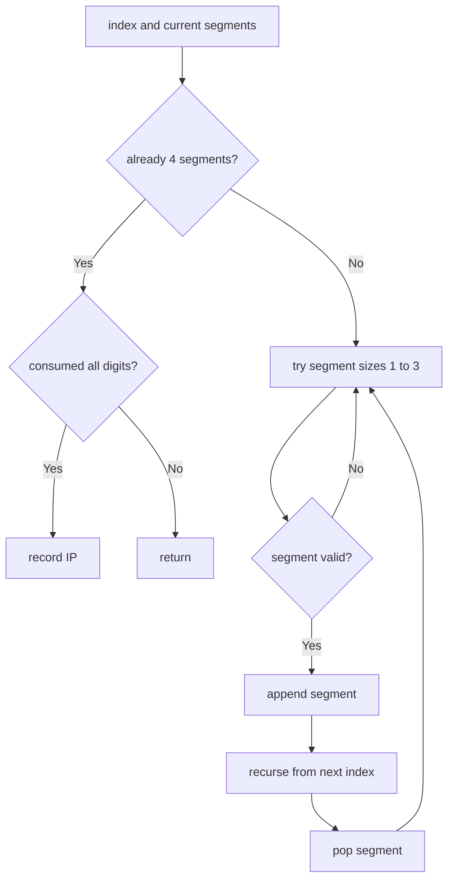

# Restore IP Addresses

**Difficulty:** Medium
**Pattern:** Backtracking
**LeetCode:** #93

## Problem Statement

A valid IP address consists of exactly four integers separated by single dots. Each integer is between `0` and `255` (inclusive) and cannot have leading zeros. Given a string `s` containing only digits, return all possible valid IP addresses that can be formed by inserting dots into `s`. You are not allowed to reorder or remove any digits in `s`. You may return the valid IP addresses in any order.

## Examples

### Example 1
**Input:** `s = "25525511135"`
**Output:** `["255.255.11.135","255.255.111.35"]`

### Example 2
**Input:** `s = "0000"`
**Output:** `["0.0.0.0"]`

### Example 3
**Input:** `s = "101023"`
**Output:** `["1.0.10.23","1.0.102.3","10.1.0.23","10.10.2.3","101.0.2.3"]`

## Constraints
- `1 <= s.length <= 20`
- `s` consists of digits only

## Hints

> 💡 **Hint 1:** Backtracking: place 3 dots to create 4 segments. At each step, try segment lengths 1, 2, or 3.

> 💡 **Hint 2:** Validate each segment: no leading zeros (unless the segment is "0"), value ≤ 255.

> 💡 **Hint 3:** When 4 segments are formed and the entire string is consumed, add the IP to results.

## Approach

**Time Complexity:** O(3^4) = O(1) — at most 3 choices for each of 4 segments
**Space Complexity:** O(1)

Backtracking with 4 segments. Try lengths 1-3 for each segment, validate, recurse. Collect when all 4 segments are placed and string is exhausted.

## Python Implementation

```python
def restore_ip_addresses(s):
	result = []
	path = []

	def valid(segment):
		if len(segment) > 1 and segment[0] == '0':
			return False
		return int(segment) <= 255

	def backtrack(index):
		if len(path) == 4:
			if index == len(s):
				result.append('.'.join(path))
			return

		for size in range(1, 4):
			if index + size > len(s):
				break
			segment = s[index:index + size]
			if not valid(segment):
				continue
			path.append(segment)
			backtrack(index + size)
			path.pop()

	backtrack(0)
	return result
```

## Step-by-Step Example

**Input:** `s = "25525511135"`

1. Start from index `0`, try segment lengths `1`, `2`, `3`.
2. `"255"` is valid, so choose it.
3. From index `3`, choose another `"255"`.
4. From index `6`, choose `"11"`, then the remaining `"135"` to form `255.255.11.135`.
5. Backtrack and instead choose `"111"`, then `"35"` to form `255.255.111.35`.

**Output:** `["255.255.11.135", "255.255.111.35"]`

## Flow Diagram



## Edge Cases

- Leading zeros are invalid except for the segment `"0"`.
- Strings shorter than `4` or longer than `12` can never form a valid IP.
- Values above `255` must be rejected immediately.
