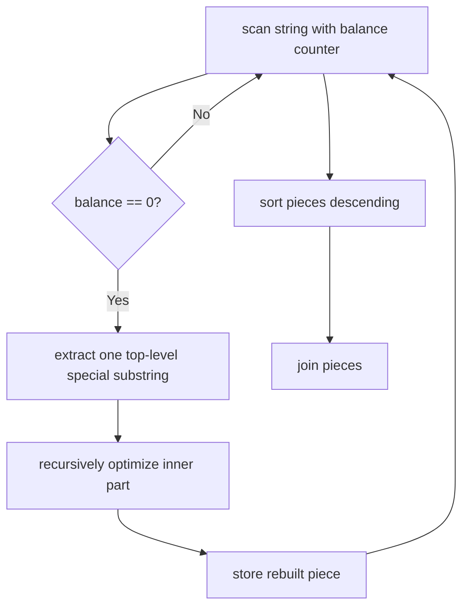

# Special Binary String

**Difficulty:** Hard
**Pattern:** Recursion / Divide and Conquer
**LeetCode:** #761

## Problem Statement

Special binary strings are binary strings with the following two properties: The number of `0`'s is equal to the number of `1`'s. Every prefix of the binary string has at least as many `1`'s as `0`'s. You are given a special binary string `s`. A move consists of choosing two consecutive, non-empty, special substrings of `s`, and swapping them. Return the lexicographically largest resulting string possible after any number of moves.

## Examples

### Example 1
**Input:** `s = "11011000"`
**Output:** `"11100100"`

### Example 2
**Input:** `s = "10"`
**Output:** `"10"`

## Constraints
- `1 <= s.length <= 50`
- `s[i]` is either `'0'` or `'1'`
- `s` is a special binary string

## Hints

> 💡 **Hint 1:** A special binary string has the form `1 + inner + 0` where inner is also a special binary string (or empty).

> 💡 **Hint 2:** Recursively find all top-level special substrings. Sort them in descending order (lexicographically largest first). Concatenate.

> 💡 **Hint 3:** For each top-level special substring `1X0`, recursively solve the inner part X to get the best inner arrangement.

## Approach

**Time Complexity:** O(n² log n)
**Space Complexity:** O(n)

Recursive: find top-level special substrings, recursively optimize each, sort descending, concatenate.

## Python Implementation

```python
def make_largest_special(s):
	parts = []
	balance = 0
	start = 0

	for index, char in enumerate(s):
		balance += 1 if char == '1' else -1
		if balance == 0:
			inner = make_largest_special(s[start + 1:index])
			parts.append('1' + inner + '0')
			start = index + 1

	parts.sort(reverse=True)
	return ''.join(parts)
```

## Step-by-Step Example

**Input:** `s = "11011000"`

1. Scan while tracking balance of `1` and `0`.
2. When balance returns to `0`, a top-level special substring is complete.
3. Split into `"10"` and `"1100"`-style pieces, recursively optimize the inside of each piece.
4. Sort the top-level pieces in descending lexicographic order.
5. Join them back together to get the largest possible special binary string.

**Output:** `"11100100"`

## Flow Diagram



## Edge Cases

- `"10"` is already the smallest valid special string and returns unchanged.
- The input is guaranteed to be special, so every top-level split is balanced.
- The lexicographically largest answer comes from sorting the optimized pieces in reverse order.
