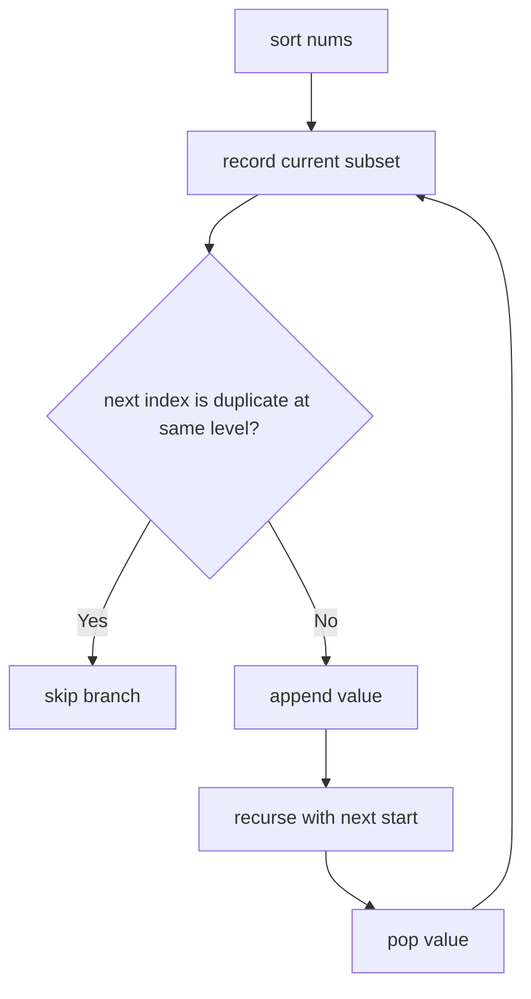

# Subsets II

**Difficulty:** Medium
**Pattern:** Backtracking (with Duplicates)
**LeetCode:** #90

## Problem Statement

Given an integer array `nums` that may contain duplicates, return all possible subsets (the power set). The solution set must not contain duplicate subsets. Return the solution in any order.

## Examples

### Example 1
**Input:** `nums = [1,2,2]`
**Output:** `[[],[1],[1,2],[1,2,2],[2],[2,2]]`

### Example 2
**Input:** `nums = [0]`
**Output:** `[[],[0]]`

## Constraints
- `1 <= nums.length <= 10`
- `-10 <= nums[i] <= 10`

## Hints

> 💡 **Hint 1:** Sort the array first to group duplicates.

> 💡 **Hint 2:** Use the same backtracking as Subsets I, but skip duplicates at the same recursion level.

> 💡 **Hint 3:** Skip condition: `if i > start and nums[i] == nums[i-1]: continue`. This ensures each duplicate value is only used a certain number of times at each level.

## Approach

**Time Complexity:** O(n × 2^n)
**Space Complexity:** O(n)

Sort + backtracking. Skip duplicate values at the same recursion level to avoid duplicate subsets.

## Python Implementation

```python
def subsets_with_dup(nums):
	nums.sort()
	result = []
	path = []

	def backtrack(start):
		result.append(path[:])

		for index in range(start, len(nums)):
			if index > start and nums[index] == nums[index - 1]:
				continue
			path.append(nums[index])
			backtrack(index + 1)
			path.pop()

	backtrack(0)
	return result
```

## Step-by-Step Example

**Input:** `nums = [1, 2, 2]`

1. Sort first: `[1, 2, 2]`.
2. Record `[]`.
3. Choose `1`, then record `[1]`.
4. Choose first `2`, record `[1, 2]`, then choose second `2`, record `[1, 2, 2]`.
5. Backtrack. At the same level, skip the second `2` because it would create a duplicate branch.
6. From top level choose first `2`, record `[2]`, then `[2, 2]`.

**Output:** `[[], [1], [1, 2], [1, 2, 2], [2], [2, 2]]`

## Flow Diagram



## Edge Cases

- All elements same: `nums = [2, 2, 2]` should produce four subsets, not eight.
- Already unique input behaves like Subsets I.
- Sorting is required; skipping duplicates without sorting is unreliable.
