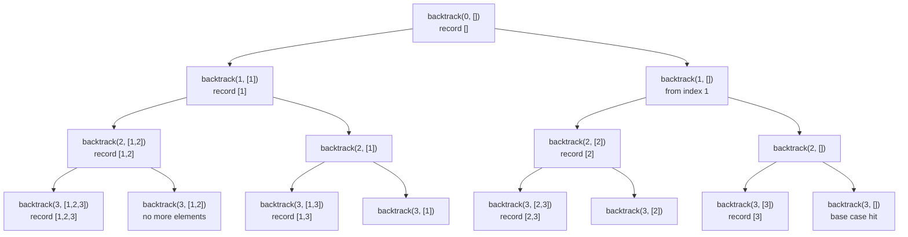

# Subsets

**Difficulty:** Medium
**Pattern:** Backtracking
**LeetCode:** #78

## Problem Statement

Given an integer array `nums` of unique elements, return all possible subsets (the power set). The solution set must not contain duplicate subsets. Return the solution in any order.

## Examples

### Example 1
**Input:** `nums = [1,2,3]`
**Output:** `[[],[1],[2],[1,2],[3],[1,3],[2,3],[1,2,3]]`

### Example 2
**Input:** `nums = [0]`
**Output:** `[[],[0]]`

## Constraints
- `1 <= nums.length <= 10`
- `-10 <= nums[i] <= 10`
- All the numbers of `nums` are unique

## Hints

> 💡 **Hint 1:** For each element, you have two choices: include it or exclude it. This gives 2^n subsets.

> 💡 **Hint 2:** Backtracking: at each step, add the current subset to results, then try adding each remaining element.

> 💡 **Hint 3:** Use a start index to avoid revisiting elements. For each call, iterate from start to end, add nums[i], recurse with start=i+1, then remove nums[i].

## Approach

**Time Complexity:** O(n × 2^n)
**Space Complexity:** O(n) recursion depth

Backtracking with a start index. Add current state to results at every call (not just leaf nodes). Iterate forward to avoid duplicates.

## Python Implementation

```python
def subsets(nums):
	result = []
	path = []

	def backtrack(start):
		result.append(path[:])

		for index in range(start, len(nums)):
			path.append(nums[index])
			backtrack(index + 1)
			path.pop()

	backtrack(0)
	return result
```

## Step-by-Step Example

**Input:** `nums = [1, 2]`

1. Start with `path = []`, record `[]`.
2. Choose `1`, now `path = [1]`, record `[1]`.
3. From there choose `2`, now `path = [1, 2]`, record `[1, 2]`.
4. Backtrack by removing `2`, then remove `1`.
5. Choose `2` from the top level, now `path = [2]`, record `[2]`.

**Output:** `[[], [1], [1, 2], [2]]`

## Flow Diagram

```mermaid
flowchart TD
	A[backtrack start=0 path=[]] --> B[record []]
	B --> C[choose 1]
	C --> D[backtrack start=1 path=[1]]
	D --> E[record [1]]
	E --> F[choose 2]
	F --> G[record [1, 2]]
	G --> H[pop 2]
	H --> I[pop 1]
	I --> J[choose 2]
	J --> K[record [2]]
```

## Recursion Tree Visualization

For **Input:** `nums = [1, 2, 3]`, here is the complete recursion tree showing all function calls:



**Key insight:** Each call to `backtrack(start)` records the current `path`, then loops from `start` to the end, choosing index by index.

## Trace Table: Execution Order

**Input:** `nums = [1, 2]`

Here's a trace showing the exact variable states at each recorded subset:

| Step | Call Stack | `start` | `path` | `result` |
|------|-----------|---------|--------|----------|
| 1 | `backtrack(0)` | 0 | `[]` | `[[]]` |
| 2 | `backtrack(1)` | 1 | `[1]` | `[[], [1]]` |
| 3 | `backtrack(2)` | 2 | `[1,2]` | `[[], [1], [1,2]]` |
| 4 | pop `2`, return to step 2 | - | `[1]` | (no change) |
| 5 | pop `1`, continue loop at step 1 | - | `[]` | (no change) |
| 6 | `backtrack(2)` | 2 | `[2]` | `[[], [1], [1,2], [2]]` |

**How to read this:**
- **Step 1**: Base case — immediately record empty path.
- **Step 2**: Loop iteration (index 0) — choose element at index 0 (value `1`), recurse.
- **Step 3**: Nested loop iteration (index 1) — choose element at index 1 (value `2`), recurse.
- **Step 4**: Backtrack (base case reached) — pop `2` from path.
- **Step 5**: Return from recursion — pop `1` from path, process next index from step 1's loop.
- **Step 6**: Loop iteration (index 1) — choose element at index 1 (value `2`), record result.

## Edge Cases

- Single element: `nums = [0]` should return `[[], [0]]`.
- Empty input in a generalized version should return `[[]]`.
- Large `n` grows to `2^n` subsets quickly, so only the recursion depth stays small.
