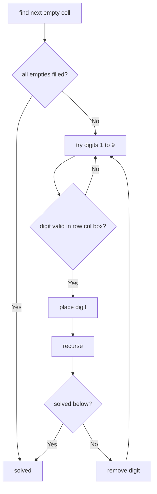

# Sudoku Solver

**Difficulty:** Hard
**Pattern:** Backtracking / Constraint Satisfaction
**LeetCode:** #37

## Problem Statement

Write a program to solve a Sudoku puzzle by filling the empty cells. A sudoku solution must satisfy all of the following rules:
1. Each of the digits 1-9 must occur exactly once in each row.
2. Each of the digits 1-9 must occur exactly once in each column.
3. Each of the digits 1-9 must occur exactly once in each of the 9 3x3 sub-boxes.

The `'.'` character indicates empty cells.

## Examples

### Example 1
**Input:** A partially filled 9×9 board
**Output:** The same board filled with the solution

## Constraints
- `board.length == 9`, `board[i].length == 9`
- `board[i][j]` is a digit or `'.'`
- It is guaranteed that the input board has only one solution

## Hints

> 💡 **Hint 1:** Find the first empty cell. Try placing digits 1-9. Check if the placement is valid (no conflict in row, column, or 3×3 box).

> 💡 **Hint 2:** If valid, place the digit and recurse. If the recursion returns true (solved), propagate true. If false, undo the placement (backtrack) and try the next digit.

> 💡 **Hint 3:** Precompute sets for each row, column, and box to enable O(1) validity checks. The box index for cell (r,c) is `(r//3)*3 + c//3`.

## Approach

**Time Complexity:** O(9^m) where m is the number of empty cells
**Space Complexity:** O(1) extra (modifying in-place)

Backtracking: find empty cell, try digits 1-9 with validity check, recurse, backtrack on failure.

## Python Implementation

```python
def solve_sudoku(board):
	rows = [set() for _ in range(9)]
	cols = [set() for _ in range(9)]
	boxes = [set() for _ in range(9)]
	empties = []

	for row in range(9):
		for col in range(9):
			value = board[row][col]
			if value == '.':
				empties.append((row, col))
				continue
			box = (row // 3) * 3 + col // 3
			rows[row].add(value)
			cols[col].add(value)
			boxes[box].add(value)

	def backtrack(index):
		if index == len(empties):
			return True

		row, col = empties[index]
		box = (row // 3) * 3 + col // 3

		for digit in '123456789':
			if digit in rows[row] or digit in cols[col] or digit in boxes[box]:
				continue

			board[row][col] = digit
			rows[row].add(digit)
			cols[col].add(digit)
			boxes[box].add(digit)

			if backtrack(index + 1):
				return True

			board[row][col] = '.'
			rows[row].remove(digit)
			cols[col].remove(digit)
			boxes[box].remove(digit)

		return False

	backtrack(0)
```

## Step-by-Step Example

**Input:** a partially filled `9 x 9` board

1. Precompute which digits already exist in every row, column, and box.
2. Pick the first empty cell.
3. Try digits `1` through `9`; skip any digit that conflicts with the row, column, or box.
4. Place one valid digit and recurse to the next empty cell.
5. If a later cell becomes impossible, undo the placement and try the next digit.
6. Stop when all empty cells are filled.

**Output:** the original board modified in-place into the unique solved board.

## Flow Diagram



## Edge Cases

- A nearly solved board should finish quickly.
- If no digit fits a cell, immediate backtracking is required.
- This version assumes the input puzzle has exactly one valid solution, matching the problem statement.
