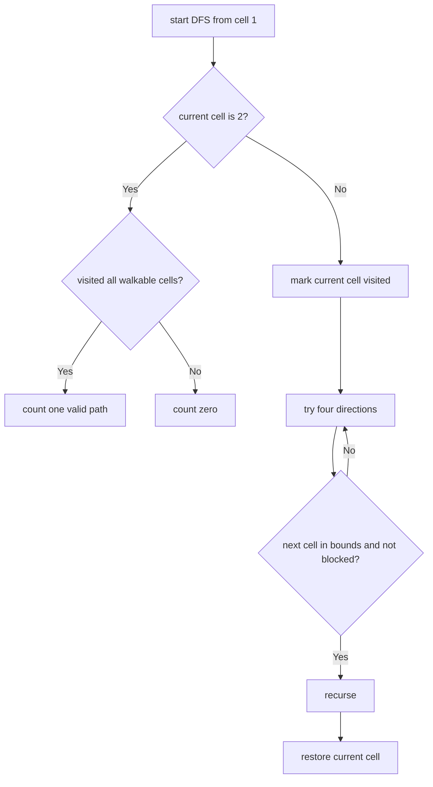

# Unique Paths III

**Difficulty:** Hard
**Pattern:** Backtracking / DFS
**LeetCode:** #980

## Problem Statement

You are given an `m x n` integer array `grid` where `grid[i][j]` could be: `1` representing the starting square (exactly one), `2` representing the ending square (exactly one), `0` representing empty squares we can walk over, `-1` representing obstacles that we cannot walk over. Return the number of 4-directional walks from the starting square to the ending square, that walk over every non-obstacle square exactly once.

## Examples

### Example 1
**Input:** `grid = [[1,0,0,0],[0,0,0,0],[0,0,2,-1]]`
**Output:** `2`

### Example 2
**Input:** `grid = [[1,0,0,0],[0,0,0,0],[0,0,0,2]]`
**Output:** `4`

## Constraints
- `m == grid.length`, `n == grid[i].length`
- `1 <= m, n <= 20`
- `1 <= m * n <= 20`
- `-1 <= grid[i][j] <= 2`
- There is exactly one starting cell and one ending cell

## Hints

> 💡 **Hint 1:** Count the total non-obstacle cells (including start and end). A valid path must visit all of them.

> 💡 **Hint 2:** DFS/backtracking from the start. Mark cells as visited. When you reach the end, check if all non-obstacle cells were visited.

> 💡 **Hint 3:** Unmark cells when backtracking. Count valid complete paths.

## Approach

**Time Complexity:** O(4^(m×n))
**Space Complexity:** O(m×n)

DFS with backtracking. Count non-obstacle cells. A path is valid when it reaches the end having visited all non-obstacle cells.

## Python Implementation

```python
def unique_paths_iii(grid):
	rows, cols = len(grid), len(grid[0])
	start_row = start_col = 0
	walkable = 0

	for row in range(rows):
		for col in range(cols):
			if grid[row][col] != -1:
				walkable += 1
			if grid[row][col] == 1:
				start_row, start_col = row, col

	def dfs(row, col, visited_count):
		if grid[row][col] == 2:
			return 1 if visited_count == walkable else 0

		original = grid[row][col]
		grid[row][col] = -1
		total = 0

		for dr, dc in ((1, 0), (-1, 0), (0, 1), (0, -1)):
			next_row = row + dr
			next_col = col + dc
			if 0 <= next_row < rows and 0 <= next_col < cols and grid[next_row][next_col] != -1:
				total += dfs(next_row, next_col, visited_count + 1)

		grid[row][col] = original
		return total

	return dfs(start_row, start_col, 1)
```

## Step-by-Step Example

**Input:** `grid = [[1,0,0,0],[0,0,0,0],[0,0,2,-1]]`

1. Count every non-obstacle square. Here the path must visit all walkable cells exactly once.
2. Start DFS from the cell containing `1`.
3. Mark the current cell as visited by temporarily changing it to `-1`.
4. Explore up, down, left, and right.
5. When the end cell `2` is reached, only count that path if the visited count equals the total walkable count.
6. Restore the cell on the way back so other branches can use it.

**Output:** `2`

## Flow Diagram



## Edge Cases

- Obstacles reduce the required walkable count.
- Reaching the end too early does not count.
- Because `m * n <= 20`, exhaustive DFS is still feasible.
