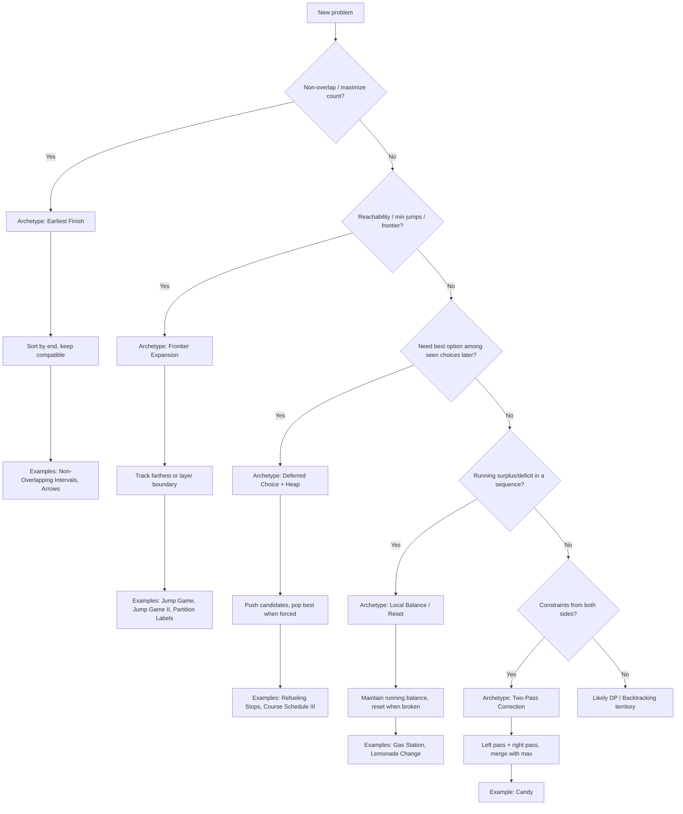
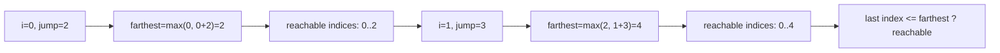
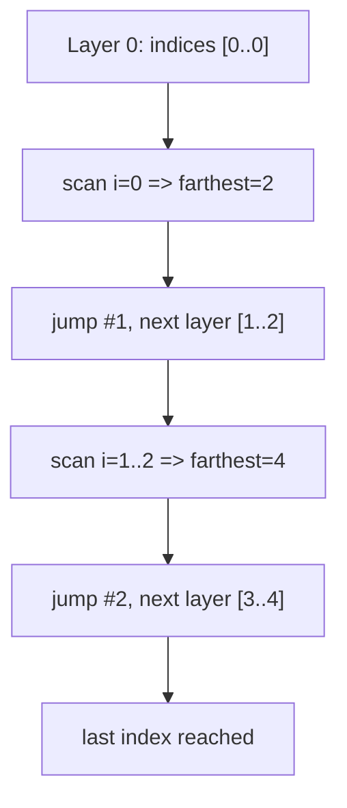
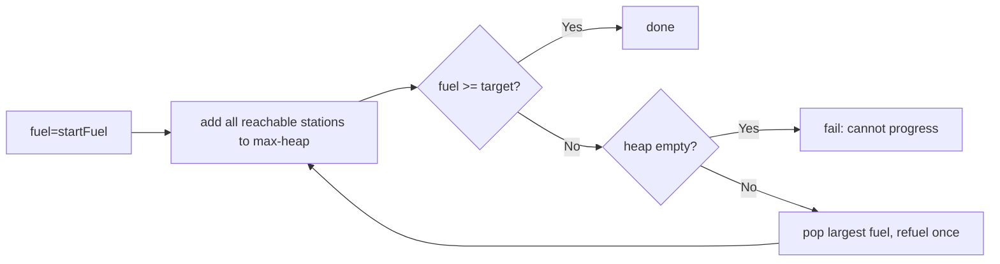
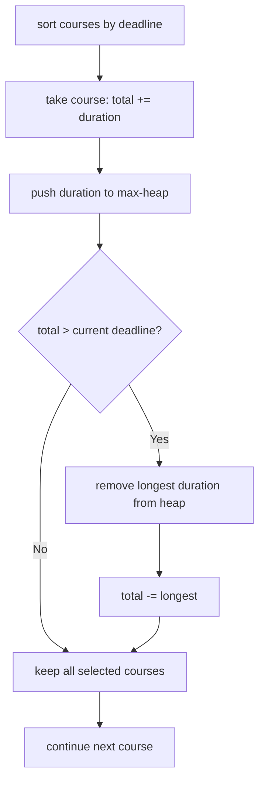

# 28. Greedy Algorithms

## Overview

Greedy algorithms build a solution step by step by taking the best-looking choice **right now**.

The key question is not "does this feel smart locally?" The key question is:

**Can I prove this local choice never blocks a globally optimal answer later?**

When that is true, greedy often gives an elegant `O(n)` or `O(n log n)` solution.

---

## The Two Properties You Need

### 1) Greedy Choice Property

There exists a local decision rule (for example, pick smallest end time, pick largest reachable jump, pick cheapest valid action) that can be part of some global optimum.

### 2) Optimal Substructure

After making that greedy choice, the remaining problem is the same type of problem on a smaller input.

If both properties hold, greedy is usually safe.

---

## How to Identify Greedy Problems

Use this quick checklist:

1. Can the problem be solved by repeatedly making one local decision?
2. If I commit to a local best choice, does the rest remain a smaller version of the same problem?
3. Can I argue that any optimal solution can be transformed to include my local choice (exchange argument)?

Strong greedy signals in problem statements:

- "maximum number of intervals/tasks/events"
- "minimum number of jumps/stops/resources"
- "can you reach"
- "schedule with no overlap"
- "merge / select / cover with minimum"

Common ingredients:

- Sorting by one key (end time, start time, cost, ratio)
- One pass with a running best/farthest
- Heap for "best available option so far"

---

## Greedy Proof Strategies (Simple Version)

### A) Exchange Argument

Show that if an optimal solution does not use your greedy choice, you can swap one choice and keep it optimal.

### B) Stay-Ahead Argument

Show that after each step, greedy is at least as good as any other strategy so far.

### C) Cut Property (for some graph problems)

Show that best edge crossing a cut is always safe to take.

---

## Common Traps (When Greedy Fails)

Greedy is often wrong when:

1. Future choices strongly depend on exact earlier choices.
2. Local best can create irreversible bad structure later.
3. Problem asks for counting all ways (usually DP/combinatorics territory).

Classic failure example:

- Coin system `[1, 3, 4]`, amount `6`
- Greedy picks `4 + 1 + 1` (3 coins)
- Optimal is `3 + 3` (2 coins)

So not all coin change problems are greedy-safe.

---

## Strategy Template (Use in Interviews)

1. Propose local rule in one sentence.
2. Pick sort key or data structure (array scan / heap).
3. Dry-run tiny input manually.
4. State why this local decision is safe (exchange/stay-ahead).
5. Implement and check edge cases.

---

## Mental Model For Medium/Hard Greedy

When greedy problems get harder, use this sequence.

1. Define the "risk" you want to avoid.
- Example risks: wasted room in intervals, getting stranded in jump problems, bad future inventory in change problems.
2. Choose a state summary that captures only what matters.
- Typical summaries: current frontier, earliest finishing end, current tank, max-heap of best seen options.
3. Ask: "If I delay this choice, do I lose options later?"
- If yes, decide now.
- If no, defer the choice and keep candidates (usually with a heap).
4. Prove local safety with one sentence.
- "Earliest end leaves maximum room."
- "Largest available refuel gives maximum reach when forced to refuel."
- "If tank goes negative here, any start in this segment fails."
5. Convert into one of five common greedy archetypes.

### The 5 Archetypes

1. Earliest finish wins (interval scheduling family)
- Sort by end and keep compatible intervals.
2. Frontier expansion (jump/reachability family)
- Track the farthest reachable boundary.
3. Local balance/accounting (inventory/cash/gas family)
- Keep running balance and reset start when balance breaks.
4. Deferred choice with heap
- Collect feasible options now, pick best only when forced.
5. Two-pass correction
- One pass enforces left constraint, second pass enforces right constraint.

### Quick Decision Flow

1. Is this "pick max number of non-overlapping"? Use sort-by-end.
2. Is this "minimum jumps/stops/reachability"? Try frontier or heap.
3. Is this sequence with running surplus/deficit? Try balance/reset logic.
4. Are constraints from both neighbors? Try two passes.
5. If none fits, test whether DP is safer.

### Visual Cheat Sheet (Greedy Archetypes)



Use this visual as a first-pass classifier before coding.

---

## Learning Path: Simple to Complex

This order is intentional. Each step reuses the previous intuition.

1. Assign Cookies (sorting + two pointers)
2. Lemonade Change (local feasibility)
3. Jump Game (farthest reachable frontier)
4. Jump Game II (layered frontier)
5. Interval Scheduling / Erase Overlap (sort by end)
6. Minimum Number of Arrows to Burst Balloons (interval greedy variant)
7. Gas Station (prefix deficit insight)
8. Task Scheduler (count-frequency formula)
9. Candy (two-pass greedy)
10. Minimum Number of Refueling Stops (heap + deferred greedy)
11. Partition Labels (last occurrence boundary)
12. Queue Reconstruction by Height (sorted insertion)
13. Course Schedule III (duration + max-heap)

---

## Worked Examples: Easiest to Harder

### Example 1: Assign Cookies (Easy)

**Problem:** 
- You have `n` children, each with a greed factor `g[i]` (minimum cookie size needed to satisfy them)
- You have `m` cookies, each with a size `s[j]`
- A child is satisfied only if you give them a cookie of size >= their greed factor
- Each cookie can only be given to one child, and each child gets at most one cookie
- Goal: Maximize the number of satisfied children
- Constraints: `1 <= n, m <= 3*10^4`, `1 <= g[i], s[j] <= 2^31 - 1`

**Example Walkthrough:**
- Children greed: `[1, 2, 3]` (child 0 needs >=1, child 1 needs >=2, child 2 needs >=3)
- Available cookies: `[1, 1]` (only two cookies of size 1)
- Cookie size 1 can satisfy child 0 (1 >= 1) ✓
- Cookie size 1 CANNOT satisfy child 1 (1 < 2) ✗
- Result: only 1 child satisfied

**Greedy rule:** Sort both arrays. Give the smallest cookie that satisfies the least-greedy child. This way, larger cookies are reserved for harder-to-satisfy children.

**Why it works:** If we use a large cookie on an easy child, we waste potential. By pairing smallest cookie with smallest greed, we preserve larger cookies for more demanding children.

```python
def find_content_children(g, s):
    g.sort()  # Sort children by greed (ascending)
    s.sort()  # Sort cookies by size (ascending)
    
    i = j = 0
    while i < len(g) and j < len(s):
        if s[j] >= g[i]:
            i += 1  # Child i is satisfied, move to next child
        j += 1      # Cookie j is used (or discarded if too small)
    
    return i  # Number of satisfied children

# Test case 1
print(find_content_children([1, 2, 3], [1, 1]))      
# Output: 1
# Sorted g: [1, 2, 3], Sorted s: [1, 1]
# Step 1: s[0]=1 >= g[0]=1? Yes. i=1, j=1. Satisfied: 1 child
# Step 2: s[1]=1 >= g[1]=2? No. j=2. No satisfaction
# Result: 1 satisfied

# Test case 2
print(find_content_children([1, 2], [1, 2, 3])) 
# Output: 2
# Sorted g: [1, 2], Sorted s: [1, 2, 3]
# Step 1: s[0]=1 >= g[0]=1? Yes. i=1, j=1. Satisfied: 1 child
# Step 2: s[1]=2 >= g[1]=2? Yes. i=2, j=2. Satisfied: 2 children
# Result: 2 satisfied

# Test case 3
print(find_content_children([2, 3, 4], [1, 1, 5]))
# Output: 1
# Sorted g: [2, 3, 4], Sorted s: [1, 1, 5]
# Step 1: s[0]=1 >= g[0]=2? No. j=1
# Step 2: s[1]=1 >= g[0]=2? No. j=2
# Step 3: s[2]=5 >= g[0]=2? Yes. i=1, j=3. Satisfied: 1 child
# Result: 1 satisfied (only child with g=2 gets the cookie of size 5)
```

**Complexity:** Time `O(n log n + m log m)` (sorting dominates), Space `O(1)` extra

**Brute Force vs Greedy:**

**Brute force approach:** use backtracking to try assigning each cookie to each child and find max satisfied.

```python
def find_content_children_bruteforce(g, s):
    def backtrack(child_idx, used_cookies, satisfied):
        if child_idx == len(g):
            return satisfied
        
        max_satisfied = satisfied
        
        # Try assigning each available cookie to this child
        for cookie_idx in range(len(s)):
            if cookie_idx not in used_cookies and s[cookie_idx] >= g[child_idx]:
                used_cookies.add(cookie_idx)
                result = backtrack(child_idx + 1, used_cookies, satisfied + 1)
                if result > max_satisfied:
                    max_satisfied = result
                used_cookies.remove(cookie_idx)
        
        # Also try not satisfying this child (skip to next child)
        result = backtrack(child_idx + 1, used_cookies, satisfied)
        if result > max_satisfied:
            max_satisfied = result
        
        return max_satisfied
    
    return backtrack(0, set(), 0)

print(find_content_children_bruteforce([1, 2, 3], [1, 1]))  # 1
print(find_content_children_bruteforce([1, 2], [1, 2, 3]))   # 2
```

- Brute force: Time `O(m^n)` worst case (try each of m cookies for each of n children)
- Greedy: Time `O(n log n + m log m)` (just two sorts)

**Key insight:** Once a small cookie can satisfy the current smallest greed, saving larger cookies is always at least as good. No need to backtrack.

---

### Example 2: Lemonade Change (Easy)

**Problem:**
- You run a lemonade stand. Each lemonade costs $5
- Customers pay with bills: $5, $10, or $20 (one customer at a time, in given order)
- You start with no cash
- Goal: Return whether you can always give correct change
- If you cannot give exact change to any customer, return False
- Constraints: `n <= 10^4`, each bill is 5, 10, or 20

**Example Walkthrough:**
- Bills: `[5, 5, 10, 10, 20]`
- Customer 1 pays $5: no change needed. You keep it. (five_count=1)
- Customer 2 pays $5: no change needed. (five_count=2)
- Customer 3 pays $10: owed change=$5. You give 1×$5 bill, keep 1×$10. (five_count=1, ten_count=1)
- Customer 4 pays $10: owed change=$5. You give 1×$5 bill, keep 1×$10. (five_count=0, ten_count=2)
- Customer 5 pays $20: owed change=$15. You need 1×$10 + 1×$5... but you have no $5! Return False

**Greedy rule:** When change is needed:
- For $10 payment: give 1×$5 bill
- For $20 payment: prefer to give 1×$10 + 1×$5 (NOT 3×$5) to preserve $5 bills

**Why it works:** $5 bills are the most versatile (used for both $10 and $20 change). By minimizing $5 usage on $20 payments, we keep them available for future $10 payments.

```python
def lemonade_change(bills):
    five = ten = 0  # Count of each bill denomination we hold
    
    for bill in bills:
        if bill == 5:
            five += 1  # Keep the $5 bill
        elif bill == 10:
            if five == 0:
                return False  # Cannot make change
            five -= 1
            ten += 1  # Keep the $10 bill
        else:  # bill == 20
            # Prefer: give 1×$10 + 1×$5 (saves $5 bills for future $10 payments)
            if ten > 0 and five > 0:
                ten -= 1
                five -= 1
            # Fallback: give 3×$5 bills
            elif five >= 3:
                five -= 3
            else:
                return False  # Cannot make change
    
    return True

# Test case 1
print(lemonade_change([5, 5, 5, 10, 20]))  
# Output: True
# Bill $5: five=1
# Bill $5: five=2
# Bill $5: five=3
# Bill $10: give $5, five=2, ten=1
# Bill $20: give $10+$5, five=1, ten=0
# Successfully served all customers

# Test case 2
print(lemonade_change([5, 5, 10, 10, 20])) 
# Output: False
# Bill $5: five=1
# Bill $5: five=2
# Bill $10: give $5, five=1, ten=1
# Bill $10: give $5, five=0, ten=2
# Bill $20: Need to give $15. Have 0×$5 and 2×$10. Cannot make change!
# Return False

# Test case 3
print(lemonade_change([10]))                
# Output: False
# First customer pays $10 but we have no $5 to give as change
# Return False
```

**Complexity:** Time `O(n)` (single pass), Space `O(1)` (just two counters)

**Brute Force vs Greedy:**

**Brute force approach:** recursively try all valid change options at each `$20` payment.

```python
def lemonade_change_bruteforce(bills):
    def dfs(index, five, ten):
        if index == len(bills):
            return True
        
        bill = bills[index]
        if bill == 5:
            return dfs(index + 1, five + 1, ten)
        elif bill == 10:
            if five == 0:
                return False
            return dfs(index + 1, five - 1, ten + 1)
        else:  # bill == 20
            # Try option 1: give 10 + 5
            if ten > 0 and five > 0:
                if dfs(index + 1, five - 1, ten - 1):
                    return True
            # Try option 2: give 5 + 5 + 5
            if five >= 3:
                if dfs(index + 1, five - 3, ten):
                    return True
            return False
    
    return dfs(0, 0, 0)

print(lemonade_change_bruteforce([5, 5, 5, 10, 20]))   # True
print(lemonade_change_bruteforce([5, 5, 10, 10, 20]))  # False
```

- Brute force: Time `O(2^n)` (branching choices at each `$20`)
- Greedy: Time `O(n)` (single pass, always pick same greedy choice)

**Key insight:** Not all valid change choices are equally future-safe. Greedy always prioritizes `10+5` to preserve `$5` bills for future `$10` payments.

---

### Example 3: Jump Game (Medium)

**Problem:**
- You are given an array `nums` where `nums[i]` represents the max jump length from index `i`
- Start at index 0, determine if you can reach the last index (return True/False)
- Constraints: `1 <= len(nums) <= 10^4`, `0 <= nums[i] <= 10^5`

**Example Walkthrough:**
- Array: `[2, 3, 1, 1, 4]`
  - Index 0: can jump 1-2 steps → can reach indices 1 or 2
  - Index 1: can jump 1-3 steps → can reach indices 2, 3, or 4 (the last index!)
  - Result: **Can reach last index** → return True
- Array: `[3, 2, 1, 0, 4]`
  - Index 0: can jump 1-3 steps → can reach indices 1, 2, or 3
  - Index 3: value is 0 → stuck, cannot jump further
  - Index 1, 2: cannot bypass index 3 without hitting it
  - Result: **Cannot reach last index** → return False

**Greedy rule:** Maintain a variable `farthest` = the furthest index we can currently reach. As we scan left-to-right:
- If current index > `farthest`, we're stuck → return False
- Update: `farthest = max(farthest, current_index + nums[current_index])`

**Why it works:** We only need to track the frontier (farthest reachable), not the exact path. If at any point we gap the frontier, we cannot reach beyond.

**Visual mental model (frontier grows):**



Think of `farthest` as a wave boundary. If index `i` is outside the wave, you're stuck.

```python
def can_jump(nums):
    farthest = 0  # Furthest index we can reach so far
    
    for i in range(len(nums)):
        if i > farthest:
            return False  # We cannot reach index i
        farthest = max(farthest, i + nums[i])  # Update frontier
    
    return True

# Test case 1
print(can_jump([2, 3, 1, 1, 4]))  
# Output: True
# i=0: farthest=0, update to max(0, 0+2)=2
# i=1: farthest=2, i<=farthest ✓, update to max(2, 1+3)=4
# i=2: farthest=4, i<=farthest ✓, update to max(4, 2+1)=4
# i=3: farthest=4, i<=farthest ✓, update to max(4, 3+1)=4
# i=4: farthest=4, i<=farthest ✓ (reached last index)
# Result: True

# Test case 2
print(can_jump([3, 2, 1, 0, 4])) 
# Output: False
# i=0: farthest=0, update to max(0, 0+3)=3
# i=1: farthest=3, i<=farthest ✓, update to max(3, 1+2)=3
# i=2: farthest=3, i<=farthest ✓, update to max(3, 2+1)=3
# i=3: farthest=3, i<=farthest ✓, update to max(3, 3+0)=3
# i=4: farthest=3, i>farthest? Yes, 4>3 ✗
# Result: False (stuck at index 3 with 0 jump)

# Test case 3
print(can_jump([0]))                
# Output: True
# i=0: is the last index, so return True immediately

# Test case 4
print(can_jump([2, 0, 0]))          
# Output: True
# i=0: farthest=max(0,0+2)=2
# i=1: farthest=max(2,1+0)=2
# i=2: farthest=max(2,2+0)=2, reached last index
# Result: True
```

**Complexity:** Time `O(n)` (one pass), Space `O(1)` constant

**Brute Force vs Greedy:**

**Brute force approach:** use DFS to explore all jump paths and check if any reaches the end.

```python
def can_jump_bruteforce(nums):
    def dfs(index):
        if index >= len(nums) - 1:
            return True
        
        for jump in range(1, nums[index] + 1):
            if dfs(index + jump):
                return True
        
        return False
    
    return dfs(0)

print(can_jump_bruteforce([2, 3, 1, 1, 4]))  # True
print(can_jump_bruteforce([3, 2, 1, 0, 4]))  # False
print(can_jump_bruteforce([0]))              # True
```

- Brute force: Time `O(2^n)` worst case (exponential jump branches)
- Greedy: Time `O(n)` (single pass, track farthest)

**Key insight:** For reachability (yes/no), you don't need exact path history—only the frontier. Greedy tracks farthest reachable in one pass.

---

### Example 4: Jump Game II (Medium)

**Problem:**
- You are given an array `nums` where `nums[i]` is the max jump length from index `i`
- Start at index 0, return the **minimum number of jumps** needed to reach the last index
- Assume you can always reach the last index
- Constraints: `1 <= len(nums) <= 10^4`, `1 <= nums[i] <= 10^5`

**Example Walkthrough:**
- Array: `[2, 3, 1, 1, 4]`
  - Index 0: can jump to indices 1 or 2
  - Jump to index 1: can reach indices 2, 3, 4 → reach end!
  - Minimum jumps: 2 (jump 1 + jump 1)
- Array: `[2, 3, 0, 1, 4]`
  - Index 0: can jump to indices 1 or 2
  - Jump to index 1: can reach indices 2, 3, 4 → reach end!
  - Minimum jumps: 2

**Greedy rule:** Process indices in "layers":
- Layer 0: just index 0
- Layer 1: all indices reachable from layer 0
- Layer 2: all indices reachable from layer 1 (but not layer 0)
- ...
- Count layers until we reach the last index = minimum jumps

While scanning a layer, find the farthest we can reach in the NEXT layer. When layer boundary is hit, increment jumps count.

**Why it works:** Layers correspond to jump counts. Every time we advance to a new layer, we make exactly one jump. No need to try all possible paths.

**Visual mental model (BFS-like layers):**



Mental shortcut: one layer equals one jump.

```python
def jump_game_ii(nums):
    jumps = 0
    current_end = 0    # Boundary of current layer
    farthest = 0       # Farthest index reachable from current layer
    
    for i in range(len(nums) - 1):
        farthest = max(farthest, i + nums[i])
        
        if i == current_end:
            jumps += 1
            current_end = farthest
            
            if current_end >= len(nums) - 1:
                break
    
    return jumps

# Test case 1
print(jump_game_ii([2, 3, 1, 1, 4]))
# Output: 2
# i=0: farthest=max(0, 0+2)=2, i==current_end? 0==0 ✓
#      Make jump 1, current_end=2
# i=1: farthest=max(2, 1+3)=4, i==current_end? 1==2 ✗
# i=2: farthest=max(4, 2+1)=4, i==current_end? 2==2 ✓
#      Make jump 2, current_end=4 (reached end)
# Total jumps: 2

# Test case 2
print(jump_game_ii([2, 3, 0, 1, 4]))
# Output: 2
# i=0: farthest=max(0,0+2)=2, i==current_end? 0==0 ✓
#      Make jump 1, current_end=2
# i=1: farthest=max(2,1+3)=4, i==current_end? 1==2 ✗
# i=2: farthest=max(4,2+0)=4, i==current_end? 2==2 ✓
#      Make jump 2, current_end=4 (reached end)
# Total jumps: 2

# Test case 3
print(jump_game_ii([1, 1, 1, 1]))
# Output: 3
# i=0: farthest=max(0,0+1)=1, i==current_end? 0==0 ✓
#      Make jump 1, current_end=1
# i=1: farthest=max(1,1+1)=2, i==current_end? 1==1 ✓
#      Make jump 2, current_end=2
# i=2: farthest=max(2,2+1)=3, i==current_end? 2==2 ✓
#      Make jump 3, current_end=3 (reached end)
# Total jumps: 3

# Test case 4
print(jump_game_ii([10, 1, 1, 1, 1]))
# Output: 1
# i=0: farthest=max(0,0+10)=10, i==current_end? 0==0 ✓
#      Make jump 1, current_end=10 (far beyond last index 4)
# Total jumps: 1
```

**Complexity:** Time `O(n)` (one pass), Space `O(1)` constant

**Brute Force vs Greedy:**

**Brute force approach:** use DFS/memoization to find minimum jumps (essentially BFS on all paths).

```python
def jump_game_ii_bruteforce(nums):
    memo = {}
    
    def dfs(index):
        if index >= len(nums) - 1:
            return 0
        if index in memo:
            return memo[index]
        
        min_jumps = float('inf')
        for jump in range(1, nums[index] + 1):
            min_jumps = min(min_jumps, 1 + dfs(index + jump))
        
        memo[index] = min_jumps
        return min_jumps
    
    return dfs(0)

print(jump_game_ii_bruteforce([2, 3, 1, 1, 4]))  # 2
print(jump_game_ii_bruteforce([2, 3, 0, 1, 4]))  # 2
print(jump_game_ii_bruteforce([1, 1, 1, 1]))     # 3
```

- Brute force: Time `O(n^2)` with memoization (DP approach)
- Greedy: Time `O(n)` (layer-based one-pass frontier tracking)

**Key insight:** This is BFS-level counting without an explicit queue. Greedy processes indices in layers; when a layer ends, make one jump.

---

### Example 5: Non-Overlapping Intervals (Medium)

**Problem:**
- You are given a list of intervals `[start, end]`
- Return the minimum number of intervals to **remove** so that the remaining intervals do not overlap
- Two intervals overlap if they share any point (e.g., `[1, 2]` and `[2, 3]` do NOT overlap, but `[1, 3]` and `[2, 4]` do)
- Constraints: `1 <= intervals.length <= 10^4`, `-10^5 <= start < end <= 10^5`

**Example Walkthrough:**
- Intervals: `[[1, 2], [2, 3], [3, 4], [1, 3]]`
  - Sorted by end time: `[[1, 2], [2, 3], [3, 4], [1, 3]]` (already sorted)
  - Keep `[1, 2]` (ends at 2)
  - Check `[2, 3]`: start 2 < end 2? No, so keep! (ends at 3)
  - Check `[3, 4]`: start 3 < end 3? No, so keep! (ends at 4)
  - Check `[1, 3]`: start 1 < end 4? Yes, REMOVE!
  - Result: 1 interval removed

**Greedy rule:** Sort intervals by end time. Keep the interval ending earliest. Skip any interval that overlaps with it. Always choose the earliest-ending non-overlapping interval next.

**Why it works:** By choosing intervals that end earliest, we leave maximum room for future intervals. Any later interval that doesn't fit our greedy choice also wouldn't fit any other earlier choice.

```python
def erase_overlap_intervals(intervals):
    if not intervals:
        return 0
    
    # Sort by end time (ascending)
    intervals.sort(key=lambda x: x[1])
    
    removed = 0
    prev_end = intervals[0][1]
    
    for start, end in intervals[1:]:
        if start < prev_end:  # Overlaps with previous
            removed += 1
        else:
            prev_end = end  # Update end of last kept interval
    
    return removed

# Test case 1
print(erase_overlap_intervals([[1, 2], [2, 3], [3, 4], [1, 3]]))
# Output: 1
# Sorted: [[1, 2], [2, 3], [3, 4], [1, 3]]
# Keep [1, 2] with prev_end=2
# [2, 3]: start=2 < prev_end=2? No, keep it, prev_end=3
# [3, 4]: start=3 < prev_end=3? No, keep it, prev_end=4
# [1, 3]: start=1 < prev_end=4? Yes, REMOVE
# Result: 1 removed

# Test case 2
print(erase_overlap_intervals([[1, 2], [1, 2], [1, 2]]))
# Output: 2
# All have same bounds [1, 2], prev_end=2
# Check [1, 2]: start=1 < prev_end=2? Yes, REMOVE
# Check [1, 2]: start=1 < prev_end=2? Yes, REMOVE
# Result: 2 removed (keep only 1 out of 3)

# Test case 3
print(erase_overlap_intervals([[1, 2], [2, 3]]))
# Output: 0
# Sorted: [[1, 2], [2, 3]], prev_end=2
# [2, 3]: start=2 < prev_end=2? No, keep it
# Result: 0 removed (no overlaps)

# Test case 4
print(erase_overlap_intervals([[0, 2], [1, 3], [1, 4], [2, 3], [3, 4]]))
# Output: 2
# Sorted by end: [[0, 2], [1, 3], [2, 3], [1, 4], [3, 4]]
# Keep [0, 2], prev_end=2
# [1, 3]: 1 < 2? Yes, REMOVE
# [2, 3]: 2 < 2? No, keep, prev_end=3
# [1, 4]: 1 < 3? Yes, REMOVE
# [3, 4]: 3 < 3? No, keep, prev_end=4
# Result: 2 removed (keep [0,2], [2,3], [3,4])
```

**Complexity:** Time `O(n log n)` (sorting dominates), Space `O(1)` extra

**Brute Force vs Greedy:**

**Brute force approach:** try all 2^n subsets of intervals and find max-sized non-overlapping subset.

```python
def erase_overlap_intervals_bruteforce(intervals):
    def bubble_sort_by_end(arr):
        """Sort intervals by end time without using sorted() built-in"""
        arr_copy = [interval for interval in arr]  # copy
        for i in range(len(arr_copy)):
            for j in range(len(arr_copy) - 1 - i):
                if arr_copy[j][1] > arr_copy[j + 1][1]:
                    arr_copy[j], arr_copy[j + 1] = arr_copy[j + 1], arr_copy[j]
        return arr_copy
    
    def is_valid_subset(subset):
        if not subset:
            return True
        sorted_subset = bubble_sort_by_end(subset)
        for i in range(1, len(sorted_subset)):
            if sorted_subset[i][0] < sorted_subset[i - 1][1]:
                return False
        return True
    
    max_kept = 0
    # Try all 2^n subsets
    for mask in range(1, 1 << len(intervals)):
        subset = []
        for i in range(len(intervals)):
            if mask & (1 << i):
                subset.append(intervals[i])
        if is_valid_subset(subset):
            if len(subset) > max_kept:
                max_kept = len(subset)
    
    return len(intervals) - max_kept

print(erase_overlap_intervals_bruteforce([[1, 2], [2, 3], [3, 4], [1, 3]]))  # 1
print(erase_overlap_intervals_bruteforce([[1, 2], [1, 2], [1, 2]]))          # 2
print(erase_overlap_intervals_bruteforce([[1, 2], [2, 3]]))                  # 0
```

- Brute force: Time `O(2^n * n^2)` (all subsets + bubble sort each)
- Greedy: Time `O(n log n)` (quick logic, minimal overhead)

**Key insight:** Finishing earlier leaves maximum room for future intervals. This local choice is globally safe.

---

### Example 6: Minimum Number of Arrows to Burst Balloons (Medium)

**Problem:** Each balloon is an interval `[start, end]`. One arrow at position `x` bursts all balloons with `start <= x <= end`. Min arrows needed.

**Greedy rule:** Sort by end and shoot arrow at current end whenever next balloon starts after it.

```python
def find_min_arrow_shots(points):
	points.sort(key=lambda x: x[1])

	arrows = 1
	arrow_pos = points[0][1]

	for start, end in points[1:]:
		if start > arrow_pos:
			arrows += 1
			arrow_pos = end

	return arrows

print(find_min_arrow_shots([[10,16], [2,8], [1,6], [7,12]]))  # 2
print(find_min_arrow_shots([[1,2], [3,4], [5,6], [7,8]]))     # 4
print(find_min_arrow_shots([[1,2], [2,3], [3,4], [4,5]]))     # 2
```

**Complexity:** Time `O(n log n)`, Space `O(1)` extra

---

### Example 7: Gas Station (Medium)

**Problem:** Circular route, `gas[i]` fuel at station `i`, `cost[i]` to go to next. Return starting index if possible, else `-1`.

**Greedy insight:**

- If total gas < total cost, impossible.
- If running tank becomes negative at `i`, any start in that segment fails; next start is `i + 1`.

```python
def can_complete_circuit(gas, cost):
	if sum(gas) < sum(cost):
		return -1

	start = 0
	tank = 0

	for i in range(len(gas)):
		tank += gas[i] - cost[i]
		if tank < 0:
			start = i + 1
			tank = 0

	return start

print(can_complete_circuit([1,2,3,4,5], [3,4,5,1,2]))  # 3
print(can_complete_circuit([2,3,4], [3,4,3]))          # -1
print(can_complete_circuit([5], [4]))                  # 0
```

**Complexity:** Time `O(n)`, Space `O(1)`

---

### Example 8: Task Scheduler (Medium)

**Problem:** Tasks are letters. Same task needs cooldown `n` units before repeating. Minimum total time.

**Greedy counting formula:**

- Let `max_freq` = highest task frequency
- Let `max_count` = number of tasks with frequency `max_freq`
- Minimum slots needed by frame logic:

$$
(max\_freq - 1) \cdot (n + 1) + max\_count
$$

Answer is max of that and total tasks.

```python
from collections import Counter


def least_interval(tasks, n):
	freq = Counter(tasks)
	max_freq = max(freq.values())
	max_count = sum(1 for v in freq.values() if v == max_freq)

	frame = (max_freq - 1) * (n + 1) + max_count
	return max(frame, len(tasks))


print(least_interval(["A","A","A","B","B","B"], 2))  # 8
print(least_interval(["A","A","A","B","B","B"], 0))  # 6
print(least_interval(["A","A","A","A","B","C","D"], 2))  # 10
```

**Complexity:** Time `O(k)` where `k = len(tasks)`, Space `O(1)` for fixed alphabet (or `O(U)` unique tasks)

---

### Example 9: Candy (Hard)

**Problem:** Each child has rating. Give at least one candy each. Higher-rated child than neighbor must get more candies. Min total candies.

**Greedy strategy:** Two passes.

1. Left-to-right to satisfy left neighbor rule.
2. Right-to-left to satisfy right neighbor rule.

```python
def candy(ratings):
	n = len(ratings)
	candies = [1] * n

	for i in range(1, n):
		if ratings[i] > ratings[i - 1]:
			candies[i] = candies[i - 1] + 1

	for i in range(n - 2, -1, -1):
		if ratings[i] > ratings[i + 1]:
			candies[i] = max(candies[i], candies[i + 1] + 1)

	return sum(candies)

print(candy([1, 0, 2]))        # 5  -> [2,1,2]
print(candy([1, 2, 2]))        # 4  -> [1,2,1]
print(candy([1, 3, 4, 5, 2]))  # 11 -> [1,2,3,4,1]
```

**Complexity:** Time `O(n)`, Space `O(n)`

---

### Example 10: Minimum Number of Refueling Stops (Hard)

**Problem:** Start with `startFuel`, target distance. Stations are `[position, fuel]`. Minimum stops to reach target.

**Greedy + heap idea:**

- Move forward as far as possible.
- Add all reachable station fuels to max-heap.
- Refuel only when needed, taking largest fuel seen so far.

This is greedy because when forced to refuel, choosing largest available fuel gives maximal future reach.

**Visual mental model (defer decision, then pick best seen):**



Interpretation: keep options in a heap, commit only when you must.

```python
import heapq


def min_refuel_stops(target, start_fuel, stations):
	max_heap = []
	fuel = start_fuel
	i = 0
	stops = 0

	while fuel < target:
		while i < len(stations) and stations[i][0] <= fuel:
			heapq.heappush(max_heap, -stations[i][1])
			i += 1

		if not max_heap:
			return -1

		fuel += -heapq.heappop(max_heap)
		stops += 1

	return stops


print(min_refuel_stops(1, 1, []))  # 0
print(min_refuel_stops(100, 10, [[10,60],[20,30],[30,30],[60,40]]))  # 2
print(min_refuel_stops(100, 1, [[10,100]]))  # -1
```

**Complexity:** Time `O(n log n)`, Space `O(n)`

---

### Example 11: Partition Labels (Medium)

**Problem:** Split a string into as many parts as possible so each letter appears in at most one part. Return partition sizes.

**Mental model:**

1. Every letter creates a "must-include-until" boundary at its last occurrence.
2. While scanning, keep extending the current partition end to the farthest last occurrence seen.
3. When current index reaches that end, close a partition.

```python
def partition_labels(s):
    last = {}
    for i in range(len(s)):
        last[s[i]] = i

    result = []
    start = 0
    end = 0

    for i in range(len(s)):
        end = max(end, last[s[i]])
        if i == end:
            result.append(end - start + 1)
            start = i + 1

    return result


print(partition_labels("ababcbacadefegdehijhklij"))  # [9, 7, 8]
print(partition_labels("eccbbbbdec"))               # [10]
print(partition_labels("abc"))                      # [1, 1, 1]
```

**Walkthrough (`"ababcbacadefegdehijhklij"`):**

1. Start at index 0 (`a`), current end becomes last(`a`) = 8.
2. Scan indices 1..8 and keep extending end using last occurrence of each char.
3. At index 8, `i == end`, close first partition size `9`.
4. Repeat from index 9, then close at 15 (size `7`), then at 23 (size `8`).
5. Final answer: `[9, 7, 8]`.

**Complexity:** Time `O(n)`, Space `O(1)` for lowercase alphabet (or `O(U)` unique chars)

---

### Example 12: Queue Reconstruction by Height (Medium)

**Problem:** Each person is `[h, k]` where `h` is height and `k` is number of people in front with height >= `h`. Reconstruct the queue.

**Mental model:**

1. Tall people are "hard constraints" because shorter people do not affect their `k`.
2. Place taller people first.
3. For same height, smaller `k` must come first.
4. Insert each person at index `k`.

```python
def reconstruct_queue(people):
    people.sort(key=lambda x: (-x[0], x[1]))

    queue = []
    for person in people:
        queue.insert(person[1], person)

    return queue


print(reconstruct_queue([[7, 0], [4, 4], [7, 1], [5, 0], [6, 1], [5, 2]]))
# [[5, 0], [7, 0], [5, 2], [6, 1], [4, 4], [7, 1]]

print(reconstruct_queue([[6, 0], [5, 0], [4, 0]]))
# [[4, 0], [5, 0], [6, 0]]
```

**Walkthrough (first case):**

1. Sort by `(-h, k)`: `[[7,0],[7,1],[6,1],[5,0],[5,2],[4,4]]`.
2. Insert `[7,0]` at index 0 -> `[[7,0]]`
3. Insert `[7,1]` at index 1 -> `[[7,0],[7,1]]`
4. Insert `[6,1]` at index 1 -> `[[7,0],[6,1],[7,1]]`
5. Insert `[5,0]` at index 0 -> `[[5,0],[7,0],[6,1],[7,1]]`
6. Continue similarly; each insertion preserves prior tall constraints.

**Complexity:** Time `O(n^2)` (list inserts), Space `O(n)`

---

### Example 13: Course Schedule III (Hard)

**Problem:** Each course is `[duration, last_day]`. You can take one course at a time. Maximize number of courses finished by their deadlines.

**Mental model (deferred choice with heap):**

1. Sort by deadline to respect urgency.
2. Always tentatively take the course.
3. If total time exceeds current deadline, remove the longest duration course taken so far.
4. Removing the longest frees maximum time while losing only one course.

**Visual mental model (take-all-then-fix):**



Why this picture helps: whenever over budget, dropping the longest buys the most time back for future deadlines.

```python
import heapq


def schedule_course(courses):
    courses.sort(key=lambda x: x[1])

    total_time = 0
    max_heap = []

    for duration, last_day in courses:
        total_time += duration
        heapq.heappush(max_heap, -duration)

        if total_time > last_day:
            longest = -heapq.heappop(max_heap)
            total_time -= longest

    return len(max_heap)


print(schedule_course([[100, 200], [200, 1300], [1000, 1250], [2000, 3200]]))  # 3
print(schedule_course([[1, 2]]))                                                # 1
print(schedule_course([[3, 2], [4, 3]]))                                        # 0
```

**Walkthrough (`[[100,200],[200,1300],[1000,1250],[2000,3200]]`):**

1. Sorted by deadline: `[100,200], [1000,1250], [200,1300], [2000,3200]`.
2. Take `100` -> time `100`.
3. Take `1000` -> time `1100` (still <= 1250).
4. Take `200` -> time `1300` (<= 1300).
5. Take `2000` -> time `3300` (> 3200), remove longest (`2000`), time back to `1300`.
6. Kept 3 courses.

**Complexity:** Time `O(n log n)`, Space `O(n)`

---

## Pattern-to-Problem Mapping

| Pattern | Recognition Clue | Typical Move |
|---|---|---|
| Sort + choose earliest finish | interval overlap / max non-overlap | sort by end time, pick if compatible |
| Running frontier | reachability / min jumps | track farthest or current layer end |
| Local feasibility accounting | bills/resources in sequence | maintain counts, prefer more flexible change |
| Two-pass correction | constraints from both sides | left pass + right pass with max merge |
| Deferred best-choice with heap | choose best among seen options later | push candidates, pop max when forced |

---

## Greedy vs DP: Quick Decision Rule

Use greedy first when:

1. You can describe one local rule with a clear safety argument.
2. The algorithm naturally needs only current summary state.

Use DP instead when:

1. Multiple future-dependent choices compete and local choices can backfire.
2. State history matters in many dimensions.

---

## Practice Set (Simple to Complex)

### Foundation

1. Assign Cookies
2. Lemonade Change
3. Best Time to Buy and Sell Stock II

### Core Medium

1. Jump Game
2. Jump Game II
3. Gas Station
4. Non-overlapping Intervals
5. Minimum Number of Arrows to Burst Balloons
6. Partition Labels

### Advanced Greedy

1. Task Scheduler
2. Candy
3. Queue Reconstruction by Height
4. Minimum Number of Refueling Stops
5. Course Schedule III

---

## Final Checklist Before You Submit a Greedy Solution

1. State your greedy rule in one sentence.
2. Explain briefly why that choice is safe.
3. Validate on edge cases:
   - empty/single element
   - all equal
   - strictly increasing/decreasing
   - impossible case
4. Confirm time complexity (often `O(n)` or `O(n log n)`).
