# 30. Dynamic Programming

## Overview

Dynamic Programming (DP) solves optimization and counting problems by reusing solutions to overlapping subproblems. Most interview DP questions are about **defining the right state**, **writing the transition**, and choosing **memoization (top-down)** or **tabulation (bottom-up)**.

This section is organized by pattern, from foundational 1D recurrences to advanced state-machine and interval/string DP. Each pattern builds on the fundamental DP properties explained below.

---

## How to Practice This Section

Use this chapter like a lab, not a glossary.

1. Read the problem and tiny input/output first, then stop.
2. Define the state in one sentence before looking at any code.
3. Write the transition in words before writing the formula.
4. Name the base case and fill a tiny table of size 3 to 6 by hand.
5. Decide whether top-down or bottom-up feels cleaner for that state.
6. Answer the quick quiz after each example without scrolling back.
7. Use the pattern-recognition drill set to classify new problems before solving them.

---

## The Two Essential Properties of DP

### 1️⃣ Overlapping Subproblems

A problem has **overlapping subproblems** if the same subproblem is solved multiple times during recursion. Without memoization, you waste time recomputing the same answers.

#### Concrete Example: Fibonacci

**Problem:** Compute the nth Fibonacci number where `fib(n) = fib(n-1) + fib(n-2)`.

**Without memoization (naive recursion):**

```python
def fib_naive(n):
    if n <= 1:
        return n
    return fib_naive(n - 1) + fib_naive(n - 2)

print(fib_naive(5))  # 5
```

**Call tree for `fib(5)`:**

```
                    fib(5)
                   /      \
              fib(4)        fib(3)
             /      \      /      \
         fib(3)   fib(2)  fib(2)  fib(1)
        /     \   /    \  /    \
    fib(2) fib(1) fib(1) fib(0) fib(1) fib(0)
    /   \
fib(1) fib(0)
```

**Mermaid Visualization: Overlapping Subproblems (with highlights)**

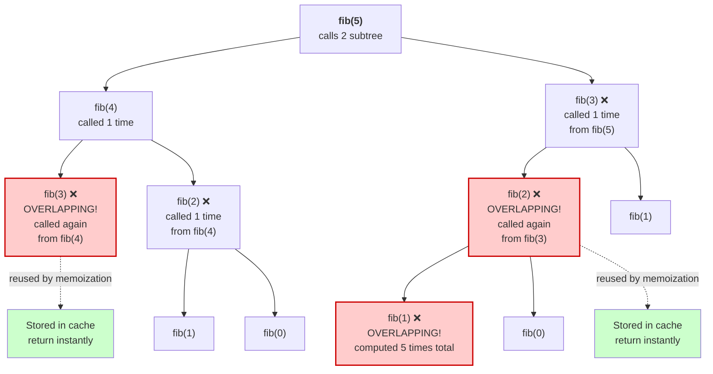

**See the overlaps?**
- `fib(3)` is computed **2 times**
- `fib(2)` is computed **3 times**
- `fib(1)` is computed **5 times**
- `fib(0)` is computed **3 times**

For `fib(50)`, the same subproblems repeat thousands of times! This is **exponential** work for no reason.

**With memoization:**

```python
def fib_memo(n):
    memo = {}
    
    def helper(k):
        if k in memo:
            return memo[k]  # Return cached result
        if k <= 1:
            return k
        result = helper(k - 1) + helper(k - 2)
        memo[k] = result
        return result
    
    return helper(n)

print(fib_memo(5))   # 5
print(fib_memo(50))  # instant (without memoization it takes seconds)
```

Now each subproblem is solved exactly **once**, and future calls return instantly from the cache.

**How to spot overlapping subproblems:**
- The recursion tree has repeated nodes (like `fib(2)` appearing multiple times)
- Removing memoization makes the code unbearably slow for moderately large inputs
- Subproblems are defined by a smaller set of parameters (e.g., just `n` in Fibonacci)

---

### 2️⃣ Optimal Substructure

A problem has **optimal substructure** if an optimal solution is built from optimal solutions to its subproblems. In other words, the best answer at each step doesn't depend on what could have been chosen earlier—only on which subproblem you're solving now.

#### Concrete Example: Climbing Stairs

**Problem:** You can climb 1 or 2 steps per move. How many distinct ways to reach step `n`?

**Example:** To reach step 5, you can:
- Come from step 4 (then take 1 step)
- Come from step 3 (then take 2 steps)

So the number of ways to reach step 5 equals:
$$\text{ways}(5) = \text{ways}(4) + \text{ways}(3)$$

This is **optimal substructure**: the best solution for `ways(5)` is built from the best solutions for `ways(4)` and `ways(3)`.

```python
def climb_stairs(n):
    memo = {}
    
    def dp(k):
        if k in memo:
            return memo[k]
        if k <= 2:
            return k
        result = dp(k - 1) + dp(k - 2)
        memo[k] = result
        return result
    
    return dp(n)

print(climb_stairs(5))   # 8
print(climb_stairs(10))  # 89
```

**Why this is optimal substructure:**
- To count all ways to reach step 5, we don't care which specific steps were taken before step 3 or 4
- We only need: "How many ways to reach step 4?" and "How many ways to reach step 3?"
- The answer combines these two independent, optimal solutions

**How to spot optimal substructure:**
- The problem asks for "maximum," "minimum," or "count of ways"
- You can express the solution in terms of smaller versions of the same problem
- The choice you make now doesn't affect the optimality of choices in subproblems
- Test: Can you write `dp[i]` as a function of `dp[i-1]`, `dp[i-2]`, etc.?

**Mermaid: Building Optimal Solutions Bottom-Up**

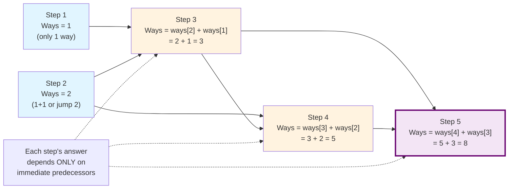

---

## Visual: Recognizing the Two Properties

### Overlapping Subproblems: Same leaves, different paths

```
            F(5)
           /    \
        F(4)    F(3)  ← F(3) computed here
       /   \    /  \
    F(3)  F(2) F(2) F(1)
     ↑      
  F(3) also computed here

Overlapping subproblems = redundancy in the call tree
Memoization = save and reuse the results
```

### Optimal Substructure: Best answer from best subproblems

```
Ways to climb step 5 = Ways to climb step 4 + Ways to climb step 3

If step 4 has 5 best ways and step 3 has 3 best ways,
then step 5 has 8 best ways total.

The answer for step 5 is determined by the answers for steps 4 and 3.
This is a pure combination, not a competition.
```

---

## Key Concepts

- **State definition**: What information uniquely identifies a subproblem?
- **Transition**: How do you compute the current state from previous states?
- **Base cases**: What are the smallest, simplest inputs?
- **Iteration order**: In what sequence must you compute states to ensure dependencies are already available?
- **Memoization (top-down)**: Recursion + cache. Compute on-demand.
- **Tabulation (bottom-up)**: Build a table. Compute all states in order.

## Common Patterns

| Pattern | Key Idea | Overlapping? | Optimal Substructure? |
|---------|---------|--------------|----------------------|
| 1D DP | `dp[i]` depends on `dp[i-1]` or `dp[i-k]` | Yes | Yes |
| 0/1 Knapsack | Include or exclude each item | Yes | Yes |
| Unbounded Knapsack | Can use each item multiple times | Yes | Yes |
| LIS | `dp[i]` = longest increasing subsequence ending at i | Yes | Yes |
| Grid DP | `dp[i][j]` depends on neighbors | Yes | Yes |
| String DP | `dp[i][j]` for two string prefixes | Yes | Yes |
| State Machine | States represent phases (buy/sell/cooldown) | Yes | Yes |

---

## How to Approach a DP Problem

**Step 1: Recognize overlapping subproblems**
- Ask: "Can I solve this recursively?"
- Write the naive recursive solution
- Observe: Are there repeated subproblems?
- If yes, DP can help

**Step 2: Identify optimal substructure**
- Ask: "Can the answer be built from answers to smaller problems?"
- Write: `dp[i] = f(dp[i-1], dp[i-2], ...)`
- If this works, optimal substructure exists

**Step 3: Define the state**
- Pick a concise definition. Example: "dp[i] = minimum cost to reach position i"
- This definition should make the transition obvious

**Step 4: Write the transition**
- For each state, list all choices and their outcomes
- Combine outcomes using `max`, `min`, or `+` (depending on the goal)

**Step 5: Identify base cases**
- What's the simplest input? (Often `dp[0]` or `dp[1]`)
- What's the answer for that input?

**Step 6: Choose top-down or bottom-up**
- **Top-down (memoization):** Recursion + dictionary cache. Intuitive, debug-friendly.
- **Bottom-up (tabulation):** Iterative loop, array/list. More efficient, harder to write initially.

---

## A Different Way to Think About Hard DP Problems

If formulas feel abstract, switch to a "story of choices" approach.

### The 4-Question DP Lens

1. **What is the decision at position `i`?**
    - Usually binary: take/skip, buy/sell, cut/not-cut, match/skip.

2. **What history do I actually need?**
    - Many problems only need one or two previous states.
    - If only the previous two states matter, you can often do `O(1)` space.

3. **Write one sentence before any formula.**
    - Example (House Robber):
      "At house `i`, either rob it and add best up to `i-2`, or skip it and keep best up to `i-1`."

4. **Run a tiny decision table (size 4 to 6).**
    - Fill columns: index, choice A, choice B, winner.
    - If the table is clear, the code is usually straightforward.

### House Robber Mental Model: "Take" vs "Skip"

Instead of memorizing `dp[i]`, track two running meanings:

- `take`: best money if current house **is robbed**
- `skip`: best money if current house **is not robbed**

When you see value `x`:

- New `take` = old `skip + x` (must skip previous)
- New `skip` = `max(old_take, old_skip)` (choose best previous)

This is the same DP, but often easier to reason about than an array.

---

## Practice by Pattern (Especially for House Robber-Type Questions)

If House Robber feels tricky, practice in this exact order.

### Pattern 1: Adjacent Constraint / Take-Skip DP

Core idea: if you take `i`, you must skip something nearby.

1. House Robber
2. House Robber II (circular houses)
3. House Robber III (tree version)
4. Delete and Earn
5. Maximum Sum of Non-Adjacent Elements
6. Pizza With 3n Slices

### Pattern 2: Same Skeleton, Different Story

These are not "rob houses" but the recurrence feels similar.

1. Min Cost Climbing Stairs
2. Paint House
3. Paint Fence
4. Best Time to Buy and Sell Stock with Cooldown
5. Best Time to Buy and Sell Stock with Transaction Fee

### Pattern 3: Include/Exclude Item Decisions (Knapsack Family)

1. Partition Equal Subset Sum
2. Target Sum
3. 0/1 Knapsack
4. Last Stone Weight II
5. Ones and Zeroes

### Pattern 4: Prefix Cut Decisions (Word/String)

1. Word Break
2. Decode Ways
3. Palindrome Partitioning II
4. Extra Characters in a String

### Fast Pattern Check During Interviews

Ask:

1. "Is this take/skip over a sequence?" -> think House Robber style.
2. "Do I choose include/exclude for each item?" -> think Knapsack.
3. "Do I split by prefix or cut position?" -> think Word Break / partition DP.
4. "Do I compare two strings or intervals?" -> think 2D DP.

---

## Examples: Simple to Complex

### Example 1: Fibonacci (Simplest DP)

**Properties:**
- Overlapping subproblems: Yes (fib(2) computed many times)
- Optimal substructure: Yes (fib(n) = fib(n-1) + fib(n-2))

**State:** `dp[i]` = the ith Fibonacci number

**Transition:** `dp[i] = dp[i-1] + dp[i-2]`

**Base cases:** `dp[0] = 0`, `dp[1] = 1`

**Small Input/Output:**
- Input: `n = 5`
- Output: `5`

**No-code walkthrough:**
- `dp[0]=0`, `dp[1]=1`
- `dp[2]=1`, `dp[3]=2`, `dp[4]=3`, `dp[5]=5`

**Brute force first (recursive baseline):**

```python
def fibonacci_bruteforce(n):
    if n <= 1:
        return n
    return fibonacci_bruteforce(n - 1) + fibonacci_bruteforce(n - 2)
```

**Memoization + tabulation:**

```python
def fibonacci(n):
    memo = {}
    
    def helper(k):
        if k in memo:
            return memo[k]
        if k == 0:
            return 0
        if k == 1:
            return 1
        result = helper(k - 1) + helper(k - 2)
        memo[k] = result
        return result
    
    return helper(n)

# Bottom-up (tabulation) version
def fibonacci_tabulation(n):
    if n <= 1:
        return n
    dp = [0] * (n + 1)
    dp[1] = 1
    for i in range(2, n + 1):
        dp[i] = dp[i - 1] + dp[i - 2]
    return dp[n]

print(fibonacci(10))  # 55
print(fibonacci_tabulation(10))  # 55
print(fibonacci(0))   # 0  — base case: fib(0) is defined as 0
print(fibonacci(1))   # 1  — base case: fib(1) is defined as 1
print(fibonacci(20))  # 6765 — larger n; memoization makes this instant
```

**Complexity:**
- Brute force: Time `O(2^n)`, Space `O(n)`
- DP (memo/tabulation): Time `O(n)`, Space `O(n)`

**Quick Quiz:**
1. What does `dp[i]` mean here?
2. Why do Fibonacci calls have overlapping subproblems?
3. What are the two base cases you must get right first?

---

### Example 2: Coin Change (Unbounded Knapsack)

**Problem:** Given coins of different denominations and an amount, find the **minimum number of coins** needed.

**Example:** `coins = [1, 2, 5]`, `amount = 5` → Use one 5-coin or one 2-coin + three 1-coins → Answer: 1

**Properties:**
- Overlapping subproblems: Yes (same amount computed via different coin paths)
- Optimal substructure: Yes (best way to make amount `i` uses best way to make `i - coin`)

**State:** `dp[i]` = minimum coins needed to make amount `i`

**Transition:** For each coin, try using it: `dp[i] = min(dp[i - coin] + 1)` for all coins where `coin <= i`

**Base case:** `dp[0] = 0` (zero coins needed for amount 0)

**Small Input/Output:**
- Input: `coins = [1, 3, 4]`, `amount = 6`
- Output: `2`

**No-code walkthrough:**
- `dp[0]=0`
- `dp[3]=1` using coin 3
- `dp[6]=2` from `dp[3] + 1` (3 + 3)

**Brute force first (recursive baseline):**

```python
def coin_change_bruteforce(coins, amount):
    if amount == 0:
        return 0
    if amount < 0:
        return float("inf")
    return min(1 + coin_change_bruteforce(coins, amount - c) for c in coins)
```

**Memoization + tabulation:**

```python
def coin_change(coins, amount):
    memo = {}
    
    def helper(remaining):
        if remaining in memo:
            return memo[remaining]
        if remaining == 0:
            return 0
        if remaining < 0:
            return float('inf')  # Impossible
        
        min_coins = float('inf')
        for coin in coins:
            result = helper(remaining - coin)
            if result != float('inf'):
                min_coins = min(min_coins, result + 1)
        
        memo[remaining] = min_coins
        return min_coins
    
    result = helper(amount)
    return result if result != float('inf') else -1

# Bottom-up version
def coin_change_tabulation(coins, amount):
    dp = [float('inf')] * (amount + 1)
    dp[0] = 0
    
    for i in range(1, amount + 1):
        for coin in coins:
            if coin <= i:
                dp[i] = min(dp[i], dp[i - coin] + 1)
    
    return dp[amount] if dp[amount] != float('inf') else -1

print(coin_change([1, 2, 5], 5))  # 1
print(coin_change([2], 3))  # -1 (impossible)
print(coin_change([10], 10))  # 1
# Greedy trap: greedy picks 9 first → 9+1+1 = 3 coins, but DP finds 5+6 = 2 coins
print(coin_change([1, 5, 6, 9], 11))  # 2  — optimal is 5+6, not greedy 9+1+1
# No combination of 3 or 7 can sum to 5
print(coin_change([3, 7], 5))  # -1  — impossible; 3+3=6>5, 7>5
```

**Complexity:**
- Brute force: Time `O(k^amount)` where `k = len(coins)`, Space `O(amount)`
- DP (memo/tabulation): Time `O(k * amount)`, Space `O(amount)`

**Quick Quiz:**
1. What state would you define for amount-based DP in this problem?
2. Why is this not a safe greedy problem for arbitrary coin systems?
3. What should the answer be when `amount = 0`?

**Overlapping subproblems visualization:**

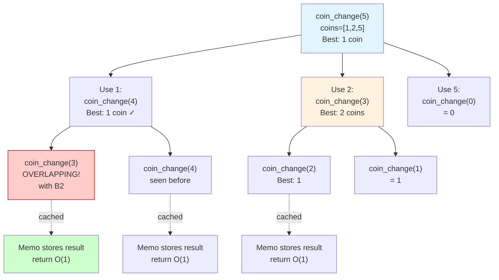

---

### Example 3: House Robber (1D DP with State Transition)

**Problem:** You can't rob adjacent houses. Maximize money stolen from `n` houses.

**Example:** `[1, 3, 1, 3, 100]` (indices 0–4) → Rob index 4 (value 100) + index 1 (value 3) = 103. You can't rob index 3 and 4 together because they're adjacent. → Answer: 103

**Properties:**
- Overlapping subproblems: Yes (same subarray considered multiple times)
- Optimal substructure: Yes (best for `n` houses = best of rob-nth-house + optimal-for-n-2-houses OR skip-nth + optimal-for-n-1-houses)

**State:** `dp[i]` = maximum money robbing up to house `i`

**Transition:** For each house `i`, either:
- Rob it: take `nums[i] + dp[i-2]` (can't rob i-1)
- Skip it: take `dp[i-1]`
- Choose the maximum: `dp[i] = max(nums[i] + dp[i-2], dp[i-1])`

**Base cases:** `dp[0] = nums[0]`, `dp[1] = max(nums[0], nums[1])`

**Small Input/Output:**
- Input: `nums = [2, 7, 9, 3, 1]`
- Output: `12`

**No-code walkthrough:**
- House 0: best is 2
- House 1: best is 7
- House 2: best is `max(9+2, 7)=11`
- House 3: best is `max(3+7, 11)=11`
- House 4: best is `max(1+11, 11)=12`

**Brute force first (recursive baseline):**

```python
def rob_bruteforce(nums, i):
    if i < 0:
        return 0
    return max(nums[i] + rob_bruteforce(nums, i - 2), rob_bruteforce(nums, i - 1))
```

**Decision Tree: Rob or Skip**

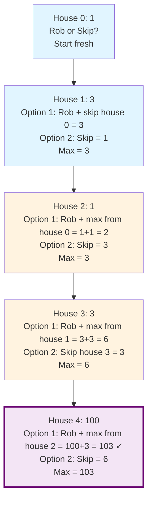

**Memoization + tabulation:**

```python
def rob(nums):
    memo = {}
    
    def helper(index):
        if index in memo:
            return memo[index]
        if index < 0:
            return 0
        if index == 0:
            return nums[0]
        
        # Choice 1: Rob this house + best from 2 houses back
        # Choice 2: Skip this house + best from 1 house back
        result = max(nums[index] + helper(index - 2), helper(index - 1))
        memo[index] = result
        return result
    
    return helper(len(nums) - 1)

# Bottom-up version
def rob_tabulation(nums):
    if len(nums) == 0:
        return 0
    if len(nums) == 1:
        return nums[0]
    
    dp = [0] * len(nums)
    dp[0] = nums[0]
    dp[1] = max(nums[0], nums[1])
    
    for i in range(2, len(nums)):
        dp[i] = max(nums[i] + dp[i - 2], dp[i - 1])
    
    return dp[-1]

print(rob([1, 3, 1, 3, 100]))  # 103
print(rob([2, 7, 9, 3, 1]))  # 12

# Edge case: only one house — must rob it
print(rob([42]))  # 42
# Non-obvious: rob indices 0 and 3 → 5+5=10; indices 1 and 3 → 1+5=6
print(rob([5, 1, 1, 5]))  # 10  — dp trace: [5,5,6,10]

# O(1) space using the take/skip mental model
def rob_take_skip(nums):
    take, skip = 0, 0

    for money in nums:
        new_take = skip + money
        new_skip = max(take, skip)
        take, skip = new_take, new_skip

    return max(take, skip)

print(rob_take_skip([1, 3, 1, 3, 100]))  # 103
print(rob_take_skip([2, 7, 9, 3, 1]))  # 12
print(rob_take_skip([42]))              # 42  — single house
print(rob_take_skip([5, 1, 1, 5]))      # 10
```

**Complexity:**
- Brute force: Time `O(2^n)`, Space `O(n)`
- DP (memo/tabulation): Time `O(n)`, Space `O(n)` (or `O(1)` optimized)

**Quick Quiz:**
1. What are the two choices at house `i`?
2. Why does robbing house `i` force you to use the best answer from `i - 2`?
3. What should the answer be for a one-house input?

---

### Example 4: Longest Increasing Subsequence (LIS)

**Problem:** Given an array, find the length of the **longest subsequence** (not necessarily contiguous) where elements are in increasing order.

**Example:** `[10, 9, 2, 5, 3, 7, 101, 18]` → LIS is `[2, 3, 7, 101]` or `[2, 3, 7, 18]` → Length: 4

**Properties:**
- Overlapping subproblems: Yes (same suffix considered from multiple indices)
- Optimal substructure: Yes (best LIS ending at index `i` comes from best LIS ending at some `j < i` where `nums[j] < nums[i]`)

**State:** `dp[i]` = length of longest increasing subsequence ending at index `i`

**Transition:** For each index `i`, check all previous indices `j < i`. If `nums[j] < nums[i]`, we can extend the LIS at `j`:
$$dp[i] = \max(dp[j] + 1) \text{ for all } j < i \text{ where } nums[j] < nums[i]$$

**Base case:** `dp[i] = 1` (any single element is an LIS of length 1)

**Small Input/Output:**
- Input: `nums = [0, 1, 0, 3, 2, 3]`
- Output: `4`

**No-code walkthrough:**
- Start `dp = [1,1,1,1,1,1]`
- At value 1, extend from 0 -> length 2
- At value 3 (index 3), best length becomes 3
- At last value 3 (index 5), extend from value 2 (index 4, dp=3) -> dp[5]=4

**Brute force first (recursive baseline):**

```python
def lis_bruteforce(nums, i, prev):
    if i == len(nums):
        return 0
    skip = lis_bruteforce(nums, i + 1, prev)
    take = 1 + lis_bruteforce(nums, i + 1, nums[i]) if nums[i] > prev else 0
    return max(skip, take)
```

**Memoization + tabulation:**

```python
def longest_increasing_subsequence(nums):
    if len(nums) == 0:
        return 0
    
    n = len(nums)
    dp = [1] * n  # Every element is an LIS of length 1
    
    for i in range(1, n):
        for j in range(i):
            if nums[j] < nums[i]:
                dp[i] = max(dp[i], dp[j] + 1)
    
    return max(dp)

# Memoization version (less common for this problem, but possible)
def lis_memo(nums):
    memo = {}
    
    def helper(index, prev):
        # index: current position
        # prev: the value of the previous element in LIS
        if (index, prev) in memo:
            return memo[(index, prev)]
        if index == len(nums):
            return 0
        
        # Skip current element
        skip = helper(index + 1, prev)
        
        # Include current element (if it's larger than prev)
        include = 0
        if nums[index] > prev:
            include = 1 + helper(index + 1, nums[index])
        
        result = max(skip, include)
        memo[(index, prev)] = result
        return result
    
    return helper(0, -float('inf'))

print(longest_increasing_subsequence([10, 9, 2, 5, 3, 7, 101, 18]))  # 4
print(longest_increasing_subsequence([0, 1, 0, 4, 4, 4, 3, 5, 9]))  # 5
# Already sorted ascending — every element extends the LIS, length = n
print(longest_increasing_subsequence([1, 2, 3, 4, 5]))  # 5
# Strictly decreasing — no element can follow another, every dp[i]=1
print(longest_increasing_subsequence([5, 4, 3, 2, 1]))  # 1
```

**Complexity:**
- Brute force: Time `O(2^n)`, Space `O(n)`
- DP: Time `O(n^2)` (or `O(n log n)` optimized), Space `O(n)`

**Quick Quiz:**
1. What does `dp[i]` mean in the `O(n^2)` LIS solution?
2. Why do you only transition from indices `j < i` with `nums[j] < nums[i]`?
3. What should the answer be for a strictly decreasing array?

---

### Example 5: 0/1 Knapsack (Multiple Items with Weight/Value)

**Problem:** Given items with weight and value, and a knapsack capacity, maximize value without exceeding capacity.

**Example:** 
- Items: `[(weight=2, value=3), (weight=3, value=4), (weight=4, value=5)]`
- Capacity: 5
- Best: Take items 1 and 2 (weight 5, value 7)

**Properties:**
- Overlapping subproblems: Yes (same (item, remaining_capacity) considered multiple times)
- Optimal substructure: Yes (best for item `i` with capacity `c` comes from best subproblems)

**State:** `dp[i][c]` = maximum value using items 0..i-1 with capacity `c`

**Transition:** For each item `i` and capacity `c`:
- Skip item: `dp[i][c]` = `dp[i-1][c]`
- Take item (if weight fits): `dp[i][c]` = `value[i-1] + dp[i-1][c - weight[i-1]]`
- Choose the max: `dp[i][c] = max(skip, take)`

**Small Input/Output:**
- Input: `weights=[2,3,4]`, `values=[3,4,5]`, `capacity=5`
- Output: `7`

**No-code walkthrough:**
- Capacity 5 can take item 3 only (value 5)
- Or item 2 + item 3? Not possible because 3+4 > 5
- Best valid combo is weight 2 + 3 with value `3 + 4 = 7`

**Brute force first (recursive baseline):**

```python
def knapsack_bruteforce(weights, values, i, cap):
    if i == len(weights) or cap == 0:
        return 0
    skip = knapsack_bruteforce(weights, values, i + 1, cap)
    take = values[i] + knapsack_bruteforce(weights, values, i + 1, cap - weights[i]) if weights[i] <= cap else 0
    return max(skip, take)
```

**Mermaid: 2D DP Table Filling Pattern (0/1 Knapsack)**

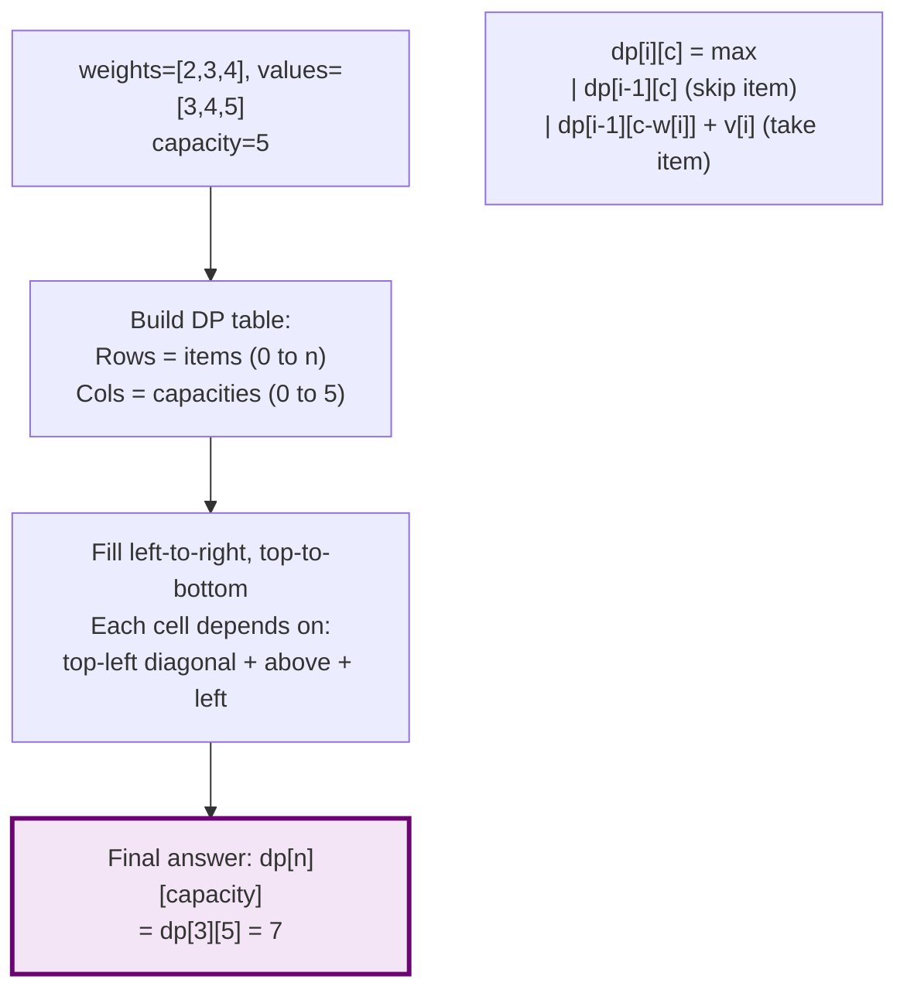

**Memoization + tabulation:**

```python
def knapsack_0_1(weights, values, capacity):
    memo = {}
    
    def helper(index, remaining):
        # index: which item to consider next
        # remaining: remaining capacity
        if (index, remaining) in memo:
            return memo[(index, remaining)]
        if index == len(weights) or remaining == 0:
            return 0
        
        # Skip this item
        skip = helper(index + 1, remaining)
        
        # Take this item (if it fits)
        take = 0
        if weights[index] <= remaining:
            take = values[index] + helper(index + 1, remaining - weights[index])
        
        result = max(skip, take)
        memo[(index, remaining)] = result
        return result
    
    return helper(0, capacity)

# Bottom-up version
def knapsack_0_1_tabulation(weights, values, capacity):
    n = len(weights)
    dp = [[0] * (capacity + 1) for _ in range(n + 1)]
    
    for i in range(1, n + 1):
        for c in range(capacity + 1):
            # Skip item i-1
            dp[i][c] = dp[i - 1][c]
            # Take item i-1 if it fits
            if weights[i - 1] <= c:
                dp[i][c] = max(dp[i][c], values[i - 1] + dp[i - 1][c - weights[i - 1]])
    
    return dp[n][capacity]

weights = [2, 3, 4]
values = [3, 4, 5]
capacity = 5
print(knapsack_0_1(weights, values, capacity))  # 7
print(knapsack_0_1_tabulation(weights, values, capacity))  # 7

# More items, larger capacity — best combo is w=3+w=4 → value 4+5=9
print(knapsack_0_1([1, 3, 4, 5], [1, 4, 5, 7], 7))  # 9
# All items too heavy — nothing fits the capacity
print(knapsack_0_1([10, 20], [100, 200], 5))  # 0  — capacity 5 cannot hold w=10 or w=20
```

**Complexity:**
- Brute force: Time `O(2^n)`, Space `O(n)`
- DP (memo/tabulation): Time `O(n * capacity)`, Space `O(n * capacity)`

**Quick Quiz:**
1. What two parameters uniquely identify a knapsack subproblem?
2. What is the difference between the skip and take transitions?
3. Why do reverse-capacity loops matter in 0/1-style formulations?

---

### Example 6: Edit Distance (String DP)

**Problem:** Minimum number of operations (insert, delete, replace) to convert string `s` to string `t`.

**Example:** `s = "horse"`, `t = "ros"` → "horse" → "orse" (delete h) → "rse" (delete o) → "ros" (replace e with s) → Answer: 3

**Properties:**
- Overlapping subproblems: Yes (same (i, j) pair considered multiple times)
- Optimal substructure: Yes (best for matching `s[0..i]` with `t[0..j]` comes from solutions to smaller substrings)

**State:** `dp[i][j]` = minimum edits to convert `s[0..i]` to `t[0..j]`

**Transition:** For each (i, j):
- If `s[i] == t[j]`: `dp[i][j] = dp[i-1][j-1]` (no edit needed)
- Else, try three operations:
  - Replace: `dp[i][j] = 1 + dp[i-1][j-1]`
  - Delete: `dp[i][j] = 1 + dp[i-1][j]`
  - Insert: `dp[i][j] = 1 + dp[i][j-1]`
  - Take the minimum

**Small Input/Output:**
- Input: `s = "horse"`, `t = "ros"`
- Output: `3`

**No-code walkthrough:**
- Replace `h` with `r`: `horse -> rorse`
- Delete extra `r`: `rorse -> rose`
- Delete `e`: `rose -> ros`

**Brute force first (recursive baseline):**

```python
def edit_distance_bruteforce(s, t, i, j):
    if i == 0:
        return j
    if j == 0:
        return i
    if s[i - 1] == t[j - 1]:
        return edit_distance_bruteforce(s, t, i - 1, j - 1)
    return 1 + min(
        edit_distance_bruteforce(s, t, i - 1, j - 1),
        edit_distance_bruteforce(s, t, i - 1, j),
        edit_distance_bruteforce(s, t, i, j - 1),
    )
```

**Memoization + tabulation:**

```python
def edit_distance(s, t):
    memo = {}
    
    def helper(i, j):
        # Convert s[0..i-1] to t[0..j-1]
        if (i, j) in memo:
            return memo[(i, j)]
        
        if i == 0:
            return j  # Insert j characters
        if j == 0:
            return i  # Delete i characters
        
        if s[i - 1] == t[j - 1]:
            result = helper(i - 1, j - 1)  # No edit needed
        else:
            replace = helper(i - 1, j - 1) + 1
            delete = helper(i - 1, j) + 1
            insert = helper(i, j - 1) + 1
            result = min(replace, delete, insert)
        
        memo[(i, j)] = result
        return result
    
    return helper(len(s), len(t))

# Bottom-up version
def edit_distance_tabulation(s, t):
    m, n = len(s), len(t)
    dp = [[0] * (n + 1) for _ in range(m + 1)]
    
    for i in range(m + 1):
        dp[i][0] = i
    for j in range(n + 1):
        dp[0][j] = j
    
    for i in range(1, m + 1):
        for j in range(1, n + 1):
            if s[i - 1] == t[j - 1]:
                dp[i][j] = dp[i - 1][j - 1]
            else:
                dp[i][j] = 1 + min(dp[i - 1][j - 1], dp[i - 1][j], dp[i][j - 1])
    
    return dp[m][n]

print(edit_distance("horse", "ros"))  # 3
print(edit_distance("intention", "execution"))  # 5
# Identical strings — zero edits needed, dp follows the diagonal every step
print(edit_distance("abc", "abc"))  # 0
# One string empty — must delete (or insert) every character one by one
print(edit_distance("abc", ""))    # 3  — delete a, b, c
print(edit_distance("", "xyz"))    # 3  — insert x, y, z
```

**Complexity:**
- Brute force: Time approximately `O(3^(m+n))`, Space `O(m+n)`
- DP: Time `O(m * n)`, Space `O(m * n)`

**Quick Quiz:**
1. What does `dp[i][j]` represent here?
2. What are the three operations considered when characters do not match?
3. What should the answer be if one string is empty?

---

## More Examples with Mermaid Diagrams

### Example 7: Min Cost Climbing Stairs (Simple 1D with Choices)

**Problem:** You can climb 1 or 2 steps. Each step has a cost. Find minimum cost to reach the top.

**Example:** `cost = [10, 15, 20]` → Start at index 0 or 1, so minimum is 15 (start at 1) or 10 + 15 = 25 (start at 0) → Answer: 15

**State:** `dp[i]` = minimum cost to reach step `i`

**Transition:** You can arrive at step `i` from step `i-1` or `i-2`:
$$dp[i] = \min(dp[i-1], dp[i-2]) + cost[i]$$

**Mermaid: Overlapping Subproblems Visualization**

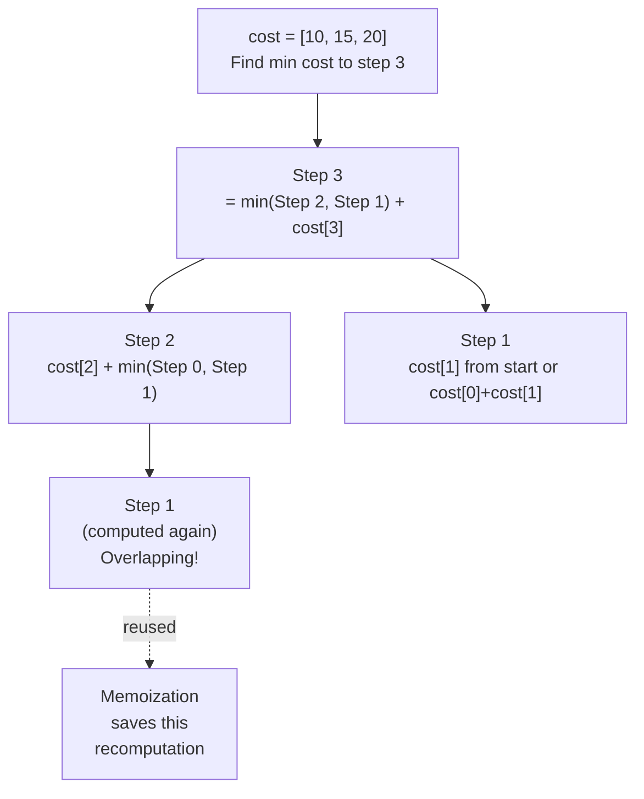

**Small Input/Output:**
- Input: `cost = [10, 15, 20]`
- Output: `15`

**No-code walkthrough:**
- `dp[0]=10`, `dp[1]=15`
- `dp[2]=20 + min(10,15)=30`
- answer is `min(dp[1], dp[2]) = 15`

**Brute force first (recursive baseline):**

```python
def min_cost_bruteforce(cost, i):
    if i <= 1:
        return cost[i]
    return cost[i] + min(min_cost_bruteforce(cost, i - 1), min_cost_bruteforce(cost, i - 2))
```

**Memoization + tabulation:**

```python
def min_cost_climbing_stairs(cost):
    memo = {}
    
    def helper(i):
        if i in memo:
            return memo[i]
        if i <= 1:
            return cost[i]
        
        result = cost[i] + min(helper(i - 1), helper(i - 2))
        memo[i] = result
        return result
    
    # Can start at step 0 or 1 (no extra cost to jump past the last step)
    return min(helper(len(cost) - 1), helper(len(cost) - 2)) if len(cost) > 1 else cost[0]

# Better: start from either step 0 or 1
def min_cost_climbing_stairs_v2(cost):
    if len(cost) <= 2:
        return min(cost)
    
    dp = [0] * len(cost)
    dp[0] = cost[0]
    dp[1] = cost[1]
    
    for i in range(2, len(cost)):
        dp[i] = cost[i] + min(dp[i - 1], dp[i - 2])
    
    # Last step or second-to-last step (no extra cost to jump past the array)
    return min(dp[-1], dp[-2])

print(min_cost_climbing_stairs([10, 15, 20]))  # 15
print(min_cost_climbing_stairs([1, 100, 1, 1, 1, 100, 1, 1, 100, 1]))  # 6
# All costs zero — the top is free regardless of path taken
print(min_cost_climbing_stairs([0, 0, 0]))  # 0
# Ascending costs — optimal path skips the expensive steps using 2-step jumps
# dp trace: [1,2,4,6,9], answer = min(dp[4], dp[3]) = min(9, 6) = 6
print(min_cost_climbing_stairs([1, 2, 3, 4, 5]))  # 6
```

**Complexity:**
- Brute force: Time `O(2^n)`, Space `O(n)`
- DP: Time `O(n)`, Space `O(n)` (or `O(1)` optimized)

**Quick Quiz:**
1. What choice is being made at each stair index?
2. Why is the final answer `min(dp[-1], dp[-2])` in the tabulation version?
3. What should happen if all step costs are zero?

---

### Example 8: Unique Paths (2D Grid DP)

**Problem:** Robot at top-left, needs to reach bottom-right. Can only move right or down. How many paths?

**Example:** 3×3 grid → 6 unique paths to bottom-right

**State:** `dp[i][j]` = number of ways to reach cell `(i, j)`

**Transition:** You can arrive at `(i, j)` from top `(i-1, j)` or left `(i, j-1)`:
$$dp[i][j] = dp[i-1][j] + dp[i][j-1]$$

**Base case:** `dp[0][0] = 1`, all cells in first row = 1, all cells in first column = 1

**Mermaid: Optimal Substructure in 2D**

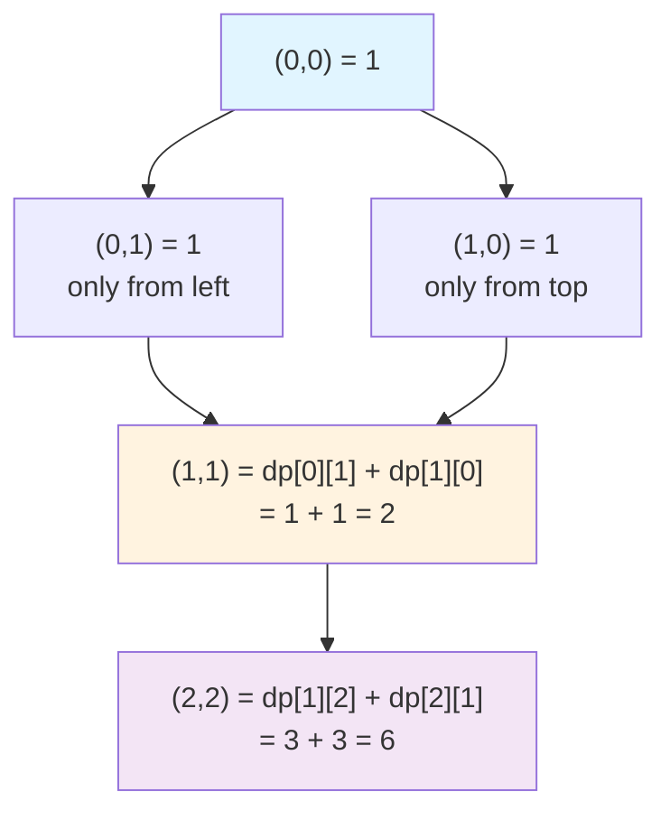

**Small Input/Output:**
- Input: `m = 3`, `n = 3`
- Output: `6`

**No-code walkthrough:**
- First row and first column are all 1
- Each inner cell is top + left
- Final bottom-right cell becomes 6

**Brute force first (recursive baseline):**

```python
def unique_paths_bruteforce(i, j):
    if i == 0 or j == 0:
        return 1
    return unique_paths_bruteforce(i - 1, j) + unique_paths_bruteforce(i, j - 1)
```

**Memoization + tabulation:**

```python
def unique_paths(m, n):
    memo = {}
    
    def helper(i, j):
        if (i, j) in memo:
            return memo[(i, j)]
        if i == 0 or j == 0:
            return 1
        
        result = helper(i - 1, j) + helper(i, j - 1)
        memo[(i, j)] = result
        return result
    
    return helper(m - 1, n - 1)

# Bottom-up
def unique_paths_tabulation(m, n):
    dp = [[1] * n for _ in range(m)]
    
    for i in range(1, m):
        for j in range(1, n):
            dp[i][j] = dp[i - 1][j] + dp[i][j - 1]
    
    return dp[m - 1][n - 1]

print(unique_paths(3, 3))  # 6
print(unique_paths(3, 7))  # 28
print(unique_paths(1, 1))  # 1
# Single-row grid: robot can only go right, exactly 1 path always
print(unique_paths(1, 5))  # 1  — forced rightward the whole way
# 2-row, 3-col grid: fills as [[1,1,1],[1,2,3]], bottom-right = 3
print(unique_paths(2, 3))  # 3
```

**Complexity:**
- Brute force: Time approximately `O(2^(m+n))`, Space `O(m+n)`
- DP: Time `O(m * n)`, Space `O(m * n)` (or `O(n)` optimized)

**Quick Quiz:**
1. What does each grid cell `dp[i][j]` store?
2. Why are the first row and first column all 1?
3. What is the answer for a `1 x n` grid?

---

### Example 9: Paint House (State Decision DP)

**Problem:** Paint `n` houses with 3 colors (0: red, 1: green, 2: blue). Adjacent houses can't have same color. Minimize total cost.

**Example:** 
```
House 0 costs: [1, 0, 0] (color 0, 1, 2)
House 1 costs: [0, 3, 1]
House 2 costs: [1, 1, 1]
```
Best: House 0 → green (cost 0), House 1 → red (cost 0, can't reuse green), House 2 → green or blue (can't reuse red, cost 1) → Total: 0 + 0 + 1 = Answer: 1

**State:** `dp[i][j]` = minimum cost to paint houses 0..i with house i painted in color j

**Transition:** House `i` with color `j` costs `houses[i][j]` + best for house `i-1` with different color:
$$dp[i][j] = houses[i][j] + \min(dp[i-1][k]) \text{ for all } k \neq j$$

**Small Input/Output:**
- Input: `costs = [[17,2,17],[16,16,5],[14,3,19]]`
- Output: `10`

**No-code walkthrough:**
- Pick green for house 0 (2)
- Then blue for house 1 (5), subtotal 7
- Then green for house 2 (3), total 10

**Brute force first (recursive baseline):**

```python
def paint_house_bruteforce(costs, house, prev_color):
    if house == len(costs):
        return 0
    ans = float("inf")
    for color in range(3):
        if color != prev_color:
            ans = min(ans, costs[house][color] + paint_house_bruteforce(costs, house + 1, color))
    return ans
```

**Memoization + tabulation:**

```python
def paint_house(costs):
    memo = {}
    
    def helper(house, prev_color):
        # Paint house 'house' where previous house used 'prev_color'
        if house == len(costs):
            return 0
        
        if (house, prev_color) in memo:
            return memo[(house, prev_color)]
        
        min_cost = float('inf')
        for color in range(3):
            if color != prev_color:
                cost = costs[house][color] + helper(house + 1, color)
                min_cost = min(min_cost, cost)
        
        memo[(house, prev_color)] = min_cost
        return min_cost
    
    return helper(0, -1)  # -1 means no previous house

# Bottom-up
def paint_house_tabulation(costs):
    if not costs:
        return 0
    
    n = len(costs)
    dp = [[0] * 3 for _ in range(n)]
    dp[0] = costs[0][:]
    
    for i in range(1, n):
        for j in range(3):
            # Paint house i with color j
            # Minimum of painting house i-1 with any other color
            dp[i][j] = costs[i][j] + min(dp[i - 1][k] for k in range(3) if k != j)
    
    return min(dp[n - 1])

costs = [[1, 0, 0], [0, 3, 1], [1, 1, 1]]
print(paint_house(costs))  # 1
print(paint_house_tabulation(costs))  # 1
# Single house — no adjacency constraint, just pick the cheapest color
print(paint_house([[5, 2, 8]]))  # 2  — minimum of [5, 2, 8]
# Two houses: H0=red(1)+H1=blue(1)=2 is the cheapest valid pair
print(paint_house([[1, 2, 3], [3, 2, 1]]))  # 2  — H0 red(1), H1 blue(1)
```

**Complexity:**
- Brute force: Time `O(3^n)`, Space `O(n)`
- DP: Time `O(n)` (for fixed 3 colors), Space `O(n)`

**Quick Quiz:**
1. What extra piece of information does the state need besides the house index?
2. Why must the transition exclude the previous color?
3. What should the answer be for a single house?

---

### Example 10: Longest Common Subsequence (2D String DP)

**Problem:** Find the longest sequence of characters that appear in both strings in the same order (not necessarily contiguous).

**Example:** `s1 = "ABCDGH"`, `s2 = "AEDFHR"` → LCS is "ADH" with length 3

**State:** `dp[i][j]` = length of LCS of `s1[0..i-1]` and `s2[0..j-1]`

**Transition:**
- If `s1[i-1] == s2[j-1]`: `dp[i][j] = dp[i-1][j-1] + 1` (extend LCS)
- Else: `dp[i][j] = max(dp[i-1][j], dp[i][j-1])` (skip from s1 or s2)

**Mermaid: Overlapping Subproblems and State Table**

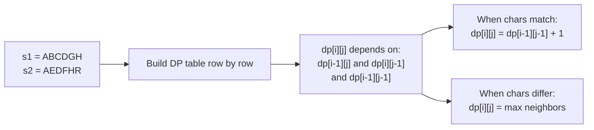

**Small Input/Output:**
- Input: `s1 = "abc"`, `s2 = "ac"`
- Output: `2`

**No-code walkthrough:**
- `a` matches `a` -> start with length 1
- skip `b` in first string
- `c` matches `c` -> length becomes 2

**Brute force first (recursive baseline):**

```python
def lcs_bruteforce(s1, s2, i, j):
    if i == 0 or j == 0:
        return 0
    if s1[i - 1] == s2[j - 1]:
        return 1 + lcs_bruteforce(s1, s2, i - 1, j - 1)
    return max(lcs_bruteforce(s1, s2, i - 1, j), lcs_bruteforce(s1, s2, i, j - 1))
```

**Memoization + tabulation:**

```python
def longest_common_subsequence(s1, s2):
    memo = {}
    
    def helper(i, j):
        # LCS length for s1[0..i-1] and s2[0..j-1]
        if (i, j) in memo:
            return memo[(i, j)]
        if i == 0 or j == 0:
            return 0
        
        if s1[i - 1] == s2[j - 1]:
            result = 1 + helper(i - 1, j - 1)
        else:
            result = max(helper(i - 1, j), helper(i, j - 1))
        
        memo[(i, j)] = result
        return result
    
    return helper(len(s1), len(s2))

# Bottom-up with full DP table
def lcs_tabulation(s1, s2):
    m, n = len(s1), len(s2)
    dp = [[0] * (n + 1) for _ in range(m + 1)]
    
    for i in range(1, m + 1):
        for j in range(1, n + 1):
            if s1[i - 1] == s2[j - 1]:
                dp[i][j] = 1 + dp[i - 1][j - 1]
            else:
                dp[i][j] = max(dp[i - 1][j], dp[i][j - 1])
    
    return dp[m][n]

print(longest_common_subsequence("ABCDGH", "AEDFHR"))  # 3
print(longest_common_subsequence("abc", "abc"))  # 3
print(longest_common_subsequence("abc", "def"))  # 0
# Classic case: LCS of "abcde" and "ace" is "ace", skipping b and d
print(longest_common_subsequence("abcde", "ace"))  # 3
# One empty string — no characters to match at all
print(longest_common_subsequence("", "xyz"))  # 0
```

**Complexity:**
- Brute force: Time `O(2^(m+n))`, Space `O(m+n)`
- DP: Time `O(m * n)`, Space `O(m * n)`

**Quick Quiz:**
1. What does `dp[i][j]` mean for LCS?
2. When characters differ, which two subproblems do you compare?
3. What should the answer be if the strings share no common characters?

---

### Example 11: Maximum Subarray Sum / Kadane's Algorithm variant of DP

**Problem:** Also solvable with 1D DP! Find the maximum sum of a contiguous subarray.

**Example:** `[-2, 1, -3, 4, -1, 2, 1, -5, 4]` → Subarray `[4, -1, 2, 1]` has max sum 6

**State:** `dp[i]` = maximum sum of subarray ending at index `i`

**Transition:** Either extend previous subarray or start fresh:
$$dp[i] = \max(nums[i], dp[i-1] + nums[i])$$

**Small Input/Output:**
- Input: `[-2, 1, -3, 4, -1, 2, 1, -5, 4]`
- Output: `6`

**No-code walkthrough:**
- Start fresh at 4
- Extend with `-1, +2, +1`
- Best contiguous sum reaches 6

**Brute force first (baseline):**

```python
def max_subarray_bruteforce(nums):
    best = -float("inf")
    for i in range(len(nums)):
        curr = 0
        for j in range(i, len(nums)):
            curr += nums[j]
            best = max(best, curr)
    return best
```

**Memoization + tabulation:**

```python
def max_subarray_sum(nums):
    memo = {}
    
    def helper(i):
        if i in memo:
            return memo[i]
        if i == 0:
            return nums[0]
        
        result = max(nums[i], helper(i - 1) + nums[i])
        memo[i] = result
        return result
    
    return max(helper(i) for i in range(len(nums)))

# Bottom-up (Kadane's algorithm)
def max_subarray_sum_tabulation(nums):
    max_ending_here = nums[0]
    max_so_far = nums[0]
    
    for i in range(1, len(nums)):
        max_ending_here = max(nums[i], max_ending_here + nums[i])
        max_so_far = max(max_so_far, max_ending_here)
    
    return max_so_far

print(max_subarray_sum([-2, 1, -3, 4, -1, 2, 1, -5, 4]))  # 6
print(max_subarray_sum([-1]))  # -1
# All positive — best subarray is the entire array: 5+4-1+7+8=23
print(max_subarray_sum([5, 4, -1, 7, 8]))  # 23
# All negative — must pick the single least negative element
print(max_subarray_sum([-3, -1, -4, -2]))  # -1  — best single element
```

**Complexity:**
- Brute force: Time `O(n^2)`, Space `O(1)`
- DP/Kadane: Time `O(n)`, Space `O(1)`

**Quick Quiz:**
1. What does the running state for Kadane's algorithm represent?
2. When do you start a new subarray instead of extending the old one?
3. What should the answer be when all numbers are negative?

---

### Example 12: Word Break (Unbounded DP with Memoization)

**Problem:** Given a string and a word dictionary, determine if the string can be segmented into dictionary words.

**Example:** `s = "leetcode"`, `wordDict = ["leet", "code"]` → "leet" + "code" = "leetcode" → True

**State:** `dp[i]` = whether `s[0..i-1]` can be segmented

**Transition:** For position `i`, check all previous positions `j < i`. If `s[j..i-1]` is in dictionary AND `dp[j]` is true:
$$dp[i] = \text{true if} \exists j: dp[j] \text{ is true AND } s[j:i] \in dict$$

**Mermaid: Overlapping Subproblems**

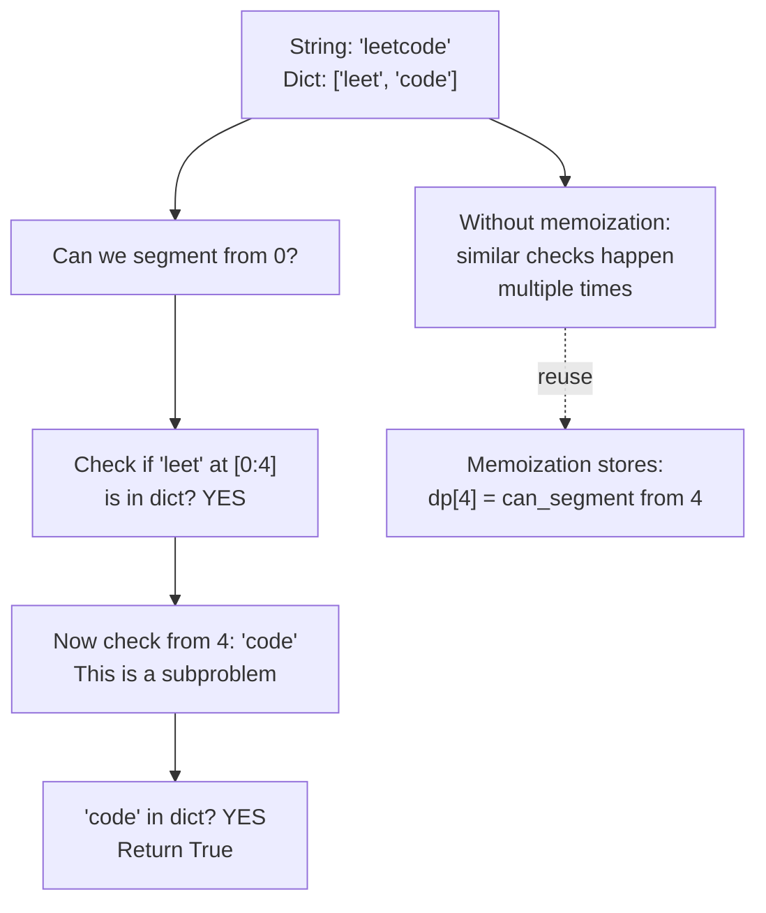

**Small Input/Output:**
- Input: `s = "leetcode"`, `wordDict = ["leet", "code"]`
- Output: `True`

**No-code walkthrough:**
- `dp[0] = True`
- `dp[4] = True` because `"leet"` exists and `dp[0]` is true
- `dp[8] = True` because `"code"` exists and `dp[4]` is true

**Brute force first (recursive baseline):**

```python
def word_break_bruteforce(s, words, start):
    if start == len(s):
        return True
    for end in range(start + 1, len(s) + 1):
        if s[start:end] in words and word_break_bruteforce(s, words, end):
            return True
    return False
```

**Memoization + tabulation:**

```python
def word_break(s, word_dict):
    memo = {}
    word_set = set(word_dict)
    
    def helper(start):
        if start in memo:
            return memo[start]
        if start == len(s):
            return True  # Reached the end
        
        for end in range(start + 1, len(s) + 1):
            word = s[start:end]
            if word in word_set and helper(end):
                memo[start] = True
                return True
        
        memo[start] = False
        return False
    
    return helper(0)

# Bottom-up
def word_break_tabulation(s, word_dict):
    word_set = set(word_dict)
    dp = [False] * (len(s) + 1)
    dp[0] = True  # Empty string is always segmentable
    
    for i in range(1, len(s) + 1):
        for j in range(i):
            if dp[j] and s[j:i] in word_set:
                dp[i] = True
                break
    
    return dp[len(s)]

print(word_break("leetcode", ["leet", "code"]))  # True
print(word_break("applepenapple", ["apple", "pen"]))  # True
print(word_break("catsanddogs", ["cat", "cats", "and", "sand", "dog"]))  # False
# Two-word segmentation: "ca" + "rs" covers the full string
print(word_break("cars", ["car", "ca", "rs"]))  # True
# "hell" matches the prefix but "o" alone is not in the dictionary
print(word_break("hello", ["hell", "world"]))  # False
```

**Complexity:**
- Brute force: Time approximately `O(2^n)`, Space `O(n)`
- DP: Time `O(n^2)`, Space `O(n)`

**Quick Quiz:**
1. What does `dp[i]` mean for segmentation problems?
2. What condition makes a cut position `j` valid?
3. Why is `dp[0] = True` the right base case?

---

### Example 13: Number of Distinct Subsequences (Pattern: Counting DP)

**Problem:** Count total number of distinct subsequences of a string.

**Example:** `s = "ab"` → Subsequences: `""`, `"a"`, `"b"`, `"ab"` → Count: 4

**State:** `dp[i]` = number of distinct subsequences in `s[0..i-1]`

**Transition:**
- For each character `s[i-1]`, we can either include it or exclude it
- Include it: double the count (add it to all previous subsequences): `2 * dp[i-1]`
- But if `s[i-1]` appeared before at index `j`, we've already counted these: subtract `dp[j]`
$$dp[i] = 2 \cdot dp[i-1] - (dp[lastSeen[char]-1] \text{ if char seen else } 0)$$

**Small Input/Output:**
- Input: `s = "ab"`
- Output: `4`

**No-code walkthrough:**
- Start with empty subsequence count 1
- After `a`, count doubles to 2
- After `b`, count doubles to 4

**Brute force first (baseline):**

```python
def count_all_subseq_bruteforce(s, i):
    if i == len(s):
        return 1
    # Include s[i] or exclude s[i]
    return count_all_subseq_bruteforce(s, i + 1) + count_all_subseq_bruteforce(s, i + 1)
```

**Tabulation (optimized counting DP):**

```python
def num_distinct_subsequences(s):
    n = len(s)
    dp = [0] * (n + 1)
    dp[0] = 1  # Empty subsequence
    last_seen = {}
    
    for i in range(1, n + 1):
        dp[i] = 2 * dp[i - 1]
        
        if s[i - 1] in last_seen:
            # Subtract duplicates
            dp[i] -= dp[last_seen[s[i - 1]]]
        
        last_seen[s[i - 1]] = i - 1
    
    return dp[n]

print(num_distinct_subsequences("ab"))  # 4: "", "a", "b", "ab"
print(num_distinct_subsequences("aab"))  # 6: "", "a", "aa", "b", "ab", "aab"
print(num_distinct_subsequences("a"))  # 2: "", "a"
# All distinct chars, no repeats — count = 2^n = 8
print(num_distinct_subsequences("abc"))  # 8: "", "a", "b", "c", "ab", "ac", "bc", "abc"
# Repeated char: dp doubles then subtracts the duplicate from before the first 'a'
# after first 'a': count=2; after second 'a': 2*2 - dp[before first 'a']=4-1=3
print(num_distinct_subsequences("aa"))   # 3: "", "a", "aa"  (two 'a' positions = one distinct "a")
```

**Complexity:**
- Brute force enumeration: Time `O(2^n)`, Space `O(n)` (plus dedup storage if required)
- DP with last-seen map: Time `O(n)`, Space `O(n)`

**Quick Quiz:**
1. Why does each new character seem to double the subsequence count at first?
2. Why do repeated characters force a subtraction term?
3. What should the answer be for a string with all unique characters of length `n`?

---

## Pattern-Recognition Drill Set

Do these before naming the pattern. For each one, answer:
1. What is the state?
2. What is the transition?
3. Is top-down or bottom-up cleaner here?

### Drill 1

You can take 1 or 2 moves at a time to reach the end of a staircase. Count how many ways exist.

### Drill 2

You are given item weights and values and can take each item at most once. Maximize value under a capacity limit.

### Drill 3

A robot moves only right or down in a grid with obstacles removed. Count the number of valid paths.

### Drill 4

Two strings are given. You may delete from either side of a prefix comparison and want the best common ordered match.

### Drill 5

You can take or skip each house, but taking one blocks its adjacent neighbors. Maximize total money.

### Drill 6

You are given a dictionary and a string. Determine whether some prefix cut sequence covers the whole string.

### Drill 7

At each index in an array, you may extend the current streak or restart at the current value. Maximize the final streak score.

### Drill 8

You build answers for prefixes of a string, but repeated characters cause duplicate counts that must be removed.

---

## Additional Intuition Builder Problems (Brute Force -> Memo -> Tabulation)

These are extra problems to strengthen your DP instincts across different patterns.

### Problem A: Partition Equal Subset Sum (0/1 Decision DP)

**Problem (plain English):**
You are given an integer array `nums`. Decide whether you can split it into **two groups** so that both groups have the **same sum**.

**Input/Output:**
- Input: `nums = [1, 5, 11, 5]`
- Output: `True`
- Why: Total sum is 22, so each subset must sum to 11. One valid subset is `[11]`, and the other is `[1, 5, 5]`.

If the total sum is odd, answer is always `False`.

**Brute force (try include/exclude each number):**

```python
def can_partition_bruteforce(nums):
    total = sum(nums)
    if total % 2 != 0:
        return False

    target = total // 2

    def dfs(i, curr_sum):
        if curr_sum == target:
            return True
        if i == len(nums) or curr_sum > target:
            return False

        # Include nums[i] or skip nums[i]
        return dfs(i + 1, curr_sum + nums[i]) or dfs(i + 1, curr_sum)

    return dfs(0, 0)
```

**Memoization (cache repeated states):**

```python
def can_partition_memo(nums):
    total = sum(nums)
    if total % 2 != 0:
        return False

    target = total // 2
    memo = {}

    def dfs(i, curr_sum):
        if curr_sum == target:
            return True
        if i == len(nums) or curr_sum > target:
            return False

        state = (i, curr_sum)
        if state in memo:
            return memo[state]

        memo[state] = dfs(i + 1, curr_sum + nums[i]) or dfs(i + 1, curr_sum)
        return memo[state]

    return dfs(0, 0)
```

**Tabulation (subset-sum bottom-up):**

```python
def can_partition_tabulation(nums):
    total = sum(nums)
    if total % 2 != 0:
        return False

    target = total // 2
    dp = [False] * (target + 1)
    dp[0] = True

    # Reverse loop means each number is used at most once (0/1 knapsack style).
    for num in nums:
        for s in range(target, num - 1, -1):
            dp[s] = dp[s] or dp[s - num]

    return dp[target]
```

**Complexity:**
- Brute force: Time `O(2^n)`, Space `O(n)`
- Memoization: Time `O(n * target)`, Space `O(n * target)`
- Tabulation: Time `O(n * target)`, Space `O(target)`

---

### Problem B: Jump Game II (Min Steps DP)

**Problem (plain English):**
Array `nums` tells you maximum jump length at each index. You start at index 0. Find the **minimum number of jumps** needed to reach the last index.

**Input/Output:**
- Input: `nums = [2, 3, 1, 1, 4]`
- Output: `2`
- Why: Jump from index 0 to index 1 (or 2), then to index 4.

You may assume the last index is reachable.

**Brute force (try all possible jumps):**

```python
def jump_game_ii_bruteforce(nums):
    n = len(nums)

    def dfs(i):
        if i >= n - 1:
            return 0

        best = float("inf")
        furthest = min(n - 1, i + nums[i])
        for nxt in range(i + 1, furthest + 1):
            best = min(best, 1 + dfs(nxt))
        return best

    return dfs(0)
```

**Memoization:**

```python
def jump_game_ii_memo(nums):
    n = len(nums)
    memo = {}

    def dfs(i):
        if i >= n - 1:
            return 0
        if i in memo:
            return memo[i]

        best = float("inf")
        furthest = min(n - 1, i + nums[i])
        for nxt in range(i + 1, furthest + 1):
            best = min(best, 1 + dfs(nxt))

        memo[i] = best
        return best

    return dfs(0)
```

**Tabulation (bottom-up minimum jumps):**

```python
def jump_game_ii_tabulation(nums):
    n = len(nums)
    dp = [float("inf")] * n
    dp[0] = 0

    for i in range(n):
        furthest = min(n - 1, i + nums[i])
        for nxt in range(i + 1, furthest + 1):
            dp[nxt] = min(dp[nxt], dp[i] + 1)

    return dp[-1]
```

**Complexity:**
- Brute force: Exponential in worst case
- Memoization: Time `O(n^2)`, Space `O(n)`
- Tabulation: Time `O(n^2)`, Space `O(n)`

---

### Problem C: Count Palindromic Substrings (String DP)

**Problem (plain English):**
Given a string `s`, count how many substrings are palindromes. A palindrome reads the same forward and backward.

**Input/Output:**
- Input: `s = "aaa"`
- Output: `6`
- Why: Palindromic substrings are `"a"`, `"a"`, `"a"`, `"aa"`, `"aa"`, `"aaa"`.

**Brute force (check every substring directly):**

```python
def count_palindromic_substrings_bruteforce(s):
    n = len(s)

    def is_pal(l, r):
        while l < r:
            if s[l] != s[r]:
                return False
            l += 1
            r -= 1
        return True

    count = 0
    for l in range(n):
        for r in range(l, n):
            if is_pal(l, r):
                count += 1
    return count
```

**Memoization (cache palindrome checks):**

```python
def count_palindromic_substrings_memo(s):
    n = len(s)
    memo = {}

    def is_pal(l, r):
        if l >= r:
            return True
        if (l, r) in memo:
            return memo[(l, r)]
        memo[(l, r)] = s[l] == s[r] and is_pal(l + 1, r - 1)
        return memo[(l, r)]

    count = 0
    for l in range(n):
        for r in range(l, n):
            if is_pal(l, r):
                count += 1
    return count
```

**Tabulation (build palindrome table by length):**

```python
def count_palindromic_substrings_tabulation(s):
    n = len(s)
    dp = [[False] * n for _ in range(n)]
    count = 0

    for length in range(1, n + 1):
        for l in range(0, n - length + 1):
            r = l + length - 1

            if s[l] == s[r]:
                if length <= 2:
                    dp[l][r] = True
                else:
                    dp[l][r] = dp[l + 1][r - 1]

            if dp[l][r]:
                count += 1

    return count
```

**Complexity:**
- Brute force: Time `O(n^3)`, Space `O(1)`
- Memoization: Time `O(n^2)`, Space `O(n^2)`
- Tabulation: Time `O(n^2)`, Space `O(n^2)`

---

### Problem D: Longest Palindromic Subsequence (LPS)

**Problem (plain English):**
Given string `s`, find the length of the longest subsequence that is a palindrome. Subsequence means you can delete characters without changing order of remaining characters.

**Input/Output:**
- Input: `s = "bbbab"`
- Output: `4`
- Why: One longest palindromic subsequence is `"bbbb"`.

**Brute force (recursive choices on ends):**

```python
def lps_bruteforce(s):
    def dfs(l, r):
        if l > r:
            return 0
        if l == r:
            return 1

        if s[l] == s[r]:
            return 2 + dfs(l + 1, r - 1)

        return max(dfs(l + 1, r), dfs(l, r - 1))

    return dfs(0, len(s) - 1)
```

**Memoization:**

```python
def lps_memo(s):
    memo = {}

    def dfs(l, r):
        if l > r:
            return 0
        if l == r:
            return 1
        if (l, r) in memo:
            return memo[(l, r)]

        if s[l] == s[r]:
            memo[(l, r)] = 2 + dfs(l + 1, r - 1)
        else:
            memo[(l, r)] = max(dfs(l + 1, r), dfs(l, r - 1))

        return memo[(l, r)]

    return dfs(0, len(s) - 1)
```

**Tabulation (fill by substring length):**

```python
def lps_tabulation(s):
    n = len(s)
    dp = [[0] * n for _ in range(n)]

    for i in range(n):
        dp[i][i] = 1

    for length in range(2, n + 1):
        for l in range(0, n - length + 1):
            r = l + length - 1

            if s[l] == s[r]:
                if length == 2:
                    dp[l][r] = 2
                else:
                    dp[l][r] = 2 + dp[l + 1][r - 1]
            else:
                dp[l][r] = max(dp[l + 1][r], dp[l][r - 1])

    return dp[0][n - 1]
```

**Complexity:**
- Brute force: Exponential
- Memoization: Time `O(n^2)`, Space `O(n^2)`
- Tabulation: Time `O(n^2)`, Space `O(n^2)`

---

## What Else Helps Build DP Intuition?

Beyond solving problems, these habits make DP click faster:

1. Build a "state first" routine.
   - Before coding, write exactly one line: "dp[state] means ..."
   - If this sentence is fuzzy, your code will be fuzzy.

2. Always dry-run tiny input by hand.
   - Use input size 3 to 5 and fill the DP table manually.
   - This reveals wrong transitions and bad base cases early.

3. Convert one solution three ways.
   - Recursion (brute force) -> memoization -> tabulation.
   - This is the fastest way to understand why DP works, not just memorize it.

4. Group problems by pattern, not by platform order.
   - Solve 3 to 5 in a row from one pattern (1D, knapsack, string 2D, interval).
   - Pattern repetition creates intuition.

5. Practice "why does this transition make sense?"
   - For each term in the transition, explain the real-world choice it represents.
   - If you can explain it in plain English, you own the problem.

6. Keep an error log.
   - Track mistakes like wrong base case, off-by-one, wrong loop direction, reused item by accident.
   - Reviewing this log is high ROI and quickly removes repeated bugs.

---

## No-Code Walkthroughs (Start Small, Then Generalize)

If coding feels too early, do this first: pick tiny input, predict output, and walk state transitions manually.

### Walkthrough 1: Climbing Stairs

**Problem in one sentence:** Number of ways to reach stair `n` if each move is 1 step or 2 steps.

**Tiny inputs -> outputs:**

| n | output | reasoning |
|---|---|---|
| 1 | 1 | only `[1]` |
| 2 | 2 | `[1+1]`, `[2]` |
| 3 | 3 | `[1+1+1]`, `[1+2]`, `[2+1]` |
| 4 | 5 | from step 3 ways + step 2 ways |

**Manual state growth:**
- `dp[1] = 1`
- `dp[2] = 2`
- `dp[3] = dp[2] + dp[1] = 3`
- `dp[4] = dp[3] + dp[2] = 5`

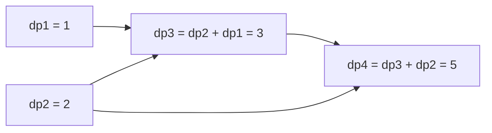

---

### Walkthrough 2: Coin Change (Minimum Coins)

**Problem in one sentence:** Minimum number of coins needed to make a target amount.

**Tiny input:**
- `coins = [1, 3, 4]`
- `amount = 6`
- Expected output: `2` (`3 + 3`)

**Manual table (amount from 0 to 6):**

| amount i | best dp[i] | why |
|---|---|---|
| 0 | 0 | base case |
| 1 | 1 | `1` |
| 2 | 2 | `1+1` |
| 3 | 1 | `3` |
| 4 | 1 | `4` |
| 5 | 2 | `4+1` |
| 6 | 2 | `3+3` |

**Transition intuition:**
For each `i`, test every coin and pick best:
`dp[i] = min(dp[i - coin] + 1)`.

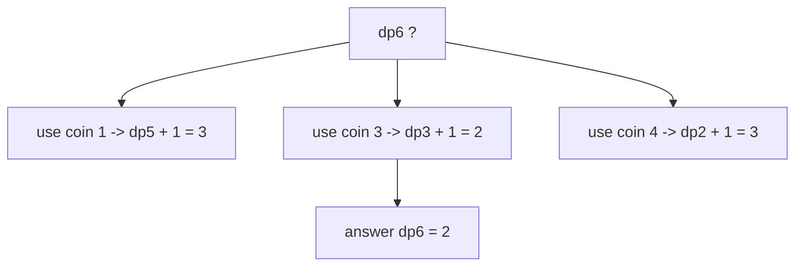

---

### Walkthrough 3: Unique Paths (Grid DP)

**Problem in one sentence:** Count paths from top-left to bottom-right using only right/down moves.

**Tiny input:**
- Grid `3 x 3`
- Expected output: `6`

**Manual fill:**
First row and first column are all `1` (only one straight way).

|   | c0 | c1 | c2 |
|---|---:|---:|---:|
| r0 | 1 | 1 | 1 |
| r1 | 1 | 2 | 3 |
| r2 | 1 | 3 | 6 |

Each inner cell = top + left.

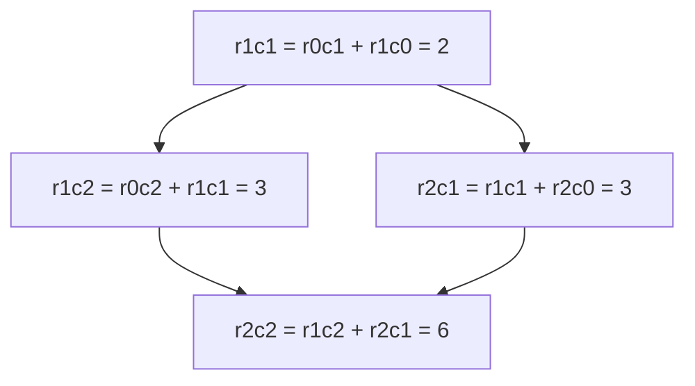

---

### Walkthrough 4: Longest Common Subsequence (LCS)

**Problem in one sentence:** Find longest sequence appearing in both strings in same order (not necessarily contiguous).

**Tiny input:**
- `s1 = "abc"`
- `s2 = "ac"`
- Expected output: `2` (subsequence `"ac"`)

**Manual grid idea:**
- Rows = prefix of `s1`
- Cols = prefix of `s2`
- Match -> diagonal + 1
- Mismatch -> max(top, left)

|      | "" | a | c |
|------|---:|---:|---:|
| ""   | 0 | 0 | 0 |
| a    | 0 | 1 | 1 |
| b    | 0 | 1 | 1 |
| c    | 0 | 1 | 2 |

```mermaid
graph LR
    A[match a-a -> dp1,1 = 1] --> B[mismatch b-c -> max(top,left) = 1]
    B --> C[match c-c -> diagonal + 1 = 2]
```

---

### Walkthrough 5: House Robber

**Problem in one sentence:** Max money with no two adjacent houses robbed.

**Tiny input:**
- `nums = [2, 7, 9, 3, 1]`
- Expected output: `12` (rob houses with 2, 9, 1)

**Manual decision table:**

| i | nums[i] | rob i (`nums[i] + dp[i-2]`) | skip i (`dp[i-1]`) | dp[i] |
|---|---:|---:|---:|---:|
| 0 | 2 | 2 | - | 2 |
| 1 | 7 | 7 | 2 | 7 |
| 2 | 9 | 11 | 7 | 11 |
| 3 | 3 | 10 | 11 | 11 |
| 4 | 1 | 12 | 11 | 12 |

```mermaid
graph TD
    A[i=2: max(9+2, 7)=11] --> B[i=3: max(3+7, 11)=11]
    B --> C[i=4: max(1+11, 11)=12]
```

---

### How to Use These Walkthroughs Every Time

1. Start with smallest valid input and write expected output.
2. Build state table by hand for 3 to 6 states only.
3. Say transition out loud in plain English.
4. Verify base case and first transition before writing code.
5. Only then implement brute force -> memo -> tabulation.

This method is often faster than jumping straight to code because it prevents wrong-state and wrong-loop-direction bugs.

---

## No-Code Walkthroughs for Remaining Older Core Problems

These continue the same style for the older core examples in this section.

### Fibonacci Number

**Tiny input -> output:**
- Input: `n = 6`
- Output: `8`

**No-code state trace:**
- `dp[0]=0`, `dp[1]=1`
- `dp[2]=1`, `dp[3]=2`, `dp[4]=3`, `dp[5]=5`, `dp[6]=8`

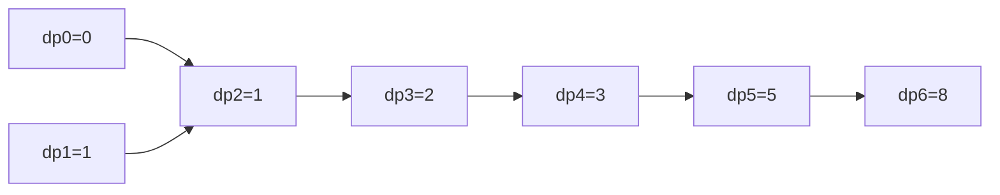

---

### Min Cost Climbing Stairs

**Tiny input -> output:**
- Input: `cost = [10, 15, 20]`
- Output: `15`

**No-code state trace:**
- `dp[0]=10`, `dp[1]=15`
- `dp[2]=20 + min(10,15)=30`
- Top is after last step, so answer `min(dp[1], dp[2]) = min(15,30)=15`

---

### Longest Increasing Subsequence (LIS)

**Tiny input -> output:**
- Input: `nums = [0, 1, 0, 3, 2, 3]`
- Output: `4` (for example subsequence `[0, 1, 2, 3]`)

**No-code state trace (`dp[i] = LIS ending at i`):**
- Start all ones: `[1,1,1,1,1,1]`
- At index 1 (value 1), extend from 0 -> `dp[1]=2`
- At index 3 (value 3), can extend best earlier -> `dp[3]=3`
- At index 4 (value 2), best is `3` from `[0,1,2]`
- At index 5 (value 3), extend from index 4 -> `dp[5]=4`
- Final answer is `max(dp)=4`

---

### 0/1 Knapsack

**Tiny input -> output:**
- Input: `weights=[2,3,4]`, `values=[3,4,5]`, `capacity=5`
- Output: `7`

**No-code reasoning:**
- Capacity 5 can hold either item (2+3) or item (4) alone.
- Value for (2+3) is `3+4=7`.
- Value for (4) alone is `5`.
- Best is `7`.

**Mini DP table intuition:**
- Rows = items considered
- Cols = capacity 0..5
- Each cell = max(skip item, take item if fits)

---

### Edit Distance

**Tiny input -> output:**
- Input: `s = "horse"`, `t = "ros"`
- Output: `3`

**No-code reasoning path:**
- Replace `h` with `r`: `horse -> rorse`
- Delete extra `r`: `rorse -> rose`
- Delete `e`: `rose -> ros`
- Minimum edits = 3

**DP intuition:**
- Match char: move diagonal
- Mismatch: 1 + min(replace diagonal, delete top, insert left)

---

### Paint House

**Tiny input -> output:**
- Input:

```text
costs = [
    [17, 2, 17],
    [16, 16, 5],
    [14, 3, 19]
]
```

- Output: `10`

**No-code reasoning:**
- House0 best is color1 (cost 2)
- House1 cannot use color1, best allowed is color2 (cost 5), subtotal 7
- House2 cannot use color2, best allowed is color1 (cost 3), subtotal 10

---

### Maximum Subarray Sum

**Tiny input -> output:**
- Input: `nums = [-2, 1, -3, 4, -1, 2, 1, -5, 4]`
- Output: `6`

**No-code state trace (`best_end_here`):**
- At 4, start new subarray at 4
- Extend with `-1, +2, +1` -> running best becomes 6
- Final max is 6 from `[4, -1, 2, 1]`

```mermaid
graph LR
        A[4] --> B[4 + (-1) = 3]
        B --> C[3 + 2 = 5]
        C --> D[5 + 1 = 6]
```

---

### Word Break

**Tiny input -> output:**
- Input: `s = "leetcode"`, `dict = ["leet", "code"]`
- Output: `True`

**No-code state trace (`dp[i] = can segment s[:i]`):**
- `dp[0]=True` (empty string)
- Check `dp[4]`: `s[:4]="leet"` in dict and `dp[0]=True` -> `dp[4]=True`
- Check `dp[8]`: `s[4:8]="code"` in dict and `dp[4]=True` -> `dp[8]=True`
- Answer `dp[8]=True`

---

### Number of Distinct Subsequences (single-string counting version in this README)

**Tiny input -> output:**
- Input: `s = "ab"`
- Output: `4`

**No-code reasoning:**
- Subsequences are: `""`, `"a"`, `"b"`, `"ab"`
- Each new character doubles existing subsequences (include it or not)
- If character repeats, subtract duplicates from earlier occurrence

**Short trace:**
- Start: count = 1 (`""`)
- After `a`: count = 2
- After `b`: count = 4

---

### Partition Equal Subset Sum

**Tiny input -> output:**
- Input: `nums = [1, 5, 11, 5]`
- Output: `True`

**No-code reasoning:**
- Total = 22, target per subset = 11
- Check if subset sum 11 exists: yes (`[11]` or `[5,5,1]`)
- Therefore partition possible

---

### Jump Game II

**Tiny input -> output:**
- Input: `nums = [2, 3, 1, 1, 4]`
- Output: `2`

**No-code reasoning:**
- From index 0 you can reach indices 1 or 2
- Choosing index 1 gives farther next reach
- Path: `0 -> 1 -> 4` uses 2 jumps

---

### Count Palindromic Substrings

**Tiny input -> output:**
- Input: `s = "aaa"`
- Output: `6`

**No-code reasoning:**
- Length 1 palindromes: 3
- Length 2 palindromes (`aa` at positions 0-1 and 1-2): 2
- Length 3 palindrome (`aaa`): 1
- Total = 3 + 2 + 1 = 6

---

### Longest Palindromic Subsequence

**Tiny input -> output:**
- Input: `s = "bbbab"`
- Output: `4`

**No-code interval reasoning:**
- Compare ends; if equal, add 2 and move inward
- If not equal, try dropping left or dropping right end
- Best found subsequence length is 4 (`"bbbb"`)

---

### Simple 5-Step Template (Apply to Any Older Problem)

1. Choose smallest useful input (size 3 to 6).
2. Write exact expected output first.
3. Define state in one sentence: `dp[...] means ...`.
4. Fill only first few states manually.
5. Explain each transition as a real choice, then code.

---

## Worked Examples for the Pattern Ladder

These go deeper on the harder variants from the practice ladder above, specifically the ones that look like House Robber but trip people up.

---

### Problem: House Robber II (Circular Houses)

**Why it's harder than House Robber I:**
The houses are in a circle, so house 0 and house `n-1` are adjacent. You cannot rob both.

**The trick:** Run House Robber I twice.
- Once on `nums[0 .. n-2]` (exclude last house)
- Once on `nums[1 .. n-1]` (exclude first house)
- Take the maximum.

**One-sentence state:** Same as House Robber, but the problem reduces to two linear subproblems.

**Decision table for `nums = [2, 3, 2]`:**

| Run | Array | dp results | Best |
|-----|-------|-----------|------|
| Exclude last | `[2, 3]` | [2, 3] | 3 |
| Exclude first | `[3, 2]` | [3, 3] | 3 |

Answer: `max(3, 3) = 3`

**Brute force:**

```python
def rob_ii_bruteforce(nums, i, excluded):
    if i < 0:
        return 0
    if i == excluded:
        return rob_ii_bruteforce(nums, i - 1, excluded)
    rob = nums[i] + rob_ii_bruteforce(nums, i - 2, excluded)
    skip = rob_ii_bruteforce(nums, i - 1, excluded)
    return max(rob, skip)
```

**Memoization:**

```python
def rob_ii_memo(nums):
    if len(nums) == 1:
        return nums[0]

    memo = {}

    def helper(index, start, end):
        if (index, start, end) in memo:
            return memo[(index, start, end)]
        if index < start:
            return 0
        rob = nums[index] + helper(index - 2, start, end)
        skip = helper(index - 1, start, end)
        memo[(index, start, end)] = max(rob, skip)
        return memo[(index, start, end)]

    return max(
        helper(len(nums) - 2, 0, len(nums) - 2),
        helper(len(nums) - 1, 1, len(nums) - 1),
    )
```

**Tabulation (cleaner):**

```python
def rob_ii(nums):
    if len(nums) == 1:
        return nums[0]

    def rob_linear(houses):
        if not houses:
            return 0
        if len(houses) == 1:
            return houses[0]
        take, skip = 0, 0
        for money in houses:
            take, skip = skip + money, max(take, skip)
        return max(take, skip)

    # Either skip first house, or skip last house
    return max(rob_linear(nums[:-1]), rob_linear(nums[1:]))

print(rob_ii([2, 3, 2]))   # 3
print(rob_ii([1, 2, 3, 1]))  # 4
print(rob_ii([1, 2, 3]))   # 3
# Single house — circular or not, just take it
print(rob_ii([7]))  # 7
# [3,1,3,1]: rob indices 0+2=6; indices 1+3=2 → best is 6
# In circle: 0 and 2 are not adjacent (circle: 0-1-2-3-0, so 0 and 2 share no edge)
print(rob_ii([3, 1, 3, 1]))  # 6
```

**Complexity:** Time `O(n)`, Space `O(1)`

---

### Problem: Delete and Earn

**Problem statement:**
Given `nums`, when you take any number `x` you gain `x` points, but must delete all occurrences of `x-1` and `x+1`.

**Why it maps to House Robber:**
- Build a bucket array where `bucket[v]` = total points from taking all copies of value `v`.
- Now you cannot take adjacent values (taking `v` deletes `v-1` and `v+1`).
- This is exactly House Robber on the `bucket` array.

**One-sentence insight:** "Delete and Earn is House Robber with buckets as the houses."

**Decision table for `nums = [3, 4, 2]`:**

| Value | Bucket (value × count) | Take/Skip |
|-------|----------------------|-----------|
| 2     | 2                    | |
| 3     | 3                    | adjacent to 2 and 4 |
| 4     | 4                    | |

House Robber on `[0, 0, 2, 3, 4]` → best is `2 + 4 = 6`

**Brute force:**

```python
def delete_and_earn_bruteforce(nums):
    if not nums:
        return 0
    max_val = max(nums)
    bucket = [0] * (max_val + 1)
    for n in nums:
        bucket[n] += n

    def rob(i):
        if i < 0:
            return 0
        return max(bucket[i] + rob(i - 2), rob(i - 1))

    return rob(max_val)
```

**Memoization:**

```python
def delete_and_earn_memo(nums):
    if not nums:
        return 0
    max_val = max(nums)
    bucket = [0] * (max_val + 1)
    for n in nums:
        bucket[n] += n

    memo = {}

    def rob(i):
        if i < 0:
            return 0
        if i in memo:
            return memo[i]
        memo[i] = max(bucket[i] + rob(i - 2), rob(i - 1))
        return memo[i]

    return rob(max_val)
```

**Tabulation:**

```python
def delete_and_earn(nums):
    if not nums:
        return 0

    max_val = max(nums)
    bucket = [0] * (max_val + 1)
    for n in nums:
        bucket[n] += n  # Total points for choosing this value

    # Same as House Robber on bucket
    take, skip = 0, 0
    for points in bucket:
        take, skip = skip + points, max(take, skip)

    return max(take, skip)

print(delete_and_earn([3, 4, 2]))   # 6
print(delete_and_earn([2, 2, 3, 3, 3, 4]))  # 9
print(delete_and_earn([1]))  # 1
# bucket=[0,1,2,3]; House Robber on [0,1,2,3] → skip 2, take 1+3=4
print(delete_and_earn([1, 2, 3]))  # 4  — earn(1)+earn(3), deleting 2 is a forced side effect
# All same value — no adjacent bucket values exist, take everything
print(delete_and_earn([5, 5, 5]))  # 15  — bucket[5]=15, no conflicts
```

**Complexity:** Time `O(n + max_val)`, Space `O(max_val)`

---

### Problem: Decode Ways

**Problem statement:**
A message was encoded as numbers: `A→1`, `B→2`, ..., `Z→26`. Given a digit string, count how many ways you can decode it.

**Why it's related to Fibonacci/Climb Stairs:**
At each position you can take 1 digit or 2 digits (if valid). This makes it a 1D recurrence with two choices — same skeleton as climbing stairs.

**The differences that catch people:**
- `"0"` cannot be decoded alone; it must pair with the digit before it.
- A two-digit number is only valid if it's `10..26`.
- Leading zeros within a segment (`"06"`) are invalid.

**One-sentence state:** `dp[i]` = number of ways to decode `s[0..i-1]`.

**Decision table for `s = "226"`:**

| i | one-digit `s[i-1]` | two-digit `s[i-2:i]` | dp[i] |
|---|---------------------|----------------------|-------|
| 0 | base case | | 1 |
| 1 | `"2"` valid → dp[0] = 1 | | 1 |
| 2 | `"2"` valid → dp[1] = 1 | `"22"` valid → dp[0] = 1 | 2 |
| 3 | `"6"` valid → dp[2] = 2 | `"26"` valid → dp[1] = 1 | 3 |

**Brute force:**

```python
def num_decodings_bruteforce(s, i=0):
    if i == len(s):
        return 1
    if s[i] == "0":
        return 0
    ways = num_decodings_bruteforce(s, i + 1)  # take one digit
    if i + 1 < len(s) and int(s[i:i+2]) <= 26:
        ways += num_decodings_bruteforce(s, i + 2)  # take two digits
    return ways
```

**Memoization:**

```python
def num_decodings_memo(s):
    memo = {}

    def helper(i):
        if i == len(s):
            return 1
        if s[i] == "0":
            return 0
        if i in memo:
            return memo[i]

        ways = helper(i + 1)
        if i + 1 < len(s) and int(s[i:i+2]) <= 26:
            ways += helper(i + 2)

        memo[i] = ways
        return ways

    return helper(0)
```

**Tabulation:**

```python
def num_decodings(s):
    if not s or s[0] == "0":
        return 0

    n = len(s)
    dp = [0] * (n + 1)
    dp[0] = 1       # empty prefix: 1 way
    dp[1] = 1       # first char: valid as long as it's not "0" (checked above)

    for i in range(2, n + 1):
        one_digit = int(s[i - 1])
        two_digit = int(s[i - 2:i])

        if one_digit != 0:
            dp[i] += dp[i - 1]

        if 10 <= two_digit <= 26:
            dp[i] += dp[i - 2]

    return dp[n]

print(num_decodings("12"))   # 2
print(num_decodings("226"))  # 3
print(num_decodings("06"))   # 0
print(num_decodings("10"))   # 1
# Standalone "0" — cannot decode alone (A=1, Z=26, so 0 is invalid)
print(num_decodings("0"))     # 0
# Valid decodings: [1,1,10,6] and [11,10,6]; "06" segment is rejected
print(num_decodings("11106"))  # 2
```

**Complexity:** Time `O(n)`, Space `O(n)` (reducible to `O(1)`)

---

### Problem: Target Sum

**Problem statement:**
Given `nums` and a `target`, assign `+` or `-` to each number. Count how many ways the expression equals `target`.

**Why it's harder than basic knapsack:**
You have two choices per element (`+x` or `-x`), and you're counting all ways, not just checking feasibility.

**One-sentence insight:** "The number of ways where positive-sum minus negative-sum equals target."

Let `P` = sum of + numbers, `N` = sum of - numbers.
- `P - N = target`
- `P + N = total`
- → `P = (total + target) / 2`

This reduces to: **count subsets that sum to `P`**. Classic 0/1 knapsack counting.

**Decision table for `nums = [1,1,1,1,1]`, `target = 3`:**

| Positive set | Sum P | Works? |
|--------------|-------|--------|
| [1,1,1,1,1] minus [1,1] | P=5, N=2, 5-2=3 | Yes |
| ... | ... | 5 ways total |

**Brute force:**

```python
def find_target_sum_ways_bruteforce(nums, target):
    def dfs(i, current):
        if i == len(nums):
            return 1 if current == target else 0
        return (dfs(i + 1, current + nums[i]) +
                dfs(i + 1, current - nums[i]))
    return dfs(0, 0)
```

**Memoization:**

```python
def find_target_sum_ways_memo(nums, target):
    memo = {}

    def dfs(i, current):
        if i == len(nums):
            return 1 if current == target else 0
        if (i, current) in memo:
            return memo[(i, current)]
        memo[(i, current)] = (dfs(i + 1, current + nums[i]) +
                               dfs(i + 1, current - nums[i]))
        return memo[(i, current)]

    return dfs(0, 0)
```

**Tabulation (subset sum count, O(n * subset_target)):**

```python
def find_target_sum_ways(nums, target):
    total = sum(nums)

    # If (total + target) is odd or out of range, no solution
    if (total + target) % 2 != 0:
        return 0
    if abs(target) > total:
        return 0

    subset_target = (total + target) // 2

    # Count subsets that sum to subset_target
    dp = [0] * (subset_target + 1)
    dp[0] = 1

    for num in nums:
        for s in range(subset_target, num - 1, -1):
            dp[s] += dp[s - num]

    return dp[subset_target]

print(find_target_sum_ways([1, 1, 1, 1, 1], 3))  # 5
print(find_target_sum_ways([1], 1))              # 1
print(find_target_sum_ways([1, 0], 1))           # 2
# P=(6+2)/2=4; only subset {4} sums to 4, so one assignment: +4-2=2
print(find_target_sum_ways([2, 4], 2))  # 1
# 0 contributes nothing either way, so +0 and -0 both reach target 0
print(find_target_sum_ways([0], 0))     # 2  — both +0 and -0 are valid
```

**Complexity:**
- Brute force: Time `O(2^n)`, Space `O(n)`
- Tabulation: Time `O(n * subset_target)`, Space `O(subset_target)`

---

## Two-Week DP Practice Schedule (Day-by-Day)

Use this to build intuition deliberately instead of randomly solving problems.

### Week 1: Core Patterns

1. Day 1: 1D recurrence basics
   - Solve: Fibonacci, Climbing Stairs
   - Goal: Write state and transition before coding

2. Day 2: 1D choice DP
   - Solve: House Robber, Min Cost Climbing Stairs
   - Goal: Explain each transition term in plain English

3. Day 3: Knapsack foundation
   - Solve: Partition Equal Subset Sum
   - Goal: Understand reverse loop in 0/1 tabulation

4. Day 4: Unbounded choices
   - Solve: Coin Change, Coin Change II
   - Goal: Compare loop order with 0/1 knapsack

5. Day 5: Grid DP
   - Solve: Unique Paths, Minimum Path Sum
   - Goal: Fill 2D table by hand for a 3x3 case

6. Day 6: String 2D DP
   - Solve: LCS, Edit Distance
   - Goal: Know exactly when to use diagonal/top/left

7. Day 7: Review day
   - Re-solve 3 earlier problems without notes
   - Build a one-page cheat sheet: state, transition, base cases, loop order

### Week 2: Advanced Patterns

1. Day 8: Interval DP
   - Solve: Burst Balloons or Min Cost to Cut a Stick
   - Goal: Practice interval boundaries and split point `k`

2. Day 9: Subsequence and palindrome DP
   - Solve: Longest Palindromic Subsequence, Palindromic Substrings
   - Goal: Distinguish substring vs subsequence states

3. Day 10: State-machine DP
   - Solve: Stock with Cooldown or Transaction Fee
   - Goal: Model each state (hold/sold/rest)

4. Day 11: Bitmask DP
   - Solve: small TSP-style problem
   - Goal: Treat `mask` as visited set and practice transitions

5. Day 12: Tree DP
   - Solve: House Robber III
   - Goal: Return multi-state info from each node

6. Day 13: Probability or expected-value DP
   - Solve: Knight Probability in Chessboard
   - Goal: Track probabilities over steps cleanly

7. Day 14: Mock interview + reflection
   - Pick 2 medium + 1 hard DP problem
   - Do timed run, then write mistakes and fixes

---

## Advanced DP Intuition Problems (Bitmask, Digit, Tree, Interval, Probability)

### Problem E: Bitmask DP - Minimum Cost to Visit All Cities

**Problem (plain English):**
You have `n` cities and a cost matrix where `cost[i][j]` is travel cost from city `i` to city `j`. Start at city `0` and visit every city exactly once. Find minimum total cost.

**Input/Output:**
- Input:

```text
cost = [
  [0, 10, 15, 20],
  [10, 0, 35, 25],
  [15, 35, 0, 30],
  [20, 25, 30, 0]
]
```

- Output: `65` (one optimal path: `0 -> 1 -> 3 -> 2`)

**Brute force (try all permutations):**

```python
from itertools import permutations


def min_cost_visit_all_bruteforce(cost):
    n = len(cost)
    best = float("inf")

    for order in permutations(range(1, n)):
        total = 0
        prev = 0
        for city in order:
            total += cost[prev][city]
            prev = city
        best = min(best, total)

    return best
```

**Memoization (state = visited mask + current city):**

```python
def min_cost_visit_all_memo(cost):
    n = len(cost)
    all_visited = (1 << n) - 1
    memo = {}

    def dfs(mask, pos):
        if mask == all_visited:
            return 0

        state = (mask, pos)
        if state in memo:
            return memo[state]

        best = float("inf")
        for nxt in range(n):
            if (mask & (1 << nxt)) == 0:
                best = min(best, cost[pos][nxt] + dfs(mask | (1 << nxt), nxt))

        memo[state] = best
        return best

    return dfs(1 << 0, 0)
```

**Tabulation (bottom-up over masks):**

```python
def min_cost_visit_all_tabulation(cost):
    n = len(cost)
    size = 1 << n
    dp = [[float("inf")] * n for _ in range(size)]
    dp[1 << 0][0] = 0

    for mask in range(size):
        for pos in range(n):
            if dp[mask][pos] == float("inf"):
                continue
            for nxt in range(n):
                if (mask & (1 << nxt)) == 0:
                    new_mask = mask | (1 << nxt)
                    dp[new_mask][nxt] = min(dp[new_mask][nxt], dp[mask][pos] + cost[pos][nxt])

    return min(dp[(1 << n) - 1])
```

**Complexity:**
- Brute force: Time `O((n-1)!)`, Space `O(n)`
- Memoization: Time `O(n^2 * 2^n)`, Space `O(n * 2^n)`
- Tabulation: Time `O(n^2 * 2^n)`, Space `O(n * 2^n)`

---

### Problem F: Digit DP - Count Numbers <= n With Unique Digits

**Problem (plain English):**
Count how many integers in range `[0, n]` have no repeated digit (for example, 121 has repeated 1, so not allowed).

**Input/Output:**
- Input: `n = 20`
- Output: `20`
- Why: Every number from 0 to 20 is unique-digit except none in this range have repeats.

**Brute force (check each number):**

```python
def count_unique_digits_bruteforce(n):
    def is_unique(x):
        s = str(x)
        return len(set(s)) == len(s)

    return sum(1 for x in range(n + 1) if is_unique(x))
```

**Memoization (digit DP):**

```python
def count_unique_digits_memo(n):
    digits = list(map(int, str(n)))
    memo = {}

    def dfs(i, tight, started, used_mask):
        if i == len(digits):
            return 1

        state = (i, tight, started, used_mask)
        if state in memo:
            return memo[state]

        limit = digits[i] if tight else 9
        total = 0

        for d in range(limit + 1):
            next_tight = tight and (d == limit)

            if not started and d == 0:
                total += dfs(i + 1, next_tight, False, used_mask)
            else:
                if (used_mask & (1 << d)) != 0:
                    continue
                total += dfs(i + 1, next_tight, True, used_mask | (1 << d))

        memo[state] = total
        return total

    return dfs(0, True, False, 0)
```

**Tabulation (iterative digit-state transitions):**

```python
def count_unique_digits_tabulation(n):
    digits = list(map(int, str(n)))
    # key: (tight, started, used_mask) -> count
    states = {(1, 0, 0): 1}

    for i in range(len(digits)):
        next_states = {}
        for (tight, started, used_mask), cnt in states.items():
            limit = digits[i] if tight else 9

            for d in range(limit + 1):
                next_tight = 1 if (tight and d == limit) else 0

                if not started and d == 0:
                    key = (next_tight, 0, used_mask)
                    next_states[key] = next_states.get(key, 0) + cnt
                else:
                    if (used_mask & (1 << d)) != 0:
                        continue
                    new_mask = used_mask | (1 << d)
                    key = (next_tight, 1, new_mask)
                    next_states[key] = next_states.get(key, 0) + cnt

        states = next_states

    return sum(states.values())
```

**Complexity:**
- Brute force: Time `O(n * digits)`, Space `O(digits)`
- Memoization: Time `O(len(n) * 2 * 2 * 2^10 * 10)`, Space `O(len(n) * 2 * 2 * 2^10)`
- Tabulation: Same state complexity as memoization

---

### Problem G: Tree DP - House Robber III

**Problem (plain English):**
You are given a binary tree where each node is a house amount. If you rob a node, you cannot rob its direct children. Return maximum money.

**Input/Output:**
- Input (level order): `[3, 2, 3, null, 3, null, 1]`
- Output: `7`
- Why: Rob root `3`, then grandchildren `3` and `1`.

**Brute force (recompute many subtrees):**

```python
class TreeNode:
    def __init__(self, val=0, left=None, right=None):
        self.val = val
        self.left = left
        self.right = right


def rob_tree_bruteforce(root):
    if not root:
        return 0

    rob_this = root.val
    if root.left:
        rob_this += rob_tree_bruteforce(root.left.left) + rob_tree_bruteforce(root.left.right)
    if root.right:
        rob_this += rob_tree_bruteforce(root.right.left) + rob_tree_bruteforce(root.right.right)

    skip_this = rob_tree_bruteforce(root.left) + rob_tree_bruteforce(root.right)
    return max(rob_this, skip_this)
```

**Memoization (cache by node identity):**

```python
def rob_tree_memo(root):
    memo = {}

    def dfs(node):
        if not node:
            return 0
        if node in memo:
            return memo[node]

        rob_this = node.val
        if node.left:
            rob_this += dfs(node.left.left) + dfs(node.left.right)
        if node.right:
            rob_this += dfs(node.right.left) + dfs(node.right.right)

        skip_this = dfs(node.left) + dfs(node.right)
        memo[node] = max(rob_this, skip_this)
        return memo[node]

    return dfs(root)
```

**Tabulation style (iterative postorder, pair state):**

```python
def rob_tree_tabulation(root):
    if not root:
        return 0

    # dp[node] = (rob_node, skip_node)
    dp = {}
    stack = [(root, False)]

    while stack:
        node, visited = stack.pop()
        if not node:
            continue

        if not visited:
            stack.append((node, True))
            stack.append((node.right, False))
            stack.append((node.left, False))
        else:
            left_rob, left_skip = dp.get(node.left, (0, 0))
            right_rob, right_skip = dp.get(node.right, (0, 0))

            rob_node = node.val + left_skip + right_skip
            skip_node = max(left_rob, left_skip) + max(right_rob, right_skip)
            dp[node] = (rob_node, skip_node)

    return max(dp[root])
```

**Complexity:**
- Brute force: Exponential in worst case
- Memoization: Time `O(n)`, Space `O(n)`
- Iterative postorder DP: Time `O(n)`, Space `O(n)`

---

### Problem H: Interval DP - Minimum Cost to Cut a Stick

**Problem (plain English):**
A stick of length `n` must be cut at positions in array `cuts`. Each cut costs current stick length being cut. Choose cut order to minimize total cost.

**Input/Output:**
- Input: `n = 7`, `cuts = [1, 3, 4, 5]`
- Output: `16`

**Brute force (try each cut as first cut in interval):**

```python
def min_cut_cost_bruteforce(n, cuts):
    points = [0] + sorted(cuts) + [n]

    def dfs(l, r):
        if r - l <= 1:
            return 0

        best = float("inf")
        for k in range(l + 1, r):
            best = min(best, (points[r] - points[l]) + dfs(l, k) + dfs(k, r))
        return best

    return dfs(0, len(points) - 1)
```

**Memoization:**

```python
def min_cut_cost_memo(n, cuts):
    points = [0] + sorted(cuts) + [n]
    memo = {}

    def dfs(l, r):
        if r - l <= 1:
            return 0
        if (l, r) in memo:
            return memo[(l, r)]

        best = float("inf")
        for k in range(l + 1, r):
            best = min(best, (points[r] - points[l]) + dfs(l, k) + dfs(k, r))

        memo[(l, r)] = best
        return best

    return dfs(0, len(points) - 1)
```

**Tabulation (interval length grows):**

```python
def min_cut_cost_tabulation(n, cuts):
    points = [0] + sorted(cuts) + [n]
    m = len(points)
    dp = [[0] * m for _ in range(m)]

    for length in range(2, m):
        for l in range(0, m - length):
            r = l + length
            if r - l <= 1:
                continue

            dp[l][r] = float("inf")
            for k in range(l + 1, r):
                dp[l][r] = min(dp[l][r], points[r] - points[l] + dp[l][k] + dp[k][r])

    return dp[0][m - 1]
```

**Complexity:**
- Brute force: Exponential
- Memoization: Time `O(m^3)`, Space `O(m^2)` where `m = len(cuts) + 2`
- Tabulation: Time `O(m^3)`, Space `O(m^2)`

---

### Problem I: Probability DP - Knight Probability in Chessboard

**Problem (plain English):**
On an `n x n` chessboard, a knight starts at `(row, col)`. It makes exactly `k` moves, each uniformly among 8 knight moves. Return probability it remains on the board after `k` moves.

**Input/Output:**
- Input: `n = 3`, `k = 2`, `row = 0`, `col = 0`
- Output: `0.0625`

**Brute force (enumerate all move paths):**

```python
def knight_probability_bruteforce(n, k, row, col):
    moves = [
        (2, 1), (2, -1), (-2, 1), (-2, -1),
        (1, 2), (1, -2), (-1, 2), (-1, -2),
    ]

    def dfs(steps, r, c):
        if r < 0 or r >= n or c < 0 or c >= n:
            return 0.0
        if steps == 0:
            return 1.0

        prob = 0.0
        for dr, dc in moves:
            prob += dfs(steps - 1, r + dr, c + dc) / 8.0
        return prob

    return dfs(k, row, col)
```

**Memoization:**

```python
def knight_probability_memo(n, k, row, col):
    moves = [
        (2, 1), (2, -1), (-2, 1), (-2, -1),
        (1, 2), (1, -2), (-1, 2), (-1, -2),
    ]
    memo = {}

    def dfs(steps, r, c):
        if r < 0 or r >= n or c < 0 or c >= n:
            return 0.0
        if steps == 0:
            return 1.0

        state = (steps, r, c)
        if state in memo:
            return memo[state]

        prob = 0.0
        for dr, dc in moves:
            prob += dfs(steps - 1, r + dr, c + dc) / 8.0

        memo[state] = prob
        return prob

    return dfs(k, row, col)
```

**Tabulation (step-by-step probability distribution):**

```python
def knight_probability_tabulation(n, k, row, col):
    moves = [
        (2, 1), (2, -1), (-2, 1), (-2, -1),
        (1, 2), (1, -2), (-1, 2), (-1, -2),
    ]

    curr = [[0.0] * n for _ in range(n)]
    curr[row][col] = 1.0

    for _ in range(k):
        nxt = [[0.0] * n for _ in range(n)]
        for r in range(n):
            for c in range(n):
                if curr[r][c] == 0.0:
                    continue
                p = curr[r][c] / 8.0
                for dr, dc in moves:
                    nr, nc = r + dr, c + dc
                    if 0 <= nr < n and 0 <= nc < n:
                        nxt[nr][nc] += p
        curr = nxt

    return sum(sum(row_probs) for row_probs in curr)
```

**Complexity:**
- Brute force: Time `O(8^k)`, Space `O(k)`
- Memoization: Time `O(k * n^2 * 8)`, Space `O(k * n^2)`
- Tabulation: Time `O(k * n^2 * 8)`, Space `O(n^2)`

---

## Comprehensive Comparison Table

| Example | Pattern | State Def | Overlapping? | Optimal Substructure? | Complexity |
|---------|---------|-----------|---|---|---|
| Fibonacci | 1D Recurrence | `dp[i]` | Yes | Yes | O(n) memoized, O(2^n) naive |
| Climbing Stairs | 1D Recurrence | `dp[i]` | Yes | Yes | O(n) |
| Min Cost Stairs | 1D Choice | `dp[i]` = min cost | Yes | Yes | O(n) |
| Coin Change | 1D Unbounded | `dp[i]` = min coins | Yes | Yes | O(n × m) |
| House Robber | 1D Choice | `dp[i]` = max money | Yes | Yes | O(n) |
| LIS | 1D Comparison | `dp[i]` = length at i | Yes | Yes | O(n²), O(n log n) binary search |
| 0/1 Knapsack | 2D Items/Capacity | `dp[i][c]` | Yes | Yes | O(n × capacity) |
| Unique Paths | 2D Grid | `dp[i][j]` = ways | Yes | Yes | O(m × n) |
| Paint House | Multiple State | `dp[i][j]` = min cost | Yes | Yes | O(n × 3) |
| LCS | 2D String | `dp[i][j]` = length | Yes | Yes | O(m × n) |
| Edit Distance | 2D String | `dp[i][j]` = edits | Yes | Yes | O(m × n) |
| Word Break | 1D String Segment | `dp[i]` = can segment | Yes | Yes | O(n²) |
| Max Subarray | 1D Contiguous | `dp[i]` = max sum | Yes | Yes | O(n) |

---

## How to Study This Section

1. **For each problem, write the state in one sentence before coding.**
   - "dp[i] = minimum coins to make amount i"
   - "dp[i][j] = maximum value with items 0..i and capacity j"

2. **Derive transition from the choices available.**
   - What are your options at this step?
   - How do they combine into the answer?

3. **Identify base cases and validate on tiny inputs.**
   - Test with n=0, n=1, n=2
   - Hand-trace the recursion tree

4. **Choose top-down first for clarity; convert to bottom-up later.**
   - Memoization is intuitive: write the recursion, add a cache
   - Tabulation is more efficient: loop through states in order

5. **Revisit space optimization only after correctness is stable.**
   - For some problems, you can reduce space by observing that only recent states are needed
   - Don't optimize prematurely—clarity first, performance later

---

## When to Use DP

- **"Maximum/minimum" with choices** → DP
- **"Number of ways"** → DP
- **"Can we achieve X?"** → DP
- **"Best solution where choices matter"** → DP
- **Recursive solution with repeated subproblems** → Memoize it

## Problems
### 1D DP
| Problem | Difficulty | LeetCode |
|---------|-----------|----------|
| [Fibonacci Number](./fibonacci-number.md) | Easy | #509 |
| [Climbing Stairs](./climbing-stairs.md) | Easy | #70 |
| [Min Cost Climbing Stairs](./min-cost-climbing-stairs.md) | Easy | #746 |
| [House Robber](./house-robber.md) | Medium | #198 |
| [House Robber II](./house-robber-ii.md) | Medium | #213 |

### 0/1 Knapsack
| Problem | Difficulty | LeetCode |
|---------|-----------|----------|
| [Partition Equal Subset Sum](./partition-equal-subset-sum.md) | Medium | #416 |
| [Target Sum](./target-sum.md) | Medium | #494 |

### Unbounded Knapsack
| Problem | Difficulty | LeetCode |
|---------|-----------|----------|
| [Coin Change](./coin-change.md) | Medium | #322 |
| [Coin Change II](./coin-change-ii.md) | Medium | #518 |
| [Perfect Squares](./perfect-squares.md) | Medium | #279 |

### LIS Family
| Problem | Difficulty | LeetCode |
|---------|-----------|----------|
| [Longest Increasing Subsequence](./longest-increasing-subsequence.md) | Medium | #300 |

### 2D Grid DP
| Problem | Difficulty | LeetCode |
|---------|-----------|----------|
| [Unique Paths](./unique-paths.md) | Medium | #62 |
| [Unique Paths II](./unique-paths-ii.md) | Medium | #63 |
| [Minimum Path Sum](./minimum-path-sum.md) | Medium | #64 |
| [Burst Balloons](./burst-balloons.md) | Hard | #312 |

### String DP
| Problem | Difficulty | LeetCode |
|---------|-----------|----------|
| [Longest Common Subsequence](./longest-common-subsequence.md) | Medium | #1143 |
| [Edit Distance](./edit-distance.md) | Medium | #72 |
| [Decode Ways](./decode-ways.md) | Medium | #91 |
| [Word Break](./word-break.md) | Medium | #139 |
| [Interleaving String](./interleaving-string.md) | Medium | #97 |

### State Machine DP (Stocks)
| Problem | Difficulty | LeetCode |
|---------|-----------|----------|
| [Best Time to Buy and Sell Stock with Cooldown](./best-time-to-buy-and-sell-stock-with-cooldown.md) | Medium | #309 |
| [Best Time to Buy and Sell Stock with Transaction Fee](./best-time-to-buy-and-sell-stock-with-transaction-fee.md) | Medium | #714 |
| [Best Time to Buy and Sell Stock III](./best-time-to-buy-and-sell-stock-iii.md) | Hard | #123 |
| [Best Time to Buy and Sell Stock IV](./best-time-to-buy-and-sell-stock-iv.md) | Hard | #188 |

## Progress
- Implemented in this section: 24 indexed problems (including foundational and advanced starter set)
- Next expansion target: Tree/Graph DP, Bitmask DP, Digit DP, Probability DP coverage
