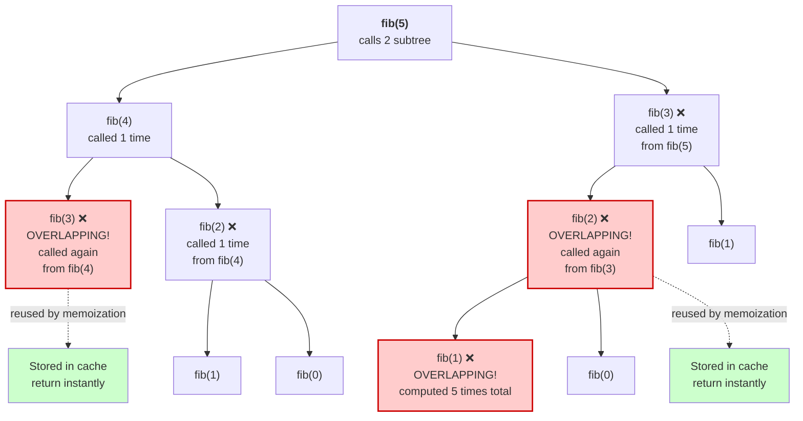
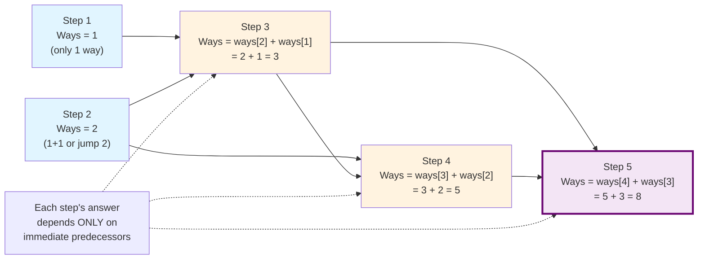
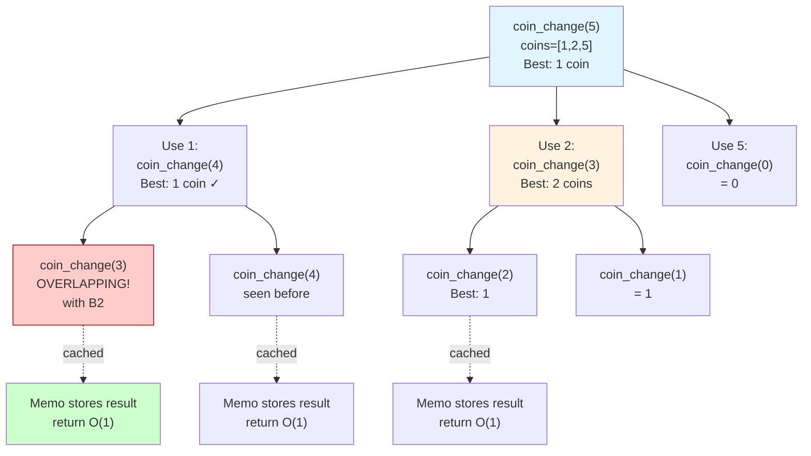
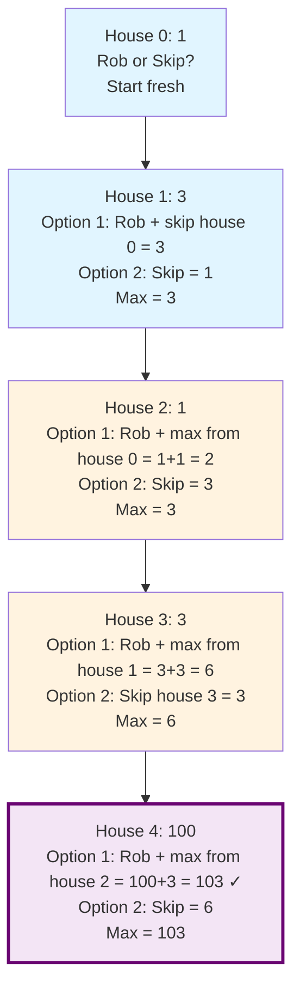
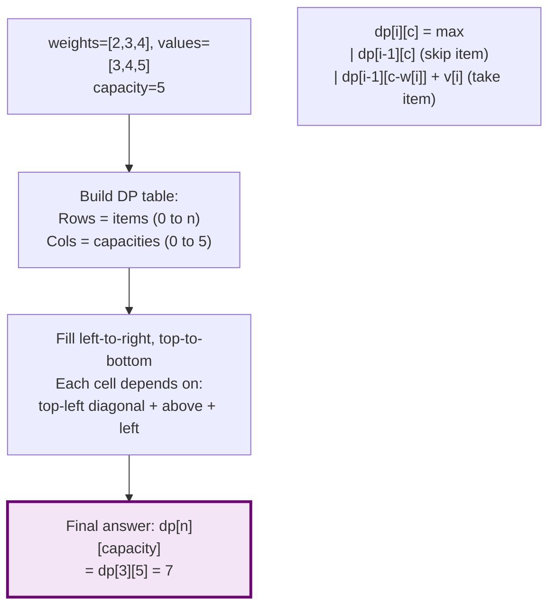
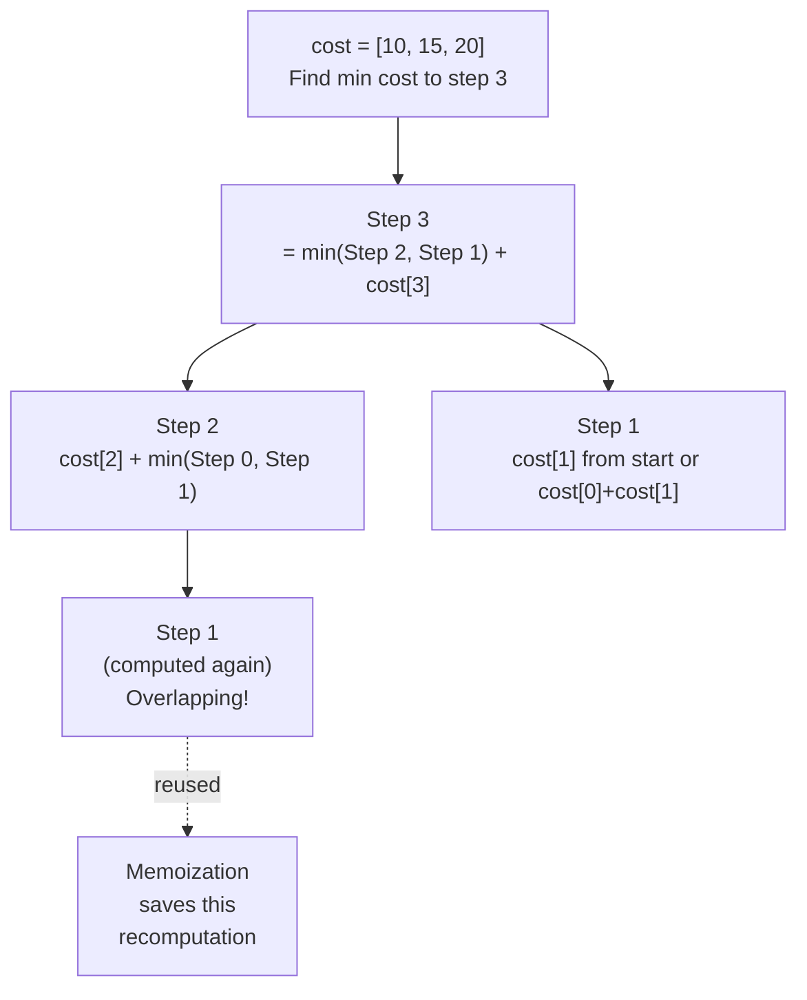
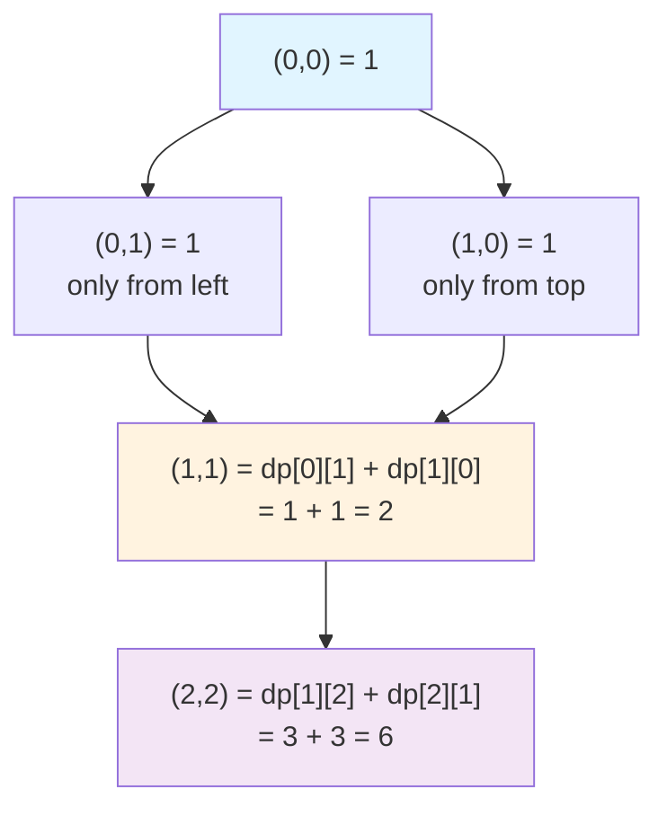
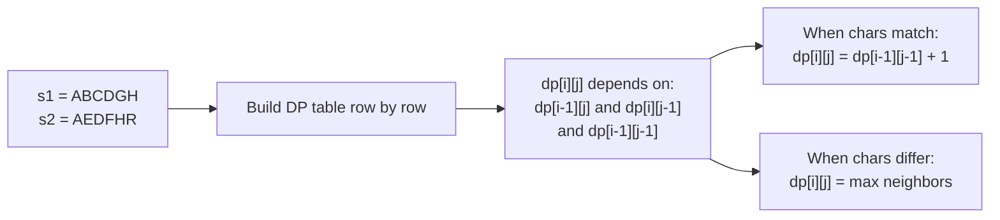
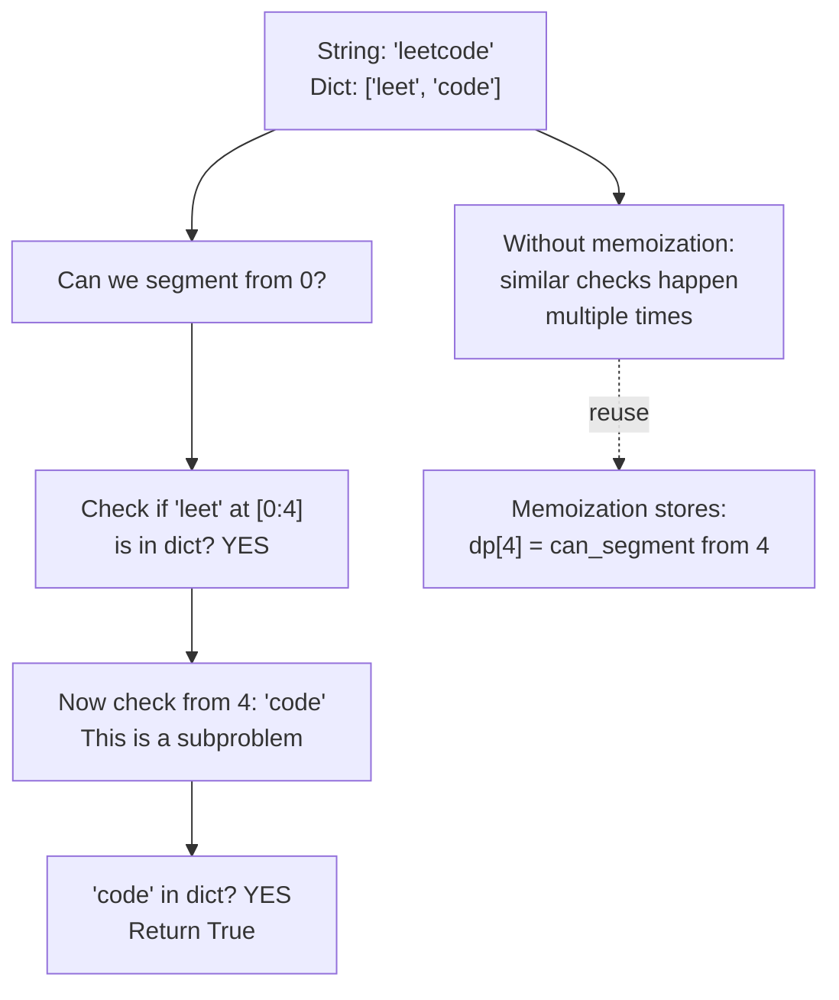

# 30. Dynamic Programming

## Overview

Dynamic Programming (DP) solves optimization and counting problems by reusing solutions to overlapping subproblems. Most interview DP questions are about **defining the right state**, **writing the transition**, and choosing **memoization (top-down)** or **tabulation (bottom-up)**.

This section is organized by pattern, from foundational 1D recurrences to advanced state-machine and interval/string DP. Each pattern builds on the fundamental DP properties explained below.

---

## The Two Essential Properties of DP

### 1️⃣ Overlapping Subproblems

A problem has **overlapping subproblems** if the same subproblem is solved multiple times during recursion. Without memoization, you waste time recomputing the same answers.

#### Concrete Example: Fibonacci

**Problem:** Compute the nth Fibonacci number where `fib(n) = fib(n-1) + fib(n-2)`.

**Without memoization (naive recursion):**

```python
def fib_naive(n: int) -> int:
    if n <= 1:
        return n
    return fib_naive(n - 1) + fib_naive(n - 2)

print(fib_naive(5))  # 5
```

**Call tree for `fib(5)`:**

```
                    fib(5)
                   /      \
              fib(4)        fib(3)
             /      \      /      \
         fib(3)   fib(2)  fib(2)  fib(1)
        /     \   /    \  /    \
    fib(2) fib(1) fib(1) fib(0) fib(1) fib(0)
    /   \
fib(1) fib(0)
```

**Mermaid Visualization: Overlapping Subproblems (with highlights)**



**See the overlaps?**
- `fib(3)` is computed **2 times**
- `fib(2)` is computed **3 times**
- `fib(1)` is computed **5 times**
- `fib(0)` is computed **3 times**

For `fib(50)`, the same subproblems repeat thousands of times! This is **exponential** work for no reason.

**With memoization:**

```python
def fib_memo(n: int) -> int:
    memo = {}
    
    def helper(k: int) -> int:
        if k in memo:
            return memo[k]  # Return cached result
        if k <= 1:
            return k
        result = helper(k - 1) + helper(k - 2)
        memo[k] = result
        return result
    
    return helper(n)

print(fib_memo(5))   # 5
print(fib_memo(50))  # instant (without memoization it takes seconds)
```

Now each subproblem is solved exactly **once**, and future calls return instantly from the cache.

**How to spot overlapping subproblems:**
- The recursion tree has repeated nodes (like `fib(2)` appearing multiple times)
- Removing memoization makes the code unbearably slow for moderately large inputs
- Subproblems are defined by a smaller set of parameters (e.g., just `n` in Fibonacci)

---

### 2️⃣ Optimal Substructure

A problem has **optimal substructure** if an optimal solution is built from optimal solutions to its subproblems. In other words, the best answer at each step doesn't depend on what could have been chosen earlier—only on which subproblem you're solving now.

#### Concrete Example: Climbing Stairs

**Problem:** You can climb 1 or 2 steps per move. How many distinct ways to reach step `n`?

**Example:** To reach step 5, you can:
- Come from step 4 (then take 1 step)
- Come from step 3 (then take 2 steps)

So the number of ways to reach step 5 equals:
$$\text{ways}(5) = \text{ways}(4) + \text{ways}(3)$$

This is **optimal substructure**: the best solution for `ways(5)` is built from the best solutions for `ways(4)` and `ways(3)`.

```python
def climb_stairs(n: int) -> int:
    memo = {}
    
    def dp(k: int) -> int:
        if k in memo:
            return memo[k]
        if k <= 2:
            return k
        result = dp(k - 1) + dp(k - 2)
        memo[k] = result
        return result
    
    return dp(n)

print(climb_stairs(5))   # 8
print(climb_stairs(10))  # 89
```

**Why this is optimal substructure:**
- To count all ways to reach step 5, we don't care which specific steps were taken before step 3 or 4
- We only need: "How many ways to reach step 4?" and "How many ways to reach step 3?"
- The answer combines these two independent, optimal solutions

**How to spot optimal substructure:**
- The problem asks for "maximum," "minimum," or "count of ways"
- You can express the solution in terms of smaller versions of the same problem
- The choice you make now doesn't affect the optimality of choices in subproblems
- Test: Can you write `dp[i]` as a function of `dp[i-1]`, `dp[i-2]`, etc.?

**Mermaid: Building Optimal Solutions Bottom-Up**



---

## Visual: Recognizing the Two Properties

### Overlapping Subproblems: Same leaves, different paths

```
            F(5)
           /    \
        F(4)    F(3)  ← F(3) computed here
       /   \    /  \
    F(3)  F(2) F(2) F(1)
     ↑      
  F(3) also computed here

Overlapping subproblems = redundancy in the call tree
Memoization = save and reuse the results
```

### Optimal Substructure: Best answer from best subproblems

```
Ways to climb step 5 = Ways to climb step 4 + Ways to climb step 3

If step 4 has 5 best ways and step 3 has 3 best ways,
then step 5 has 8 best ways total.

The answer for step 5 is determined by the answers for steps 4 and 3.
This is a pure combination, not a competition.
```

---

## Key Concepts

- **State definition**: What information uniquely identifies a subproblem?
- **Transition**: How do you compute the current state from previous states?
- **Base cases**: What are the smallest, simplest inputs?
- **Iteration order**: In what sequence must you compute states to ensure dependencies are already available?
- **Memoization (top-down)**: Recursion + cache. Compute on-demand.
- **Tabulation (bottom-up)**: Build a table. Compute all states in order.

## Common Patterns

| Pattern | Key Idea | Overlapping? | Optimal Substructure? |
|---------|---------|--------------|----------------------|
| 1D DP | `dp[i]` depends on `dp[i-1]` or `dp[i-k]` | Yes | Yes |
| 0/1 Knapsack | Include or exclude each item | Yes | Yes |
| Unbounded Knapsack | Can use each item multiple times | Yes | Yes |
| LIS | `dp[i]` = longest increasing subsequence ending at i | Yes | Yes |
| Grid DP | `dp[i][j]` depends on neighbors | Yes | Yes |
| String DP | `dp[i][j]` for two string prefixes | Yes | Yes |
| State Machine | States represent phases (buy/sell/cooldown) | Yes | Yes |

---

## How to Approach a DP Problem

**Step 1: Recognize overlapping subproblems**
- Ask: "Can I solve this recursively?"
- Write the naive recursive solution
- Observe: Are there repeated subproblems?
- If yes, DP can help

**Step 2: Identify optimal substructure**
- Ask: "Can the answer be built from answers to smaller problems?"
- Write: `dp[i] = f(dp[i-1], dp[i-2], ...)`
- If this works, optimal substructure exists

**Step 3: Define the state**
- Pick a concise definition. Example: "dp[i] = minimum cost to reach position i"
- This definition should make the transition obvious

**Step 4: Write the transition**
- For each state, list all choices and their outcomes
- Combine outcomes using `max`, `min`, or `+` (depending on the goal)

**Step 5: Identify base cases**
- What's the simplest input? (Often `dp[0]` or `dp[1]`)
- What's the answer for that input?

**Step 6: Choose top-down or bottom-up**
- **Top-down (memoization):** Recursion + dictionary cache. Intuitive, debug-friendly.
- **Bottom-up (tabulation):** Iterative loop, array/list. More efficient, harder to write initially.

---

## Examples: Simple to Complex

### Example 1: Fibonacci (Simplest DP)

**Properties:**
- Overlapping subproblems: Yes (fib(2) computed many times)
- Optimal substructure: Yes (fib(n) = fib(n-1) + fib(n-2))

**State:** `dp[i]` = the ith Fibonacci number

**Transition:** `dp[i] = dp[i-1] + dp[i-2]`

**Base cases:** `dp[0] = 0`, `dp[1] = 1`

```python
def fibonacci(n: int) -> int:
    memo = {}
    
    def helper(k: int) -> int:
        if k in memo:
            return memo[k]
        if k == 0:
            return 0
        if k == 1:
            return 1
        result = helper(k - 1) + helper(k - 2)
        memo[k] = result
        return result
    
    return helper(n)

# Bottom-up (tabulation) version
def fibonacci_tabulation(n: int) -> int:
    if n <= 1:
        return n
    dp = [0] * (n + 1)
    dp[1] = 1
    for i in range(2, n + 1):
        dp[i] = dp[i - 1] + dp[i - 2]
    return dp[n]

print(fibonacci(10))  # 55
print(fibonacci_tabulation(10))  # 55
```

---

### Example 2: Coin Change (Unbounded Knapsack)

**Problem:** Given coins of different denominations and an amount, find the **minimum number of coins** needed.

**Example:** `coins = [1, 2, 5]`, `amount = 5` → Use one 5-coin or one 2-coin + three 1-coins → Answer: 1

**Properties:**
- Overlapping subproblems: Yes (same amount computed via different coin paths)
- Optimal substructure: Yes (best way to make amount `i` uses best way to make `i - coin`)

**State:** `dp[i]` = minimum coins needed to make amount `i`

**Transition:** For each coin, try using it: `dp[i] = min(dp[i - coin] + 1)` for all coins where `coin <= i`

**Base case:** `dp[0] = 0` (zero coins needed for amount 0)

```python
def coin_change(coins: list[int], amount: int) -> int:
    memo = {}
    
    def helper(remaining: int) -> int:
        if remaining in memo:
            return memo[remaining]
        if remaining == 0:
            return 0
        if remaining < 0:
            return float('inf')  # Impossible
        
        min_coins = float('inf')
        for coin in coins:
            result = helper(remaining - coin)
            if result != float('inf'):
                min_coins = min(min_coins, result + 1)
        
        memo[remaining] = min_coins
        return min_coins
    
    result = helper(amount)
    return result if result != float('inf') else -1

# Bottom-up version
def coin_change_tabulation(coins: list[int], amount: int) -> int:
    dp = [float('inf')] * (amount + 1)
    dp[0] = 0
    
    for i in range(1, amount + 1):
        for coin in coins:
            if coin <= i:
                dp[i] = min(dp[i], dp[i - coin] + 1)
    
    return dp[amount] if dp[amount] != float('inf') else -1

print(coin_change([1, 2, 5], 5))  # 1
print(coin_change([2], 3))  # -1 (impossible)
print(coin_change([10], 10))  # 1
```

**Overlapping subproblems visualization:**



---

### Overlapping subproblems visualization:

### Example 3: House Robber (1D DP with State Transition)

**Problem:** You can't rob adjacent houses. Maximize money stolen from `n` houses.

**Example:** `[1, 3, 1, 3, 100]` → Rob house 3 (100) and house 1 (3) or house 2 (3) → Answer: 103

**Properties:**
- Overlapping subproblems: Yes (same subarray considered multiple times)
- Optimal substructure: Yes (best for `n` houses = best of rob-nth-house + optimal-for-n-2-houses OR skip-nth + optimal-for-n-1-houses)

**State:** `dp[i]` = maximum money robbing up to house `i`

**Transition:** For each house `i`, either:
- Rob it: take `nums[i] + dp[i-2]` (can't rob i-1)
- Skip it: take `dp[i-1]`
- Choose the maximum: `dp[i] = max(nums[i] + dp[i-2], dp[i-1])`

**Base cases:** `dp[0] = nums[0]`, `dp[1] = max(nums[0], nums[1])`

**Decision Tree: Rob or Skip**



**Code:**

```python
def rob(nums: list[int]) -> int:
    memo = {}
    
    def helper(index: int) -> int:
        if index in memo:
            return memo[index]
        if index < 0:
            return 0
        if index == 0:
            return nums[0]
        
        # Choice 1: Rob this house + best from 2 houses back
        # Choice 2: Skip this house + best from 1 house back
        result = max(nums[index] + helper(index - 2), helper(index - 1))
        memo[index] = result
        return result
    
    return helper(len(nums) - 1)

# Bottom-up version
def rob_tabulation(nums: list[int]) -> int:
    if len(nums) == 0:
        return 0
    if len(nums) == 1:
        return nums[0]
    
    dp = [0] * len(nums)
    dp[0] = nums[0]
    dp[1] = max(nums[0], nums[1])
    
    for i in range(2, len(nums)):
        dp[i] = max(nums[i] + dp[i - 2], dp[i - 1])
    
    return dp[-1]

print(rob([1, 3, 1, 3, 100]))  # 103
print(rob([2, 7, 9, 3, 1]))  # 12
```

---

### Example 4: Longest Increasing Subsequence (LIS)

**Problem:** Given an array, find the length of the **longest subsequence** (not necessarily contiguous) where elements are in increasing order.

**Example:** `[10, 9, 2, 5, 3, 7, 101, 18]` → LIS is `[2, 3, 7, 101]` or `[2, 3, 7, 18]` → Length: 4

**Properties:**
- Overlapping subproblems: Yes (same suffix considered from multiple indices)
- Optimal substructure: Yes (best LIS ending at index `i` comes from best LIS ending at some `j < i` where `nums[j] < nums[i]`)

**State:** `dp[i]` = length of longest increasing subsequence ending at index `i`

**Transition:** For each index `i`, check all previous indices `j < i`. If `nums[j] < nums[i]`, we can extend the LIS at `j`:
$$dp[i] = \max(dp[j] + 1) \text{ for all } j < i \text{ where } nums[j] < nums[i]$$

**Base case:** `dp[i] = 1` (any single element is an LIS of length 1)

```python
def longest_increasing_subsequence(nums: list[int]) -> int:
    if len(nums) == 0:
        return 0
    
    n = len(nums)
    dp = [1] * n  # Every element is an LIS of length 1
    
    for i in range(1, n):
        for j in range(i):
            if nums[j] < nums[i]:
                dp[i] = max(dp[i], dp[j] + 1)
    
    return max(dp)

# Memoization version (less common for this problem, but possible)
def lis_memo(nums: list[int]) -> int:
    memo = {}
    
    def helper(index: int, prev: int) -> int:
        # index: current position
        # prev: the value of the previous element in LIS
        if (index, prev) in memo:
            return memo[(index, prev)]
        if index == len(nums):
            return 0
        
        # Skip current element
        skip = helper(index + 1, prev)
        
        # Include current element (if it's larger than prev)
        include = 0
        if nums[index] > prev:
            include = 1 + helper(index + 1, nums[index])
        
        result = max(skip, include)
        memo[(index, prev)] = result
        return result
    
    return helper(0, -float('inf'))

print(longest_increasing_subsequence([10, 9, 2, 5, 3, 7, 101, 18]))  # 4
print(longest_increasing_subsequence([0, 1, 0, 4, 4, 4, 3, 5, 9]))  # 5
```

---

### Example 5: 0/1 Knapsack (Multiple Items with Weight/Value)

**Problem:** Given items with weight and value, and a knapsack capacity, maximize value without exceeding capacity.

**Example:** 
- Items: `[(weight=2, value=3), (weight=3, value=4), (weight=4, value=5)]`
- Capacity: 5
- Best: Take items 1 and 2 (weight 5, value 7)

**Properties:**
- Overlapping subproblems: Yes (same (item, remaining_capacity) considered multiple times)
- Optimal substructure: Yes (best for item `i` with capacity `c` comes from best subproblems)

**State:** `dp[i][c]` = maximum value using items 0..i-1 with capacity `c`

**Transition:** For each item `i` and capacity `c`:
- Skip item: `dp[i][c]` = `dp[i-1][c]`
- Take item (if weight fits): `dp[i][c]` = `value[i-1] + dp[i-1][c - weight[i-1]]`
- Choose the max: `dp[i][c] = max(skip, take)`

**Mermaid: 2D DP Table Filling Pattern (0/1 Knapsack)**



**Code:**

```python
def knapsack_0_1(weights: list[int], values: list[int], capacity: int) -> int:
    memo = {}
    
    def helper(index: int, remaining: int) -> int:
        # index: which item to consider next
        # remaining: remaining capacity
        if (index, remaining) in memo:
            return memo[(index, remaining)]
        if index == len(weights) or remaining == 0:
            return 0
        
        # Skip this item
        skip = helper(index + 1, remaining)
        
        # Take this item (if it fits)
        take = 0
        if weights[index] <= remaining:
            take = values[index] + helper(index + 1, remaining - weights[index])
        
        result = max(skip, take)
        memo[(index, remaining)] = result
        return result
    
    return helper(0, capacity)

# Bottom-up version
def knapsack_0_1_tabulation(weights: list[int], values: list[int], capacity: int) -> int:
    n = len(weights)
    dp = [[0] * (capacity + 1) for _ in range(n + 1)]
    
    for i in range(1, n + 1):
        for c in range(capacity + 1):
            # Skip item i-1
            dp[i][c] = dp[i - 1][c]
            # Take item i-1 if it fits
            if weights[i - 1] <= c:
                dp[i][c] = max(dp[i][c], values[i - 1] + dp[i - 1][c - weights[i - 1]])
    
    return dp[n][capacity]

weights = [2, 3, 4]
values = [3, 4, 5]
capacity = 5
print(knapsack_0_1(weights, values, capacity))  # 7
print(knapsack_0_1_tabulation(weights, values, capacity))  # 7
```

---

### Example 6: Edit Distance (String DP)

**Problem:** Minimum number of operations (insert, delete, replace) to convert string `s` to string `t`.

**Example:** `s = "horse"`, `t = "ros"` → "horse" → "orse" (delete h) → "rse" (delete o) → "ros" (replace e with s) → Answer: 3

**Properties:**
- Overlapping subproblems: Yes (same (i, j) pair considered multiple times)
- Optimal substructure: Yes (best for matching `s[0..i]` with `t[0..j]` comes from solutions to smaller substrings)

**State:** `dp[i][j]` = minimum edits to convert `s[0..i]` to `t[0..j]`

**Transition:** For each (i, j):
- If `s[i] == t[j]`: `dp[i][j] = dp[i-1][j-1]` (no edit needed)
- Else, try three operations:
  - Replace: `dp[i][j] = 1 + dp[i-1][j-1]`
  - Delete: `dp[i][j] = 1 + dp[i-1][j]`
  - Insert: `dp[i][j] = 1 + dp[i][j-1]`
  - Take the minimum

```python
def edit_distance(s: str, t: str) -> int:
    memo = {}
    
    def helper(i: int, j: int) -> int:
        # Convert s[0..i-1] to t[0..j-1]
        if (i, j) in memo:
            return memo[(i, j)]
        
        if i == 0:
            return j  # Insert j characters
        if j == 0:
            return i  # Delete i characters
        
        if s[i - 1] == t[j - 1]:
            result = helper(i - 1, j - 1)  # No edit needed
        else:
            replace = helper(i - 1, j - 1) + 1
            delete = helper(i - 1, j) + 1
            insert = helper(i, j - 1) + 1
            result = min(replace, delete, insert)
        
        memo[(i, j)] = result
        return result
    
    return helper(len(s), len(t))

# Bottom-up version
def edit_distance_tabulation(s: str, t: str) -> int:
    m, n = len(s), len(t)
    dp = [[0] * (n + 1) for _ in range(m + 1)]
    
    for i in range(m + 1):
        dp[i][0] = i
    for j in range(n + 1):
        dp[0][j] = j
    
    for i in range(1, m + 1):
        for j in range(1, n + 1):
            if s[i - 1] == t[j - 1]:
                dp[i][j] = dp[i - 1][j - 1]
            else:
                dp[i][j] = 1 + min(dp[i - 1][j - 1], dp[i - 1][j], dp[i][j - 1])
    
    return dp[m][n]

print(edit_distance("horse", "ros"))  # 3
print(edit_distance("intention", "execution"))  # 5
```

---

## More Examples with Mermaid Diagrams

### Example 7: Min Cost Climbing Stairs (Simple 1D with Choices)

**Problem:** You can climb 1 or 2 steps. Each step has a cost. Find minimum cost to reach the top.

**Example:** `cost = [10, 15, 20]` → Start at index 0 or 1, so minimum is 15 (start at 1) or 10 + 15 = 25 (start at 0) → Answer: 15

**State:** `dp[i]` = minimum cost to reach step `i`

**Transition:** You can arrive at step `i` from step `i-1` or `i-2`:
$$dp[i] = \min(dp[i-1], dp[i-2]) + cost[i]$$

**Mermaid: Overlapping Subproblems Visualization**



**Code:**

```python
def min_cost_climbing_stairs(cost: list[int]) -> int:
    memo = {}
    
    def helper(i: int) -> int:
        if i in memo:
            return memo[i]
        if i <= 1:
            return cost[i]
        
        result = cost[i] + min(helper(i - 1), helper(i - 2))
        memo[i] = result
        return result
    
    # Can start at step 0 or 1
    return min(helper(len(cost) - 1), helper(len(cost) - 2) + cost[-1]) if len(cost) > 1 else cost[0]

# Better: start from either step 0 or 1
def min_cost_climbing_stairs_v2(cost: list[int]) -> int:
    if len(cost) <= 2:
        return min(cost)
    
    dp = [0] * len(cost)
    dp[0] = cost[0]
    dp[1] = cost[1]
    
    for i in range(2, len(cost)):
        dp[i] = cost[i] + min(dp[i - 1], dp[i - 2])
    
    # Last step or second-to-last step
    return min(dp[-1], dp[-2] + cost[-1])

print(min_cost_climbing_stairs([10, 15, 20]))  # 15
print(min_cost_climbing_stairs([1, 100, 1, 1, 1, 100, 1, 1, 100, 1]))  # 6
```

---

### Example 8: Unique Paths (2D Grid DP)

**Problem:** Robot at top-left, needs to reach bottom-right. Can only move right or down. How many paths?

**Example:** 3×3 grid → 6 unique paths to bottom-right

**State:** `dp[i][j]` = number of ways to reach cell `(i, j)`

**Transition:** You can arrive at `(i, j)` from top `(i-1, j)` or left `(i, j-1)`:
$$dp[i][j] = dp[i-1][j] + dp[i][j-1]$$

**Base case:** `dp[0][0] = 1`, all cells in first row = 1, all cells in first column = 1

**Mermaid: Optimal Substructure in 2D**



**Code:**

```python
def unique_paths(m: int, n: int) -> int:
    memo = {}
    
    def helper(i: int, j: int) -> int:
        if (i, j) in memo:
            return memo[(i, j)]
        if i == 0 or j == 0:
            return 1
        
        result = helper(i - 1, j) + helper(i, j - 1)
        memo[(i, j)] = result
        return result
    
    return helper(m - 1, n - 1)

# Bottom-up
def unique_paths_tabulation(m: int, n: int) -> int:
    dp = [[1] * n for _ in range(m)]
    
    for i in range(1, m):
        for j in range(1, n):
            dp[i][j] = dp[i - 1][j] + dp[i][j - 1]
    
    return dp[m - 1][n - 1]

print(unique_paths(3, 3))  # 6
print(unique_paths(3, 7))  # 28
print(unique_paths(1, 1))  # 1
```

---

### Example 9: Paint House (State Decision DP)

**Problem:** Paint `n` houses with 3 colors (0: red, 1: green, 2: blue). Adjacent houses can't have same color. Minimize total cost.

**Example:** 
```
House 0 costs: [1, 0, 0] (color 0, 1, 2)
House 1 costs: [0, 3, 1]
House 2 costs: [1, 1, 1]
```
Best: House 0 → green (0), House 1 → red (0) or blue (1), House 2 → any → Answer: 2

**State:** `dp[i][j]` = minimum cost to paint houses 0..i with house i painted in color j

**Transition:** House `i` with color `j` costs `houses[i][j]` + best for house `i-1` with different color:
$$dp[i][j] = houses[i][j] + \min(dp[i-1][k]) \text{ for all } k \neq j$$

**Code:**

```python
def paint_house(costs: list[list[int]]) -> int:
    memo = {}
    
    def helper(house: int, prev_color: int) -> int:
        # Paint house 'house' where previous house used 'prev_color'
        if house == len(costs):
            return 0
        
        if (house, prev_color) in memo:
            return memo[(house, prev_color)]
        
        min_cost = float('inf')
        for color in range(3):
            if color != prev_color:
                cost = costs[house][color] + helper(house + 1, color)
                min_cost = min(min_cost, cost)
        
        memo[(house, prev_color)] = min_cost
        return min_cost
    
    return helper(0, -1)  # -1 means no previous house

# Bottom-up
def paint_house_tabulation(costs: list[list[int]]) -> int:
    if not costs:
        return 0
    
    n = len(costs)
    dp = [[0] * 3 for _ in range(n)]
    dp[0] = costs[0][:]
    
    for i in range(1, n):
        for j in range(3):
            # Paint house i with color j
            # Minimum of painting house i-1 with any other color
            dp[i][j] = costs[i][j] + min(dp[i - 1][k] for k in range(3) if k != j)
    
    return min(dp[n - 1])

costs = [[1, 0, 0], [0, 3, 1], [1, 1, 1]]
print(paint_house(costs))  # 2
print(paint_house_tabulation(costs))  # 2
```

---

### Example 10: Longest Common Subsequence (2D String DP)

**Problem:** Find the longest sequence of characters that appear in both strings in the same order (not necessarily contiguous).

**Example:** `s1 = "ABCDGH"`, `s2 = "AEDFHR"` → LCS is "ADH" with length 3

**State:** `dp[i][j]` = length of LCS of `s1[0..i-1]` and `s2[0..j-1]`

**Transition:**
- If `s1[i-1] == s2[j-1]`: `dp[i][j] = dp[i-1][j-1] + 1` (extend LCS)
- Else: `dp[i][j] = max(dp[i-1][j], dp[i][j-1])` (skip from s1 or s2)

**Mermaid: Overlapping Subproblems and State Table**



**Code:**

```python
def longest_common_subsequence(s1: str, s2: str) -> int:
    memo = {}
    
    def helper(i: int, j: int) -> int:
        # LCS length for s1[0..i-1] and s2[0..j-1]
        if (i, j) in memo:
            return memo[(i, j)]
        if i == 0 or j == 0:
            return 0
        
        if s1[i - 1] == s2[j - 1]:
            result = 1 + helper(i - 1, j - 1)
        else:
            result = max(helper(i - 1, j), helper(i, j - 1))
        
        memo[(i, j)] = result
        return result
    
    return helper(len(s1), len(s2))

# Bottom-up with full DP table
def lcs_tabulation(s1: str, s2: str) -> int:
    m, n = len(s1), len(s2)
    dp = [[0] * (n + 1) for _ in range(m + 1)]
    
    for i in range(1, m + 1):
        for j in range(1, n + 1):
            if s1[i - 1] == s2[j - 1]:
                dp[i][j] = 1 + dp[i - 1][j - 1]
            else:
                dp[i][j] = max(dp[i - 1][j], dp[i][j - 1])
    
    return dp[m][n]

print(longest_common_subsequence("ABCDGH", "AEDFHR"))  # 3
print(longest_common_subsequence("abc", "abc"))  # 3
print(longest_common_subsequence("abc", "def"))  # 0
```

---

### Example 11: Maximum Subarray Sum / Kadane's Algorithm variant of DP

**Problem:** Also solvable with 1D DP! Find the maximum sum of a contiguous subarray.

**Example:** `[-2, 1, -3, 4, -1, 2, 1, -5, 4]` → Subarray `[4, -1, 2, 1]` has max sum 6

**State:** `dp[i]` = maximum sum of subarray ending at index `i`

**Transition:** Either extend previous subarray or start fresh:
$$dp[i] = \max(nums[i], dp[i-1] + nums[i])$$

**Code:**

```python
def max_subarray_sum(nums: list[int]) -> int:
    memo = {}
    
    def helper(i: int) -> int:
        if i in memo:
            return memo[i]
        if i == 0:
            return nums[0]
        
        result = max(nums[i], helper(i - 1) + nums[i])
        memo[i] = result
        return result
    
    return max(helper(i) for i in range(len(nums)))

# Bottom-up (Kadane's algorithm)
def max_subarray_sum_tabulation(nums: list[int]) -> int:
    max_ending_here = nums[0]
    max_so_far = nums[0]
    
    for i in range(1, len(nums)):
        max_ending_here = max(nums[i], max_ending_here + nums[i])
        max_so_far = max(max_so_far, max_ending_here)
    
    return max_so_far

print(max_subarray_sum([-2, 1, -3, 4, -1, 2, 1, -5, 4]))  # 6
print(max_subarray_sum([-1]))  # -1
```

---

### Example 12: Word Break (Unbounded DP with Memoization)

**Problem:** Given a string and a word dictionary, determine if the string can be segmented into dictionary words.

**Example:** `s = "leetcode"`, `wordDict = ["leet", "code"]` → "leet" + "code" = "leetcode" → True

**State:** `dp[i]` = whether `s[0..i-1]` can be segmented

**Transition:** For position `i`, check all previous positions `j < i`. If `s[j..i-1]` is in dictionary AND `dp[j]` is true:
$$dp[i] = \text{true if} \exists j: dp[j] \text{ is true AND } s[j:i] \in dict$$

**Mermaid: Overlapping Subproblems**



**Code:**

```python
def word_break(s: str, word_dict: list[str]) -> bool:
    memo = {}
    word_set = set(word_dict)
    
    def helper(start: int) -> bool:
        if start in memo:
            return memo[start]
        if start == len(s):
            return True  # Reached the end
        
        for end in range(start + 1, len(s) + 1):
            word = s[start:end]
            if word in word_set and helper(end):
                memo[start] = True
                return True
        
        memo[start] = False
        return False
    
    return helper(0)

# Bottom-up
def word_break_tabulation(s: str, word_dict: list[str]) -> bool:
    word_set = set(word_dict)
    dp = [False] * (len(s) + 1)
    dp[0] = True  # Empty string is always segmentable
    
    for i in range(1, len(s) + 1):
        for j in range(i):
            if dp[j] and s[j:i] in word_set:
                dp[i] = True
                break
    
    return dp[len(s)]

print(word_break("leetcode", ["leet", "code"]))  # True
print(word_break("applepenapple", ["apple", "pen"]))  # True
print(word_break("catsanddogs", ["cat", "cats", "and", "sand", "dog"]))  # False
```

---

### Example 13: Number of Distinct Subsequences (Pattern: Counting DP)

**Problem:** Count total number of distinct subsequences of a string.

**Example:** `s = "ab"` → Subsequences: `""`, `"a"`, `"b"`, `"ab"` → Count: 4

**State:** `dp[i]` = number of distinct subsequences in `s[0..i-1]`

**Transition:**
- For each character `s[i-1]`, we can either include it or exclude it
- Include it: double the count (add it to all previous subsequences): `2 * dp[i-1]`
- But if `s[i-1]` appeared before at index `j`, we've already counted these: subtract `dp[j]`
$$dp[i] = 2 \cdot dp[i-1] - (dp[lastSeen[char]-1] \text{ if char seen else } 0)$$

**Code:**

```python
def num_distinct_subsequences(s: str) -> int:
    n = len(s)
    dp = [0] * (n + 1)
    dp[0] = 1  # Empty subsequence
    last_seen = {}
    
    for i in range(1, n + 1):
        dp[i] = 2 * dp[i - 1]
        
        if s[i - 1] in last_seen:
            # Subtract duplicates
            dp[i] -= dp[last_seen[s[i - 1]]]
        
        last_seen[s[i - 1]] = i - 1
    
    return dp[n]

print(num_distinct_subsequences("ab"))  # 4: "", "a", "b", "ab"
print(num_distinct_subsequences("aab"))  # 6: "", "a", "aa", "b", "ab", "aab"
print(num_distinct_subsequences("a"))  # 2: "", "a"
```

---

## Comprehensive Comparison Table

| Example | Pattern | State Def | Overlapping? | Optimal Substructure? | Complexity |
|---------|---------|-----------|---|---|---|
| Fibonacci | 1D Recurrence | `dp[i]` | Yes | Yes | O(n) memoized, O(2^n) naive |
| Climbing Stairs | 1D Recurrence | `dp[i]` | Yes | Yes | O(n) |
| Min Cost Stairs | 1D Choice | `dp[i]` = min cost | Yes | Yes | O(n) |
| Coin Change | 1D Unbounded | `dp[i]` = min coins | Yes | Yes | O(n × m) |
| House Robber | 1D Choice | `dp[i]` = max money | Yes | Yes | O(n) |
| LIS | 1D Comparison | `dp[i]` = length at i | Yes | Yes | O(n²), O(n log n) binary search |
| 0/1 Knapsack | 2D Items/Capacity | `dp[i][c]` | Yes | Yes | O(n × capacity) |
| Unique Paths | 2D Grid | `dp[i][j]` = ways | Yes | Yes | O(m × n) |
| Paint House | Multiple State | `dp[i][j]` = min cost | Yes | Yes | O(n × 3) |
| LCS | 2D String | `dp[i][j]` = length | Yes | Yes | O(m × n) |
| Edit Distance | 2D String | `dp[i][j]` = edits | Yes | Yes | O(m × n) |
| Word Break | 1D String Segment | `dp[i]` = can segment | Yes | Yes | O(n²) |
| Max Subarray | 1D Contiguous | `dp[i]` = max sum | Yes | Yes | O(n) |

---

## How to Study This Section

1. **For each problem, write the state in one sentence before coding.**
   - "dp[i] = minimum coins to make amount i"
   - "dp[i][j] = maximum value with items 0..i and capacity j"

2. **Derive transition from the choices available.**
   - What are your options at this step?
   - How do they combine into the answer?

3. **Identify base cases and validate on tiny inputs.**
   - Test with n=0, n=1, n=2
   - Hand-trace the recursion tree

4. **Choose top-down first for clarity; convert to bottom-up later.**
   - Memoization is intuitive: write the recursion, add a cache
   - Tabulation is more efficient: loop through states in order

5. **Revisit space optimization only after correctness is stable.**
   - For some problems, you can reduce space by observing that only recent states are needed
   - Don't optimize prematurely—clarity first, performance later

---

## When to Use DP

- **"Maximum/minimum" with choices** → DP
- **"Number of ways"** → DP
- **"Can we achieve X?"** → DP
- **"Best solution where choices matter"** → DP
- **Recursive solution with repeated subproblems** → Memoize it

## Problems
### 1D DP
| Problem | Difficulty | LeetCode |
|---------|-----------|----------|
| [Fibonacci Number](./fibonacci-number.md) | Easy | #509 |
| [Climbing Stairs](./climbing-stairs.md) | Easy | #70 |
| [Min Cost Climbing Stairs](./min-cost-climbing-stairs.md) | Easy | #746 |
| [House Robber](./house-robber.md) | Medium | #198 |
| [House Robber II](./house-robber-ii.md) | Medium | #213 |

### 0/1 Knapsack
| Problem | Difficulty | LeetCode |
|---------|-----------|----------|
| [Partition Equal Subset Sum](./partition-equal-subset-sum.md) | Medium | #416 |
| [Target Sum](./target-sum.md) | Medium | #494 |

### Unbounded Knapsack
| Problem | Difficulty | LeetCode |
|---------|-----------|----------|
| [Coin Change](./coin-change.md) | Medium | #322 |
| [Coin Change II](./coin-change-ii.md) | Medium | #518 |
| [Perfect Squares](./perfect-squares.md) | Medium | #279 |

### LIS Family
| Problem | Difficulty | LeetCode |
|---------|-----------|----------|
| [Longest Increasing Subsequence](./longest-increasing-subsequence.md) | Medium | #300 |

### 2D Grid DP
| Problem | Difficulty | LeetCode |
|---------|-----------|----------|
| [Unique Paths](./unique-paths.md) | Medium | #62 |
| [Unique Paths II](./unique-paths-ii.md) | Medium | #63 |
| [Minimum Path Sum](./minimum-path-sum.md) | Medium | #64 |
| [Burst Balloons](./burst-balloons.md) | Hard | #312 |

### String DP
| Problem | Difficulty | LeetCode |
|---------|-----------|----------|
| [Longest Common Subsequence](./longest-common-subsequence.md) | Medium | #1143 |
| [Edit Distance](./edit-distance.md) | Medium | #72 |
| [Decode Ways](./decode-ways.md) | Medium | #91 |
| [Word Break](./word-break.md) | Medium | #139 |
| [Interleaving String](./interleaving-string.md) | Medium | #97 |

### State Machine DP (Stocks)
| Problem | Difficulty | LeetCode |
|---------|-----------|----------|
| [Best Time to Buy and Sell Stock with Cooldown](./best-time-to-buy-and-sell-stock-with-cooldown.md) | Medium | #309 |
| [Best Time to Buy and Sell Stock with Transaction Fee](./best-time-to-buy-and-sell-stock-with-transaction-fee.md) | Medium | #714 |
| [Best Time to Buy and Sell Stock III](./best-time-to-buy-and-sell-stock-iii.md) | Hard | #123 |
| [Best Time to Buy and Sell Stock IV](./best-time-to-buy-and-sell-stock-iv.md) | Hard | #188 |

## Progress
- Implemented in this section: 24 indexed problems (including foundational and advanced starter set)
- Next expansion target: Tree/Graph DP, Bitmask DP, Digit DP, Probability DP coverage
