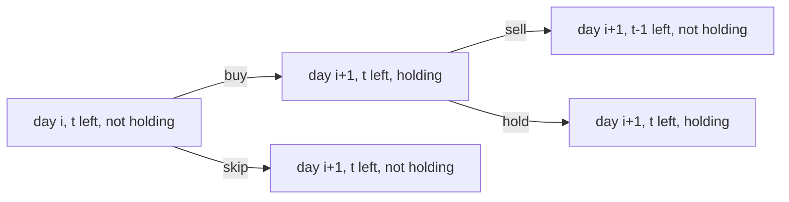

# Best Time to Buy and Sell Stock IV

**Difficulty:** Hard
**Pattern:** State Machine DP
**LeetCode:** #188

## Problem Statement
Given an integer `k` and array `prices`, return the maximum profit with at most `k` transactions.
Each transaction is one buy followed by one sell.

## Input/Output Examples
1. Input: `k = 2, prices = [2,4,1]` -> Output: `2`
2. Input: `k = 2, prices = [3,2,6,5,0,3]` -> Output: `7`

## Why This Is DP (overlapping + optimal substructure)
- Overlapping: same `(day, transactions_left, holding)` appears from different decision paths.
- Optimal substructure: optimal answer from day `i` builds from optimal answers of day `i+1`.

## Mermaid Visual


## Brute Force (Python)
```python
def max_profit_k_bruteforce(k, prices):
    n = len(prices)
    def dfs(i, t, holding):
        if i == n:
            return 0 if not holding else float("-inf")
        if t == 0 and not holding:
            return 0

        best = dfs(i + 1, t, holding)
        if holding:
            if t > 0:
                best = max(best, prices[i] + dfs(i + 1, t - 1, 0))
        else:
            if t > 0:
                best = max(best, -prices[i] + dfs(i + 1, t, 1))
        return best

    return dfs(0, k, 0)
```

## Optimal DP (Python)
```python
def max_profit_k_dp(k, prices):
    n = len(prices)
    if n == 0 or k == 0:
        return 0

    if k >= n // 2:
        return sum(max(0, prices[i] - prices[i - 1]) for i in range(1, n))

    hold = [float("-inf")] * (k + 1)
    cash = [0] * (k + 1)

    for p in prices:
        for t in range(1, k + 1):
            hold[t] = max(hold[t], cash[t] - p)
            cash[t] = max(cash[t], hold[t] + p)

    return cash[k]
```

## DP Checklist
- Define the DP state clearly before coding.
- Identify base cases that stop recursion/iteration.
- Write recurrence from smaller subproblems.
- Ensure transitions are valid for problem constraints.
- Decide top-down memo vs bottom-up table.
- Check if state compression is possible.
- Verify behavior on empty or minimal inputs.
- Confirm impossible states are handled safely.
- Test with monotonic, random, and duplicate-heavy data.
- Re-check off-by-one around boundaries.

## Minimal Test Harness (Python)
```python
def run_small_cases(cases, solver):
    """Simple harness to quickly smoke-test a DP implementation."""
    results = []
    for args, expected in cases:
        if isinstance(args, tuple):
            got = solver(*args)
        else:
            got = solver(args)
        results.append((got, expected, got == expected))
    return results
```

## Complexity (brute force + optimal)
- Brute force recursion: exponential in days and decisions, `O(n)` stack.
- Optimal DP: `O(n * k)` time, `O(k)` space.
