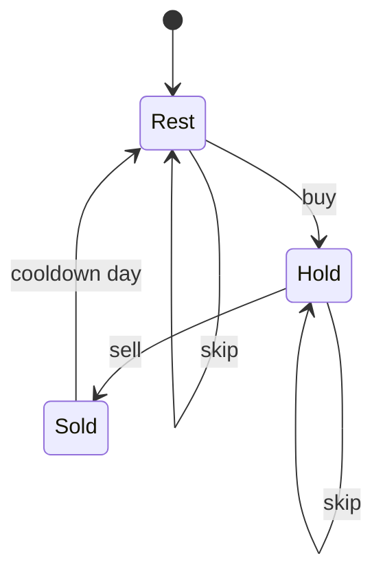

# Best Time to Buy and Sell Stock with Cooldown

**Difficulty:** Medium
**Pattern:** State Machine DP
**LeetCode:** #309

## Problem Statement
Given `prices`, maximize profit with unlimited transactions, but after selling you must cooldown for one day.
You cannot hold more than one stock at a time.

## Input/Output Examples
1. Input: `prices = [1,2,3,0,2]` -> Output: `3`
2. Input: `prices = [1]` -> Output: `0`

## Why This Is DP (overlapping + optimal substructure)
- Overlapping: same day/state (`hold`, `sold`, `rest`) is revisited.
- Optimal substructure: best state today depends only on best states from yesterday.

## Mermaid Visual


## Brute Force (Python)
```python
def max_profit_cooldown_bruteforce(prices):
    n = len(prices)
    def dfs(i, holding, cooldown):
        if i == n:
            return 0

        best = dfs(i + 1, holding, max(0, cooldown - 1))  # skip

        if holding:
            best = max(best, prices[i] + dfs(i + 1, 0, 1))
        elif cooldown == 0:
            best = max(best, -prices[i] + dfs(i + 1, 1, 0))

        return best

    return dfs(0, 0, 0)
```

## Optimal DP (Python)
```python
def max_profit_cooldown_dp(prices):
    hold = float("-inf")
    sold = float("-inf")
    rest = 0

    for p in prices:
        prev_sold = sold
        sold = hold + p
        hold = max(hold, rest - p)
        rest = max(rest, prev_sold)

    return max(sold, rest)
```

## DP Checklist
- Define the DP state clearly before coding.
- Identify base cases that stop recursion/iteration.
- Write recurrence from smaller subproblems.
- Ensure transitions are valid for problem constraints.
- Decide top-down memo vs bottom-up table.
- Check if state compression is possible.
- Verify behavior on empty or minimal inputs.
- Confirm impossible states are handled safely.
- Test with monotonic, random, and duplicate-heavy data.
- Re-check off-by-one around boundaries.

## Minimal Test Harness (Python)
```python
def run_small_cases(cases, solver):
    """Simple harness to quickly smoke-test a DP implementation."""
    results = []
    for args, expected in cases:
        if isinstance(args, tuple):
            got = solver(*args)
        else:
            got = solver(args)
        results.append((got, expected, got == expected))
    return results
```

## Complexity (brute force + optimal)
- Brute force recursion: exponential in days (roughly `O(3^n)`), `O(n)` stack.
- Optimal DP: `O(n)` time, `O(1)` space.
