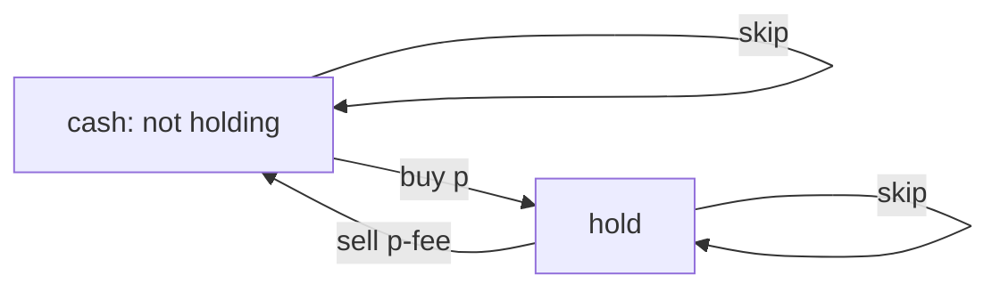

# Best Time to Buy and Sell Stock with Transaction Fee

**Difficulty:** Medium
**Pattern:** State Machine DP
**LeetCode:** #714

## Problem Statement
Given `prices` and transaction `fee`, return the max profit with unlimited transactions.
Each completed transaction pays the fee once.

## Input/Output Examples
1. Input: `prices = [1,3,2,8,4,9], fee = 2` -> Output: `8`
2. Input: `prices = [1,3,7,5,10,3], fee = 3` -> Output: `6`

## Why This Is DP (overlapping + optimal substructure)
- Overlapping: same day and holding/not-holding states recur.
- Optimal substructure: best value at day `i` comes from best day `i-1` states.

## Mermaid Visual


## Brute Force (Python)
```python
def max_profit_fee_bruteforce(prices, fee):
    n = len(prices)
    def dfs(i, holding):
        if i == n:
            return 0 if not holding else float("-inf")

        best = dfs(i + 1, holding)  # skip
        if holding:
            best = max(best, prices[i] - fee + dfs(i + 1, 0))
        else:
            best = max(best, -prices[i] + dfs(i + 1, 1))
        return best

    return dfs(0, 0)
```

## Optimal DP (Python)
```python
def max_profit_fee_dp(prices, fee):
    cash = 0
    hold = float("-inf")

    for p in prices:
        old_cash = cash
        cash = max(cash, hold + p - fee)
        hold = max(hold, old_cash - p)

    return cash
```

## DP Checklist
- Define the DP state clearly before coding.
- Identify base cases that stop recursion/iteration.
- Write recurrence from smaller subproblems.
- Ensure transitions are valid for problem constraints.
- Decide top-down memo vs bottom-up table.
- Check if state compression is possible.
- Verify behavior on empty or minimal inputs.
- Confirm impossible states are handled safely.
- Test with monotonic, random, and duplicate-heavy data.
- Re-check off-by-one around boundaries.

## Minimal Test Harness (Python)
```python
def run_small_cases(cases, solver):
    """Simple harness to quickly smoke-test a DP implementation."""
    results = []
    for args, expected in cases:
        if isinstance(args, tuple):
            got = solver(*args)
        else:
            got = solver(args)
        results.append((got, expected, got == expected))
    return results
```

## Complexity (brute force + optimal)
- Brute force recursion: exponential in days (roughly `O(3^n)`), `O(n)` stack.
- Optimal DP: `O(n)` time, `O(1)` space.
