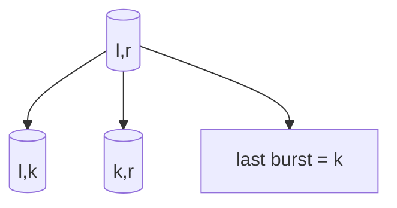

# Burst Balloons

**Difficulty:** Hard
**Pattern:** Interval DP
**LeetCode:** #312

## Problem Statement
Given `nums`, burst all balloons to maximize coins.
Bursting index `k` gives `left_value * nums[k] * right_value` where neighbors are the nearest unburst balloons.

## Input/Output Examples
1. Input: `nums = [3,1,5,8]` -> Output: `167`
2. Input: `nums = [1,5]` -> Output: `10`

## Why This Is DP (overlapping + optimal substructure)
- Overlapping: same interval `(l, r)` is solved repeatedly.
- Optimal substructure: if `k` is last balloon in interval, left and right subintervals are independent.

## Mermaid Visual


## Brute Force (Python)
```python
def max_coins_bruteforce(nums):
    arr = [1] + nums + [1]
    n = len(arr)
    def dfs(l, r):
        if l + 1 >= r:
            return 0
        best = 0
        for k in range(l + 1, r):
            gain = arr[l] * arr[k] * arr[r]
            best = max(best, gain + dfs(l, k) + dfs(k, r))
        return best

    return dfs(0, n - 1)
```

## Optimal DP (Python)
```python
def max_coins_dp(nums):
    arr = [1] + nums + [1]
    n = len(arr)
    dp = [[0] * n for _ in range(n)]

    for length in range(2, n):
        for l in range(0, n - length):
            r = l + length
            for k in range(l + 1, r):
                gain = arr[l] * arr[k] * arr[r]
                dp[l][r] = max(dp[l][r], gain + dp[l][k] + dp[k][r])

    return dp[0][n - 1]
```

## DP Checklist
- Define the DP state clearly before coding.
- Identify base cases that stop recursion/iteration.
- Write recurrence from smaller subproblems.
- Ensure transitions are valid for problem constraints.
- Decide top-down memo vs bottom-up table.
- Check if state compression is possible.
- Verify behavior on empty or minimal inputs.
- Confirm impossible states are handled safely.
- Test with monotonic, random, and duplicate-heavy data.
- Re-check off-by-one around boundaries.

## Minimal Test Harness (Python)
```python
def run_small_cases(cases, solver):
    """Simple harness to quickly smoke-test a DP implementation."""
    results = []
    for args, expected in cases:
        if isinstance(args, tuple):
            got = solver(*args)
        else:
            got = solver(args)
        results.append((got, expected, got == expected))
    return results
```

## Complexity (brute force + optimal)
- Brute force recursion: super-exponential growth (Catalan-like split choices).
- Optimal interval DP: `O(n^3)` time, `O(n^2)` space.
