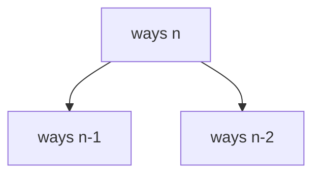

# Climbing Stairs

**Difficulty:** Easy
**Pattern:** 1D DP / Fibonacci
**LeetCode:** #70

## Problem Statement
Given `n` steps, each move can climb 1 or 2 steps.
Return the number of distinct ways to reach step `n`.

## Input/Output Examples
1. Input: `n = 2` -> Output: `2`
2. Input: `n = 3` -> Output: `3`
3. Input: `n = 5` -> Output: `8`

## Why This Is DP (overlapping + optimal substructure)
- Overlapping: ways(`n-1`) and ways(`n-2`) are reused many times.
- Optimal substructure: ways(`n`) = ways(`n-1`) + ways(`n-2`).

## Mermaid Visual


## Brute Force (Python)
```python
def climb_stairs_bruteforce(n):
    if n <= 2:
        return n
    return climb_stairs_bruteforce(n - 1) + climb_stairs_bruteforce(n - 2)
```

## Optimal DP (Python)
```python
def climb_stairs_dp(n):
    if n <= 2:
        return n

    a, b = 1, 2
    for _ in range(3, n + 1):
        a, b = b, a + b
    return b
```

## DP Checklist
- Define the DP state clearly before coding.
- Identify base cases that stop recursion/iteration.
- Write recurrence from smaller subproblems.
- Ensure transitions are valid for problem constraints.
- Decide top-down memo vs bottom-up table.
- Check if state compression is possible.
- Verify behavior on empty or minimal inputs.
- Confirm impossible states are handled safely.
- Test with monotonic, random, and duplicate-heavy data.
- Re-check off-by-one around boundaries.

## Minimal Test Harness (Python)
```python
def run_small_cases(cases, solver):
    """Simple harness to quickly smoke-test a DP implementation."""
    results = []
    for args, expected in cases:
        if isinstance(args, tuple):
            got = solver(*args)
        else:
            got = solver(args)
        results.append((got, expected, got == expected))
    return results
```

## Common Pitfalls
- Forgetting the `n <= 2` base cases.
- Mixing step index with number of ways.
- Returning `a` instead of `b` after the loop.

## Complexity (brute force + optimal)
- Brute force recursion: `O(2^n)` time, `O(n)` stack.
- Optimal DP: `O(n)` time, `O(1)` space.
