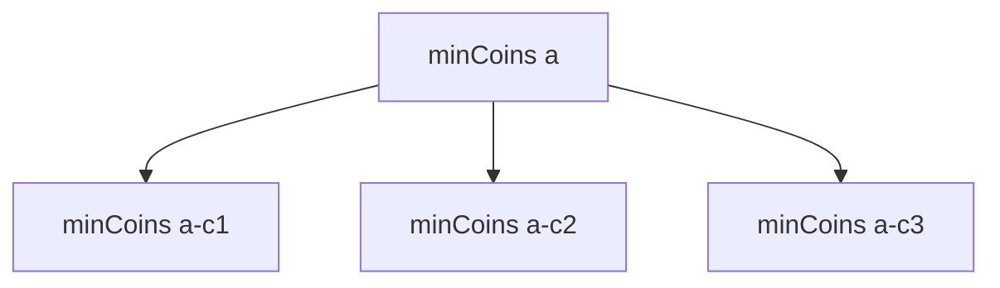

# Coin Change

**Difficulty:** Medium
**Pattern:** Unbounded Knapsack DP
**LeetCode:** #322

## Problem Statement
Given `coins` and integer `amount`, return the fewest coins needed to make `amount`.
Return `-1` if impossible.

## Input/Output Examples
1. Input: `coins = [1,2,5], amount = 11` -> Output: `3`
2. Input: `coins = [2], amount = 3` -> Output: `-1`
3. Input: `coins = [1], amount = 0` -> Output: `0`

## Why This Is DP (overlapping + optimal substructure)
- Overlapping: min coins for sub-amounts like `7`, `6`, `5` are reused.
- Optimal substructure: best for `a` is `1 + min(best[a - coin])`.

## Mermaid Visual


## Brute Force (Python)
```python
def coin_change_bruteforce(coins, amount):
    def dfs(rem):
        if rem == 0:
            return 0
        if rem < 0:
            return float("inf")

        best = float("inf")
        for c in coins:
            best = min(best, 1 + dfs(rem - c))
        return best

    ans = dfs(amount)
    return -1 if ans == float("inf") else ans
```

## Optimal DP (Python)
```python
def coin_change_dp(coins, amount):
    inf = amount + 1
    dp = [inf] * (amount + 1)
    dp[0] = 0

    for a in range(1, amount + 1):
        for c in coins:
            if a >= c:
                dp[a] = min(dp[a], 1 + dp[a - c])

    return -1 if dp[amount] == inf else dp[amount]
```

## DP Checklist
- Define the DP state clearly before coding.
- Identify base cases that stop recursion/iteration.
- Write recurrence from smaller subproblems.
- Ensure transitions are valid for problem constraints.
- Decide top-down memo vs bottom-up table.
- Check if state compression is possible.
- Verify behavior on empty or minimal inputs.
- Confirm impossible states are handled safely.
- Test with monotonic, random, and duplicate-heavy data.
- Re-check off-by-one around boundaries.

## Minimal Test Harness (Python)
```python
def run_small_cases(cases, solver):
    """Simple harness to quickly smoke-test a DP implementation."""
    results = []
    for args, expected in cases:
        if isinstance(args, tuple):
            got = solver(*args)
        else:
            got = solver(args)
        results.append((got, expected, got == expected))
    return results
```

## Complexity (brute force + optimal)
- Brute force recursion: `O(len(coins)^amount)` time in the worst case, `O(amount)` stack.
- Optimal DP: `O(amount * len(coins))` time, `O(amount)` space.
