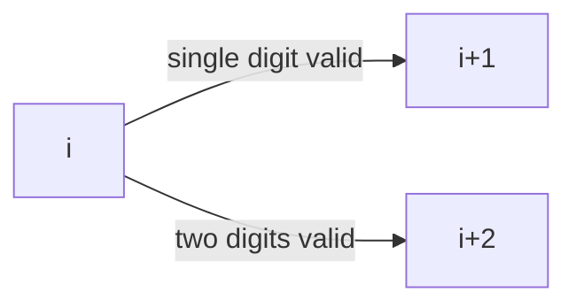

# Decode Ways

**Difficulty:** Medium
**Pattern:** String DP / 1D DP
**LeetCode:** #91

## Problem Statement
Digits map to letters: `1 -> A` ... `26 -> Z`.
Given a digit string `s`, return how many valid decodings exist.
A leading zero is invalid, and two-digit decode must be between 10 and 26.

## Input/Output Examples
1. Input: `s = "12"` -> Output: `2`
2. Input: `s = "226"` -> Output: `3`
3. Input: `s = "06"` -> Output: `0`

## Why This Is DP (overlapping + optimal substructure)
- Overlapping: number of decodings from index `i` is reused from many paths.
- Optimal substructure: `ways[i]` depends on `ways[i+1]` and `ways[i+2]`.

## Mermaid Visual


## Brute Force (Python)
```python
def num_decodings_bruteforce(s):
    n = len(s)
    def dfs(i):
        if i == n:
            return 1
        if s[i] == "0":
            return 0

        ans = dfs(i + 1)
        if i + 1 < n and 10 <= int(s[i:i + 2]) <= 26:
            ans += dfs(i + 2)
        return ans

    return dfs(0)
```

## Optimal DP (Python)
```python
def num_decodings_dp(s):
    n = len(s)
    if n == 0 or s[0] == "0":
        return 0

    dp = [0] * (n + 1)
    dp[n] = 1

    for i in range(n - 1, -1, -1):
        if s[i] != "0":
            dp[i] = dp[i + 1]
            if i + 1 < n and 10 <= int(s[i:i + 2]) <= 26:
                dp[i] += dp[i + 2]

    return dp[0]
```

## DP Checklist
- Define the DP state clearly before coding.
- Identify base cases that stop recursion/iteration.
- Write recurrence from smaller subproblems.
- Ensure transitions are valid for problem constraints.
- Decide top-down memo vs bottom-up table.
- Check if state compression is possible.
- Verify behavior on empty or minimal inputs.
- Confirm impossible states are handled safely.
- Test with monotonic, random, and duplicate-heavy data.
- Re-check off-by-one around boundaries.

## Minimal Test Harness (Python)
```python
def run_small_cases(cases, solver):
    """Simple harness to quickly smoke-test a DP implementation."""
    results = []
    for args, expected in cases:
        if isinstance(args, tuple):
            got = solver(*args)
        else:
            got = solver(args)
        results.append((got, expected, got == expected))
    return results
```

## Complexity (brute force + optimal)
- Brute force recursion: `O(2^n)` time, `O(n)` stack.
- Optimal DP: `O(n)` time, `O(n)` space.
