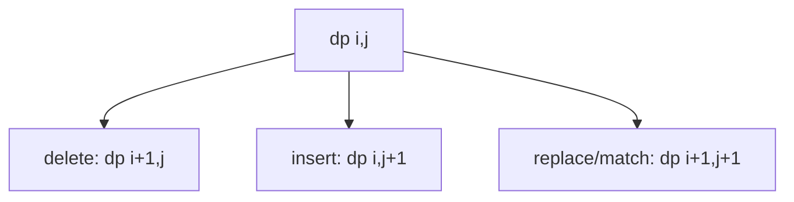

# Edit Distance

**Difficulty:** Medium
**Pattern:** 2D String DP
**LeetCode:** #72

## Problem Statement
Given `word1` and `word2`, return the minimum operations to convert `word1` to `word2`.
Allowed operations: insert, delete, replace.

## Input/Output Examples
1. Input: `word1 = "horse", word2 = "ros"` -> Output: `3`
2. Input: `word1 = "intention", word2 = "execution"` -> Output: `5`

## Why This Is DP (overlapping + optimal substructure)
- Overlapping: many choices lead to same suffix pair `(i, j)`.
- Optimal substructure: best edit count for `(i, j)` uses best of neighboring states.

## Mermaid Visual


## Brute Force (Python)
```python
def min_distance_bruteforce(word1, word2):
    n1, n2 = len(word1), len(word2)
    def dfs(i, j):
        if i == n1:
            return n2 - j
        if j == n2:
            return n1 - i

        if word1[i] == word2[j]:
            return dfs(i + 1, j + 1)

        return 1 + min(
            dfs(i + 1, j),
            dfs(i, j + 1),
            dfs(i + 1, j + 1),
        )

    return dfs(0, 0)
```

## Optimal DP (Python)
```python
def min_distance_dp(word1, word2):
    n1, n2 = len(word1), len(word2)
    dp = [[0] * (n2 + 1) for _ in range(n1 + 1)]

    for i in range(n1 + 1):
        dp[i][n2] = n1 - i
    for j in range(n2 + 1):
        dp[n1][j] = n2 - j

    for i in range(n1 - 1, -1, -1):
        for j in range(n2 - 1, -1, -1):
            if word1[i] == word2[j]:
                dp[i][j] = dp[i + 1][j + 1]
            else:
                dp[i][j] = 1 + min(dp[i + 1][j], dp[i][j + 1], dp[i + 1][j + 1])

    return dp[0][0]
```

## DP Checklist
- Define the DP state clearly before coding.
- Identify base cases that stop recursion/iteration.
- Write recurrence from smaller subproblems.
- Ensure transitions are valid for problem constraints.
- Decide top-down memo vs bottom-up table.
- Check if state compression is possible.
- Verify behavior on empty or minimal inputs.
- Confirm impossible states are handled safely.
- Test with monotonic, random, and duplicate-heavy data.
- Re-check off-by-one around boundaries.

## Minimal Test Harness (Python)
```python
def run_small_cases(cases, solver):
    """Simple harness to quickly smoke-test a DP implementation."""
    results = []
    for args, expected in cases:
        if isinstance(args, tuple):
            got = solver(*args)
        else:
            got = solver(args)
        results.append((got, expected, got == expected))
    return results
```

## Complexity (brute force + optimal)
- Brute force recursion: `O(3^(n1+n2))` time, `O(n1+n2)` stack.
- Optimal DP: `O(n1 * n2)` time, `O(n1 * n2)` space.
