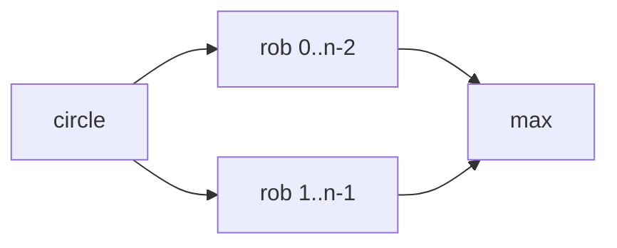

# House Robber II

**Difficulty:** Medium
**Pattern:** 1D DP / Circular Array
**LeetCode:** #213

## Problem Statement
Houses are in a circle, so first and last are adjacent.
Return max amount you can rob without robbing adjacent houses.

## Input/Output Examples
1. Input: `nums = [2,3,2]` -> Output: `3`
2. Input: `nums = [1,2,3,1]` -> Output: `4`
3. Input: `nums = [1,2,1,1]` -> Output: `3`

## Why This Is DP (overlapping + optimal substructure)
- Overlapping: linear robber subproblems reuse prefix results.
- Optimal substructure: circular case is max of two linear cases: exclude first or exclude last.

## Mermaid Visual


## Brute Force (Python)
```python
def rob2_bruteforce(nums):
    n = len(nums)
    if n == 1:
        return nums[0]

    def solve(arr):
        def dfs(i):
            if i >= len(arr):
                return 0
            return max(dfs(i + 1), arr[i] + dfs(i + 2))
        return dfs(0)

    return max(solve(tuple(nums[:-1])), solve(tuple(nums[1:])))
```

## Optimal DP (Python)
```python
def rob2_dp(nums):
    n = len(nums)
    if n == 1:
        return nums[0]

    def rob_line(arr):
        prev2, prev1 = 0, 0
        for x in arr:
            prev2, prev1 = prev1, max(prev1, prev2 + x)
        return prev1

    return max(rob_line(nums[:-1]), rob_line(nums[1:]))
```

## DP Checklist
- Define the DP state clearly before coding.
- Identify base cases that stop recursion/iteration.
- Write recurrence from smaller subproblems.
- Ensure transitions are valid for problem constraints.
- Decide top-down memo vs bottom-up table.
- Check if state compression is possible.
- Verify behavior on empty or minimal inputs.
- Confirm impossible states are handled safely.
- Test with monotonic, random, and duplicate-heavy data.
- Re-check off-by-one around boundaries.

## Minimal Test Harness (Python)
```python
def run_small_cases(cases, solver):
    """Simple harness to quickly smoke-test a DP implementation."""
    results = []
    for args, expected in cases:
        if isinstance(args, tuple):
            got = solver(*args)
        else:
            got = solver(args)
        results.append((got, expected, got == expected))
    return results
```

## Complexity (brute force + optimal)
- Brute force recursion: `O(2^n)` time, `O(n)` stack.
- Optimal DP: `O(n)` time, `O(1)` space.
