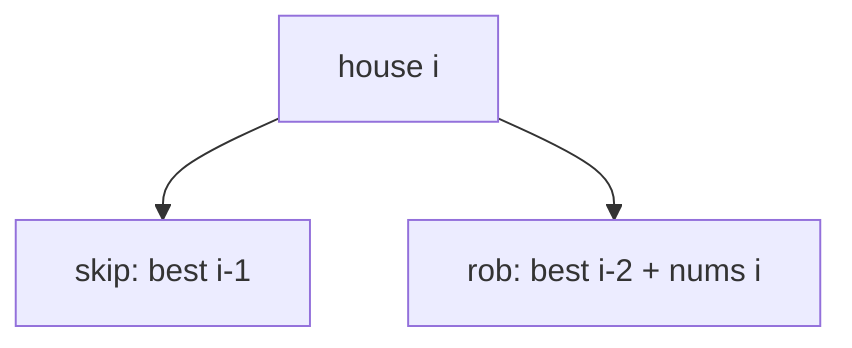

# House Robber

**Difficulty:** Medium
**Pattern:** 1D DP
**LeetCode:** #198

## Problem Statement
Given `nums[i]` as money in each house on a line, return the max amount you can rob.
You cannot rob two adjacent houses.

## Input/Output Examples
1. Input: `nums = [1,2,3,1]` -> Output: `4`
2. Input: `nums = [2,7,9,3,1]` -> Output: `12`

## Why This Is DP (overlapping + optimal substructure)
- Overlapping: best for prefix ending at `i` is reused when solving `i+1`.
- Optimal substructure: at house `i`, choose max of skip (`i-1`) or rob (`i-2 + nums[i]`).

## Mermaid Visual


## Brute Force (Python)
```python
def rob_bruteforce(nums):
    def dfs(i):
        if i >= len(nums):
            return 0
        return max(dfs(i + 1), nums[i] + dfs(i + 2))

    return dfs(0)
```

## Optimal DP (Python)
```python
def rob_dp(nums):
    prev2, prev1 = 0, 0
    for money in nums:
        prev2, prev1 = prev1, max(prev1, prev2 + money)
    return prev1
```

## DP Checklist
- Define the DP state clearly before coding.
- Identify base cases that stop recursion/iteration.
- Write recurrence from smaller subproblems.
- Ensure transitions are valid for problem constraints.
- Decide top-down memo vs bottom-up table.
- Check if state compression is possible.
- Verify behavior on empty or minimal inputs.
- Confirm impossible states are handled safely.
- Test with monotonic, random, and duplicate-heavy data.
- Re-check off-by-one around boundaries.

## Minimal Test Harness (Python)
```python
def run_small_cases(cases, solver):
    """Simple harness to quickly smoke-test a DP implementation."""
    results = []
    for args, expected in cases:
        if isinstance(args, tuple):
            got = solver(*args)
        else:
            got = solver(args)
        results.append((got, expected, got == expected))
    return results
```

## Common Pitfalls
- Using greedy local choice instead of DP recurrence.
- Forgetting that adjacent houses cannot both be robbed.
- Mis-initializing rolling variables for small arrays.

## Complexity (brute force + optimal)
- Brute force recursion: `O(2^n)` time, `O(n)` stack.
- Optimal DP: `O(n)` time, `O(1)` space.
