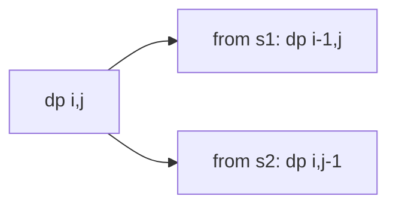

# Interleaving String

**Difficulty:** Medium
**Pattern:** String DP / 2D DP
**LeetCode:** #97

## Problem Statement
Given `s1`, `s2`, and `s3`, return `true` if `s3` is formed by interleaving `s1` and `s2`.
Relative order inside each source string must be preserved.

## Input/Output Examples
1. Input: `s1="aabcc", s2="dbbca", s3="aadbbcbcac"` -> Output: `true`
2. Input: `s1="aabcc", s2="dbbca", s3="aadbbbaccc"` -> Output: `false`
3. Input: `s1="", s2="", s3=""` -> Output: `true`

## Why This Is DP (overlapping + optimal substructure)
- Overlapping: same index pair `(i, j)` is reached by multiple merge paths.
- Optimal substructure: truth of `(i, j)` depends on neighboring states `(i-1, j)` and `(i, j-1)`.

## Mermaid Visual


## Brute Force (Python)
```python
def is_interleave_bruteforce(s1, s2, s3):
    if len(s1) + len(s2) != len(s3):
        return False
    def dfs(i, j):
        k = i + j
        if k == len(s3):
            return True

        ok = False
        if i < len(s1) and s1[i] == s3[k]:
            ok = ok or dfs(i + 1, j)
        if j < len(s2) and s2[j] == s3[k]:
            ok = ok or dfs(i, j + 1)
        return ok

    return dfs(0, 0)
```

## Optimal DP (Python)
```python
def is_interleave_dp(s1, s2, s3):
    m, n = len(s1), len(s2)
    if m + n != len(s3):
        return False

    dp = [[False] * (n + 1) for _ in range(m + 1)]
    dp[0][0] = True

    for i in range(m + 1):
        for j in range(n + 1):
            if i > 0 and s1[i - 1] == s3[i + j - 1]:
                dp[i][j] = dp[i][j] or dp[i - 1][j]
            if j > 0 and s2[j - 1] == s3[i + j - 1]:
                dp[i][j] = dp[i][j] or dp[i][j - 1]

    return dp[m][n]
```

## DP Checklist
- Define the DP state clearly before coding.
- Identify base cases that stop recursion/iteration.
- Write recurrence from smaller subproblems.
- Ensure transitions are valid for problem constraints.
- Decide top-down memo vs bottom-up table.
- Check if state compression is possible.
- Verify behavior on empty or minimal inputs.
- Confirm impossible states are handled safely.
- Test with monotonic, random, and duplicate-heavy data.
- Re-check off-by-one around boundaries.

## Minimal Test Harness (Python)
```python
def run_small_cases(cases, solver):
    """Simple harness to quickly smoke-test a DP implementation."""
    results = []
    for args, expected in cases:
        if isinstance(args, tuple):
            got = solver(*args)
        else:
            got = solver(args)
        results.append((got, expected, got == expected))
    return results
```

## Complexity (brute force + optimal)
- Brute force recursion: `O(2^(len(s1)+len(s2)))` time, `O(len(s1)+len(s2))` stack.
- Optimal DP: `O(len(s1) * len(s2))` time and space.
