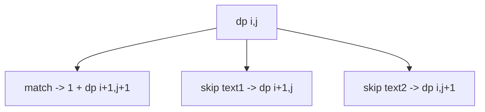

# Longest Common Subsequence

**Difficulty:** Medium
**Pattern:** 2D String DP
**LeetCode:** #1143

## Problem Statement
Given strings `text1` and `text2`, return the length of their longest common subsequence (LCS).
A subsequence keeps order but may skip characters.

## Input/Output Examples
1. Input: `text1="abcde", text2="ace"` -> Output: `3`
2. Input: `text1="abc", text2="abc"` -> Output: `3`
3. Input: `text1="abc", text2="def"` -> Output: `0`

## Why This Is DP (overlapping + optimal substructure)
- Overlapping: same suffix pair `(i, j)` is recomputed in recursion.
- Optimal substructure: if chars match, take `1 + dp[i+1][j+1]`; else max of two skips.

## Mermaid Visual


## Brute Force (Python)
```python
def lcs_bruteforce(text1, text2):
    def dfs(i, j):
        if i == len(text1) or j == len(text2):
            return 0
        if text1[i] == text2[j]:
            return 1 + dfs(i + 1, j + 1)
        return max(dfs(i + 1, j), dfs(i, j + 1))

    return dfs(0, 0)
```

## Optimal DP (Python)
```python
def lcs_dp(text1, text2):
    m, n = len(text1), len(text2)
    dp = [[0] * (n + 1) for _ in range(m + 1)]

    for i in range(m - 1, -1, -1):
        for j in range(n - 1, -1, -1):
            if text1[i] == text2[j]:
                dp[i][j] = 1 + dp[i + 1][j + 1]
            else:
                dp[i][j] = max(dp[i + 1][j], dp[i][j + 1])

    return dp[0][0]
```

## DP Checklist
- Define the DP state clearly before coding.
- Identify base cases that stop recursion/iteration.
- Write recurrence from smaller subproblems.
- Ensure transitions are valid for problem constraints.
- Decide top-down memo vs bottom-up table.
- Check if state compression is possible.
- Verify behavior on empty or minimal inputs.
- Confirm impossible states are handled safely.
- Test with monotonic, random, and duplicate-heavy data.
- Re-check off-by-one around boundaries.

## Minimal Test Harness (Python)
```python
def run_small_cases(cases, solver):
    """Simple harness to quickly smoke-test a DP implementation."""
    results = []
    for args, expected in cases:
        if isinstance(args, tuple):
            got = solver(*args)
        else:
            got = solver(args)
        results.append((got, expected, got == expected))
    return results
```

## Complexity (brute force + optimal)
- Brute force recursion: approximately `O(2^(m+n))` time, `O(m+n)` stack.
- Optimal DP: `O(m * n)` time, `O(m * n)` space.
