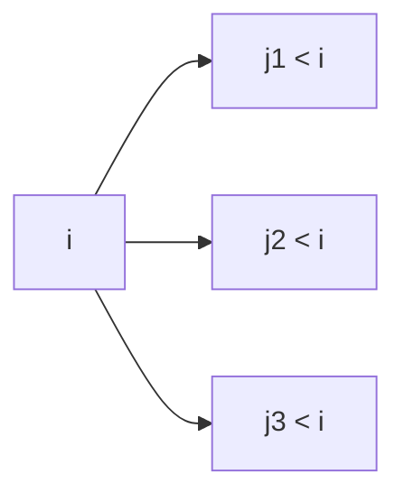

# Longest Increasing Subsequence

**Difficulty:** Medium
**Pattern:** LIS DP / Binary Search
**LeetCode:** #300

## Problem Statement
Given `nums`, return the length of the longest strictly increasing subsequence.

## Input/Output Examples
1. Input: `nums = [10,9,2,5,3,7,101,18]` -> Output: `4`
2. Input: `nums = [0,1,0,3,2,3]` -> Output: `4`
3. Input: `nums = [7,7,7,7,7]` -> Output: `1`

## Why This Is DP (overlapping + optimal substructure)
- Overlapping: LIS ending at index `i` depends on many earlier LIS values reused repeatedly.
- Optimal substructure: LIS at `i` is `1 + max(LIS(j))` over valid `j < i` and `nums[j] < nums[i]`.

## Mermaid Visual


## Brute Force (Python)
```python
def lis_bruteforce(nums):
    def dfs(i, prev_index):
        if i == len(nums):
            return 0

        skip = dfs(i + 1, prev_index)
        take = 0
        if prev_index == -1 or nums[i] > nums[prev_index]:
            take = 1 + dfs(i + 1, i)
        return max(skip, take)

    return dfs(0, -1)
```

## Optimal DP (Python)
```python
def lis_dp(nums):
    if not nums:
        return 0

    dp = [1] * len(nums)
    for i in range(len(nums)):
        for j in range(i):
            if nums[j] < nums[i]:
                dp[i] = max(dp[i], dp[j] + 1)

    return max(dp)
```

## DP Checklist
- Define the DP state clearly before coding.
- Identify base cases that stop recursion/iteration.
- Write recurrence from smaller subproblems.
- Ensure transitions are valid for problem constraints.
- Decide top-down memo vs bottom-up table.
- Check if state compression is possible.
- Verify behavior on empty or minimal inputs.
- Confirm impossible states are handled safely.
- Test with monotonic, random, and duplicate-heavy data.
- Re-check off-by-one around boundaries.

## Minimal Test Harness (Python)
```python
def run_small_cases(cases, solver):
    """Simple harness to quickly smoke-test a DP implementation."""
    results = []
    for args, expected in cases:
        if isinstance(args, tuple):
            got = solver(*args)
        else:
            got = solver(args)
        results.append((got, expected, got == expected))
    return results
```

## Complexity (brute force + optimal)
- Brute force recursion: `O(2^n)` time, `O(n)` stack.
- Optimal DP (`O(n^2)` version): `O(n^2)` time, `O(n)` space.
