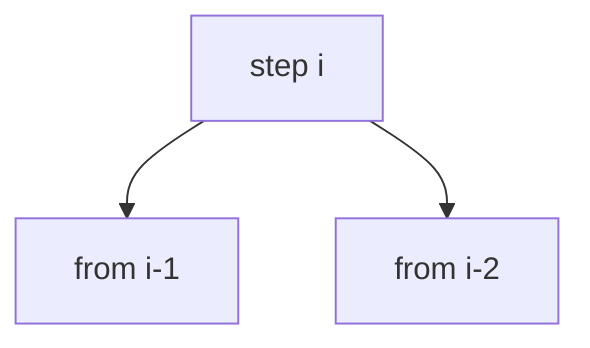

# Min Cost Climbing Stairs

**Difficulty:** Easy
**Pattern:** 1D DP
**LeetCode:** #746

## Problem Statement
Given `cost[i]` for stepping on stair `i`, return minimum cost to reach the top.
You can start at step 0 or 1, and move by 1 or 2 steps.

## Input/Output Examples
1. Input: `cost = [10,15,20]` -> Output: `15`
2. Input: `cost = [1,100,1,1,1,100,1,1,100,1]` -> Output: `6`

## Why This Is DP (overlapping + optimal substructure)
- Overlapping: minimum cost to reach each step is reused.
- Optimal substructure: `dp[i] = cost[i] + min(dp[i-1], dp[i-2])`.

## Mermaid Visual


## Brute Force (Python)
```python
def min_cost_bruteforce(cost):
    n = len(cost)
    def dfs(i):
        if i >= n:
            return 0
        return cost[i] + min(dfs(i + 1), dfs(i + 2))

    return min(dfs(0), dfs(1))
```

## Optimal DP (Python)
```python
def min_cost_dp(cost):
    n = len(cost)
    if n <= 2:
        return min(cost)

    dp = [0] * n
    dp[0], dp[1] = cost[0], cost[1]

    for i in range(2, n):
        dp[i] = cost[i] + min(dp[i - 1], dp[i - 2])

    return min(dp[n - 1], dp[n - 2])
```

## DP Checklist
- Define the DP state clearly before coding.
- Identify base cases that stop recursion/iteration.
- Write recurrence from smaller subproblems.
- Ensure transitions are valid for problem constraints.
- Decide top-down memo vs bottom-up table.
- Check if state compression is possible.
- Verify behavior on empty or minimal inputs.
- Confirm impossible states are handled safely.
- Test with monotonic, random, and duplicate-heavy data.
- Re-check off-by-one around boundaries.

## Minimal Test Harness (Python)
```python
def run_small_cases(cases, solver):
    """Simple harness to quickly smoke-test a DP implementation."""
    results = []
    for args, expected in cases:
        if isinstance(args, tuple):
            got = solver(*args)
        else:
            got = solver(args)
        results.append((got, expected, got == expected))
    return results
```

## Complexity (brute force + optimal)
- Brute force recursion: `O(2^n)` time, `O(n)` stack.
- Optimal DP: `O(n)` time, `O(n)` space.
