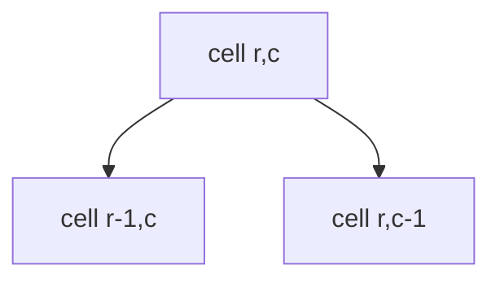

# Minimum Path Sum

**Difficulty:** Medium
**Pattern:** 2D Grid DP
**LeetCode:** #64

## Problem Statement
Given a non-negative `m x n` grid, find a path from top-left to bottom-right with minimum sum.
You may move only right or down.

## Input/Output Examples
1. Input: `grid = [[1,3,1],[1,5,1],[4,2,1]]` -> Output: `7`
2. Input: `grid = [[1,2,3],[4,5,6]]` -> Output: `12`

## Why This Is DP (overlapping + optimal substructure)
- Overlapping: min cost to each cell is reused by neighbors.
- Optimal substructure: best to `(r,c)` is grid value plus min of top or left best.

## Mermaid Visual


## Brute Force (Python)
```python
def min_path_sum_bruteforce(grid):
    rows, cols = len(grid), len(grid[0])
    def dfs(r, c):
        if r == rows - 1 and c == cols - 1:
            return grid[r][c]
        best = float("inf")
        if r + 1 < rows:
            best = min(best, dfs(r + 1, c))
        if c + 1 < cols:
            best = min(best, dfs(r, c + 1))
        return grid[r][c] + best

    return dfs(0, 0)
```

## Optimal DP (Python)
```python
def min_path_sum_dp(grid):
    rows, cols = len(grid), len(grid[0])
    dp = [[0] * cols for _ in range(rows)]
    dp[0][0] = grid[0][0]

    for r in range(1, rows):
        dp[r][0] = dp[r - 1][0] + grid[r][0]
    for c in range(1, cols):
        dp[0][c] = dp[0][c - 1] + grid[0][c]

    for r in range(1, rows):
        for c in range(1, cols):
            dp[r][c] = grid[r][c] + min(dp[r - 1][c], dp[r][c - 1])

    return dp[rows - 1][cols - 1]
```

## DP Checklist
- Define the DP state clearly before coding.
- Identify base cases that stop recursion/iteration.
- Write recurrence from smaller subproblems.
- Ensure transitions are valid for problem constraints.
- Decide top-down memo vs bottom-up table.
- Check if state compression is possible.
- Verify behavior on empty or minimal inputs.
- Confirm impossible states are handled safely.
- Test with monotonic, random, and duplicate-heavy data.
- Re-check off-by-one around boundaries.

## Minimal Test Harness (Python)
```python
def run_small_cases(cases, solver):
    """Simple harness to quickly smoke-test a DP implementation."""
    results = []
    for args, expected in cases:
        if isinstance(args, tuple):
            got = solver(*args)
        else:
            got = solver(args)
        results.append((got, expected, got == expected))
    return results
```

## Complexity (brute force + optimal)
- Brute force recursion: approximately `O(2^(rows+cols))` time, `O(rows+cols)` stack.
- Optimal DP: `O(rows * cols)` time, `O(rows * cols)` space.
