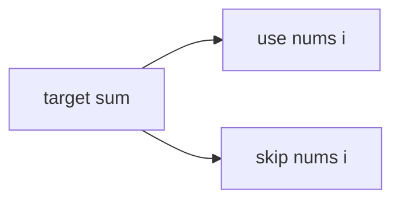

# Partition Equal Subset Sum

**Difficulty:** Medium
**Pattern:** 0/1 Knapsack DP
**LeetCode:** #416

## Problem Statement
Given array `nums`, return `true` if it can be split into two subsets with equal sum.

## Input/Output Examples
1. Input: `nums = [1,5,11,5]` -> Output: `true`
2. Input: `nums = [1,2,3,5]` -> Output: `false`

## Why This Is DP (overlapping + optimal substructure)
- Overlapping: same `(index, remaining_sum)` state appears repeatedly.
- Optimal substructure: choose current number or skip it and combine subresults.

## Mermaid Visual


## Brute Force (Python)
```python
def can_partition_bruteforce(nums):
    total = sum(nums)
    if total % 2:
        return False
    target = total // 2
    def dfs(i, rem):
        if rem == 0:
            return True
        if i == len(nums) or rem < 0:
            return False
        return dfs(i + 1, rem - nums[i]) or dfs(i + 1, rem)

    return dfs(0, target)
```

## Optimal DP (Python)
```python
def can_partition_dp(nums):
    total = sum(nums)
    if total % 2:
        return False

    target = total // 2
    dp = [False] * (target + 1)
    dp[0] = True

    for x in nums:
        for s in range(target, x - 1, -1):
            dp[s] = dp[s] or dp[s - x]

    return dp[target]
```

## DP Checklist
- Define the DP state clearly before coding.
- Identify base cases that stop recursion/iteration.
- Write recurrence from smaller subproblems.
- Ensure transitions are valid for problem constraints.
- Decide top-down memo vs bottom-up table.
- Check if state compression is possible.
- Verify behavior on empty or minimal inputs.
- Confirm impossible states are handled safely.
- Test with monotonic, random, and duplicate-heavy data.
- Re-check off-by-one around boundaries.

## Minimal Test Harness (Python)
```python
def run_small_cases(cases, solver):
    """Simple harness to quickly smoke-test a DP implementation."""
    results = []
    for args, expected in cases:
        if isinstance(args, tuple):
            got = solver(*args)
        else:
            got = solver(args)
        results.append((got, expected, got == expected))
    return results
```

## Complexity (brute force + optimal)
- Brute force recursion: `O(2^n)` time, `O(n)` stack.
- Optimal DP: `O(n * target)` time, `O(target)` space.
