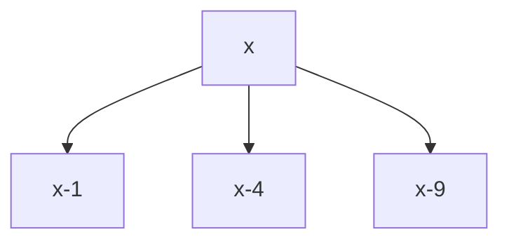

# Perfect Squares

**Difficulty:** Medium
**Pattern:** Unbounded Knapsack DP
**LeetCode:** #279

## Problem Statement
Given integer `n`, return the least number of perfect squares that sum to `n`.

## Input/Output Examples
1. Input: `n = 12` -> Output: `3` (`4 + 4 + 4`)
2. Input: `n = 13` -> Output: `2` (`4 + 9`)

## Why This Is DP (overlapping + optimal substructure)
- Overlapping: same remainder values appear in many decompositions.
- Optimal substructure: best for `x` is `1 + min(best[x - sq])` over square numbers.

## Mermaid Visual


## Brute Force (Python)
```python
def num_squares_bruteforce(n):
    squares = [i * i for i in range(1, int(n ** 0.5) + 1)]
    def dfs(rem):
        if rem == 0:
            return 0
        best = float("inf")
        for sq in squares:
            if sq > rem:
                break
            best = min(best, 1 + dfs(rem - sq))
        return best

    return dfs(n)
```

## Optimal DP (Python)
```python
def num_squares_dp(n):
    squares = [i * i for i in range(1, int(n ** 0.5) + 1)]
    dp = [0] + [float("inf")] * n

    for x in range(1, n + 1):
        for sq in squares:
            if sq > x:
                break
            dp[x] = min(dp[x], 1 + dp[x - sq])

    return dp[n]
```

## DP Checklist
- Define the DP state clearly before coding.
- Identify base cases that stop recursion/iteration.
- Write recurrence from smaller subproblems.
- Ensure transitions are valid for problem constraints.
- Decide top-down memo vs bottom-up table.
- Check if state compression is possible.
- Verify behavior on empty or minimal inputs.
- Confirm impossible states are handled safely.
- Test with monotonic, random, and duplicate-heavy data.
- Re-check off-by-one around boundaries.

## Minimal Test Harness (Python)
```python
def run_small_cases(cases, solver):
    """Simple harness to quickly smoke-test a DP implementation."""
    results = []
    for args, expected in cases:
        if isinstance(args, tuple):
            got = solver(*args)
        else:
            got = solver(args)
        results.append((got, expected, got == expected))
    return results
```

## Complexity (brute force + optimal)
- Brute force recursion: exponential in `n` (many repeated remainder branches).
- Optimal DP: `O(n * sqrt(n))` time, `O(n)` space.
