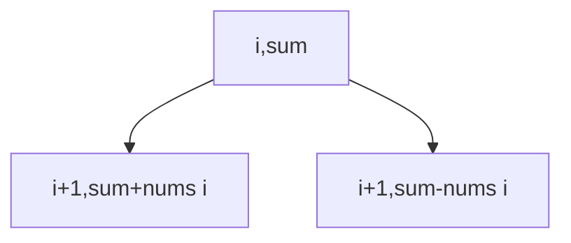

# Target Sum

**Difficulty:** Medium
**Pattern:** 0/1 Knapsack DP
**LeetCode:** #494

## Problem Statement
Given `nums` and `target`, assign `+` or `-` before each number.
Return the number of expressions that evaluate to `target`.

## Input/Output Examples
1. Input: `nums = [1,1,1,1,1], target = 3` -> Output: `5`
2. Input: `nums = [1], target = 1` -> Output: `1`
3. Input: `nums = [2,1], target = 1` -> Output: `1`

## Why This Is DP (overlapping + optimal substructure)
- Overlapping: same `(index, current_sum)` repeats across branches.
- Optimal substructure: ways from state are sum of adding and subtracting current value.

## Mermaid Visual


## Brute Force (Python)
```python
def find_target_sum_ways_bruteforce(nums, target):
    def dfs(i, cur):
        if i == len(nums):
            return 1 if cur == target else 0
        return dfs(i + 1, cur + nums[i]) + dfs(i + 1, cur - nums[i])

    return dfs(0, 0)
```

## Optimal DP (Python)
```python
def find_target_sum_ways_dp(nums, target):
    total = sum(nums)
    if abs(target) > total or (total + target) % 2:
        return 0

    subset = (total + target) // 2
    dp = [0] * (subset + 1)
    dp[0] = 1

    for x in nums:
        for s in range(subset, x - 1, -1):
            dp[s] += dp[s - x]

    return dp[subset]
```

## DP Checklist
- Define the DP state clearly before coding.
- Identify base cases that stop recursion/iteration.
- Write recurrence from smaller subproblems.
- Ensure transitions are valid for problem constraints.
- Decide top-down memo vs bottom-up table.
- Check if state compression is possible.
- Verify behavior on empty or minimal inputs.
- Confirm impossible states are handled safely.
- Test with monotonic, random, and duplicate-heavy data.
- Re-check off-by-one around boundaries.

## Minimal Test Harness (Python)
```python
def run_small_cases(cases, solver):
    """Simple harness to quickly smoke-test a DP implementation."""
    results = []
    for args, expected in cases:
        if isinstance(args, tuple):
            got = solver(*args)
        else:
            got = solver(args)
        results.append((got, expected, got == expected))
    return results
```

## Complexity (brute force + optimal)
- Brute force recursion: `O(2^n)` time, `O(n)` stack.
- Optimal DP (subset transform): `O(n * subset)` time, `O(subset)` space.
