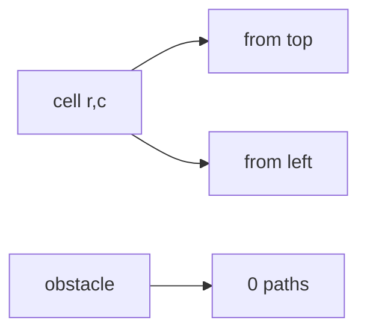

# Unique Paths II

**Difficulty:** Medium
**Pattern:** 2D Grid DP
**LeetCode:** #63

## Problem Statement
In `obstacleGrid`, `1` means blocked and `0` means free.
A robot starts at top-left and moves only right or down.
Return number of unique paths to bottom-right.

## Input/Output Examples
1. Input: `obstacleGrid = [[0,0,0],[0,1,0],[0,0,0]]` -> Output: `2`
2. Input: `obstacleGrid = [[0,1],[0,0]]` -> Output: `1`

## Why This Is DP (overlapping + optimal substructure)
- Overlapping: path counts for each cell are reused by cells to the right/below.
- Optimal substructure: paths to cell = top paths + left paths, unless obstacle.

## Mermaid Visual


## Brute Force (Python)
```python
def unique_paths2_bruteforce(obstacle_grid):
    rows, cols = len(obstacle_grid), len(obstacle_grid[0])
    def dfs(r, c):
        if r >= rows or c >= cols or obstacle_grid[r][c] == 1:
            return 0
        if r == rows - 1 and c == cols - 1:
            return 1
        return dfs(r + 1, c) + dfs(r, c + 1)

    return dfs(0, 0)
```

## Optimal DP (Python)
```python
def unique_paths2_dp(obstacle_grid):
    rows, cols = len(obstacle_grid), len(obstacle_grid[0])
    dp = [[0] * cols for _ in range(rows)]

    if obstacle_grid[0][0] == 1:
        return 0
    dp[0][0] = 1

    for r in range(rows):
        for c in range(cols):
            if obstacle_grid[r][c] == 1:
                dp[r][c] = 0
            else:
                if r > 0:
                    dp[r][c] += dp[r - 1][c]
                if c > 0:
                    dp[r][c] += dp[r][c - 1]

    return dp[rows - 1][cols - 1]
```

## DP Checklist
- Define the DP state clearly before coding.
- Identify base cases that stop recursion/iteration.
- Write recurrence from smaller subproblems.
- Ensure transitions are valid for problem constraints.
- Decide top-down memo vs bottom-up table.
- Check if state compression is possible.
- Verify behavior on empty or minimal inputs.
- Confirm impossible states are handled safely.
- Test with monotonic, random, and duplicate-heavy data.
- Re-check off-by-one around boundaries.

## Minimal Test Harness (Python)
```python
def run_small_cases(cases, solver):
    """Simple harness to quickly smoke-test a DP implementation."""
    results = []
    for args, expected in cases:
        if isinstance(args, tuple):
            got = solver(*args)
        else:
            got = solver(args)
        results.append((got, expected, got == expected))
    return results
```

## Complexity (brute force + optimal)
- Brute force recursion: approximately `O(2^(rows+cols))` time, `O(rows+cols)` stack.
- Optimal DP: `O(rows * cols)` time, `O(rows * cols)` space.
